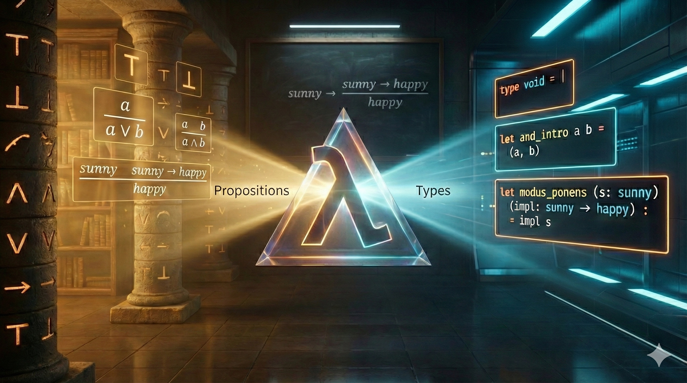

## Chapter 1: Logic

{.chapter-image}

*From logic rules to programming constructs*

**Prerequisites:** no OCaml; familiarity with “and”, “or” and “if”.
**Route:** Part I starts here. Continue to Chapter 2 for data representations.

**In this chapter, you will:**

- Learn natural-deduction rules for the core connectives ($\top, \bot, \wedge, \vee, \rightarrow$)
- Practice reading and building derivation trees (including hypothetical derivations)
- See the Curry–Howard correspondence emerge in OCaml typing rules
- Connect logical reasoning patterns (cases, induction) to programming patterns (pattern matching, recursion)

**Conventions.** OCaml code blocks are intended to be runnable unless marked with `ocaml skip` (used for illustrative or partial snippets).

Throughout this chapter we use *natural deduction* in the style of intuitionistic (constructive) logic. This choice is not accidental: it is exactly the fragment of logic that lines up with the “pure” core of functional programming via the Curry–Howard correspondence.

### 1.0 A first session

Start the command `ocaml` in a terminal. Its `#` is a prompt, not part of the
expression. Type `let double x = x + x;;`, then `double 3;;`. The toplevel reports
a function type and then the integer `6`. Save these definitions in `first.ml`:

```ocaml env=first
let double x = x + x
let answer = double 3
let () = assert (answer = 6)
```

Load the file from the same directory by typing `#use "first.ml";;` at the
OCaml prompt (this `#use` is a directive, including its `#`). In a terminal,
`ocaml first.ml` instead runs the file and exits; the assertion succeeds silently.
This file uses only the standard library. To change its result, edit the file
and reload it. Existing bindings are shadowed by the new definitions.

The expression `double "three"` produces a type error: `double` needs an integer,
but `"three"` is a string. Read the expected and actual types before changing the
program. Parentheses group expressions; `;;` finishes a toplevel phrase, and is
usually unnecessary between definitions in a file.

```ocaml env=first
let outer = 10
let inner = let outer = 3 in double outer
let () = assert (inner = 6 && outer = 10)
```

The local `outer` is visible only after its `in`. This is *scope*. Below, a
hypothetical assumption has a scope in exactly the same way that a function
parameter or a local binding has a scope.

### 1.1 In the Beginning there was Logos

What logical connectives do you know? Before we write any code, let us take a step back and think about logic itself. The connectives listed below form the foundation of reasoning, and as we will discover, they also form the foundation of programming.

| $\top$ | $\bot$ | $\wedge$ | $\vee$ | $\rightarrow$ |
|---|---|---|---|---|
|   |   | $a \wedge b$ | $a \vee b$ | $a \rightarrow b$ |
| truth | falsehood | conjunction | disjunction | implication |
| "trivial" | "impossible" | $a$ and $b$ | $a$ or $b$ | $a$ gives $b$ |
|   | shouldn't get | got both | got at least one | given $a$, we get $b$ |

How can we define these connectives precisely? The key insight is to think in terms of *derivation trees*. A derivation tree shows how we arrive at conclusions from premises, building up knowledge step by step:

$$
\frac{
\frac{\frac{\,}{\text{a premise}} \; \frac{\,}{\text{another premise}}}{\text{some fact}} \;
\frac{\frac{\,}{\text{this we have by default}}}{\text{another fact}}}
{\text{final conclusion}}
$$

We define connectives by providing rules for using them. For example, a rule $\frac{a \; b}{c}$ matches parts of the tree that have two premises, represented by variables $a$ and $b$, and have any conclusion, represented by variable $c$. These variables act as placeholders that can match any proposition.

**Design principle:** When defining a connective, we try to use only that connective in its definition. This keeps definitions self-contained and avoids circular dependencies between connectives.

### 1.2 Rules for Logical Connectives

Each logical connective comes with two kinds of rules:

**Introduction rules** tell us how to *produce* or *construct* a connective. If you want to prove "A and B", the introduction rule tells you what you need: proofs of both A and B.

**Elimination rules** tell us how to *use* or *consume* a connective. If you already have "A and B", the elimination rules tell you what you can get from it: either A or B (your choice but there is no limit on how many times you decide).

In the table below, text in parentheses provides informal commentary. Letters like $a$, $b$, and $c$ are variables that can stand for any proposition.

| Connective | Introduction Rules | Elimination Rules |
|------------|-------------------|-------------------|
| $\top$ | $\frac{}{\top}$ | doesn't have |
| $\bot$ | doesn't have | $\frac{\bot}{a}$ (i.e., anything) |
| $\wedge$ | $\frac{a \quad b}{a \wedge b}$ | $\frac{a \wedge b}{a}$ (take first) &nbsp; $\frac{a \wedge b}{b}$ (take second) |
| $\vee$ | $\frac{a}{a \vee b}$ (put first) &nbsp; $\frac{b}{a \vee b}$ (put second) | $\frac{a \vee b \quad \hyp{[a]^x}{c} \quad \hyp{[b]^y}{c}}{c}$ using $x, y$ |
| $\rightarrow$ | $\frac{\hyp{[a]^x}{b}}{a \rightarrow b}$ using $x$ | $\frac{a \rightarrow b \quad a}{b}$ |

#### Each rule as a small program

Read this code beside the table. Values introduce logical structure; patterns
and application eliminate it. The empty match is well typed precisely because
there is no constructor to consider.

```ocaml env=proof_rules
type void = |
type ('a, 'b) either = Left of 'a | Right of 'b
let truth = ()
let absurd (x : void) = match x with _ -> .
let both a b = (a, b)
let first (a, _) = a
let second (_, b) = b
let left a = Left a
let right b = Right b
let cases f g = function Left a -> f a | Right b -> g b
let identity a = a
let apply f a = f a
let () =
  assert (first (both 3 true) = 3);
  assert (second (both 3 true));
  assert (cases ((+) 1) String.length (left 3) = 4);
  assert (cases ((+) 1) String.length (right "four") = 4);
  assert (apply identity 7 = 7)
```

`cases` is disjunction elimination: both branches must produce the same result
type. `identity` introduces the implication $a \rightarrow a$; `apply` eliminates
an implication by providing its argument. There is no executable call to `absurd`
using a terminating value, because such a value of `void` cannot be constructed.

#### Notation for Hypothetical Derivations

The notation $\hyp{[a]^x}{b}$ (sometimes written as a tree) matches any subtree that derives $b$ and can use $a$ as an assumption (marked with label $x$), even though $a$ might not otherwise be warranted. The square brackets around $a$ indicate that this is a *hypothetical* assumption, not something we have actually established. The superscript $x$ is a label that helps us track which assumption gets "discharged" when we complete the derivation.

To prove an implication, assume its input proposition and construct the output.
The assumption can be used more than once, just as `fun x -> (x, x)` uses its
parameter twice. It is available only inside the hypothetical derivation, just
as `x` is available only inside the function body. Discharging the assumption
means that the resulting implication no longer requires that input to be present
until it is applied.

#### Reasoning by Cases

The elimination rule for disjunction deserves special attention because it represents **reasoning by cases**, one of the most fundamental proof techniques.

Suppose we know "A or B" is true, but we do not know which one. How can we still derive a conclusion C? We must show that C follows *regardless* of which alternative holds. In other words, we need to prove: (1) assuming A, we can derive C, and (2) assuming B, we can derive C. Since one of A or B must be true, and both lead to C, we can conclude C.

In `cases` above, knowing `Left a` or `Right b` is enough to choose a branch.
The common result type enforces that either branch establishes the same conclusion.
We do not need to know which branch will be chosen when we define the function.

#### Reasoning by Induction

We need one more kind of rule to do serious math: **reasoning by induction**. This rule is somewhat similar to reasoning by cases, but instead of considering a finite number of alternatives, it allows us to prove properties that hold for infinitely many cases, such as all natural numbers.

Here is the example rule for induction on natural numbers:

$$
\frac{p(0) \quad \hyp{[p(x)]^x}{p(x+1)}}{p(n)} \text{ by induction, using } x
$$

This rule says: we get property $p$ for *any* natural number $n$, provided we can do two things:

1. **Base case:** Establish $p(0)$, that is, prove the property holds for zero.
2. **Inductive step:** Show that *assuming* $p(x)$ holds for some arbitrary $x$, we can derive $p(x+1)$. This assumption $p(x)$ is called the *induction hypothesis*.

Here $x$ is a unique variable representing an arbitrary natural number. We cannot substitute a particular number for it because we write "using $x$" on the side, indicating that the derivation works for any choice of $x$.

The power of induction lies in this: once we have the base case and the inductive step, we have implicitly covered *all* natural numbers. Starting from $p(0)$, we can derive $p(1)$, then $p(2)$, then $p(3)$, and so on, reaching any natural number $n$ we wish.

A structural recursion makes the decreasing argument visible:

```ocaml env=proof_rules
type nat = Zero | Succ of nat
let rec count = function Zero -> 0 | Succ n -> 1 + count n
let () = assert (count (Succ (Succ Zero)) = 2)
```

Each recursive call receives a smaller finite `nat`. This supplies a termination
argument. OCaml also permits general recursion, including a function that calls
itself on the same argument forever. The type checker does not certify
termination. The proof/program correspondence below applies to the terminating,
pure fragment, not to arbitrary OCaml programs that may loop or raise exceptions.
The integer result of `count` has machine bounds; a mathematical induction about
unbounded natural numbers is a separate claim.

### 1.3 Logos was Programmed in OCaml

The **Curry–Howard correspondence**, also known as "propositions as types" or the "proofs-as-programs" interpretation. In a total, pure, intuitionistic setting, this correspondence is not just a metaphor: proof rules and typing rules are the same kind of object.

Under this correspondence:

- **Propositions** (logical statements) correspond to **types**
- **Proofs** (derivations showing a proposition is true) correspond to **programs** (expressions of a given type)
- **Introduction rules** correspond to **constructors** (ways to build values)
- **Elimination rules** correspond to **destructors** (ways to use values)

When you write a well-typed program, you are (implicitly) constructing a derivation tree that proves a typing judgement.

The following table shows how each logical connective corresponds to a programming construct in OCaml:

| Logic | OCaml type (example) | Example program | Intuition |
|-------|------|------------|-----------|
| $\top$ | `unit` | `()` | The trivially true proposition; the type with exactly one value |
| $\bot$ | `void` (an empty type) | `match v with _ -> .` | Falsehood; a type with no values |
| $\wedge$ | `*` | `(,)` | Conjunction corresponds to pairs: having both A and B |
| $\vee$ | a variant type | `Left x` / `Right y` | Disjunction corresponds to sums: having either A or B |
| $\rightarrow$ | `->` | `fun` | Implication corresponds to functions: given A, produce B |
| induction | - | structurally decreasing recursion | Inductive proofs correspond to terminating recursive definitions |

For example, the identity function corresponds to the tautology $a \rightarrow a$:

```ocaml env=ch1
# fun x -> x;;
- : 'a -> 'a = <fun>
```

Let us now see the precise typing rules for each OCaml construct, presented in the same style as our logical rules:

**Typing rules for OCaml constructs:**

- **Unit (truth):** $\frac{}{\texttt{()} : \texttt{unit}}$

  The unit value `()` always has type `unit`. This is like $\top$ in logic: we can always produce it without any premises.

- **Empty type (falsehood):** in OCaml we can *define* an empty type (a type with no constructors):

  ```ocaml env=ch1
  type void = |
  ```

  There is no way to construct a value of type `void` using ordinary, terminating code. But if we somehow have a `v : void`, then we can derive anything from it (falsity elimination):

  ```ocaml env=ch1
  let absurd (v : void) : 'a =
    match v with _ -> .
  ```

  This corresponds closely to the logical rule $\frac{\bot}{a}$.

  OCaml also has *effects* (notably exceptions). Because `raise e` never returns normally, the type checker allows it to have any result type:
  $$
  \frac{e : \texttt{exn}}{\texttt{raise } e : a}
  $$
  This is useful in practice, but it is also a good reminder that effects complicate the neat “proofs-as-programs” story.

- **Pair (conjunction):**
  - Introduction: $\frac{s : a \quad t : b}{(s, t) : a * b}$
  - Elimination: from `p : a * b` we can extract either component (e.g. by pattern matching, or via `fst`/`snd`)

  To construct a pair, you need both components. To use a pair, you can extract either component. This mirrors conjunction perfectly: to prove "A and B", you need proofs of both; given "A and B", you can conclude either A or B.

- **Variant (disjunction):** first, we define a sum type (a two-way choice):

  ```ocaml env=ch1
  type ('a, 'b) either = Left of 'a | Right of 'b
  ```

  - Introduction: from `x : a` we get `Left x : (a, b) either`, and from `y : b` we get `Right y : (a, b) either`
  - Elimination: given `t : (a, b) either` and a branch for each case, produce a result `c` (pattern matching)

  The shape of the elimination rule is exactly “reasoning by cases”: to use an `either`, you must handle both `Left` and `Right`.

  ```ocaml env=ch1
  let either f g = function
    | Left x -> f x
    | Right y -> g y
  ```

  A built-in example is `bool`, which you can think of as a two-constructor variant; the `if ... then ... else ...` expression is just a specialized form of case analysis on a boolean.

  ```ocaml env=ch1
  let choose b x y =
    if b then x else y

  let choose' b x y =
    match b with
    | true -> x
    | false -> y
  ```

  To construct a variant, you only need one of the alternatives. To use a variant, you must handle *all* possible cases (pattern matching). This mirrors disjunction: to prove "A or B", you only need one; to use "A or B", you must consider both possibilities.

- **Function (implication):**
  - Introduction: $\frac{\hyp{[x : a]}{e : b}}{\texttt{fun}~x \to e : a \to b}$
  - Elimination (application): $\frac{f : a \to b \quad t : a}{f~t : b}$

  To construct a function, you assume you have an input of type $a$ (the parameter $x$) and show how to produce a result of type $b$. To use a function, you apply it to an argument. This mirrors implication: to prove "A implies B", assume A and derive B; given "A implies B" and A, conclude B.

- **Recursion (induction):** recursion is not a connective, but it matches the *shape* of induction: in a recursive definition you are allowed to assume the function being defined (the “induction hypothesis”) when defining its body.

  General recursion alone is not an induction proof: `let rec loop x = loop x` never returns. The proof interpretation requires termination, for example by recursion on a strictly smaller substructure.

  In OCaml, recursion is introduced with `let rec` (there is no standalone `rec` expression).

#### Definitions

Writing out expressions and types repetitively quickly becomes tedious. More importantly, without definitions we cannot give names to our concepts, making code harder to understand and maintain. This is why we need definitions.

**Type definitions** are written: `type ty =` some type.

- In OCaml, disjunction-like types are not written as something like `a | b` directly; instead, you define a *variant type* and then use its constructors. For example:
  ```ocaml env=ch1
  type int_string_choice = A of int | B of string
  ```
  This allows us to write `A x : int_string_choice` for any `x : int`, and `B y : int_string_choice` for any `y : string`.

- Why do we need to define variant types? The reasons are: exhaustiveness checks, performance of generated code, and ease of type inference. When OCaml sees `A 5`, it needs to figure out (or "infer") the type. Without a type definition, how would OCaml know whether this is `A of int | B of string` or `A of int | B of float | C of bool`? The definition tells OCaml exactly what variants exist. When you match `| A i -> ...`, the compiler will warn you if you forgot to also cover `C b` in your match patterns.

- OCaml does provide an alternative: *polymorphic variants*, written with a backtick. We can write `` `A x : [ `A of a | `B of b ] ``. With `` ` `` variants, OCaml does infer what other variants might exist based on usage. These types are powerful and flexible; we will discuss them in chapter 11.

- Tuple elements do not need labels because we always know at which position a tuple element stands: the first element is first, the second is second, and so on. However, having labels makes code much clearer, especially when tuples have many components or components of the same type. For this reason, we can define a *record type*:

  ```ocaml env=ch1
  type int_string_record = { a : int; b : string }
  ```

  and create its values: `{a = 7; b = "Mary"}`. OCaml 5.4 and newer also support labeled tuples, we will not discuss these.

- We access the *fields* of records using the dot notation: `{a = 7; b = "Mary"}.b = "Mary"`. Unlike tuples where you must remember "the second element is the name", with records you can write `.b` to get the field named `b`.

#### Expression Definitions

In many presentations of the Curry–Howard correspondence (and in programming language theory), recursion is introduced via a standalone operator often called `fix`. OCaml does not have a standalone `fix` expression: recursion is introduced only as part of a `let rec` definition.

This brings us to **expression definitions**, which let us give names to values. The typing rules for definitions are a bit more complex than what we have seen so far:

$$
\frac{e_1 : a \quad \hyp{[x : a]}{e_2 : b}}{\texttt{let } x = e_1 \texttt{ in } e_2 : b}
$$

This rule says: if $e_1$ has type $a$, and assuming $x$ has type $a$ we can show that $e_2$ has type $b$, then the whole `let` expression has type $b$. Interestingly, this rule is equivalent to introducing a function and immediately applying it: `let x = e1 in e2` behaves the same as `(fun x -> e2) e1`. This is the introduction rule for a function followed by its elimination rule.

For recursive definitions, we need an additional rule:

$$
\frac{\hyp{[x : a]}{e_1 : a} \quad \hyp{[x : a]}{e_2 : b}}{\texttt{let rec } x = e_1 \texttt{ in } e_2 : b}
$$

Notice the crucial difference: in the recursive case, $x$ can appear in $e_1$ itself! This is what allows functions to call themselves. The name $x$ is visible both in its own definition ($e_1$) and in the body that uses the definition ($e_2$).

These rules are slightly simplified. The full rules involve a concept called **polymorphism**, which we will cover in a later chapter. Polymorphism explains how the same function can work with different types.

#### Scoping Rules

Understanding *scope*—where names are visible—is essential for reading and writing OCaml programs.

- **Type definitions** we have seen above are *global*: they need to be at the top-level (not nested in expressions), and they extend from the point they occur till the end of the source file or interactive session. A bare `type` declaration cannot occur inside an expression, but a function can introduce a type through a local module; we will meet modules in Chapter 5.

- **`let`-`in` definitions** for expressions: `let x = e1 in e2` are *local*—the name $x$ is only visible within $e_2$. Once you exit the `in` part, $x$ no longer exists. This is useful for temporary values that should not pollute the global namespace.

- **`let` definitions** without `in` are global: placing `let x = e1` at the top-level makes $x$ visible from after $e_1$ till the end of the source file or interactive session. This is how you define functions and values that the rest of your program can use.

- In the interactive session (toplevel/REPL), we mark the end of a top-level "sentence" with `;;`. This tells OCaml "I am done typing, please evaluate this." In source files compiled by the build system, `;;` is unnecessary because the end of each definition is clear from context.

#### Operators

Operators like `+`, `*`, `<`, `=` are simply names of functions. In OCaml, there is nothing magical about operators; they are ordinary functions that happen to have special characters in their names and can be used in infix position (between their arguments).

Just like other names, you can define your own operators:

```ocaml env=ch1
# let (+:) a b = String.concat "" [a; b];;
val ( +: ) : string -> string -> string = <fun>
# "Alpha" +: "Beta";;
- : string = "AlphaBeta"
```

Notice the asymmetry here: when *defining* an operator, we wrap it in parentheses to tell OCaml "this is the name I am defining". When *using* the operator, we write it in the normal infix position between its arguments. This asymmetry exists because the definition syntax needs to distinguish between "the name `+:`" and "the expression `a +: b`".

OCaml's built-in arithmetic operators are **not overloaded** across numeric types: integer and floating-point arithmetic use different operators. This is distinct from parametric polymorphism, which allows operations such as equality to have polymorphic types:

- `+`, `*`, `/` work for integers
- `+.`, `*.`, `/.` work for floating point numbers

This design choice makes type inference simpler and more predictable. When you see `x + y`, OCaml knows immediately that `x` and `y` must be integers.

**Exception:** The comparison operators `<`, `=`, `<=`, `>=`, `<>` do work for all values other than functions. These are called *polymorphic comparisons*.

### 1.4 Exercises

The following exercises are adapted from *Think OCaml: How to Think Like a Computer Scientist* by Nicholas Monje and Allen Downey. They will help you get comfortable with OCaml's syntax and type system.

#### Practice 1: Type and Value Predictions

Assume that we execute the following assignment statements:

```ocaml env=ch1
let width = 17
let height = 12.0
let delimiter = '.'
```

For each of the following expressions, write the value of the expression and the type (of the value of the expression), or the resulting type error.

1. `width/2`
2. `width/.2.0`
3. `height/3`
4. `1 + 2 * 5`
5. `delimiter * 5`

#### Practice 2: REPL Calculator Drills

Practice using the OCaml interpreter as a calculator:

1. The volume of a sphere with radius $r$ is $\frac{4}{3} \pi r^3$. What is the volume of a sphere with radius 5? (*Hint:* 392.6 is wrong!)
2. Suppose the cover price of a book is \$24.95, but bookstores get a 40% discount. Shipping costs \$3 for the first copy and 75 cents for each additional copy. What is the total wholesale cost for 60 copies?
3. If I leave my house at 6:52 am and run 1 mile at an easy pace (8:15 per mile), then 3 miles at tempo (7:12 per mile) and 1 mile at easy pace again, what time do I get home for breakfast?

#### Practice 3: Recursive Fibonacci

You've probably heard of the Fibonacci numbers before, but in case you haven't, they're defined by the following recursive relationship:

$$
\begin{cases}
f(0) = 0 \\
f(1) = 1 \\
f(n+1) = f(n) + f(n-1) & \text{for } n = 1, 2, \ldots
\end{cases}
$$

Write a recursive function on nonnegative integers to calculate these numbers.
Reject negative inputs. Check `f 0 = 0`, `f 1 = 1`, and `f 10 = 55`; explain why
the argument decreases. Machine integer overflow limits the numerical contract.

#### Practice 4: Recursive Palindromes

A palindrome is a word that is spelled the same backward and forward, like "noon" and "redivider". Recursively, a word is a palindrome if the first and last letters are the same and the middle is a palindrome.

The following are functions that take a string argument and return the first, last, and middle letters:

```ocaml env=ch1
let first_char word = word.[0]
let last_char word =
  let len = String.length word - 1 in
  word.[len]
let middle word =
  let len = String.length word - 2 in
  String.sub word 1 len
```

1. Enter these functions into the toplevel and test them out. What happens if you call `middle` with a string with two letters? One letter? What about the empty string `""`?
2. Write a function called `is_palindrome` that takes a string argument and returns `true` if it is a palindrome and `false` otherwise.

#### Practice 5: Euclid's GCD

The greatest common divisor (GCD) of $a$ and $b$ is the largest number that divides both of them with no remainder.

One way to find the GCD of two numbers is Euclid's algorithm, which is based on the observation that if $r$ is the remainder when $a$ is divided by $b$, then $\gcd(a, b) = \gcd(b, r)$. As a base case, we can consider $\gcd(a, 0) = a$.

Write `gcd` on nonnegative integers `a` and `b`, taking `gcd 0 0 = 0` by convention.
Check `(0, 7)`, `(7, 0)` and `(54, 24)`. **Proof:** show that the second argument
strictly decreases whenever it is positive.

If you need help, see [http://en.wikipedia.org/wiki/Euclidean_algorithm](http://en.wikipedia.org/wiki/Euclidean_algorithm).

#### Selected answer: safe palindrome base cases

For byte strings, lengths zero and one are palindromes. Check this before calling
`first_char`, `last_char`, or `middle`, whose contracts exclude those lengths.
This is a byte-level exercise, not a Unicode grapheme algorithm.

```ocaml env=ch1
let rec is_palindrome word =
  String.length word < 2 ||
  (first_char word = last_char word && is_palindrome (middle word))
let () =
  assert (is_palindrome "");
  assert (is_palindrome "a");
  assert (is_palindrome "noon");
  assert (not (is_palindrome "not"))
```
