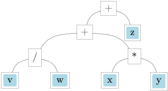
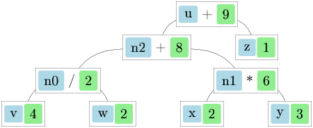
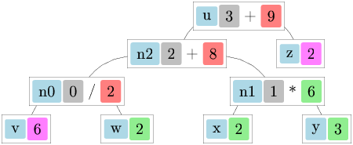
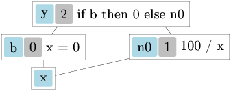
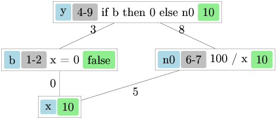

## Chapter 10: Functional Reactive Programming

How do we deal with change and interaction in functional programming? This is one of the most challenging questions in the field, and over the years programmers have developed increasingly sophisticated answers. This chapter explores a progression of techniques: we begin with *zippers*, a clever data structure for navigating and modifying positions within larger structures. We then advance to *adaptive programming* (also known as incremental computing), which automatically propagates changes through computations. Finally, we arrive at *Functional Reactive Programming* (FRP), a declarative approach to handling time-varying values and event streams. We conclude with practical examples including graphical user interfaces.

**Recommended Reading:**

- *"The Zipper"* by Gérard Huet -- the original paper introducing zippers
- [Zippers (Haskell Wikibook)](https://en.wikibooks.org/wiki/Haskell/Zippers) -- visual intuition and examples
- [*How `froc` works*](how-froc-works-a.png) -- a slide-friendly walk through dependency graphs (this chapter includes the figures)
- [`lwd` documentation](https://github.com/let-def/lwd) -- lightweight reactive documents for OCaml
- [`incremental` documentation](https://github.com/janestreet/incremental) -- Jane Street's industrial incremental engine
- *"The Haskell School of Expression"* by Paul Hudak -- a classic FRP source
- *"Deprecating the Observer Pattern with `Scala.React`"* by Ingo Maier and Martin Odersky
- If you want background on OCaml 5 effect handlers (used in Section 10.7), see the OCaml manual and OCaml 5 release material.

### 10.1 Zippers

Imagine you are editing a document, a tree structure, or navigating through a file system. You need to keep track of where you are, easily access and modify the data at that location, and move around efficiently. This is exactly the problem that zippers solve.

Recall from earlier chapters how we defined *context types* for datatypes -- types that represent a data structure with one of its elements missing. We discovered that taking the derivative of an algebraic datatype gives us exactly this context type. Now we will put this theory to practical use.

Consider binary trees:

```ocaml skip
type btree = Tip | Node of int * btree * btree
```

Using our algebraic datatype calculus, where $T$ represents the tree type:

$$
\begin{matrix}
T & = & 1 + xT^2 \\
\frac{\partial T}{\partial x} & = & 0 + T^2 + 2xT\frac{\partial T}{\partial x} = TT + 2xT\frac{\partial T}{\partial x}
\end{matrix}
$$

This derivative gives us the context type:

```ocaml skip
type btree_dir = LeftBranch | RightBranch
type btree_deriv =
  | Here of btree * btree
  | Below of btree_dir * int * btree * btree_deriv
```

The key insight is that **Location = context + subtree**! A location in a data structure consists of two parts: the context (everything around the focused element) and the subtree (what we are currently looking at).

However, there is a problem with the representation above: we cannot easily move the location if `Here` is at the bottom of our context representation. Think about it: if we want to move up from our current position, we need to access the innermost layer of the context first. The part closest to the location should be on top, not buried at the bottom.

#### Revisiting the Equations

Let us revisit the equations for trees and lists:

$$
\begin{matrix}
T & = & 1 + xT^2 \\
\frac{\partial T}{\partial x} & = & 0 + T^2 + 2xT\frac{\partial T}{\partial x} \\
\frac{\partial T}{\partial x} & = & \frac{T^2}{1 - 2xT} \\
L(y) & = & 1 + yL(y) \\
L(y) & = & \frac{1}{1 - y} \\
\frac{\partial T}{\partial x} & = & T^2 L(2xT)
\end{matrix}
$$

This algebraic manipulation reveals something beautiful: the context can be stored as a list with the root as the last node. The $L(2xT)$ factor tells us that we have a list where each element consists of $2xT$ -- that is, a direction indicator (left or right, hence the factor of 2), the element at that node ($x$), and the sibling subtree ($T$).

It does not matter whether we use built-in OCaml lists or define a custom type with `Above` and `Root` variants -- the structure is the same.

In practice, contexts of subtrees are more useful than contexts of single elements. Rather than tracking where a single value lives, we track the position of an entire subtree within the larger structure:

```ocaml env=ch10
type 'a tree = Tip | Node of 'a tree * 'a * 'a tree
type tree_dir = Left_br | Right_br
type 'a context = (tree_dir * 'a * 'a tree) list
type 'a location = {sub: 'a tree; ctx: 'a context}

let access {sub; _} = sub       (* Get the current subtree *)
let change {ctx; _} sub = {sub; ctx}  (* Replace the subtree, keep context *)
let modify f {sub; ctx} = {sub = f sub; ctx}  (* Transform the subtree *)
```

There is a wonderful visual intuition for zippers: imagine taking a tree and pinning it at one of its nodes, then letting it hang down under gravity. The pinned node becomes "the current focus," and all the other parts of the tree dangle from it. This mental picture helps understand how movement works: moving to a child means letting a new node become the pin point, with the old parent now hanging above. For excellent visualizations, see [Zippers (Haskell Wikibook)](https://en.wikibooks.org/wiki/Haskell/Zippers).

#### Moving Around

Navigation functions allow us to traverse the structure. Each movement operation restructures the zipper: what was context becomes part of the subtree, and vice versa. Watch how ascending rebuilds a parent node from the context, while descending breaks apart a node to create new context:

```ocaml env=ch10
let ascend loc =
  match loc.ctx with
  | [] -> loc  (* At root already, or raise exception *)
  | (Left_br, n, l) :: up_ctx ->
    (* We were in the right subtree; rebuild the parent node *)
    {sub = Node (l, n, loc.sub); ctx = up_ctx}
  | (Right_br, n, r) :: up_ctx ->
    (* We were in the left subtree; rebuild the parent node *)
    {sub = Node (loc.sub, n, r); ctx = up_ctx}

let desc_left loc =
  match loc.sub with
  | Tip -> loc  (* Cannot descend into a tip, or raise exception *)
  | Node (l, n, r) ->
    (* Focus on left child; right sibling goes into context *)
    {sub = l; ctx = (Right_br, n, r) :: loc.ctx}

let desc_right loc =
  match loc.sub with
  | Tip -> loc  (* Cannot descend into a tip, or raise exception *)
  | Node (l, n, r) ->
    (* Focus on right child; left sibling goes into context *)
    {sub = r; ctx = (Left_br, n, l) :: loc.ctx}
```

#### Trees with Arbitrary Branching

Following *The Zipper* by Gerard Huet, let us look at a tree with an arbitrary number of branches. This is particularly useful for representing document structures where a group can contain any number of children:

```ocaml env=ch10
type doc = Text of string | Line | Group of doc list
type context = (doc list * doc list) list  (* left siblings, right siblings *)
type location = {sub: doc; ctx: context}
```

In this design, the context at each level stores two lists: the siblings to the left of our current position (in reverse order for efficient access) and the siblings to the right. This allows us to move not just up and down, but also left and right among siblings.

The navigation functions for this more complex structure show how we reconstruct the parent when going up, and how we split the sibling list when going down:

```ocaml env=ch10
let go_up loc =
  match loc.ctx with
  | [] -> invalid_arg "go_up: at top"
  | (left, right) :: up_ctx ->
    (* Reconstruct the Group: reverse left siblings, add current, then right *)
    {sub = Group (List.rev left @ loc.sub :: right); ctx = up_ctx}

let go_left loc =
  match loc.ctx with
  | [] -> invalid_arg "go_left: at top"
  | (l :: left, right) :: up_ctx ->
    (* Move to left sibling; current element moves to right siblings *)
    {sub = l; ctx = (left, loc.sub :: right) :: up_ctx}
  | ([], _) :: _ -> invalid_arg "go_left: at first"

let go_right loc =
  match loc.ctx with
  | [] -> invalid_arg "go_right: at top"
  | (left, r :: right) :: up_ctx ->
    (* Move to right sibling; current element moves to left siblings *)
    {sub = r; ctx = (loc.sub :: left, right) :: up_ctx}
  | (_, []) :: _ -> invalid_arg "go_right: at last"

let go_down loc =
  (* Go to the first (i.e. leftmost) subdocument *)
  match loc.sub with
  | Text _ -> invalid_arg "go_down: at text"
  | Line -> invalid_arg "go_down: at line"
  | Group [] -> invalid_arg "go_down: at empty"
  | Group (doc :: docs) ->
    (* First child becomes focus; rest become right siblings *)
    {sub = doc; ctx = ([], docs) :: loc.ctx}
```

### 10.2 Example: Context Rewriting

Let us put zippers to work on a real problem. Imagine a friend working on string theory asks us for help simplifying equations. The task is to pull out particular subexpressions as far to the left as possible, while changing the whole expression as little as possible. This kind of algebraic manipulation is common in symbolic computation.

We can illustrate our algorithm using mathematical notation. Let:
- $x$ be the thing we pull out
- $C[e]$ and $D[e]$ be big expressions with subexpression $e$
- operator $\circ$ stand for one of: $*, +$

The rewriting rules are:

$$
\begin{matrix}
D[(C[x] \circ e_1) \circ e_2] & \Rightarrow & D[C[x] \circ (e_1 \circ e_2)] \\
D[e_2 \circ (C[x] \circ e_1)] & \Rightarrow & D[C[x] \circ (e_1 \circ e_2)] \\
D[(C[x] + e_1) e_2] & \Rightarrow & D[C[x] e_2 + e_1 e_2] \\
D[e_2 (C[x] + e_1)] & \Rightarrow & D[C[x] e_2 + e_1 e_2] \\
D[e \circ C[x]] & \Rightarrow & D[C[x] \circ e]
\end{matrix}
$$

These rules encode the algebraic properties we need: associativity (first two rules), distributivity of multiplication over addition (third and fourth rules), and commutativity (last rule, which lets us swap operands). The key insight is that we can implement these transformations efficiently using a zipper, since each rule only needs to look at a small neighborhood of the current position.

First, the groundwork. We define expression types and a zipper for navigating them:

```ocaml env=ch10
type op = Add | Mul
type expr = Val of int | Var of string | App of expr * op * expr
type expr_dir = Left_arg | Right_arg
type context = (expr_dir * op * expr) list
type location = {sub: expr; ctx: context}
```

To locate the subexpression described by predicate `p`, we search the expression tree and build up the context as we go. Notice that we build the context in reverse order during the search, then reverse it at the end so the innermost context comes first (as required for efficient navigation):

```ocaml env=ch10
let rec find_aux p e =
  if p e then Some (e, [])
  else match e with
  | Val _ | Var _ -> None
  | App (l, op, r) ->
    match find_aux p l with
    | Some (sub, up_ctx) ->
      Some (sub, (Right_arg, op, r) :: up_ctx)
    | None ->
      match find_aux p r with
      | Some (sub, up_ctx) ->
        Some (sub, (Left_arg, op, l) :: up_ctx)
      | None -> None

let find p e =
  match find_aux p e with
  | None -> None
  | Some (sub, ctx) -> Some {sub; ctx = List.rev ctx}
```

Now we can implement the pull-out transformation. This is where the zipper shines: we pattern match on the context to decide which rewriting rule to apply, then modify the context directly. The function recursively moves the target subexpression outward until it reaches the root:

```ocaml env=ch10
let rec pull_out loc =
  match loc.ctx with
  | [] -> loc  (* Done: reached the root *)
  | (Left_arg, op, l) :: up_ctx ->
    (* D[e . C[x]] => D[C[x] . e] -- use commutativity to swap sides *)
    pull_out {loc with ctx = (Right_arg, op, l) :: up_ctx}
  | (Right_arg, op1, e1) :: (_, op2, e2) :: up_ctx
      when op1 = op2 ->
    (* D[(C[x] . e1) . e2] => D[C[x] . (e1 . e2)] -- associativity *)
    pull_out {loc with ctx = (Right_arg, op1, App(e1, op1, e2)) :: up_ctx}
  | (Right_arg, Add, e1) :: (_, Mul, e2) :: up_ctx ->
    (* D[(C[x] + e1) * e2] => D[C[x] * e2 + e1 * e2] -- distributivity *)
    pull_out {loc with ctx =
        (Right_arg, Mul, e2) ::
          (Right_arg, Add, App(e1, Mul, e2)) :: up_ctx}
  | (Right_arg, op, r) :: up_ctx ->
    (* No rule applies: move up by incorporating current context *)
    pull_out {sub = App(loc.sub, op, r); ctx = up_ctx}
```

Since we assume operators are commutative, we can ignore the direction for the second piece of context above -- both `(C[x] . e1) . e2` and `e2 . (C[x] . e1)` are handled by the same associativity rule.

Let us test the implementation with a concrete example:

```ocaml env=ch10
let rec expr_to_string = function
  | Val n -> string_of_int n
  | Var v -> v
  | App (l, Add, r) -> "(" ^ expr_to_string l ^ "+" ^ expr_to_string r ^ ")"
  | App (l, Mul, r) -> "(" ^ expr_to_string l ^ "*" ^ expr_to_string r ^ ")"

module ExprOps = struct
  let (+) a b = App (a, Add, b)
  let ( * ) a b = App (a, Mul, b)
  let (!) a = Val a
end
let x = Var "x"
let y = Var "y"

(* Original: 5 + y * (7 + x) * (3 + y) -- we want to pull x to the front *)
let ex = ExprOps.(!5 + y * (!7 + x) * (!3 + y))
let loc = find (fun e -> e = x) ex
let sol =
  match loc with
  | None -> raise Not_found
  | Some loc -> pull_out loc
let result = expr_to_string sol.sub
let () = assert (result = "(((x*y)*(3+y))+(((7*y)*(3+y))+5))")
```

The transformation successfully pulled `x` from deep inside the expression to the outermost left position. For best results on complex expressions, we can iterate the `pull_out` function until a fixpoint is reached, ensuring all instances of the target are pulled out as far as possible.

### 10.3 Adaptive Programming (Incremental Computing)

Zippers gave us a way to make *local* edits to a large structure while keeping enough context to put the structure back together. But they do not, by themselves, solve a more global problem:

> if we change an input, how do we update *all* the derived results efficiently, without rewriting the whole program to “thread the context around”?

**Incremental computing** (also called **self-adjusting computation** or **adaptive programming**) answers this by letting us write code in a direct style while the runtime system records *dependencies* between intermediate results. When an input changes, only the part of the computation graph that depends on that input is recomputed; everything else is reused.

#### A Mental Model: Traces and Change Propagation

Think of an incremental program as building a directed acyclic graph (DAG):

- **Leaves** are *changeable inputs* (mutable cells).
- **Internal nodes** are *pure computations* (maps, combinations, binds).
- **Roots** are *observers* (the results we care to keep up-to-date).

When a leaf changes, the system does two logically separate things:

1. **Invalidate** cached results that (transitively) depend on the changed leaf.
2. **Recompute** just enough of the graph to bring the observed roots back to a consistent state.

Different libraries make different choices about *when* recomputation happens (eager stabilization vs. lazy sampling), *how* they avoid redundant work (timestamps vs. boolean dirty flags), and *what* extra guarantees they provide (cutoffs, resource lifetimes, “no glitches”).

#### The Core Idea: Write Normal Code, Get a DAG

Consider a simple expression:

```
u = v / w + x * y + z
```

As ordinary code, this just computes a number. As an *incremental* computation, it implicitly defines a dependency graph:

- `n0 = v / w`
- `n1 = x * y`
- `n2 = n0 + n1`
- `u  = n2 + z`

When `v` changes, we should update `n0`, then `n2`, then `u`. When `z` changes, we should update only `u`. The point of incremental computing is that you should not have to maintain this update order yourself.

Most libraries expose a “lifted arithmetic” style: you still write expressions like `v / w + x * y + z`, but the operators build graph nodes rather than eagerly computing.

#### A Worked Picture: *How `froc` Works*

Jacob Donham’s short note *How `froc` works* explains incremental computation using pictures of a dependency graph (the `froc` library is historically important, but in this book we will use modern OCaml libraries in the same design space).

The expression `u = v / w + x * y + z` as a dependency graph:

{width=75%}

The same graph after memoizing intermediate results:

{width=75%}

If multiple inputs change, the engine must update nodes in a safe order (a topological schedule). The picture uses grey numbers to indicate a recomputation order:

{width=75%}

The subtle case is **dynamic dependency** (a `bind`/`join` that can choose a different subgraph). If we recompute “everything that ever depended on `x`”, we may attempt to update a branch that is no longer relevant:

{width=75%}

One approach (as described in the note) is to track not just a single timestamp but an *interval* for a node’s computation, detach the old subgraph interval when a dynamic node is recomputed, and reattach only what the new branch actually needs:

{width=75%}

Two practical lessons fall out of this:

- **Prefer applicative combinators** (`map`, `map2`, `map3`, …) for static dependency structure.
- Use **dynamic dependency** (`bind`/`join`) only when the structure truly depends on values (conditionals, switching, dynamic collections).

#### Conditional Dependencies (Dynamic Graphs)

The most interesting case is when the dependency graph itself depends on data:

```ocaml skip
(* Pseudocode: the dependencies of [out] depend on [use_fast]. *)
let out =
  if use_fast then fast_path input
  else slow_path input
```

If `use_fast` flips, we must stop depending on the old branch and start depending on the new one. Incremental systems support this with a *dynamic dependency* operator:

- `bind` / `join` / `switch` (names vary): pick which subgraph is active *based on a value*.

Operationally, this means: detach edges to the old branch, attach edges to the new branch, then recompute along the newly relevant dependencies. This is also where “glitch freedom” matters: we want each observed root to be updated as if we recomputed in a topological order on a single, consistent snapshot of inputs.

Here is the classic pitfall:

```ocaml skip
(* Pseudocode: [x] is a changeable input. *)
let b  = map x ~f:(fun x -> x = 0)
let n0 = map x ~f:(fun x -> 100 / x)
let y  = bind b ~f:(fun b -> if b then return 0 else n0)
```

If we naïvely “recompute everything that ever depended on `x`”, then changing `x` to `0` would try to compute `100 / 0` even though the branch containing `n0` is no longer relevant. Dynamic dependency operators solve this by making *reachability* part of correctness: when the branch switches, the old subgraph becomes inactive and stops being demanded by observers.

#### Two Modern OCaml Libraries: `lwd` and `incremental`

Many ideas above can be packaged behind a small “conceptual API”:

```ocaml env=ch10
module type INCREMENTAL = sig
  type 'a t
  type 'a var
  type 'a obs

  val var : 'a -> 'a var
  val get : 'a var -> 'a t
  val set : 'a var -> 'a -> unit

  val map : 'a t -> f:('a -> 'b) -> 'b t
  val map2 : 'a t -> 'b t -> f:('a -> 'b -> 'c) -> 'c t
  val bind : 'a t -> f:('a -> 'b t) -> 'b t

  val observe : 'a t -> 'a obs
  val sample : 'a obs -> 'a
end
```

OCaml has at least two widely used implementations of this idea, with different priorities.

##### `Lwd` (Lightweight Reactive Documents)

`Lwd` is designed around building *reactive trees* (most famously, UI trees). Its model is **invalidate eagerly, recompute lazily**:

- `Lwd.var` / `Lwd.set` mutate leaves and immediately invalidate dependent nodes.
- Values are recomputed on demand when you `Lwd.sample` a **root** (an observer).
- It tracks *liveness*: nodes not reachable from any root are released, and `Lwd.prim` supports `acquire`/`release` for resource lifetimes (subscriptions, DOM nodes, etc.).

```ocaml env=ch10
(* Using Lwd as an incremental engine *)
let a = Lwd.var 10
let b = Lwd.var 32

let sum : int Lwd.t =
  Lwd.map2 (Lwd.get a) (Lwd.get b) ~f:( + )

let root = Lwd.observe sum
let now () = Lwd.quick_sample root

let () =
  let s0 = now () in  (* 42 *)
  Lwd.set a 11;
  let s1 = now () in  (* 43 *)
  ignore (s0, s1)
```

##### `Incremental` (Jane Street)

`Incremental` is a general-purpose industrial incremental engine. Its model is **batch updates into a stabilization pass**:

- `Incr.Var.set` records changes to leaves.
- `Incr.stabilize` recomputes all stale *necessary* nodes in an order based on node heights (a topological schedule).
- It supports **cutoffs** (don’t propagate if “unchanged enough”), rich observer hooks, and scoping mechanisms that help manage dynamic graphs.

```ocaml env=ch10
module Incr = Incremental.Make ()

let a = Incr.Var.create 10
let b = Incr.Var.create 32
let sum = Incr.map2 (Incr.Var.watch a) (Incr.Var.watch b) ~f:( + )

let obs = Incr.observe sum
let now () =
  Incr.stabilize ();
  Incr.Observer.value_exn obs

let () =
  let s0 = now () in  (* 42 *)
  Incr.Var.set a 11;
  let s1 = now () in  (* 43 *)
  ignore (s0, s1)
```

##### Comparing Design Choices (Why Two Libraries?)

Both libraries implement self-adjusting computation, but they optimize for different problem shapes. A quick high-level summary:

- **When recomputation happens**
  - `Lwd`: recompute on `sample` (pull), after eager invalidation (push).
  - `Incremental`: recompute during `stabilize` (push), sampling is just reading.
- **Graph shape expectations**
  - `Lwd`: typically tree-ish with occasional sharing; optimized to be small.
  - `Incremental`: arbitrary large DAGs with heavy sharing; optimized to schedule recomputation precisely.
- **Change propagation policy**
  - `Lwd`: simple invalidation flags; minimal bookkeeping.
  - `Incremental`: timestamps/heights, recompute heaps, cutoffs; more bookkeeping, more guarantees and knobs.
- **Lifetimes**
  - `Lwd`: explicit `acquire`/`release` on primitives; roots control liveness.
  - `Incremental`: observers/scopes and finalizers; “necessary” vs “unnecessary” nodes.

As a rule of thumb:

- Choose **`Lwd`** when your reactive graph is primarily a *view tree* (documents/widgets/DOM-ish nodes), and you care about explicit resource lifetimes and keeping the runtime lightweight.
- Choose **`Incremental`** when you have a large shared DAG, you need cutoffs and richer scheduling/inspection tools, or you want to build higher-level frameworks (e.g. component systems) on top.

The moral is not “one is better”; it is that incremental computing is a *design space*. Your choice should match how you expect your graph to evolve (tree vs. DAG, dynamic dependencies, scale) and how much control you need over scheduling and cutoffs.

#### When Incremental Computing Wins (and When It Doesn’t)

Incremental computing has overhead: it builds and maintains a dependency graph and caches intermediate results. It tends to win when you have:

- a large computation that you will update *many times*,
- each update changes a *small part* of the inputs,
- and you need outputs after each update.

If you build something once and throw it away, plain recomputation can be faster and simpler.

### 10.4 Functional Reactive Programming

Incremental computing is about efficiently updating a *pure* computation when some inputs change. **Functional Reactive Programming (FRP)** is about structuring programs that interact with a changing world—key presses, network packets, sensor readings, animations—*without giving up declarative composition*.

FRP revolves around a small vocabulary:

- A **behavior** is a value that exists “at every time” (mouse position, window size, current score).
- An **event** is a discrete occurrence (a key press, a click, a timer tick).
- A **signal** is a generic name for either kind of thing (terminology varies across libraries).

Two constraints shape every FRP design:

1. **Causality**. A signal at time `t` may depend on the past and present, but not on the future. Feedback loops must include a delay (e.g. “previous value”, integration, an explicit state step).
2. **Efficiency and consistency**. We want to avoid replaying the entire history of the world on every sample, and we want to avoid *glitches*—temporarily observing inconsistent intermediate states because dependencies update in the wrong order.

In practice, FRP systems implement some notion of an **update step** (also called a tick, a frame, a stabilization pass). During an update step we incorporate all inputs that “happened simultaneously” and then recompute derived signals in a schedule that respects dependencies.

#### Idealized Definitions (and Why We Don’t Implement Them Directly)

In the most mathematical presentation, we might write:

```ocaml skip
type time = float
type 'a behavior = time -> 'a
type 'a event = (time * 'a) stream  (* increasing time stamps *)
```

This says: a behavior has a value at every time; an event is a (possibly infinite) stream of timestamped occurrences.

The trouble is that real programs must react to *external* events (mouse moves, clicks, window resize). If we define behaviors as “functions of time”, we still need some representation of “the history of inputs so far”, and we need to compute behavior values without rescanning that history from the beginning each time.

The usual move is to turn behaviors into **stream transformers** that process time and inputs incrementally:

```ocaml skip
type 'a behavior = user_action event -> time -> 'a
type 'a behavior = user_action event -> time stream -> 'a stream
type 'a behavior = (user_action option * time) stream -> 'a stream
```

This transformation from functions-of-time to stream transformers is analogous to a classic algorithm optimization. Computing the intersection of two lists naively checks every pair, giving $O(mn)$ time. If the lists are sorted, the smart approach walks through both lists simultaneously, giving $O(m + n)$ time. Similarly, our stream-based behaviors process time and events together in a single pass.

Once behaviors are stream transformers, a very convenient representation for events is:

```ocaml skip
type 'a event = 'a option behavior
```

An event is just a behavior that yields `None` most of the time and `Some v` at the instants where the event occurs.

#### Behaviors as Applicative (Static Wiring)

Pointwise behaviors form an applicative functor (and, in idealized presentations, a monad). For `type 'a behavior = time -> 'a` we can define:

```ocaml env=ch10
let pure a = fun _t -> a
let map f b = fun t -> f (b t)
let ap bf ba = fun t -> (bf t) (ba t)
```

From `ap` we get the familiar lifting operators:

```ocaml env=ch10
let lift2 f a b = ap (map f a) b
let lift3 f a b c = ap (lift2 f a b) c
```

In practice, most FRP code is written in this *applicative* style: it gives a static “wiring diagram”, which is easier to implement efficiently and avoids surprising dynamic dependencies.

#### Converting Between Events and Behaviors

Four combinators show up again and again:

- `step : init:'a -> 'a event -> 'a behavior` (hold last event value)
- `switch : init:'a behavior -> 'a behavior event -> 'a behavior` (switch behaviors over time)
- `until : 'a behavior -> 'a behavior event -> 'a behavior` (switch once)
- `snapshot : 'a event -> 'b behavior -> ('a * 'b) event` (sample a behavior when an event fires)

Section 10.5 builds a small stream-based FRP core where these are concrete functions on lazy streams.

#### A Concrete Input Model

To keep the discussion concrete, we will package external inputs (user actions) together with sampling times:

```ocaml env=ch10
type time = float

type user_action =
  | Key of char * bool
  | Button of int * int * bool * bool
  | MouseMove of int * int
  | Resize of int * int
```

We will present two implementations:

1. A **stream-processing** implementation (Section 10.5) that makes time explicit and computes signals by consuming an input stream.
2. An **incremental** implementation (Section 10.6) that represents signals as nodes in an incremental dependency graph and updates them by invalidation/stabilization.

Conceptually, in the stream-processing interpretation we will treat:

```ocaml skip
(* Conceptual types (we refine the representation in Section 10.5). *)
type 'a behavior = (user_action option * time) stream -> 'a stream
type 'a event = 'a option behavior
```

### 10.5 Reactivity by Stream Processing

Now let us implement FRP using the stream processing techniques from Chapter 7. The infrastructure should be familiar:

```ocaml env=ch10
type 'a stream = 'a stream_ Lazy.t
and 'a stream_ = Cons of 'a * 'a stream

let rec lmap f l = lazy (
  let Cons (x, xs) = Lazy.force l in
  Cons (f x, lmap f xs))

(* Infinite loop: only exits via an exception, either from forcing
   e.g. "end of stream", or from f e.g. "exit". *)
let rec liter (f : 'a -> unit) (l : 'a stream) : unit =
  let Cons (x, xs) = Lazy.force l in
  f x; liter f xs

let rec lmap2 f xs ys = lazy (
  let Cons (x, xs) = Lazy.force xs in
  let Cons (y, ys) = Lazy.force ys in
  Cons (f x y, lmap2 f xs ys))

let rec lmap3 f xs ys zs = lazy (
  let Cons (x, xs) = Lazy.force xs in
  let Cons (y, ys) = Lazy.force ys in
  let Cons (z, zs) = Lazy.force zs in
  Cons (f x y z, lmap3 f xs ys zs))

let rec lfold acc f (l : 'a stream) = lazy (
  let Cons (x, xs) = Lazy.force l in  (* Fold a function over the stream *)
  let acc = f acc x in  (* producing a stream of partial results *)
  Cons (acc, lfold acc f xs))
```

Since a behavior is a function from the input stream to an output stream, we face a subtle sharing problem: if we apply the same behavior function twice to the "same" input, we might create two separate streams that diverge. We need to ensure that for any actual input stream, each behavior creates exactly one output stream. This requires memoization:

```ocaml env=ch10
type ('a, 'b) memo1 =
  {memo_f : 'a -> 'b; mutable memo_r : ('a * 'b) option}

let memo1 f = {memo_f = f; memo_r = None}

let memo1_app f x =
  match f.memo_r with
  | Some (y, res) when x == y -> res  (* Physical equality check *)
  | _ ->
    let res = f.memo_f x in
    f.memo_r <- Some (x, res);  (* Cache for next call *)
    res

let ($) = memo1_app  (* Convenient infix for memoized application *)

type 'a behavior =
  ((user_action option * time) stream, 'a stream) memo1

type 'a event = 'a option behavior
```

We use physical equality (`==`) rather than structural equality (`=`) because the external input stream is a single physical object -- if we see the same pointer, we know it is the same stream. During debugging, we can verify that `memo_r` is `None` before the first call and `Some` afterwards.

#### Building Complex Behaviors

Now we can build the monadic/applicative functions for composing behaviors. A practical tip: when working with these higher-order types, type annotations are essential. If you do not provide type annotations in `.ml` files, work together with an `.mli` interface file to catch type problems early.

```ocaml env=ch10
(* A constant behavior: returns the same value at all times *)
let returnB x : 'a behavior =
  let rec xs = lazy (Cons (x, xs)) in  (* Infinite stream of x *)
  memo1 (fun _ -> xs)

let ( !* ) = returnB  (* Convenient prefix operator for constants *)

(* Lift a unary function to work on behaviors *)
let liftB f fb = memo1 (fun uts -> lmap f (fb $ uts))

(* Lift binary and ternary functions similarly *)
let liftB2 f fb1 fb2 = memo1
  (fun uts -> lmap2 f (fb1 $ uts) (fb2 $ uts))

let liftB3 f fb1 fb2 fb3 = memo1
  (fun uts -> lmap3 f (fb1 $ uts) (fb2 $ uts) (fb3 $ uts))

(* Lift a function to work on events (None -> None, Some e -> Some (f e)) *)
let liftE f (fe : 'a event) : 'b event = memo1
  (fun uts -> lmap
    (function Some e -> Some (f e) | None -> None)
    (fe $ uts))

let (=>>) fe f = liftE f fe  (* Map over events, infix style *)
let (->>) e v = e =>> fun _ -> v  (* Replace event value with constant *)
```

We also need to create events from behaviors and vice versa. Creating events out of behaviors:

```ocaml env=ch10
(* whileB: produces an event at every moment the behavior is true *)
let whileB (fb : bool behavior) : unit event =
  memo1 (fun uts ->
    lmap (function true -> Some () | false -> None)
      (fb $ uts))

(* unique: filters out duplicate consecutive events *)
let unique fe : 'a event =
  memo1 (fun uts ->
    let xs = fe $ uts in
    lmap2 (fun x y -> if x = y then None else y)
      (lazy (Cons (None, xs))) xs)  (* Compare with previous value *)

(* whenB: produces an event when the behavior becomes true (edge detection) *)
let whenB fb =
  memo1 (fun uts -> unique (whileB fb) $ uts)

(* snapshot: when an event occurs, capture both the event value
   and current behavior value *)
let snapshot fe fb : ('a * 'b) event =
  memo1 (fun uts -> lmap2
    (fun x -> function Some y -> Some (y, x) | None -> None)
      (fb $ uts) (fe $ uts))
```

Creating behaviors out of events:

```ocaml env=ch10
(* step: holds the value of the most recent event, starting with 'acc' *)
let step acc fe =
  memo1 (fun uts -> lfold acc
    (fun acc -> function None -> acc | Some v -> v)
    (fe $ uts))

(* step_accum: accumulates by applying functions from events to current value *)
let step_accum acc ff =
  memo1 (fun uts ->
    lfold acc (fun acc -> function
      | None -> acc | Some f -> f acc)
      (ff $ uts))
```

For physics simulations like our upcoming paddle game, we need to integrate behaviors over time. This requires access to the sampling timestamps:

```ocaml env=ch10
let integral fb =
  let rec loop t0 acc uts bs =
    let Cons ((_, t1), uts) = Lazy.force uts in
    let Cons (b, bs) = Lazy.force bs in
    (* Rectangle rule: b is fb(t1), acc approximates integral up to t0 *)
    let acc = acc +. (t1 -. t0) *. b in
    Cons (acc, lazy (loop t1 acc uts bs)) in
  memo1 (fun uts -> lazy (
    let Cons ((_, t), uts') = Lazy.force uts in
    Cons (0., lazy (loop t 0. uts' (fb $ uts)))))
```

In our upcoming *paddle game* example, we will express position and velocity in a mutually recursive manner -- position is the integral of velocity, but velocity changes when position hits a wall. This seems paradoxical: how can we define position in terms of velocity if velocity depends on position?

The trick is the same as we saw in Chapter 7: integration introduces one step of delay. The integral at time $t$ depends on velocities at times *before* $t$, while the bounce detection at time $t$ uses the position at time $t$. This breaks the cyclic dependency and makes the recursion well-founded.

We define behaviors for user actions by extracting them from the input stream:

```ocaml env=ch10
(* Left button press event *)
let lbp : unit event =
  memo1 (fun uts -> lmap
    (function Some (Button (_, _, true, _)), _ -> Some () | _ -> None)
    uts)

(* Mouse movement event (carries coordinates) *)
let mm : (int * int) event =
  memo1 (fun uts -> lmap
    (function Some (MouseMove (x, y)), _ -> Some (x, y) | _ -> None)
    uts)

(* Window resize event *)
let screen : (int * int) event =
  memo1 (fun uts -> lmap
    (function Some (Resize (x, y)), _ -> Some (x, y) | _ -> None)
    uts)

(* Behaviors derived from events using step *)
let mouse_x : int behavior = step 0 (liftE fst mm)  (* Current mouse X *)
let mouse_y : int behavior = step 0 (liftE snd mm)  (* Current mouse Y *)
let width : int behavior = step 640 (liftE fst screen)  (* Window width *)
let height : int behavior = step 512 (liftE snd screen) (* Window height *)
```

#### The Paddle Game Example

Now let us put all these pieces together to build a classic paddle game (similar to Pong). A ball bounces around the screen, and the player controls a paddle at the bottom to prevent the ball from falling.

First, we define a *scene graph*, a data structure that represents a "world" which can be drawn on screen. Since we will use Bogue's `Sdl_area` for rendering, we use simple line-based shapes (rectangles drawn as outlines, circles approximated by line segments):

```ocaml env=ch10
type color = int * int * int  (* RGB components *)

type scene =
  | Rect of int * int * int * int  (* x, y, width, height *)
  | Circle of int * int * int      (* x, y, radius *)
  | Group of scene list
  | Color of color * scene         (* color of subscene objects *)
  | Translate of float * float * scene  (* offset *)
```

The drawing function interprets the scene graph. We use Bogue's `Sdl_area` to draw lines:

```ocaml env=ch10
let draw area ~h sc =
  let open Bogue in
  let f2i = int_of_float in
  let flip_y y = h - y in  (* Bogue uses top-left origin *)
  let rec aux t_x t_y (r, g, b) = function
    | Rect (x, y, w, ht) ->
      let color = Draw.opaque (r, g, b) in
      let x0, y0 = f2i t_x + x, flip_y (f2i t_y + y + ht) in
      Sdl_area.draw_rectangle area ~color ~thick:2 ~w ~h:ht (x0, y0)
    | Circle (x, y, rad) ->
      let color = Draw.opaque (r, g, b) in
      let cx, cy = f2i t_x + x, flip_y (f2i t_y + y) in
      Sdl_area.draw_circle area ~color ~thick:2 ~radius:rad (cx, cy)
    | Group scs ->
      List.iter (aux t_x t_y (r, g, b)) scs
    | Color (c, sc) ->
      aux t_x t_y c sc
    | Translate (dx, dy, sc) ->
      aux (t_x +. dx) (t_y +. dy) (r, g, b) sc
  in
  aux 0. 0. (255, 255, 255) sc  (* Default color: white *)
```

An *animation* is simply a scene behavior -- a time-varying scene. The `reactimate` function runs the animation loop: it creates the input stream (user actions paired with sampling times), feeds it to the scene behavior to get a stream of scenes, and draws each scene. We use double buffering to avoid flickering.

For the game logic, we define lifted operators so we can write behavior expressions naturally:

```ocaml env=ch10
let (+*) = liftB2 (+)
let (-*) = liftB2 (-)
let ( *** ) = liftB2 ( * )
let (/*) = liftB2 (/)
let (&&*) = liftB2 (&&)
let (||*) = liftB2 (||)
let (<*) = liftB2 (<)
let (>*) = liftB2 (>)
```

Now we can define the game elements. The walls are drawn on the left, top and right borders of the window:

```ocaml env=ch10
let blue = (0, 0, 255)

let walls =
  liftB2 (fun w h -> Color (blue, Group
    [Rect (0, 0, 20, h-1); Rect (0, h-21, w-1, 20);
     Rect (w-21, 0, 20, h-1)]))
    width height
```

The paddle is tied to the mouse at the bottom border of the window:

```ocaml env=ch10
let black = (0, 0, 0)

let clamp_int ~lo ~hi x = max lo (min hi x)

let wall_thickness = 20
let paddle_w = 70
let paddle_h = 10

let paddle_x : int behavior =
  liftB2 (fun mx w ->
    let lo = wall_thickness in
    let hi = max lo (w - 21 - paddle_w) in
    clamp_int ~lo ~hi (mx - (paddle_w / 2)))
    mouse_x width

let paddle =
  liftB (fun px -> Color (black, Rect (px, 0, paddle_w, paddle_h))) paddle_x
```

The ball has a velocity in pixels per second and bounces from the walls.

The key ideas in the ball implementation:

- `xbounce ->> (~-.)` -- When an `xbounce` event fires, emit the negation function `(~-.)`. This will be used to flip the velocity sign.

- `step_accum vel (xbounce ->> (~-.))` -- Start with velocity `vel`, and whenever a bounce event occurs, apply the negation function to flip the sign. This creates a velocity that bounces back and forth.

- `liftB int_of_float (integral xvel) +* width /* !*2` -- Integrate velocity to get position (as a float), truncate to integers, and offset to center the ball in the window.

- `whenB ((xpos >* width -* !*27) ||* (xpos <* !*27))` -- Fire an event the *first* time the position exceeds the wall boundaries (27 pixels from edges, accounting for wall thickness and ball radius). The `whenB` combinator produces an event only on the *transition* from false to true, ensuring we do not keep bouncing while inside the wall.

**Tying the knot with memo1 records.** The mutual recursion between `xvel`, `xpos`, and `xbounce` requires care. If we naively wrote mutually recursive *functions* that call each other, we would get an infinite loop at definition time (before any stream is consumed). The trick is to define the recursion at the *memo1 record* level: we use `let rec ... and ...` to create mutually recursive records where each record's `memo_f` field references the other records by name. The actual computation is deferred until `$ uts` is applied.

```ocaml env=ch10
let red = (255, 0, 0)

let ball : scene behavior =
  let wall_margin = 27 in
  let vel = 100.0 in
  (* Horizontal motion with bouncing.
     The mutual recursion is between memo1 records, not function calls. *)
  let rec xvel_ uts = step_accum vel (xbounce ->> (~-.)) $ uts
  and xvel = {memo_f = xvel_; memo_r = None}
  and xpos_ uts = (liftB int_of_float (integral xvel) +* width /* !*2) $ uts
  and xpos = {memo_f = xpos_; memo_r = None}
  and xbounce_ uts =
    whenB ((xpos >* width -* !*wall_margin) ||* (xpos <* !*wall_margin)) $ uts
  and xbounce = {memo_f = xbounce_; memo_r = None} in
  (* Vertical motion with bouncing *)
  let rec yvel_ uts = step_accum vel (ybounce ->> (~-.)) $ uts
  and yvel = {memo_f = yvel_; memo_r = None}
  and ypos_ uts = (liftB int_of_float (integral yvel) +* height /* !*2) $ uts
  and ypos = {memo_f = ypos_; memo_r = None}
  and ybounce_ uts =
    whenB ((ypos >* height -* !*wall_margin) ||* (ypos <* !*wall_margin)) $ uts
  and ybounce = {memo_f = ybounce_; memo_r = None} in
  liftB2 (fun x y -> Color (red, Circle (x, y, 7))) xpos ypos
```

Finally, we compose everything into the complete game scene:

```ocaml skip
let game : scene behavior =
  liftB3 (fun w p b -> Group [w; p; b]) walls paddle ball
```

The animation loop drives the system. With Bogue, we integrate with its event loop by using a timer and connection callbacks:

```ocaml skip
let reactimate (scene : scene behavior) =
  let open Bogue in
  let w, h = 640, 512 in
  let area_widget = Widget.sdl_area ~w ~h () in
  let area = Widget.get_sdl_area area_widget in

  (* Append-only input stream: each node's tail forces a mutable "hole". *)
  let mk_node (x : user_action option * time) :
    (user_action option * time) stream * (user_action option * time) stream ref =
    let next_ref : (user_action option * time) stream ref =
      ref (lazy (assert false))
    in
    let tail : (user_action option * time) stream =
      lazy (Lazy.force !next_ref)
    in
    (lazy (Cons (x, tail)), next_ref)
  in

  let t0 = Unix.gettimeofday () in
  let uts0, hole0 = mk_node (Some (Resize (w, h)), t0) in
  let hole : (user_action option * time) stream ref ref = ref hole0 in
  let pending = ref 0 in
  let last_time = ref t0 in

  let append_input (x : user_action option * time) =
    let node, next = mk_node x in
    (!hole) := node;
    hole := next;
    incr pending
  in

  (* Keep physics stable even if the GUI stalls: subdivide large dt. *)
  let advance_time_to (t : time) =
    if t <= !last_time then ()
    else begin
      let max_step = 1.0 /. 240.0 in
      let max_catchup = 0.25 in
      let target = min t (!last_time +. max_catchup) in
      while !last_time +. 1e-9 < target do
        let dt = min max_step (target -. !last_time) in
        last_time := !last_time +. dt;
        append_input (None, !last_time)
      done
    end
  in

  (* Consume the scene stream one step per input element. *)
  let scenes = scene $ uts0 in
  let Cons (sc0, tail0) = Lazy.force scenes in
  let scene_cursor = ref tail0 in
  let current = ref sc0 in

  Sdl_area.add area (fun _renderer ->
    Sdl_area.fill_rectangle area ~color:(Draw.opaque Draw.grey)
      ~w ~h (0, 0);
    while !pending > 0 do
      decr pending;
      let Cons (sc, rest) = Lazy.force !scene_cursor in
      current := sc;
      scene_cursor := rest
    done;
    draw area ~h !current);

  let layout = Layout.resident area_widget in

  let action _w _l ev =
    let mx, my = Mouse.pointer_pos ev in
    let t = Unix.gettimeofday () in
    advance_time_to t;
    (* Mouse movement updates the paddle; time was advanced above. *)
    append_input (Some (MouseMove (mx, my)), !last_time);
    Sdl_area.update area
  in
  let connection =
    Widget.connect area_widget area_widget action Trigger.pointer_motion
  in
  Widget.add_connection area_widget connection;

  let rec tick () =
    advance_time_to (Unix.gettimeofday ());
    Sdl_area.update area;
    Widget.update area_widget;
    Timeout.add_ignore 16 tick
  in
  Timeout.add_ignore 16 tick;

  let board = Main.of_layout layout in
  Main.run board
```

The stream-based implementation is elegant but has a limitation: in strict OCaml, recursive signal definitions require care. In the ball example we “tie the knot” at the level of `memo1` records (so recursion is in *data*, not immediate function calls), and we rely on the integrator to introduce the one-step delay that makes the dependency causal. In a lazy language like Haskell, the same kind of recursive definition often reads more directly, but it still needs a delay to be meaningful.

### 10.6 FRP by Incremental Computing (Lwd)

The stream-processing implementation from Section 10.5 makes time explicit and computes signals by consuming an input stream. An alternative is to let an incremental engine maintain the dependency graph for you, and to put “time” and “inputs” into mutable cells.

This is the same picture as Section 10.3:

1. **Inputs** live in mutable variables (`Lwd.var`).
2. **Derived signals** are pure computations over those vars (`Lwd.map`, `Lwd.map2`, `Lwd.join`, …).
3. The host program chooses an **update step** and samples a root once per step.

This “one sample per step” discipline establishes an **update cycle**:

- You may update many input vars; the step ends when you sample the root.
- Inputs updated within the same step are treated as **simultaneous** (one consistent snapshot).
- Glitch-freedom -- do not interleave “half-updated inputs” with sampling: set everything first, then sample once.

#### Mapping FRP Concepts to Lwd

A useful correspondence is:

- **Behavior**: `'a Lwd.t`
- **Event**: `'a option Lwd.t` (a pulse) or a queue/list carried by a var
- **Observer/root**: `'a Lwd.root`

```ocaml env=ch10
module LwdFrp = struct
  type 'a behavior = 'a Lwd.t
  type 'a event = 'a option Lwd.t

  let returnB = Lwd.return
  let mapB = Lwd.map
  let mapB2 = Lwd.map2

  let mapE e ~f = Lwd.map e ~f:(Option.map f)
  let filterE e ~f =
    Lwd.map e ~f:(function None -> None | Some x -> f x)

  let mergeE a b =
    Lwd.map2 a b ~f:(fun a b -> match a with Some _ -> a | None -> b)
end
```

`Lwd` does not have a built-in notion of time; you supply one (usually as a `float` variable updated each frame):

```ocaml env=ch10
let time_v : float Lwd.var = Lwd.var 0.0
let time_b : float Lwd.t = Lwd.get time_v

let mouse_v : (int * int) Lwd.var = Lwd.var (0, 0)
let mouse_b : (int * int) Lwd.t = Lwd.get mouse_v
let mouse_x : int Lwd.t = Lwd.map mouse_b ~f:fst
let mouse_y : int Lwd.t = Lwd.map mouse_b ~f:snd
```

#### Events as Pulses (and a Caveat)

The simplest event representation is a one-step pulse:

```ocaml env=ch10
let click_v : unit option Lwd.var = Lwd.var None
let click_e : unit option Lwd.t = Lwd.get click_v
```

In the host program, you set `click_v` to `Some ()` for one update step and then clear it to `None` after sampling. This gives you “happened this step?” semantics.

The caveat: if many events can occur between samples, a single `option` cell will lose information. In that case, represent events as a list/queue (e.g. `user_action list`) accumulated by the host program and drained once per step.

One more practical rule: keep mutations (`Lwd.set`) in the host program. If a derived signal needs to “request” an output event, model that request as data (e.g. return `Some msg`) and let the host send it on the next step.

#### Stateful Signal Combinators (One-Step Memory)

In FRP, feedback loops require *delay* (“previous value”). In a stream-based model, delay falls out of stream processing. With incremental engines, you can implement the same idea with a bit of internal state.

Here are two classic combinators implemented with internal references. They are intentionally “single-sample” oriented: sample once per step.

```ocaml env=ch10
(* step: hold the last event value, starting from [init] *)
let step (init : 'a) (e : 'a option Lwd.t) : 'a Lwd.t =
  let last = ref init in
  Lwd.map e ~f:(function
    | None -> !last
    | Some v -> last := v; v)

(* rising_edge: None most of the time, Some () exactly when b flips false->true *)
let rising_edge (b : bool Lwd.t) : unit option Lwd.t =
  let was_true = ref false in
  Lwd.map b ~f:(fun now ->
    let fire = now && not !was_true in
    was_true := now;
    if fire then Some () else None)
```

These are not “pure” in the mathematical FRP sense, but they capture a key idea: **signals can have local memory**, and that memory is exactly what causality demands.

#### Integration (Discrete Time)

We can also integrate a velocity signal by accumulating over time. This is effectively a discrete-time integrator driven by your chosen update step:

```ocaml env=ch10
let integral (v : float Lwd.t) (t : float Lwd.t) : float Lwd.t =
  let acc = ref 0.0 in
  let prev_t = ref 0.0 in
  Lwd.map2 v t ~f:(fun v t ->
    let dt = t -. !prev_t in
    prev_t := t;
    acc := !acc +. dt *. v;
    !acc)
```

#### Example: Reimplementing the Paddle Scene with Lwd

We reuse the `scene` type and `draw` function from Section 10.5. The idea is:

- treat `mouse_x`, `width`, `height`, `time` as input behaviors,
- build a reactive scene graph as an `Lwd.t`,
- sample and draw once per frame.

```ocaml env=ch10
let time_v : float Lwd.var = Lwd.var 0.0
let time_b : float Lwd.t = Lwd.get time_v

let mouse_v : (int * int) Lwd.var = Lwd.var (0, 0)
let mouse_x : int Lwd.t = Lwd.map (Lwd.get mouse_v) ~f:fst

let width_v : int Lwd.var = Lwd.var 640
let height_v : int Lwd.var = Lwd.var 512
let width : int Lwd.t = Lwd.get width_v
let height : int Lwd.t = Lwd.get height_v

let blue = (0, 0, 255)
let black = (0, 0, 0)
let red = (255, 0, 0)

let clamp_int ~lo ~hi x = max lo (min hi x)

let wall_thickness = 20
let ball_r = 7
let paddle_w = 70
let paddle_h = 10

let walls : scene Lwd.t =
  Lwd.map2 width height ~f:(fun w h ->
    Color (blue, Group
      [Rect (0, 0, 20, h-1); Rect (0, h-21, w-1, 20);
       Rect (w-21, 0, 20, h-1)]))

let paddle_x : int Lwd.t =
  Lwd.map2 mouse_x width ~f:(fun mx w ->
    let lo = wall_thickness in
    let hi = max lo (w - 21 - paddle_w) in
    clamp_int ~lo ~hi (mx - (paddle_w / 2)))

let paddle : scene Lwd.t =
  Lwd.map paddle_x ~f:(fun px ->
    Color (black, Rect (px, 0, paddle_w, paddle_h)))

type ball_state =
  { mutable x : float
  ; mutable y : float
  ; mutable vx : float
  ; mutable vy : float
  }

let ball : scene Lwd.t =
  let st : ball_state = { x = 0.0; y = 0.0; vx = 120.0; vy = 160.0 } in
  let prev_t : float option ref = ref None in
  let prev_wh : (int * int) option ref = ref None in
  let dir : float ref = ref 1.0 in

  let reset ~w ~h =
    st.x <- float_of_int w /. 2.0;
    st.y <- float_of_int h /. 2.0;
    st.vx <- !dir *. 120.0;
    st.vy <- 180.0;
    dir := -. !dir
  in

  let clamp_float ~lo ~hi x = max lo (min hi x) in

  let step_physics ~w ~h ~paddle_x ~dt =
    let max_step = 1.0 /. 240.0 in
    let paddle_plane = float_of_int (paddle_h + ball_r) in
    let xmin = float_of_int (wall_thickness + ball_r) in
    let xmax = float_of_int (max (wall_thickness + ball_r) (w - 21 - ball_r)) in
    let ymax = float_of_int (max (paddle_h + ball_r) (h - 21 - ball_r)) in
    let max_speed = 500.0 in

    let rec loop remaining =
      if remaining <= 0.0 then ()
      else begin
        let dt1 = min max_step remaining in
        let x0, y0 = st.x, st.y in
        let x1 = x0 +. dt1 *. st.vx in
        let y1 = y0 +. dt1 *. st.vy in
        let x1, vx =
          if x1 < xmin then (xmin +. (xmin -. x1), -. st.vx)
          else if x1 > xmax then (xmax -. (x1 -. xmax), -. st.vx)
          else (x1, st.vx)
        in
        let y1, vy =
          if y1 > ymax then (ymax -. (y1 -. ymax), -. st.vy)
          else (y1, st.vy)
        in
        st.x <- x1;
        st.y <- y1;
        st.vx <- vx;
        st.vy <- vy;

        if st.vy < 0.0 && y0 >= paddle_plane && st.y < paddle_plane then begin
          let alpha = (y0 -. paddle_plane) /. (y0 -. st.y) in
          let x_hit = x0 +. alpha *. (st.x -. x0) in
          let paddle_left = float_of_int paddle_x -. float_of_int ball_r in
          let paddle_right =
            float_of_int (paddle_x + paddle_w) +. float_of_int ball_r
          in
          if x_hit >= paddle_left && x_hit <= paddle_right then begin
            st.y <- paddle_plane +. (paddle_plane -. st.y);
            st.vy <- abs_float st.vy;
            let paddle_center =
              float_of_int paddle_x +. (float_of_int paddle_w /. 2.0)
            in
            let offset =
              (x_hit -. paddle_center) /. (float_of_int paddle_w /. 2.0)
              |> clamp_float ~lo:(-1.0) ~hi:1.0
            in
            st.vx <- clamp_float ~lo:(-.max_speed) ~hi:max_speed (st.vx +. offset *. 120.0)
          end else (
            reset ~w ~h
          )
        end else if st.y < -50.0 then (
          reset ~w ~h
        );

        st.vx <- clamp_float ~lo:(-.max_speed) ~hi:max_speed st.vx;
        st.vy <- clamp_float ~lo:(-.max_speed) ~hi:max_speed st.vy;
        loop (remaining -. dt1)
      end
    in
    loop dt
  in

  let inputs : (int * int * int * float) Lwd.t =
    let wh_px : ((int * int) * int) Lwd.t =
      Lwd.pair (Lwd.pair width height) paddle_x
    in
    Lwd.map2 wh_px time_b ~f:(fun ((w, h), px) t -> (w, h, px, t))
  in
  Lwd.map inputs ~f:(fun (w, h, px, t) ->
    (match !prev_wh with
     | Some (w0, h0) when w0 = w && h0 = h -> ()
     | _ -> prev_wh := Some (w, h); reset ~w ~h);

    let dt =
      match !prev_t with
      | None -> 0.0
      | Some t0 ->
        let dt = t -. t0 in
        if dt <= 0.0 then 0.0 else min dt 0.25
    in
    prev_t := Some t;
    if dt > 0.0 then step_physics ~w ~h ~paddle_x:px ~dt;
    Color (red, Circle (int_of_float st.x, int_of_float st.y, ball_r)))

let game : scene Lwd.t =
  Lwd.map2 walls (Lwd.pair paddle ball) ~f:(fun w (p, b) -> Group [w; p; b])
```

Because `ball` above uses internal mutable state, you should sample the root scene **exactly once per update step** (otherwise the physics will advance multiple times).

Keep the sampled root (and anything you need for its computation) reachable. In `Lwd`, nodes not reachable from any root are considered dead and can be released.

This is “FRP by incremental computing” in a nutshell: the engine caches and reuses computations in the scene graph; the host program decides what constitutes a step and updates the input vars accordingly.

#### Stream FRP vs. Lwd FRP (A Practical Contrast)

- Stream-based FRP is *purely functional* and makes time explicit, but in strict OCaml mutual recursion can be awkward.
- Lwd-based FRP makes dependency tracking automatic and integrates naturally with an imperative “main loop”, but stateful signal combinators must be handled with care (sample once per step; avoid depending on evaluation order).

### 10.7 Direct Control (Effects)

FRP shines when the program is mostly “wiring”: combine signals, transform values, render a view. But many interactions are naturally **staged**:

- wait for a click,
- then track mouse movement until release,
- then wait for the next click,
- and so on.

You *can* encode staged workflows in pure FRP, but it often becomes awkward: you start building explicit state machines “in the large”.

Think of a recipe:

1. preheat the oven,
2. mix ingredients,
3. bake,
4. take out and cool.

That is not a static wiring diagram: it is a program that *proceeds through stages*. We want a *flow* that can proceed through events in sequence: when the first relevant event arrives, we process it and then wait for the next event—**ignoring** any further occurrences of the “earlier-stage” event after we have moved on.

Standard FRP combinators like “map an event” (or “whenever behavior changes, do …”) are not designed to express this “move forward and never look back” semantics. In Chapter 9 we learned that algebraic effects let us express such workflows in **direct style**, while still keeping the effectful interface abstract and interpretable by different handlers.

In this section we will reuse the **paddle game** from Sections 10.5 and 10.6, but we will drive it in direct style using effects.

#### An Effect Interface: Await Inputs, Render Scenes

We separate the *script* (the staged logic) from the *interpreter* (Bogue / headless tests) via a small effect interface:

```ocaml env=ch10
type input =
  | Tick of float                 (* dt in seconds *)
  | User of user_action

type _ Effect.t +=
  | Await : (input -> 'a option) -> 'a Effect.t
  | Render : scene -> unit Effect.t

let await p = Effect.perform (Await p)
let render sc = Effect.perform (Render sc)
```

`Await p` means: “pause until you receive an `input` for which `p` returns `Some v`, then resume and return `v`.” This neatly expresses “ignore everything else until the thing I’m waiting for happens”. Operationally, this is the effect-based analog of “the next occurrence of event `e`, and only that one”.

`Render sc` is the output side: “send this scene to whatever display I’m running under”.

We are implementing *coarse-grained threads* (cooperative scripts): a script runs in direct style until it reaches `Await`, at which point it yields back to the surrounding driver. There is no explicit `Yield`: `Await` is the suspension point.

Sometimes we need to wait for *one of several* possible events. With the predicate-based `await`, this is a one-liner:

```ocaml env=ch10
let await_either p q =
  await (fun u ->
    match p u with
    | Some a -> Some (`A a)
    | None ->
      match q u with
      | Some b -> Some (`B b)
      | None -> None)

let race = await_either
```

#### A Driver: “Step Until You Need Input”

To integrate a script with a GUI event loop (and to make it testable), it is useful to *step* the script until it blocks on `Await`, and then resume it only when an input arrives.

One convenient representation is a paused computation that either finished, or is waiting and provides a function to feed the next input action:

```ocaml env=ch10
type 'a paused =
  | Done of 'a
  | Awaiting of {feed : input -> 'a paused}

let step ~(on_render : scene -> unit) (th : unit -> 'a) : 'a paused =
  Effect.Deep.match_with th () {
    retc = (fun v -> Done v);
    exnc = raise;
    effc = fun (type c) (eff : c Effect.t) ->
      match eff with
      | Render sc ->
        Some (fun (k : (c, _) Effect.Deep.continuation) ->
          on_render sc;
          Effect.Deep.continue k ())
      | Await p ->
        Some (fun (k : (c, _) Effect.Deep.continuation) ->
          let rec feed (u : input) =
            match p u with
            | None -> Awaiting {feed}  (* ignore and keep waiting *)
            | Some v -> Effect.Deep.continue k v
          in
          Awaiting {feed})
      | _ -> None
  }
```

This is the “flow as a lightweight thread” idea, but without a monad: the state of the thread is the (closed-over) continuation stored inside `feed`.

#### A Handler: Replay a Script of Inputs (Headless)

Using the stepping driver, we can interpret `Await` by consuming a pre-recorded list of inputs (useful for tests and examples):

```ocaml env=ch10
let run_script (type a) ~(inputs : input list) ~(on_render : scene -> unit)
    (f : unit -> a) : a =
  let rec drive (st : a paused) (inputs : input list) : a =
    match st with
    | Done a -> a
    | Awaiting {feed} ->
      (match inputs with
       | [] -> failwith "run_script: no more inputs"
       | u :: us -> drive (feed u) us)
  in
  drive (step ~on_render f) inputs
```

In a real GUI, you keep the current `paused` state in a mutable cell. On each incoming event `u`, if the script is `Awaiting {feed}`, you update the state to `feed u`; if the script is `Done _`, you stop. This also gives a simple form of **cancellation**: to cancel a running script “from the outside”, you overwrite the stored state (dropping the continuation) and stop feeding it inputs.

Here is the basic shape of such a driver loop:

```ocaml skip
(* This snippet uses a [script] defined below. See chapter10.ml for a runnable
   version. *)
let st : unit paused ref = ref (step ~on_render:(fun _ -> ()) script)

let on_input (u : input) =
  match !st with
  | Done () -> ()
  | Awaiting {feed} -> st := feed u
```

#### Example: The Paddle Game in Direct Style

We reuse the `scene` type and the constants from Sections 10.5–10.6. We will keep the entire game state local to the script, and we will request rendering after every relevant input.

```ocaml env=ch10
let walls_scene ~w ~h : scene =
  Color (blue, Group
    [Rect (0, 0, 20, h - 1)
    ; Rect (0, h - 21, w - 1, 20)
    ; Rect (w - 21, 0, 20, h - 1)
    ])

let paddle_scene ~x : scene =
  Color (black, Rect (x, 0, paddle_w, paddle_h))

let ball_scene ~x ~y : scene =
  Color (red, Circle (int_of_float x, int_of_float y, ball_r))

let scene_of_state ~w ~h ~paddle_x (st : ball_state) : scene =
  Group [walls_scene ~w ~h; paddle_scene ~x:paddle_x; ball_scene ~x:st.x ~y:st.y]
```

The physics is the same as in the Lwd implementation (Section 10.6), including paddle collision and “reset on miss”:

```ocaml env=ch10
let clamp_float ~lo ~hi x = max lo (min hi x)

let step_physics ~w ~h ~(paddle_x : int) ~(st : ball_state) ~(reset : unit -> unit) ~dt =
  let max_step = 1.0 /. 240.0 in
  let paddle_plane = float_of_int (paddle_h + ball_r) in
  let xmin = float_of_int (wall_thickness + ball_r) in
  let xmax = float_of_int (max (wall_thickness + ball_r) (w - 21 - ball_r)) in
  let ymax = float_of_int (max (paddle_h + ball_r) (h - 21 - ball_r)) in
  let max_speed = 500.0 in

  let rec loop remaining =
    if remaining <= 0.0 then ()
    else begin
      let dt1 = min max_step remaining in
      let x0, y0 = st.x, st.y in
      let x1 = x0 +. dt1 *. st.vx in
      let y1 = y0 +. dt1 *. st.vy in
      let x1, vx =
        if x1 < xmin then (xmin +. (xmin -. x1), -. st.vx)
        else if x1 > xmax then (xmax -. (x1 -. xmax), -. st.vx)
        else (x1, st.vx)
      in
      let y1, vy =
        if y1 > ymax then (ymax -. (y1 -. ymax), -. st.vy)
        else (y1, st.vy)
      in
      st.x <- x1;
      st.y <- y1;
      st.vx <- vx;
      st.vy <- vy;

      if st.vy < 0.0 && y0 >= paddle_plane && st.y < paddle_plane then begin
        let alpha = (y0 -. paddle_plane) /. (y0 -. st.y) in
        let x_hit = x0 +. alpha *. (st.x -. x0) in
        let paddle_left = float_of_int paddle_x -. float_of_int ball_r in
        let paddle_right =
          float_of_int (paddle_x + paddle_w) +. float_of_int ball_r
        in
        if x_hit >= paddle_left && x_hit <= paddle_right then begin
          st.y <- paddle_plane +. (paddle_plane -. st.y);
          st.vy <- abs_float st.vy;
          let paddle_center =
            float_of_int paddle_x +. (float_of_int paddle_w /. 2.0)
          in
          let offset =
            (x_hit -. paddle_center) /. (float_of_int paddle_w /. 2.0)
            |> clamp_float ~lo:(-1.0) ~hi:1.0
          in
          st.vx <-
            clamp_float ~lo:(-.max_speed) ~hi:max_speed (st.vx +. offset *. 120.0)
        end else (
          reset ()
        )
      end else if st.y < -50.0 then (
        reset ()
      );

      st.vx <- clamp_float ~lo:(-.max_speed) ~hi:max_speed st.vx;
      st.vy <- clamp_float ~lo:(-.max_speed) ~hi:max_speed st.vy;
      loop (remaining -. dt1)
    end
  in
  loop dt
```

Now the *script* is just a direct-style loop:

```ocaml env=ch10
let paddle_game () =
  let w = ref 640 in
  let h = ref 512 in
  let paddle_x = ref (wall_thickness + 10) in
  let st : ball_state = { x = 0.0; y = 0.0; vx = 120.0; vy = 180.0 } in
  let dir = ref 1.0 in

  let reset () =
    st.x <- float_of_int !w /. 2.0;
    st.y <- float_of_int !h /. 2.0;
    st.vx <- !dir *. 120.0;
    st.vy <- 180.0;
    dir := -. !dir
  in
  reset ();

  let set_paddle mx =
    let lo = wall_thickness in
    let hi = max lo (!w - 21 - paddle_w) in
    paddle_x := clamp_int ~lo ~hi (mx - (paddle_w / 2))
  in

  render (scene_of_state ~w:!w ~h:!h ~paddle_x:!paddle_x st);

  let rec loop () =
    let ev =
      await (function
        | Tick dt -> Some (`Tick dt)
        | User (MouseMove (mx, _my)) -> Some (`Move mx)
        | User (Resize (w1, h1)) -> Some (`Resize (w1, h1))
        | _ -> None)
    in
    (match ev with
     | `Move mx -> set_paddle mx
     | `Resize (w1, h1) -> w := w1; h := h1; reset ()
     | `Tick dt ->
       let dt = if dt <= 0.0 then 0.0 else min dt 0.25 in
       if dt > 0.0 then step_physics ~w:!w ~h:!h ~paddle_x:!paddle_x ~st ~reset ~dt);
    render (scene_of_state ~w:!w ~h:!h ~paddle_x:!paddle_x st);
    loop ()
  in
  loop ()
```

#### A Bogue Interpreter for the Effects

In a GUI, we keep the current paused state in a mutable cell, feed it on pointer motion and on a periodic timer tick, and interpret `Render` by updating a “current scene” ref that the draw callback reads:

```ocaml env=ch10
let run_bogue ~(w : int) ~(h : int) (script : unit -> unit) : unit =
  let open Bogue in
  let area_widget = Widget.sdl_area ~w ~h () in
  let area = Widget.get_sdl_area area_widget in

  let current : scene ref = ref (Group []) in
  let st : unit paused ref = ref (Done ()) in

  let on_render sc =
    current := sc;
    Sdl_area.update area
  in
  st := step ~on_render script;
  (* Let the script know the initial size, if it cares. *)
  (match !st with
   | Done () -> ()
   | Awaiting {feed} -> st := feed (User (Resize (w, h))));

  let feed_input (u : input) =
    match !st with
    | Done () -> ()
    | Awaiting {feed} -> st := feed u
  in

  Sdl_area.add area (fun _renderer ->
    Sdl_area.fill_rectangle area ~color:(Draw.opaque Draw.grey)
      ~w ~h (0, 0);
    draw area ~h !current);

  let action _w _l ev =
    let mx, my = Mouse.pointer_pos ev in
    feed_input (User (MouseMove (mx, my)));
    Widget.update area_widget
  in
  let connection =
    Widget.connect area_widget area_widget action Trigger.pointer_motion
  in
  Widget.add_connection area_widget connection;

  let last = ref (Unix.gettimeofday ()) in
  let rec tick () =
    let now = Unix.gettimeofday () in
    let dt = now -. !last in
    last := now;
    feed_input (Tick dt);
    Widget.update area_widget;
    Timeout.add_ignore 16 tick
  in
  Timeout.add_ignore 16 tick;

  let layout = Layout.resident area_widget in
  let board = Main.of_layout layout in
  Main.run board
```

You can run it (outside of mdx) like this:

```ocaml skip
let () = run_bogue ~w:640 ~h:512 paddle_game
```

One practical tip (mirroring the “flows and state” warning from the monadic version): keep the script itself as a thunk `unit -> _`, and run it *inside* a handler/driver. If you accidentally *call* it while *building* a larger structure, you may trigger effects too early (or outside any handler).

### 10.8 Summary

This chapter explored a progression of techniques for handling change and interaction in functional programming.

**Zippers** make “where am I in the structure?” explicit, by representing a location as *context + focused subtree*. This turns local navigation and rewriting problems (like our algebraic manipulation example) into simple, efficient code.

**Incremental computing** makes “what depends on what?” explicit, by building a dependency graph behind the scenes. You write normal-looking code; the system tracks dependencies and recomputes only what is necessary after an update. We compared two modern OCaml libraries:

- `Lwd`: lightweight, pull-based sampling, explicit resource lifetimes (`prim` acquire/release); a good fit for reactive view trees.
- `Incremental`: stabilization-based recomputation with cutoffs and rich observer tooling; a good fit for large DAGs and complex dependency structure.

**Functional Reactive Programming (FRP)** adds the time dimension. We modernized the standard vocabulary (behaviors, events, signals), emphasized causality and glitch freedom, and kept a stream-based implementation that makes time explicit.

**Direct control with effects** complements FRP: many interactions are staged state machines. With algebraic effects (Chapter 9), we can write reactive “scripts” in direct style (`await`, `race`, …) and interpret them with different handlers (real GUI loop, replayed test script, simulation).

A note on practice: OCaml UI and dataflow systems today often embed an incremental engine under the hood (`Lwd`, or `Incremental` via frameworks like Bonsai). Even without adopting a full FRP framework, the core ideas transfer: choose a clear update-step boundary, keep effectful input/output at the edge, and make dependencies explicit so the runtime can do less work.

### 10.9 Exercises

**Exercise 1.** Extend the context rewriting “pull out subexpression” example to include `-` and `/`. Remember: they are not commutative.

**Exercise 2.** Implement a simple text editor zipper:

1. Define a type for a text buffer as a zipper over characters, with the cursor position represented by the split between left context and right content.
2. Implement `insert_char`, `delete_char`, `move_left`, `move_right`, `move_to_start`, and `move_to_end` operations.
3. Add word-based movement: `move_word_left` and `move_word_right`.

**Exercise 3.** Add the following features to the paddle game example:

1. Score keeping: increment score when the ball bounces off the paddle
2. Game over: detect when the ball falls below the paddle
3. Restart: press a key to restart after game over
4. Speed increase: gradually increase ball speed as the game progresses


**Exercise 4.** Our numerical integration function uses the rectangle rule (left endpoint). Implement and compare:

1. The midpoint rule: $\int_a^b f(x)dx \approx (b-a) \cdot f\left(\frac{a+b}{2}\right)$
2. The trapezoidal rule: $\int_a^b f(x)dx \approx (b-a) \cdot \frac{f(a) + f(b)}{2}$
3. Simpson's rule: $\int_a^b f(x)dx \approx \frac{b-a}{6} \left( f(a) + 4f\left(\frac{a+b}{2}\right) + f(b) \right)$

Test the accuracy by integrating $\sin(x)$ from 0 to $\pi$ (exact answer: 2).

**Exercise 5.** Implement `switch` and `until` for the stream-based FRP system:

- `switch : 'a behavior -> 'a behavior event -> 'a behavior` -- behaves as the most recent behavior from events
- `until : 'a behavior -> 'a behavior event -> 'a behavior` -- switches once on the first event

**Exercise 6.** Implement a `debounce` combinator for events:
```
val debounce : float -> 'a event -> 'a event
```
The debounced event only fires if the original event has not fired for the specified time interval. This is useful for handling rapid user input like typing. Example: throttling API requests for auto-complete in a text field.

**Exercise 7.** Build a tiny “spreadsheet” with either `Lwd` or `Incremental`: cells are variables; other cells are formulas over them. Measure how much recomputation happens when you update a single input cell.

**Exercise 8.** Using `Lwd.join` (or `Incremental.bind`), build a reactive computation with *dynamic dependencies* (e.g. a toggle that chooses which subgraph is active). Explain what should be recomputed when the toggle flips.

**Exercise 9.** Extend the effect-based interface in Section 10.7 with timeouts.

```ocaml skip
val await_timeout : deadline:float -> (user_action -> 'a option) -> 'a option
```

The function should return `Some v` if the awaited action happens before the deadline, and `None` otherwise. Write a small scripted test with `run_script`.

**Exercise 10.** Implement `parallel` for effect-based flows:
```
val parallel : (unit -> 'a) list -> 'a list
```
This should run multiple flows concurrently and collect their results. Think about:

- How do you handle flows that await events?
- What happens if one flow fails?
- How do you handle cancellation?

**Exercise 11.** The FRP implementations in this chapter handle time as wall-clock time from `Unix.gettimeofday`. Implement a version with *virtual time* that can be controlled programmatically:

1. Create a `Clock` module with `advance : float -> unit` and `now : unit -> float` functions
2. Modify the integration function to use virtual time
3. Write tests that use virtual time to verify physics behavior deterministically

**Exercise 12.** Compare the memory characteristics of the three FRP approaches:

1. Create a benchmark that builds a dependency graph with N nodes
2. Measure memory usage for each approach (stream-based, Lwd-based, effect-based)
3. Measure update time when one input changes
4. Plot the results and explain the tradeoffs
