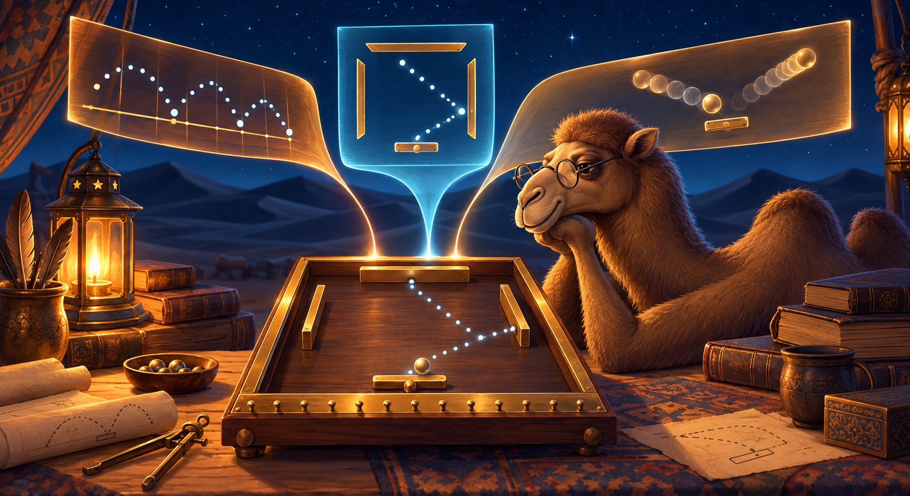
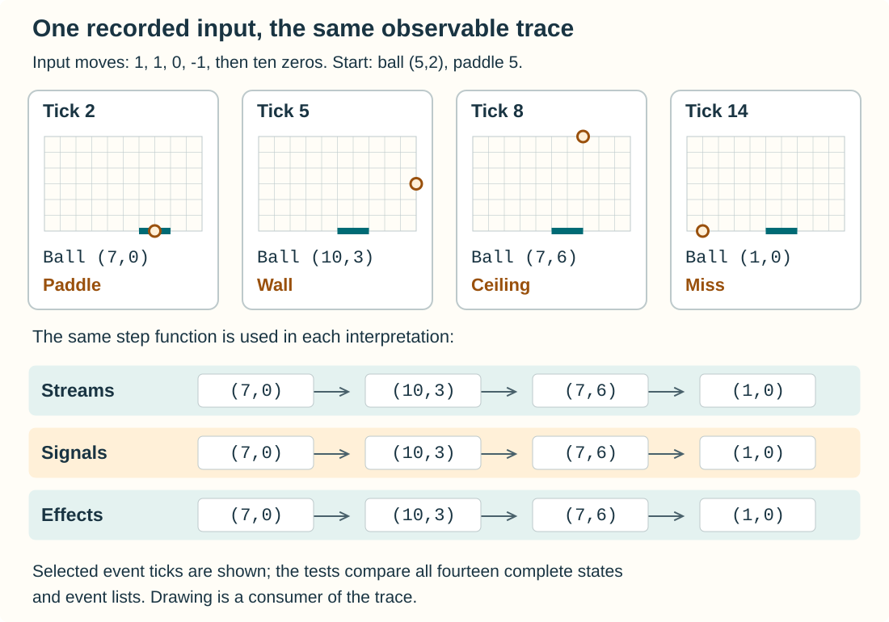

## Chapter 10: One game, three interpretations

{.chapter-image}

**Prerequisites:** Chapters 7–9: streams, interpreters and owned continuations.
**Route:** the final chapter of Part III. Chapter 12 returns to the laws connecting
representations. Zipper navigation and rewriting are in `projects/zippers`.

A moving ball on a screen is not a specification. Before comparing reactive
libraries, define one transition, a logical clock, an input log and its expected
output. Then ask whether streams, incremental signals and direct-style effects
interpret that same program. Drawing becomes a consumer of the verified states.

### 10.1 Define a discrete world

The playfield has integer x-coordinates 0–10 and y-coordinates 0–6. The ball moves
one cell per axis per tick. A paddle centered at `paddle` covers its center and
one cell on either side. Each input moves it by at most one cell, clamped to
centers 1–9. Move the paddle first, then move the ball, then resolve collisions.
A ball arriving at y=0 bounces if within the paddle; otherwise the game is lost.
At x=0 or x=10 its horizontal velocity reverses; at y=6 its vertical velocity
reverses. Simultaneous collisions emit events in wall, ceiling, paddle/miss order.

<!-- $MDX file=../projects/reactive/game.ml,part=transition -->
```ocaml
type status = Playing | Lost
type state = { tick:int; x:int; y:int; vx:int; vy:int; paddle:int; status:status }
type input = { move:int }
type event = Paddle | Wall | Ceiling | Miss
let initial = {tick=0; x=5; y=2; vx=1; vy=(-1); paddle=5; status=Playing}
let clamp lo hi x = max lo (min hi x)
let step s input =
  if input.move < -1 || input.move > 1 then invalid_arg "move must be -1, 0 or 1";
  let paddle = clamp 1 9 (s.paddle + input.move) in
  let tick = s.tick + 1 in
  if s.status = Lost then {s with tick; paddle}, []
  else
    let x = s.x + s.vx and y = s.y + s.vy in
    let wall = x = 0 || x = 10 in
    let ceiling = y = 6 in
    let bottom = y = 0 in
    let hit = bottom && abs (x - paddle) <= 1 in
    let missed = bottom && not hit in
    let state = {tick; x; y; paddle;
      vx=(if wall then -s.vx else s.vx);
      vy=(if ceiling || hit then -s.vy else s.vy);
      status=(if missed then Lost else Playing)} in
    let events =
      (if wall then [Wall] else []) @ (if ceiling then [Ceiling] else []) @
      (if hit then [Paddle] else []) @ (if missed then [Miss] else []) in
    state, events
```

The transition's state precondition is a state reachable from `initial` by valid
inputs. It is not a continuous-physics solver: there is no variable time step,
subpixel velocity or swept collision detection. After loss, ticks and paddle
inputs continue, while ball position and velocity remain fixed and no new
collision event is emitted. The simple integer model makes the semantics exact
until the machine tick counter overflows.

### 10.2 Establish the expected trace

The recorded paddle movements are
`[1;1;0;-1;0;0;0;0;0;0;0;0;0;0]`. Starting at `(5,2)` with paddle 5, the first
input moves the paddle to 6 and ball to `(6,1)`. The second moves the paddle to 7,
so the ball hits it at `(7,0)` and reverses vertically.

| Tick | Ball position | Event |
|---|---|---|
| 1 | (6,1) | none |
| 2 | (7,0) | paddle |
| 3 | (8,1) | none |
| 4 | (9,2) | none |
| 5 | (10,3) | wall |
| 6 | (9,4) | none |
| 7 | (8,5) | none |
| 8 | (7,6) | ceiling |
| 9 | (6,5) | none |
| 10 | (5,4) | none |
| 11 | (4,3) | none |
| 12 | (3,2) | none |
| 13 | (2,1) | none |
| 14 | (1,0) | miss |

At the last tick the paddle is still centered at 6, so the ball misses. This
trace exercises the paddle rule that a picture alone would not establish.

```ocaml env=game
let trace = Game.through_stream Game.recorded
let () =
  assert (List.map (fun (s,_) -> s.Game.x,s.Game.y) trace = Game.expected_positions);
  assert (List.filter_map (fun (s,e) ->
    if e=[] then None else Some (s.Game.tick,e)) trace =
    [2,[Game.Paddle];5,[Game.Wall];8,[Game.Ceiling];14,[Game.Miss]])
```

{.technical-figure}

### 10.3 A stream is a sequence of transitions

`Game.stream state inputs` yields the next `(state, events)` pair and delays the
rest behind a `Seq.t` thunk. It applies `step` once per demanded node. It is not
memoized: traversing the same sequence twice recomputes its pure transitions.
The input list is immutable, so recomputation gives the same trace.

```ocaml env=game
let () = assert (Game.through_stream Game.recorded = trace)
```

This interpretation is a scan: a fold that exposes each intermediate state.
With a live reader, re-traversal would be a different contract; Chapter 7's
resource scope would still be required. A finite input log separates that concern
from the game's state semantics.

### 10.4 Incremental signals cache dependencies

The project's `Signal` module implements a small static dependency graph. A
variable has a revision; setting it to an equal value leaves that revision alone.
A `map2` node samples its two dependencies and caches its output under their pair
of revisions. Re-reading unchanged dependencies returns the cached value.

The game scan depends on **both logical tick and input value**. Holding the same
movement key for two ticks must still move the ball twice. The driver delivers
every consecutive tick and samples it before delivering the next; an attempted
skip raises an error. The scan's stateful update is confined to that node, while
ordinary derived nodes can be pure functions of the resulting snapshot.

```ocaml env=game
let () =
  let update,sample,cost = Game.incremental () in
  update {Game.move=1};
  let first = sample () in
  assert (sample () = first && cost () = 1);
  update {Game.move=1};
  ignore (sample ());
  assert (cost () = 2);
  assert (Game.through_incremental Game.recorded = trace)
```

The input value is unchanged on the second update, but the tick revision changes.
This is the same issue an event edge detector faces: a rising edge belongs to
one tick, not every future sampling of a cached `Some event`. The `rising_edge`
example explicitly invalidates by tick. Repeated samples within one tick return
the same occurrence, and an unchanged true input on the next tick produces none.

```ocaml env=game
let () =
  let edge = Game.rising_edge () in
  assert (edge ~tick:1 true);
  assert (edge ~tick:1 true);
  assert (not (edge ~tick:2 true));
  assert (not (edge ~tick:3 false));
  assert (edge ~tick:4 true)
```

Caching a result and consuming an event are separate operations. `Game.consumer`
remembers the most recently consumed tick for one monotone consumer, returning no
events on a second poll. Another consumer owns its own cursor. No global clearing
of the event is needed, so one observer cannot silently steal it from another.

This small graph makes dependency invalidation visible. It omits dynamic graph
rewiring, disposal of observers, scheduling priorities and equality cutoffs at
derived nodes. The optional GUI laboratory describes what a port to a library
must verify; it does not infer equivalence from similar APIs.

### 10.5 Direct-style scripts suspend for input

A direct-style script asks for an input, calls `step`, publishes the snapshot,
and repeats. `Game.start` handles its input effect by owning the suspended
continuation. `push` consumes that continuation and supplies one input; the script
then publishes and suspends again. `close` discontinues the pending continuation
and runs its resource finalizer. Pushing after close is an error; closing twice
is harmless.

```ocaml env=game
let () =
  let released = ref 0 and output = ref [] in
  let session = Game.start
    ~publish:(fun snapshot -> output := snapshot :: !output)
    ~release:(fun () -> incr released) in
  Fun.protect ~finally:session.close
    (fun () -> List.iter session.push Game.recorded);
  assert (List.rev !output = trace);
  assert (!released = 1);
  assert (Game.through_effects Game.recorded = trace)
```

The ownership transfer is the same as Chapter 9: remove the continuation from its
slot *before* resuming it. If publication raises, stack unwinding releases the
resource and closes the script. The tests cover that failure as well as normal
closure and closure while waiting for another input.

### 10.6 Equivalence before drawing and timing

`projects/reactive/laws.ml` first checks the explicit trace above, then compares
all three interpreters on 100 fixed-seed, 30-input traces. It also checks repeated
sampling, repeated event consumption, unchanged Boolean edges, and abandoned or
failed scripts. Equality includes every field of state and the ordered event
list, not just ball coordinates.

The reason for agreement is simple enough to prove: each interpreter starts from
`initial`, consumes each input once in order, and emits exactly the result of the
same `step`. Induction on the input prefix establishes equal emitted traces. The
incremental interpretation additionally needs its consecutive-tick contract; the
effect interpretation needs successful publication and the stated ownership policy.

Only now connect a renderer. A renderer observes a snapshot; it must not advance
physics just because the window redraws. A timer or input adapter determines
logical ticks. If drawing takes longer than a tick, choose whether to queue,
drop or coalesce inputs and state the resulting trace policy. None of those
policies follows automatically from “reactive”.

The historical Bogue/Lwd/Incremental executable remains an optional laboratory in
`projects/gui/README.md`, outside the maintained headless suite. It has not been
certified as an implementation of this transition. No new GUI framework is
required for the chapter's behavioral comparisons.

### 10.7 Exercises

1. **Practice.** Record a trace in which the paddle misses at tick 2. Check all
   fields of the final state, not just its `Lost` status.
2. **Proof.** State the prefix invariant for the three interpreters and explain
   where the no-skipped-tick premise is used.
3. **Experiment.** Remove the tick dependency from the incremental scan and feed
   repeated equal inputs. Keep the failed trace as a regression test.
4. **Practice.** Create two independent event consumers. Check that each receives
   a paddle event once, regardless of the order in which they poll.
5. **Project.** Port the renderer to the shared transition. Pass the same recorded
   trace, verify cleanup when its window closes, and only then measure updates
   versus cached redraws. Specify a backlog policy for slow rendering.
