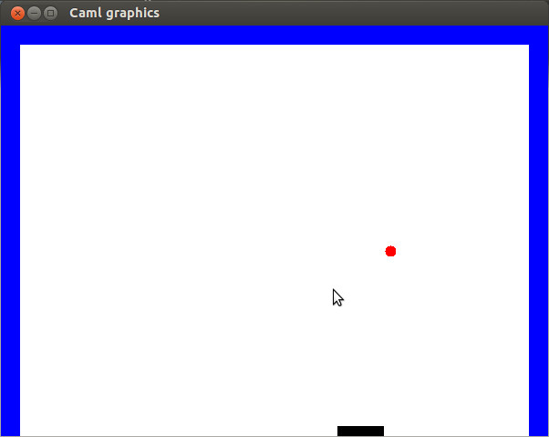
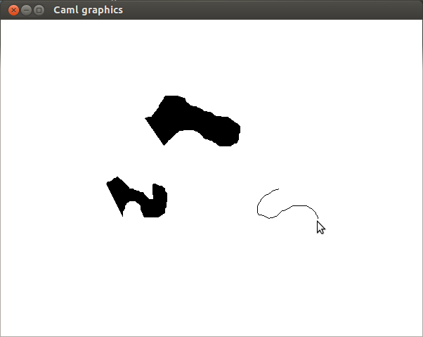
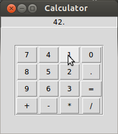
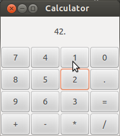

Functional Programming


Lecture 10: FRP

Zippers. Functional Reactive Programming. GUIs.

 *‘‘Zipper''* in *Haskell Wikibook* and *‘‘The Zipper''* by Gerard Huet *‘‘How
`froc` works''* by Jacob Donham *‘‘The Haskell School of Expression''* by Paul
Hudak ‘‘*Deprecating the Observer Pattern with `Scala.React`*'' by Ingo Maier,
Martin Odersky

If you see any error on the slides, let me know!

# 1 Zippers

* We would like to keep track of a position in a data structure: easily access 
  and modify it at that location, easily move the location around.
* Recall how we have defined *context types* for datatypes: types that 
  represent a data structure with one of elements stored in it missing.

```ocaml
type btree = Tip | Node of int * btree * btree
```

\begin{eqnarray*}
  T & = & 1 + xT^2\\\\\\
  \frac{\partial T}{\partial x} & = & 0 + T^2 + 2 xT \frac{\partial
  T}{\partial x} = TT + 2 xT \frac{\partial T}{\partial x}
\end{eqnarray*}

```ocaml
type btree_dir = LeftBranch | RightBranch
type btree_deriv =
  | Here of btree * btree
  | Below of btree_dir * int * btree * btree_deriv
```

* **Location = context + subtree**! But there's a problem above.
* But we cannot easily move the location if Here is at the bottom.

  The part closest to the location should be on top.
* Revisiting equations for trees and lists:

  \begin{eqnarray*}
  T & = & 1 + xT^2\\\\\\
  \frac{\partial T}{\partial x} & = & 0 + T^2 + 2 xT \frac{\partial
  T}{\partial x}\\\\\\
  \frac{\partial T}{\partial x} & = & \frac{T^2}{1 - 2 xT}\\\\\\
  L (y) & = & 1 + yL (y)\\\\\\
  L (y) & = & \frac{1}{1 - y}\\\\\\
  \frac{\partial T}{\partial x} & = & T^2 L (2 xT)
\end{eqnarray*}

  I.e. the context can be stored as a list with the root as the last node.
  * Of course it doesn't matter whether we use built-in lists, or a type with 
    Above and Root variants.
* Contexts of subtrees are more useful than of single elements.

  type 'a tree = Tip | Node of 'a tree \* 'a \* 'a treetype treedir = Leftbr | 
  Rightbrtype 'a context = (treedir \* 'a \* 'a tree) listtype 'a location = 
  {sub: 'a tree; ctx: 'a context}let access {sub} = sublet change {ctx} sub = 
  {sub; ctx}let modify f {sub; ctx} = {sub=f sub; ctx}
* We can imagine a location as a rooted tree, which is hanging pinned at one 
  of its nodes. Let's look at pictures 
  in[http://en.wikibooks.org/wiki/Haskell/Zippers](http://en.wikibooks.org/wiki/Haskell/Zippers)
* Moving around:

  let ascend loc =  match loc.ctx with  | [] -> `loc`Or raise exception.| 
  (Leftbr, n, l) :: upctx ->    {sub=Node (l, n, loc.sub); ctx=upctx}  | 
  (Rightbr, n, r) :: upctx ->    {sub=Node (loc.sub, n, r); ctx=upctx}let 
  descleft loc =  match loc.sub with  | Tip -> `loc`Or raise exception.| 
  Node (l, n, r) ->    {sub=l; ctx=(Rightbr, n, r)::loc.ctx}let descright 
  loc =  match loc.sub with  | Tip -> `loc`Or raise exception.| Node (l, 
  n, r) ->    {sub=r; ctx=(Leftbr, n, l)::loc.ctx}
* Following *The Zipper*, let's look at a tree with arbitrary number of 
  branches.

type doc = Text of string | Line | Group of doc listtype context = (doc list 
\* doc list) listtype location = {sub: doc; ctx: context}

let goup loc =  match loc.ctx with  | [] -> invalidarg "goup: at top"  | 
(left, right) :: upctx ->Previous subdocument and its siblings.    
{sub=Group (List.rev left @ loc.sub::right); ctx=upctx}let goleft loc =  match 
loc.ctx with  | [] -> invalidarg "goleft: at top"  | (l::left, right) :: 
upctx ->Left sibling of previous subdocument.    {sub=l; ctx=(left, 
loc.sub::right) :: upctx}  | ([], ) ::  -> invalidarg "goleft: at first"

let goright loc =  match loc.ctx with  | [] -> invalidarg "goright: at 
top"  | (left, r::right) :: upctx ->    {sub=r; ctx=(loc.sub::left, 
right) :: upctx}  | (, []) ::  -> invalidarg "goright: at last"let godown 
loc =Go to the first (i.e. leftmost) subdocument.  match loc.sub with  | Text 
 -> invalidarg "godown: at text"  | Line -> invalidarg "godown: at 
line"  | Group [] -> invalidarg "godown: at empty"  | Group 
(doc::docs) -> {sub=doc; ctx=([], docs)::loc.ctx}

## 1.1 Example: Context rewriting

* Our friend working on the string theory asked us for help with simplifying 
  his equations.
* The task is to pull out particular subexpressions as far to the left as we 
  can, but changing the whole expression as little as possible.
* We can illustrate our algorithm using mathematical notation. Let:
  *  $x$ be the thing we pull out
  * $C [e]$ and $D [e]$ be big expressions with subexpression $e$
  * operator $\circ$ stand for one of: $\ast, +$

  \begin{eqnarray*}
  D [(C [x] \circ e\_{1}) \circ e\_{2}] & \Rightarrow & D [C [x] \circ (e\_{1}
  \circ e\_{2})]\\\\\\
  D [e\_{2} \circ (C [x] \circ e\_{1})] & \Rightarrow & D [C [x] \circ (e\_{1}
  \circ e\_{2})]\\\\\\
  D [(C [x] + e\_{1}) e\_{2}] & \Rightarrow & D [C [x] e\_{2} + e\_{1}
  e\_{2}]\\\\\\
  D [e\_{2}  (C [x] + e\_{1})] & \Rightarrow & D [C [x] e\_{2} + e\_{1}
  e\_{2}]\\\\\\
  D [e \circ C [x]] & \Rightarrow & D [C [x] \circ e]
\end{eqnarray*}
* First the groundwork:

type op = Add | Multype expr = Val of int | Var of string | App of 
expr\*op\*exprtype exprdir = Leftarg | Rightargtype context = (exprdir \* op 
\* expr) listtype location = {sub: expr; ctx: context}

* Locate the subexpression described by `p`.

let rec findaux p e =  if p e then Some (e, [])  else match e with  | Val  | 
Var  -> None  | App (l, op, r) ->    match findaux p l with    | Some 
(sub, upctx) ->      Some (sub, (Rightarg, op, r)::upctx)    | None -> 
     match findaux p r with      | Some (sub, upctx) ->        Some (sub, 
(Leftarg, op, l)::upctx)      | None -> None

let find p e =  match findaux p e with  | None -> None  | Some (sub, 
ctx) -> Some {sub; ctx=List.rev ctx}

* Pull-out the located subexpression.

let rec pullout loc =  match loc.ctx with  | [] -> `loc`Done.| (Leftarg, op, l) :: upctx ->$D [e \circ C [x]] \Rightarrow D [C [x] \circ e]$    pullout {loc with ctx=(Rightarg, op, l) :: upctx}  | (Rightarg, op1, e1) :: (, op2, e2) :: upctx      when op1 = op2 ->$D [(C [x] \circ e\_{1}) \circ e\_{2}] / D [e\_{2} \circ (C [x] \circ e\_{1})] \Rightarrow D [C [x] \circ (e\_{1} \circ e\_{2})]$    pullout {loc with ctx=(Rightarg, op1, App(e1,op1,e2)) :: upctx}  | (Rightarg, Add, e1) :: (, Mul, e2) :: upctx ->    pullout {loc with ctx=$D [(C [x] + e\_{1}) e\_{2}] / D [e\_{2}  (C [x] + e\_{1})] \Rightarrow D [C [x] e\_{2} + e\_{1} e\_{2}]$        (Rightarg, Mul, e2) ::          (Rightarg, Add, App(e1,Mul,e2)) :: upctx}  | (Rightarg, op, r)::upctx ->Move up the context.    pullout {sub=App(loc.sub, op, r); ctx=upctx}

* Since operators are commutative, we ignore the direction for the second 
  piece of context above.
* Test:

  let (+) a b = App (a, Add, b)let ( \* ) a b = App (a, Mul, b)let (!) a = Val 
  alet x = Var "x"let y = Var "y"let ex = !5 + y \* (!7 + x) \* (!3 + y)let 
  loc = find (fun e->e=x) exlet sol =  match loc with  | None -> raise 
  Notfound  | Some loc -> pullout loc# let  = expr2str sol;;- : string = 
  "(((x\*y)\*(3+y))+(((7\*y)\*(3+y))+5))"
* For best results we can iterate the `pull_out` function until fixpoint.

# 2 Adaptive Programming aka.Incremental Computing

* Zippers are somewhat unnatural.
* Once we change the data-structure, it is difficult to propagate the changes 
  – need to rewrite all algorithms to work on context changes.
* In *Adaptive Programming*, aka. *incremental computation*, 
  aka. *self-adjusting computation*, we write programs in straightforward 
  functional manner, but can later modify any data causing only minimal amount 
  of work required to update results.
* The functional description of computation is within a monad.
* We can change monadic values – e.g. parts of input – from outside and 
  propagate the changes.
  * In the *Froc* library, the monadic *changeables* are `'a Froc_sa.t`, and 
    the ability to modify them is exposed by type `'a Froc_sa.u` – 
    the *writeables*.

### 1 Dependency Graphs (explained by Jake Dunham)

* The monadic value `'a changeable` will be the *dependency graph* of the 
  computation of the represented value `'a`.
* Let's look at the example in *“How froc works”*, representing computation

  let u = v / w + x \* y + z 
* and its state with partial results memoized

  

  where `n0, n1, n2` are interior nodes of computation.
* Modify inputs `v` and `z` simultaneously

  
* We need to update `n2` before `u`.
* We use the gray numbers – the order of computation – for the order of update 
  of `n0`, `n2` and `u`.
* Similarly to `parallel` in the concurrency monad, we provide `bind2`, 
  `bind3`, … – and corresponding `lift2`, `lift3`, … – to 
  introduce nodes with several children.

  let n0 = bind2 v w (fun v w -> return (v / w)) let n1 = bind2 x y (fun x 
  y -> return (x \* y)) let n2 = bind2 n0 n1 (fun n0 n1 -> return 
  (n0 + n1)) let u = bind2 n2 z (fun n2 z -> return (n2 + z))
* Do-notation is not necessary to have readable expressions.

  let (/) = lift2 (/) let ( \* ) = lift2 ( \* ) let (+) = lift2 (+) let u = v 
  / w + x \* y + z
* As in other monads, we can decrease overhead by using bigger chunks.

  let n0 = blift2 v w (fun v w -> v / w) let n2 = blift3 n0 x y (fun n0 x 
  y -> n0 + x \* y) let u = blift2 n2 z (fun n2 z -> n2 + z)
* We have a problem if we recompute all nodes by order of computation.

  let b = x >>= fun x -> return (x = 0) let n0 = x >>= fun 
  x -> return (100 / x) let y = bind2 b n0 (fun b n0->if b then return 
  0 else n0)

  
* Rather than a signle “time” stamp, we store intervals: begin and end of 
  computation

  
* When updating the `y` node, we first detach nodes in range 4-9 from the 
  graph.
  * Computing the expression will re-attach the nodes as needed.
* When value of `b` does not change, then we skip updating `y` and proceed 
  with updating `n0`.
  * I.e. no children of `y` with time stamp smaller than `y` change.
  * The value of `y` is a link to the value of `n0` so it will change anyway.
* We need memoization to re-attach the same nodes in case they don't need 
  updating.
  * Are they up-to-date? Run updating past the node's timestamp range.

## 2.1 Example using *Froc*

* Download *Froc* from 
  [https://github.com/jaked/froc/downloads](https://github.com/jaked/froc/downloads)
* Install for example with

  `cd froc-0.2a; ./configure; make all; sudo make install`
* Frocsa (for *self-adjusting*) exports the monadic type `t` for changeable 
  computation, and a handle type `u` for updating the computation.
* open Frocsatype tree =Binary tree with nodes storing their screen location.| 
  Leaf of int \* intWe will grow the tree| Node of int \* int \* tree t \* 
  tree tby modifying subtrees.
* let rec display px py t =Displaying the tree is changeable effect:  match t 
  withwhenever the tree changes, displaying will be updated.  | Leaf (x, 
  y) ->Only new nodes will be drawn after update.    return      
  (Graphics.drawpolyline [|px,py;x,y|];We return       Graphics.drawcircle x y 
  3)a throwaway value.  | Node (x, y, l, r) ->    return 
  (Graphics.drawpolyline [|px,py;x,y|])    >>= fun  -> 
  l >>= display x y    >>= fun  -> r >>= display x 
  y
* let growat (x, depth, upd) =  let xl = x-f2i (width\*.(2.0\*\*($\sim$-.(i2f 
  (depth+1))))) in  let l, updl = changeable (Leaf (xl, (depth+1)\*20)) in  
  let xr = x+f2i (width\*.(2.0\*\*($\sim$-.(i2f (depth+1))))) in  let r, updr 
  = changeable (Leaf (xr, (depth+1)\*20)) in  write upd (Node (x, depth\*20, 
  l, r));Update the old leaf  propagate ();and keep handles to make future 
  updates.  [xl, depth+1, updl; xr, depth+1, updr]
* let rec loop t subts steps =  if steps <= 0 then ()  else loop t 
  (concatmap growat subts) (steps-1)let incremental steps () =  
  Graphics.opengraph " 1024x600";  let t, u = changeable (Leaf (512, 20)) in  
  let d = t >>= display (f2i (width /. 2.)) 0 inDisplay once  loop t 
  [512, 1, u] steps;-- new nodes will be drawn automatically.  
  Graphics.closegraph ();;
* Compare with rebuilding and redrawing the whole tree. Unfortunately the 
  overhead of incremental computation is quite large. Byte code run:

   <table style="display: inline-table; vertical-align: middle">
  <tbody><tr>
    <td>depth</td>
    <td style="text-align: left">12</td>
    <td>13</td>
    <td>14</td>
    <td>15</td>
    <td>16</td>
    <td>17</td>
    <td>18</td>
    <td>19</td>
    <td>20</td>
  </tr><tr>
    <td>incremental</td>
    <td>0.66s</td>
    <td>1s</td>
    <td>2.2s</td>
    <td>4.4s</td>
    <td>9.3s</td>
    <td>21s</td>
    <td>50s</td>
    <td>140s</td>
    <td>255s</td>
  </tr><tr>
    <td style="text-align: left">rebuilding</td>
    <td>0.5s</td>
    <td>0.63s</td>
    <td>1.3s</td>
    <td>3s</td>
    <td>5.3s</td>
    <td>13s</td>
    <td>39s</td>
    <td>190s</td>
    <td></td>
  </tr></tbody>
</table>

# 3 Functional Reactive Programming

* FRP is an attempt to declaratively deal with time.
* *Behaviors* are functions of time.
  * A behavior has a specific value in each instant.
* *Events* are sets of (time, value) pairs.
  * I.e. they are organised into streams of actions.
* Two problems
  * Behaviors / events are well defined when they don't depend on future
  * Efficiency: minimize overhead
* FRP is *synchronous*: it is possible to set up for events to happen at the 
  same time, and it is *continuous*: behaviors can have details at arbitrary 
  time resolution.
  * Although the results are *sampled*, there's no fixed (minimal) time step 
    for specifying behavior.
  * Asynchrony refers to various ideas so ask what people mean.
* Ideally we would define:

  type time = floattype 'a behavior = time -> 'aArbitrary function.type 'a 
  event = ('a, time) streamIncreasing time instants.
* Forcing a lazy list (stream) of events would wait till an event arrives.
* But behaviors need to react to external events:

  type useraction =| Key of char \* bool| Button of int \* int \* bool \* 
  bool| MouseMove of int \* int| Resize of int \* inttype 'a behavior = 
  useraction event -> time -> 'a
* Scanning through an event list since the beginnig of time till current time, 
  each time we evaluate a behavior – very wasteful wrt. time&space.

  Producing a stream of behaviors for the stream of time allows to forget 
  about events already in the past.

  type 'a behavior =  useraction event -> time stream -> 'a stream
* Next optimization is to pair user actions with sampling times.

  type 'a behavior =  (useraction option \* time) stream -> 'a stream

  None action corresponds to sampling time when nothing happens.
* Turning behaviors and events from functions of time into input-output 
  streams is similar to optimizing interesction of ordered lists from $O (mn)$ 
  to $O (m + n)$ time.
* Now we can in turn define events in terms of behaviors:

  type 'a event = 'a option behavior

  although it betrays the discrete character of events (happening at points in 
  time rather than varying over intervals of time).
* We've gotten very close to *stream processing* as discussed in lecture 7.
  * Recall the incremental pretty-printing example that can “react” to more 
    input.
  * Stream combinators, *fork* from exercise 9 for lecture 7, and a 
    corresponding *merge*, turn stream processing into *synchronous discrete 
    reactive programming*.
* Behaviors are monadic (but see next point) – in original specification:

  type 'a behavior = time -> 'aval return : 'a -> 'a behaviorlet 
  return a = fun  -> aval bind :  'a behavior -> ('a -> 'b 
  behavior) -> 'b behaviorlet bind a f = fun t -> f (a t) t
* As we've seen with changeables, we mostly use lifting. In Haskell world we'd 
  call behaviors *applicative*. To build our own lifters in any monad:

  val ap : ('a -> 'b) monad -> 'a monad -> 'b monadlet ap fm am = 
  perform  f <-- fm;  a <-- am;  return (f a)
  * Note that for changeables, the naive implementation above will introduce 
    unnecessary dependencies. Monadic libraries for *incremental computing* or 
    FRP should provide optimized variants if needed.
    * Compare with `parallel` for concurrent computing.
* Going from events to behaviors. `until` and `switch` have type

  'a behavior -> 'a behavior event -> 'a behavior

  `step` has type

  'a -> 'a event -> 'a behavior
  * `until b es` behaves as `b` until the first event in `es`, then behaves as 
    the behavior in that event
  * `switch b es` behaves as the behavior from the last event in `es` prior to 
    current time, if any, otherwise as `b`
  * `step a b` starts with behavior returning `a` and then switches to 
    returning the value of the last event in `b` (prior to current time) – 
    a *step function*.
* We will use “*signal*” to refer to a behavior or an event. But often 
  “signal” is used as our behavior (check terminology when looking at a new 
  FRP library).

# 4 Reactivity by Stream Processing

* The stream processing infrastructure should be familiar.

  type 'a stream = 'a stream Lazy.tand 'a stream = Cons of 'a \* 'a streamlet 
  rec lmap f l = lazy (  let Cons (x, xs) = Lazy.force l in  Cons (f x, lmap f 
  xs))let rec liter (f : 'a -> unit) (l : 'a stream) : unit =  let Cons 
  (x, xs) = Lazy.force l in  f x; liter f xslet rec lmap2 f xs ys = lazy (  
  let Cons (x, xs) = Lazy.force xs in  let Cons (y, ys) = Lazy.force ys in  
  Cons (f x y, lmap2 f xs ys))let rec lmap3 f xs ys zs = lazy (  let Cons (x, 
  xs) = Lazy.force xs in  let Cons (y, ys) = Lazy.force ys in  let Cons (z, 
  zs) = Lazy.force zs in  Cons (f x y z, lmap3 f xs ys zs))let rec lfold acc f 
  (l : 'a stream) = lazy (  let Cons (x, xs) = Lazy.force l inFold a function 
  over the stream  let acc = f acc x inproducing a stream of partial results.  
  Cons (acc, lfold acc f xs))
* Since a behavior is a function of user actions and sample times, we need to 
  ensure that only one stream is created for the actual input stream.

  type ('a, 'b) memo1 =  {memof : 'a -> 'b; mutable memor : ('a \* 'b) 
  option}let memo1 f = {memof = f; memor = None}let memo1app f x =  match 
  f.memor with  | Some (y, res) when x == y -> `res`Physical equality is 
  OK --|  ->external input is ‘‘physically'' unique.    let res = f.memof 
  x inWhile debugging, we can monitor    f.memor <- Some (x, res);whether 
  f.memor = None before.    reslet ($) = memo1apptype 'a behavior =  
  ((useraction option \* time) stream, 'a stream) memo1
* The monadic/applicative functions to build complex behaviors.
  * If you do not provide type annotations in `.ml` files, work together with 
    an `.mli` file to catch problems early. You can later add more type 
    annotations as needed to find out what's wrong.

  let returnB x : 'a behavior =  let rec xs = lazy (Cons (x, xs)) in  memo1 
  (fun  -> xs)let ( !\* ) = returnBlet liftB f fb = memo1 (fun uts -> 
  lmap f (fb $ uts))let liftB2 f fb1 fb2 = memo1  (fun uts -> lmap2 f (fb1 
  $ uts) (fb2 $ uts))let liftB3 f fb1 fb2 fb3 = memo1  (fun uts -> lmap3 f 
  (fb1 $ uts) (fb2 $ uts) (fb3 $ uts))let liftE f (fe : 'a event) : 'b event = 
  memo1  (fun uts -> lmap    (function Some e -> Some (f e) | 
  None -> None)    (fe $ uts))let (=>>) fe f = liftE f felet 
  (->>) e v = e =>> fun  -> v
* Creating events out of behaviors.

  let whileB (fb : bool behavior) : unit event =  memo1 (fun uts ->    
  lmap (function true -> Some () | false -> None)      (fb $ uts))let 
  unique fe : 'a event =  memo1 (fun uts ->    let xs = fe $ uts in    
  lmap2 (fun x y -> if x = y then None else y)      (lazy (Cons (None, 
  xs))) xs)let whenB fb =  memo1 (fun uts -> unique (whileB fb) $ uts)let 
  snapshot fe fb : ('a \* 'b) event =  memo1 (fun uts -> lmap2    (fun 
  x->function Some y -> Some (y,x) | None -> None)      (fb $ uts) 
  (fe $ uts))
* Creating behaviors out of events.

  let step acc fe =The step function: value of last event. memo1 (fun 
  uts -> lfold acc   (fun acc -> function None -> acc | Some 
  v -> v)   (fe $ uts))let stepaccum acc ff =Transform a value by a series 
  of functions. memo1 (fun uts ->   lfold acc (fun acc -> function   | 
  None -> acc | Some f -> f acc)     (ff $ uts))
* To numerically integrate a behavior, we need to access the sampling times.

  let integral fb =  let rec loop t0 acc uts bs =    let Cons ((,t1), uts) = 
  Lazy.force uts in    let Cons (b, bs) = Lazy.force bs in    let acc = acc +. 
  (t1 -. t0) \*. b in$b =\operatorname{fb} (t\_{1}), \operatorname{acc} 
  \approx \int\_{t \leqslant t\_{0}} f$.    Cons (acc, lazy (loop t1 acc uts 
  bs)) in  memo1 (fun uts -> lazy (    let Cons ((,t), uts') = Lazy.force 
  uts in    Cons (0., lazy (loop t 0. uts' (fb $ uts)))))
  * In our *paddle game* example, we paradoxically express position and 
    velocity in mutually recursive manner. The trick is the same as in chapter 
    7 – integration introduces one step of delay.
* User actions:

  let lbp : unit event =  memo1 (fun uts -> lmap    (function 
  Some(Button(,)),  -> Some() |  -> None)    uts)let mm : (int \* int) 
  event =  memo1 (fun uts -> lmap  (function 
  Some(MouseMove(x,y)), ->Some(x,y) |  ->None)    uts)let screen : 
  (int \* int) event =  memo1 (fun uts -> lmap    (function 
  Some(Resize(x,y)), ->Some(x,y) |  ->None)    uts)let mousex : int 
  behavior = step 0 (liftE fst mm)let mousey : int behavior = step 0 (liftE 
  snd mm)let width : int behavior = step 640 (liftE fst screen)let height : 
  int behavior = step 512 (liftE snd screen)

### 1 The Paddle Game example

* A *scene graph* is a data structure that represents a “world” which can be 
  drawn on screen.

  type scene =| Rect of int \* int \* int \* intposition, width, height| 
  Circle of int \* int \* intposition, radius| Group of scene list| Color of 
  Graphics.color \* `scene`color of subscene objects|Translate of float \* 
  float \* sceneadditional offset of origin
* Drawing a scene explains what we mean above.

  let draw sc =  let f2i = intoffloat in  let open Graphics in  let rec aux tx 
  ty = functionAccumulate translations.  | Rect (x, y, w, h) ->    
  fillrect (f2i tx+x) (f2i ty+y) w h  | Circle (x, y, r) ->    fillcircle 
  (f2i tx+x) (f2i ty+y) r  | Group scs ->    List.iter (aux tx ty) 
  `scs`$\swarrow$  Set color for `sc` objects.| Color (c, sc) -> setcolor 
  c; aux tx ty sc  | Translate (x, y, sc) -> aux (tx+.x) (ty+.y) sc in  
  cleargraph ();‘‘Fast and clean'' removing of previous picture.  aux 0. 0. 
  sc;  synchronize ()Synchronize the *double buffer* -- avoiding flickering.
* An animation is a scene behavior. To animate it we need to create the input 
  stream: the user actions and sampling times stream.
  * We could abstract away drawing from time sampling in `reactimate`, asking 
    for (i.e. passing as argument) a producer of user actions and a consumer 
    of scene graphs (like `draw`).

  let reactimate (anim : scene behavior) =  let open Graphics in  let notb =
  function Some (Button (,)) -> false |  -> true in  let current oldm
  oldscr (oldu, t0) =    let rec delay () =      let t1 = Unix.gettimeofday ()
  in      let d = 0.01 -. (t1 -. t0) in      try if d > 0. then
  Thread.delay d;          Unix.gettimeofday ()      with Unix.Unixerror ((\*
  Unix.EAGAIN \*), , ) -> delay () in    let t1 = delay () in    let s =
  Graphics.waitnextevent [Poll] in    let x = s.mousex and y = s.mousey    and
  scrx = Graphics.sizex () and scry = Graphics.sizey () in
    let ue =      if s.keypressed then Some (Key s.key)      else if (scrx,
  scry) <> oldscr then Some (Resize (scrx,scry))      else if
  s.button && notb oldu then Some (Button (x, y))      else if (x, y)
  <> oldm then Some (MouseMove (x, y))      else None in    (x, y),
  (scrx, scry), (ue, t1) in  opengraph "";Open window.  displaymode false;Draw
  using *double buffering*.  let t0 = Unix.gettimeofday () in  let rec utstep
  mpos scr ut = lazy (    let mpos, scr, ut = current mpos scr ut in    Cons
  (ut, utstep mpos scr ut)) in  let scr = Graphics.sizex (), Graphics.sizey ()
  in  let ut0 = Some (Resize (fst scr, snd scr)), t0 in  liter draw (anim $
  lazy (Cons (ut0, utstep (0,0) scr ut0)));  closegraph ()Close window --
  unfortunately never happens.
* General-purpose behavior operators.

  let (+\*) = liftB2 (+)let (-\*) = liftB2 (-)let ( \*\*\* ) = liftB2 ( \* 
  )let (/\*) = liftB2 (/)let (&&\*) = liftB2 (&&)let (||\*) = liftB2 (||)let 
  (<\*) = liftB2 (<)let (>\*) = liftB2 (>)
* The walls are drawn on left, top and right borders of the window.

  let walls =  liftB2 (fun w h -> Color (Graphics.blue, Group    [Rect (0, 
  0, 20, h-1); Rect (0, h-21, w-1, 20);     Rect (w-21, 0, 20, h-1)]))    
  width height
* The paddle is tied to the mouse at the bottom border of the window.

  let paddle = liftB (fun mx ->  Color (Graphics.black, Rect (mx, 0, 50, 
  10))) mousex
* The ball has a velocity in pixels per second. It bounces from the walls, 
  which is hard-coded in terms of distance from window borders.
  * Unfortunately OCaml, being an eager language, does not let us encode 
    recursive behaviors in elegant way.  We need to unpack behaviors and 
    events as functions of the input stream.
  * xbounce ->> ($\sim$-.) event is just the negation function 
    happening at each horizontal bounce.
  * stepaccum vel (xbounce ->> ($\sim$-.)) behavior is `vel` value 
    changing sign at each horizontal bounce.
  * liftB intoffloat (integral xvel) +\* width /\* !\*2 – first integrate 
    velocity, then truncate it to integers and offset to the middle of the 
    window.
  * whenB ((xpos >\* width -\* !\*27) ||\* (xpos <\* !\*27)) – issue 
    an event the first time the position exceeds the bounds. This ensures 
    there are no further bouncings until the ball moves out of the walls.

let pbal vel =  let rec xvel uts =    stepaccum vel (xbounce ->> ($\sim$-.)) $ uts  and xvel = {memof = xvel; memor = None}  and xpos uts =    (liftB intoffloat (integral xvel) +\* width /\* !\*2) $ uts  and xpos = {memof = xpos; memor = None}  and xbounce uts = whenB    ((xpos >\* width -\* !\*27) ||\* (xpos <\* !\*27)) $ uts  and xbounce = {memof = xbounce; memor = None} in  let rec yvel uts =    (stepaccum vel (ybounce ->> ($\sim$-.))) $ uts  and yvel = {memof = yvel; memor = None}  and ypos uts =    (liftB intoffloat (integral yvel) +\* height /\* !\*2) $ uts  and ypos = {memof = ypos; memor = None}  and ybounce uts = whenB (    (ypos >\* height -\* !\*27) ||\*      ((ypos <\* !\*17) &&\* (ypos >\* !\*7) &&\*          (xpos >\* mousex) &&\* (xpos <\* mousex +\* !\*50))) $ uts  and ybounce = {memof = ybounce; memor = None} in  liftB2 (fun x y -> Color (Graphics.red, Circle (x, y, 6)))    xpos ypos

* Invocation:

  `ocamlbuild Lec10b.native -cflags -I,+threads  -libs 
  graphics,unix,threads/threads --`
* 

# 5 Reactivity by Incremental Computing

* In *Froc* behaviors and events are both implemented as changeables but only 
  behaviors persist, events are “instantaneous”.
  * Behaviors are composed out of constants and prior events, capture the 
    “changeable” aspect.
  * Events capture the “writeable” aspect – after their values are propagated, 
    the values are removed.

  Events and behaviors are called *signals*.
* *Froc* does not represent time, and provides the function changes : 'a 
  behavior -> 'a event, which violates the continuous semantics we 
  introduced before.
  * It breaks the illusion that behaviors vary continuously rather than at 
    discrete points in time.
  * But it avoids the need to synchronize global time samples with events in 
    the system. It is “less continuous but more dense”.
* Sending an event – `send` – starts an *update cycle*. Signals cannot call 
  `send`, but can `send_deferred` which will send an event in next cycle.
  * Things that happen in the same update cycle are *simultaneous*.
  * Events are removed (detached from dependency graph) after an update cycle.
* *Froc* provides the `fix_b`, `fix_e` functions to define signals 
  recursively. Current value refers to value from previous update cycle, and 
  defers next recursive step to next cycle, until convergence.
* Update cycles can happen “back-to-back” via `send_deferred` and `fix_b`, 
  `fix_e`, or can be invoked from outside *Froc* by sending events at 
  arbitrary times.
  * With a `time` behavior that holds a `clock` event value, events from 
    “back-to-back” update cycles can be at the same clock time although not 
    simultaneous in this sense.
  * Update cycles prevent *glitches*, where outdated signal is used e.g. to 
    issue an event.
* Let's familiarize ourselves with *Froc* 
  API:[http://jaked.github.com/froc/doc/Froc.html](http://jaked.github.com/froc/doc/Froc.html)
* A behavior is written in *pure style*, when its definition does not use 
  `send`, `send_deferred`, `notify_e`, `notify_b` and `sample`:
  * `sample`, `notify_e`, `notify_b` are used from outside the behavior (from 
    its “environment”) analogously to observing result of a function,
  * `send`, `send_deferred` are used from outside analogously to providing 
    input to a function.
* We will develop an example in a pragmatic, *impure* style, but since purity 
  is an important aspect of functional programming, I propose to rewrite it in 
  pure style as an exercise (ex. 5).
* When writing in impure style we need to remember to refer from somewhere to 
  all the pieces of our behavior, otherwise the unreferred parts will 
  be **garbage collected** breaking the behavior.
  * A value is referred to, when it has a name in the global environment or is 
    part of a bigger value that is referred to (for example it's stored 
    somewhere). Signals can be referred to by being part of the dependency 
    graph, but also by any of the more general ways.

### 1 Reimplementing the Paddle Game example

* Rather than following our incremental computing example (a scene with 
  changeable parts), we follow our FRP example: a scene behavior.
* First we introduce time:

  open Froclet clock, tick = makeevent ()let time = hold (Unix.gettimeofday 
  ()) clock
* Next we define integration:

  let integral fb =  let aux (sum, t0) t1 =    sum +. (t1 -. t0) \*. sample 
  fb, t1 in  collectb aux (0., sample time) clock

  For convenience, the integral remembers the current upper limit of 
  integration. It will be useful to get the integer part:

  let integres fb =  lift (fun (v,) -> intoffloat v) (integral fb)


* We can also define integration in pure style:

  let pair fa fb = lift2 (fun x y -> x, y) fa fblet integralnice fb =  let 
  samples = changes (pair fb time) in  let aux (sum, t0) (fv, t1) =    sum +. 
  (t1 -. t0) \*. fv, t1 in  collectb aux (0., sample time) samples

  The initial value (0., sample time) is not “inside” the behavior so `sample` 
  here does not spoil the pure style.
* The `scene` datatype and how we `draw` a scene does not change.
* Signals which will be sent to behaviors:

  let mousemovex, movemousex = makeevent ()let mousemovey, movemousey =
  makeevent ()let mousex = hold 0 mousemovexlet mousey = hold 0 mousemovexlet
  widthresized, resizewidth = makeevent ()let heightresized, resizeheight =
  makeevent ()let width = hold 640 widthresizedlet height = hold 512
  heightresizedlet mbuttonpressed, pressmbutton = makeevent ()let keypressed,
  presskey = makeevent ()
* The user interface main loop, emiting signals and observing behaviors:

  let reactimate (anim : scene behavior) =  let open Graphics in  let rec loop 
  omx omy osx osy omb t0 =    let rec delay () =      let t1 = 
  Unix.gettimeofday () in      let d = 0.01 -. (t1 -. t0) in      try if 
  d > 0. then Thread.delay d;          Unix.gettimeofday ()      with 
  Unix.Unixerror ((\* Unix.EAGAIN \*), , ) -> delay () in    let t1 = 
  delay () in    let s = Graphics.waitnextevent [Poll] in    let x = s.mousex 
  and y = s.mousey    and scrx = Graphics.sizex () and scry = Graphics.sizey 
  () in    if s.keypressed then send presskey s.key;We can send signals    if 
  scrx <> osx then send resizewidth scrx;one by one.    if scry 
  <> osy then send resizeheight scry;    if s.button && not omb then 
  send pressmbutton ();    if x <> omx then send movemousex x;    if 
  y <> omy then send movemousey y;    send tick t1;    draw (sample 
  anim);After all signals are updated, observe behavior.    loop x y scrx scry 
  s.button t1 in  opengraph "";  displaymode false;  loop 0 0 640 512 false 
  (Unix.gettimeofday ());  closegraph ()
* The simple behaviors as in `Lec10b.ml`. Pragmatic (impure) bouncing:

  let pbal vel =  let xbounce, bouncex = makeevent () in  let ybounce, bouncey 
  =
  makeevent () in  let xvel = collectb (fun v  -> $\sim$-.v) vel xbounce
  in  let yvel = collectb (fun v  -> $\sim$-.v) vel ybounce in  let xpos =
  integres xvel +\* width /\* !\*2 in  let ypos = integres yvel +\* height /\*
  !\*2 in  let xbounce = whentrue    ((xpos >\* width -\* !\*27) ||\*
  (xpos <\* !\*27)) in  notifye xbounce (send bouncex);  let ybounce =
  whentrue (    (ypos >\* height -\* !\*27) ||\*      ((ypos <\*
  !\*17) &&\* (ypos >\* !\*7) &&\*          (xpos >\* mousex) &&\*
  (xpos <\* mousex +\* !\*50))) in  notifye ybounce (send bouncey);
  lift4 (fun x y   -> Color (Graphics.red, Circle (x, y, 6)))    xpos ypos
  (hold () xbounce) (hold () ybounce)
* We hold on to xbounce and ybounce above to prevent garbage collecting them. 
  We could instead remember them in the “toplevel”:

  let pbal vel =  …  xbounce, ybounce,  lift2 (fun x y -> Color 
  (Graphics.red, Circle (x, y, 6)))    xpos yposlet xb, yb, ball = pbal 
  100.let game = lift3 (fun walls paddle ball ->  Group [walls; paddle; 
  ball]) walls paddle ball
* We can easily monitor signals while debugging, e.g.:

    notifye xbounce (fun () -> Printf.printf "xbounce\n%!");  notifye 
  ybounce (fun () -> Printf.printf "ybounce\n%!");
* Invocation:`ocamlbuild Lec10c.native -cflags -I,+froc,-I,+threads -libs 
  froc/froc,unix,graphics,threads/threads --`

# 6 Direct Control

* Real-world behaviors often are *state machines*, going through several 
  stages. We don't have declarative means for it yet.
  * Example: baking recipes. *1. Preheat the oven. 2. Put flour, sugar, eggs 
    into a bowl. 3. Spoon the mixture.* etc.
* We want a *flow* to be able to proceed through events: when the first event 
  arrives we remember its result and wait for the next event, disregarding any 
  further arrivals of the first event!
  * Therefore *Froc* constructs like mapping an event: `map`, or attaching a 
    notification to a behavior change: `bind b1 (fun v1 -> notify_b 
    ~now:false b2 (fun v2 ->` …)), will not work.
* We also want to be able to repeat or loop a flow, but starting from the 
  notification of the first event that happens after the notification of the 
  last event.
* `next e` is an event propagating only the first occurrence of `e`. This will 
  be the basis of our `await` function.
* The whole flow should be cancellable from outside at any time.
* A flow is a kind of a *lightweight thread* as in end of lecture 8, we'll 
  make it a monad. It only “stores” a non-unit value when it `await`s an 
  event. But it has a primitive to `emit` values.
  * We actually implement *coarse-grained* threads (lecture 8 exercise 11), 
    with `await` in the role of `suspend`.
* We build a module Flow with monadic type ('a, 'b) flow “storing” `'b` and 
  emitting `'a`.

  type ('a, 'b) flowtype cancellableA handle to cancel a flow (stop further 
  computation).val noopflow : ('a, unit) flowSame as `return` ().val return : 
  'b -> ('a, 'b) flowCompleted flow.val await : 'b Froc.event -> ('a, 
  'b) flowWait and store event:val bind :the principled way to input.  ('a, 
  'b) flow -> ('b -> ('a, 'c) flow) -> ('a, 'c) flowval emit : 
  'a -> ('a, unit) flowThe principled way to output.val cancel : 
  cancellable -> unitval repeat :Loop the given flow and store the stop 
  event.  ?until:'a Froc.event -> ('b, unit) flow -> ('b, 'a) flowval 
  eventflow :  ('a, unit) flow -> 'a Froc.event \* cancellableval 
  behaviorflow :The initial value of a behavior and a flow to update it.  
  'a -> ('a, unit) flow -> 'a Froc.behavior \* cancellableval 
  iscancelled : cancellable -> bool
* We follow our (or *Lwt*) implementation of lightweight threads, adapting it 
  to the need of cancelling flows.

  module F = Froctype 'a result =| Return of `'a`$\downarrow$Notifications to 
  cancel when cancelled.| Sleep of ('a -> unit) list \* F.cancel ref list| 
  Cancelled| Link of 'a stateand 'a state = {mutable state : 'a result}type 
  cancellable = unit state
* Functions `find`, `wakeup`, `connect` are as in lecture 8 (but connecting to 
  cancelled thread cancels the other thread).
* Our monad is actually a reader monad over the result state. The reader 
  supplies the `emit` function. (See exercise 10.)

  type ('a, 'b) flow = ('a -> unit) -> 'b state
* The `return` and `bind` functions are as in our lightweight threads, but we 
  need to handle cancelled flows: for `m = bind a b`, if `a` is cancelled then 
  `m` is cancelled, and if `m` is cancelled then don't wake up `b`:

        let waiter x =        if not (iscancelled m)        then connect m (b 
  x emit) in      …
* `await` is implemented like `next`, but it wakes up a flow:

  let await t = fun emit ->  let c = ref F.nocancel in  let m = 
  {state=Sleep ([], [c])} in  c :=    F.notifyecancel t begin fun r ->     
   F.cancel !c;      c := F.nocancel;      wakeup m r    end;  m
* `repeat` attaches the whole loop as a waiter for the loop body.

  let repeat ?(until=F.never) fa =  fun emit ->    let c = ref F.nocancel 
  in    let out = {state=Sleep ([], [c])} in    let cancelbody = ref 
  {state=Cancelled} in    c := F.notifyecancel until begin fun tv ->       
   F.cancel !c;        c := F.nocancel; Exiting the loop consists of 
  cancelling the loop body        cancel !cancelbody; `wakeup out tv`and 
  waking up loop waiters.end;    let rec loop () =      let a = find (fa emit) 
  in      cancelbody := a;      (match a.state with      | Cancelled -> 
  cancel out; F.cancel !c      | Return x ->        failwith "loopuntil: 
  not implemented for unsuspended flows"      | Sleep (xwaiters, 
  xcancels) ->        a.state <- Sleep (loop::xwaiters, xcancels)     
   | Link  -> assert false) in    loop (); out
* Example: drawing shapes. Invocation:`ocamlbuild Lec10d.native -pp "camlp4o 
  monad/pa_monad.cmo" -libs froc/froc,graphics -cflags -I,+froc --`
* The event handlers and drawing/event dispatch loop `reactimate` is similar 
  to the paddle game example (we removed unnecessary events).
* The scene is a list of shapes, the first shape is open.

  type scene = (int \* int) list listlet draw sc =  let open Graphics in  
  cleargraph ();  (match sc with  | [] -> ()  | opn::cld ->    
  drawpolyline (Array.oflist opn);    List.iter (fillpoly -| Array.oflist) 
  cld);  synchronize ()
* We build a flow and turn it into a behavior to animate.

  let painter =  let cld = ref [] inGlobal state of painter.  repeat (perform  
      await mbuttonpressed;Start when button down.      let opn = ref [] in    
    repeat (perform          mpos <-- await mousemove;$\swarrow$Add next 
  position to line.          emit (opn := mpos :: !opn; !opn :: !cld))        
  $\sim$until:mbuttonreleased;$\swarrow$Start new shape.      emit (cld := 
  !opn :: !cld; opn := []; [] :: !cld))let painter, cancelpainter = 
  behaviorflow [] painterlet () = reactimate painter
* 

### 1 Flows and state

Global state and thread-local state can be used with lightweight threads, but 
pay attention to semantics – which computations are inside the monad and which 
while building the initial monadic value.

* Side effects hidden in `return` and `emit` arguments are not inside the 
  monad. E.g. if in the “first line” of a loop effects are executed only at 
  the start of the loop – but if after bind (“below first line” of a loop), at 
  each step of the loop.

let f =  repeat (perform      emit (Printf.printf "[0]\n%!"; '0');      () <-- await aas;      emit (Printf.printf "[1]\n%!"; '1');      () <-- await bs;      emit (Printf.printf "[2]\n%!"; '2');      () <-- await cs;      emit (Printf.printf "[3]\n%!"; '3');      () <-- await ds;      emit (Printf.printf "[4]\n%!"; '4'))let e, cancele = eventflow flet () =  F.notifye e (fun c -> Printf.printf "flow: %c\n%!" c);  Printf.printf "notification installed\n%!"let () =  F.send a (); F.send b (); F.send c (); F.send d ();  F.send a (); F.send b (); F.send c (); F.send d ()

[0]Only printed once -- when building the loop.`notification installed`Only 
installed **after** the first flow event sent.event: aEvent notification (see 
source `Lec10e.ml`).[1]Second `emit` computed after first `await` 
returns.flow: 1Emitted signal.event: bNext event…[2]flow: 2event: 
c[3]flow: 3event: d[4]flow: 4Last signal emitted from first turn of the 
loop --flow: 0and first signal of the second turn (but `[0]` not 
printed).event: a[1]flow: 1event: b[2]flow: 2event: c[3]flow: 3event: 
d[4]flow: 4flow: 0Program ends while flow in third turn of the loop.


# 7 Graphical User Interfaces

* In-depth discussion of GUIs is beyond the scope of this course. We only 
  cover what's needed for an example reactive program with direct control.
* Demo of libraries *LablTk* based on optional labelled arguments discussed in 
  lecture 2 exercise 2, and polymorphic variants, and *LablGtk* additionally 
  based on objects. We will learn more about objects and polymorphic variants 
  in next lecture.

## 7.1 Calculator Flow

let digits, digit = F.makeevent ()We represent the mechanicslet ops, op = 
F.makeevent ()of the calculator directly as a flow.let dots, dot = F.makeevent 
()let calc =We need two state variables for two arguments of calculation  let 
f = ref (fun x -> x) and now = ref 0.0 inbut we  repeat (performremember 
the older argument in partial application.      op <-- repeat        
(performEnter the digits of a number (on later turns            d <-- 
await digits;starting from the second digit)            emit (now := 10. \*. 
!now +. d; !now))        $\sim$until:ops;until operator button is pressed.     
 emit (now := !f !now; f := op !now; !now);      d <-- 
`repeat`$\nwarrow$Compute the result and ‘‘store away'' the operator.(perform 
op <-- await ops; return (f := op !now))        $\sim$until:digits;The 
user can pick a different operator.      emit (now := d; !now))Reset the state 
to a new number.let calce, cancelcalc = eventflow calcNotifies display update.

## 7.2 *Tk*: *LablTk*

* Widget toolkit ***Tk*** known from the *Tcl* language.
* Invocation:`ocamlbuild Lec10tk.byte -cflags -I,+froc -libs froc/froc  -pkg 
  labltk -pp "camlp4o monad/pa_monad.cmo" --`
  * For unknown reason I had build problems with `ocamlopt` (native).
* Layout of the calculator – common across GUIs.

  let layout = [|[|"7",‘Di 7.; "8",‘Di 8.; "9",‘Di 9.; "+",‘O (+.)|];   
  [|"4",‘Di 4.; "5",‘Di 5.; "6",‘Di 6.; "-",‘O (-.)|];   [|"1",‘Di 1.; 
  "2",‘Di 2.; "3",‘Di 3.; "\*",‘O ( \*.)|];   [|"0",‘Di 0.; ".",‘Dot;   "=", 
  ‘O sk; "/",‘O (/.)|]|]
* Every *widget* (window gadget) has a parent in which it is located.
* *Buttons* have action associated with pressing them, *labels* just provide 
  information, *entries* (aka. *edit* fields) are for entering info from 
  keyboard.
  * Actions are *callback* functions passed as the $\sim$`command` argument.
* *Frames* in *Tk* group widgets.
* The parent is sent as last argument, after optional labelled arguments.

  let top = Tk.openTk ()let btnframe =  Frame.create $\sim$relief:‘Groove 
  $\sim$borderwidth:2 toplet buttons =  Array.map (Array.map (function  | 
  text, ‘Dot ->    Button.create $\sim$text      $\sim$command:(fun 
  () -> F.send dot ()) btnframe  | text, ‘Di d ->    Button.create 
  $\sim$text      $\sim$command:(fun () -> F.send digit d) btnframe  | 
  text, ‘O f ->    Button.create $\sim$text      $\sim$command:(fun 
  () -> F.send op f) btnframe)) layoutlet result = Label.create 
  $\sim$text:"0" $\sim$relief:‘Sunken top
* GUI toolkits have layout algorithms, so we only need to tell which widgets 
  hang together and whether they should fill all available space etc. – via 
  `pack`, or `grid` for “rectangular” organization.
* $\sim$fill: the allocated space in `‘X`, `‘Y`, `‘Both` or `‘None` 
  axes;$\sim$expand: maximally how much space is allocated or only as needed.
* $\sim$anchor: allows to glue a widget in particular direction (`‘Center`, 
  `‘E`, `‘Ne` etc.)
* The `grid` packing flexibility: $\sim$columnspan and $\sim$rowspan.
* `configure` functions accept the same arguments as `create` but change 
  existing widgets.
* let () =  Wm.titleset top "Calculator";  Tk.pack [result] $\sim$side:‘Top 
  $\sim$fill:‘X;  Tk.pack [btnframe] $\sim$side:‘Bottom $\sim$expand:true;  
  Array.iteri (fun column ->Array.iteri (fun row button ->    Tk.grid 
  $\sim$column $\sim$row [button])) buttons;  Wm.geometryset top "200x200";  
  F.notifye calce    (fun now ->      Label.configure 
  $\sim$text:(stringoffloat now) result);  Tk.mainLoop ()
* 

## 7.3 *GTk+*: *LablGTk*

* ***LablGTk*** is build as an object-oriented layer over a low-level layer of 
  functions interfacing with the *GTk+* library, which is written in *C*.
* In OCaml, object fields are only visible to object methods, and methods are 
  called with # syntax, e.g. window#show ()
* The interaction with the application is reactive:
  * Our events are called signals in *GTk+*.
  * Registering a notification is called connecting a signal handler, 
    e.g.button#connect#clicked $\sim$callback:hello which takes $\sim 
    {\nobreak}$callback:(unit -> unit) and returns GtkSignal.id.
    * As with *Froc* notifications, multiple handlers can be attached.
  * *GTk+* events are a subclass of signals related to more specific window 
    events, e.g.window#event#connect#delete $\sim$callback:deleteevent
  * *GTk+* event callbacks take more info: $\sim$callback:(event -> unit) 
    for some type `event`.
* Automatic layout (aka. packing) seems less sophisticated than in *Tk*:
  * only horizontal and vertical boxes,
  * therefore $\sim$fill is binary and $\sim$anchor is replaced by $\sim$from 
    `‘START` or `‘END`.
* Automatic grid layout is called `table`.
  * $\sim$fill and $\sim$expand take `‘X`, `‘Y`, `‘BOTH`, `‘NONE`.
* The `coerce` method casts the type of the object (in *Tk* there is `coe` 
  function).
* Labels don't have a dedicated module – see definition of `result` widget.
* Widgets have setter methods `widget#set_X` (instead of a single `configure` 
  function in *Tk*).
* Invocation:`ocamlbuild Lec10gtk.native -cflags -I,+froc -libs froc/froc 
   -pkg lablgtk2 -pp "camlp4o monad/pa_monad.cmo" --`
* The model part of application doesn't change.
* Setup:

  let  = GtkMain.Main.init ()let window =  GWindow.window $\sim$width:200 
  $\sim$height:200 $\sim$title:"Calculator" ()let top = GPack.vbox 
  $\sim$packing:window#add ()let result = GMisc.label $\sim$text:"0" 
  $\sim$packing:top#add ()let btnframe =  GPack.table $\sim$rows:(Array.length 
  layout)   $\sim$columns:(Array.length layout.(0)) $\sim$packing:top#add ()
* Button actions:

  let buttons =  Array.map (Array.map (function  | label, ‘Dot ->    let b 
  = GButton.button $\sim$label () in    let  = b#connect#clicked      
  $\sim$callback:(fun () -> F.send dot ()) in b  | label, ‘Di d ->    
  let b = GButton.button $\sim$label () in    let  = b#connect#clicked      
  $\sim$callback:(fun () -> F.send digit d) in b  | label, ‘O f ->    
  let b = GButton.button $\sim$label () in    let  = b#connect#clicked      
  $\sim$callback:(fun () -> F.send op f) in b)) layout
* Button layout, result notification, start application:

  let deleteevent  = GMain.Main.quit (); falselet () =  let  = 
  window#event#connect#delete $\sim$callback:deleteevent in  Array.iteri (fun 
  column->Array.iteri (fun row button ->    btnframe#attach 
  $\sim$left:column $\sim$top:row      $\sim$fill:‘BOTH $\sim$expand:‘BOTH 
  (button#coerce))  ) buttons;  F.notifye calce    (fun now -> 
  result#setlabel (stringoffloat now));  window#show ();  GMain.Main.main ()
* 
