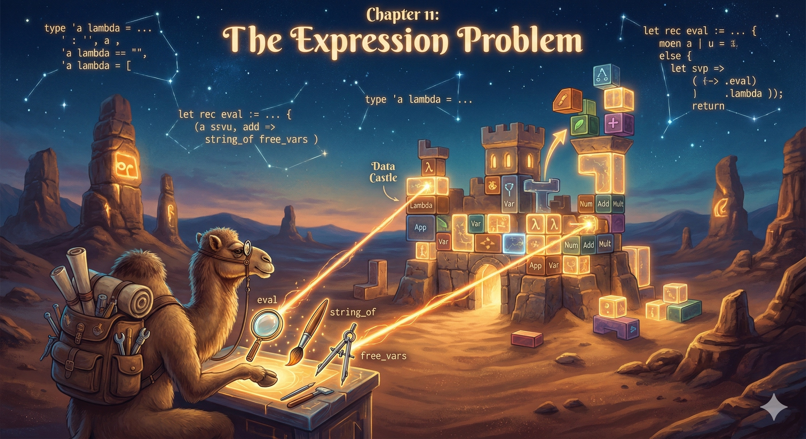

## Chapter 11: Binding, parsing, and extension

{.chapter-image}

**Prerequisites:** Chapters 3, 5 and 6. Chapter 8 is useful for parser choice;
Chapter 9 is useful for GADT indices. **Route:** Part II continues from Chapter 6;
read it before Part III if you want the whole expression-language thread together.

We have evaluated one syntax directly, by CPS, by a machine and by a fold. Now
we will substitute into it, parse it and compare ways of extending it. State the
requirements before selecting an encoding: “extensible” can mean several
incompatible things.

### 11.1 The extension requirements

Suppose we add unary negation and a new operation, pretty printing. We want:

1. Existing expressions to keep their evaluation behavior.
2. Negation to nest around old expressions, and inside old binary operations.
3. Independently compiled code to add syntax or operations without editing every
   original definition.
4. Exhaustiveness or another explicit failure policy for unknown cases.
5. Where required, result types to distinguish arithmetic from Boolean expressions.

The classic expression problem asks for extension along both datatype and
operation axes, with static type safety and without modifying existing code.
A runtime registry offers a different tradeoff: separately loaded extensions with
explicit missing-handler failures. A GADT result index solves another problem,
namely ruling out ill-typed object-language expressions. It does not automatically
solve separate extensibility.

### 11.2 Binding is shared machinery

Recall that `Let (x, value, body)` binds `x` only in `body`. The variable remains
free in `value` unless an outer binding supplies it. A substitution must preserve
that scope and avoid capturing free variables in its replacement.

<!-- $MDX file=../projects/expressions/expr.ml,part=binding -->
```ocaml
module Names = Set.Make (String)

let rec free = function
  | Number _ -> Names.empty
  | Variable x -> Names.singleton x
  | Binary (_, a, b) -> Names.union (free a) (free b)
  | Let (x, value, body) ->
    Names.union (free value) (Names.remove x (free body))

let rec names = function
  | Number _ -> Names.empty
  | Variable x -> Names.singleton x
  | Binary (_, a, b) -> Names.union (names a) (names b)
  | Let (x, value, body) ->
    Names.add x (Names.union (names value) (names body))

let fresh used x =
  let rec loop x = if Names.mem x used then loop (x ^ "'") else x in
  loop x

let rec subst x replacement = function
  | Number _ as e -> e
  | Variable y as e -> if x = y then replacement else e
  | Binary (op, a, b) ->
    Binary (op, subst x replacement a, subst x replacement b)
  | Let (y, value, body) ->
    let value' = subst x replacement value in
    if x = y then Let (y, value', body)
    else if not (Names.mem y (free replacement)) then
      Let (y, value', subst x replacement body)
    else
      let used = Names.add x (Names.union (names body) (names replacement)) in
      let z = fresh used y in
      let renamed = subst y (Variable z) body in
      Let (z, value', subst x replacement renamed)
```

If the binding name is the variable being substituted, skip its body, but still
substitute in its value expression. Otherwise, if the replacement has that name
free, choose a fresh name outside **all** names in the body and replacement, and
outside the substituted name. Rename this binding's occurrences before descending.
The recursive substitution respects inner shadowing; it is not a global string
replacement. No prefix is reserved for generated names.

```ocaml env=binding
open Expressions.Expr
let () =
  let e = Let ("y", Number 1., Binary (Add, Variable "x", Variable "y")) in
  let e' = subst "x" (Variable "y") e in
  assert (Names.elements (free e') = ["y"]);
  assert (eval ["y",10.] e' = 11.);
  let shadow = Let ("x", Variable "x", Variable "x") in
  assert (eval [] (subst "x" (Number 7.) shadow) = 7.)
```

The first result must use the outer `y=10` for the replacement while preserving
the inner bound value one. The optional lambda interpreter in Chapter 4 avoids
bound-name choices with de Bruijn indices. These are two representations of the
same scope obligation, not two different meanings of substitution.

### 11.3 Parse the common language

We use an explicit parenthesized grammar to keep precedence out of the first
parser. It accepts finite float literals, identifiers, binary arithmetic and
local binding:

```text
expression := number | identifier
            | "(" operator expression expression ")"
            | "(let" identifier expression expression ")"
operator   := "+" | "-" | "*" | "/"
```

The implementation is `projects/expressions/sexp.ml` for tokenization and nested
forms, then `parser.ml` for translation into `Expr.t`. The parser requires the
whole input to be consumed. Unknown forms, wrong arity, missing parentheses,
invalid identifiers and trailing tokens are errors. Binding scope is represented
by `Let`; parsing does not evaluate or substitute the body.

```ocaml env=parser
let () =
  let open Expressions in
  let text = "(let x 3 (+ (* x 4) 2))" in
  match Parser.parse text with
  | Error message -> failwith message
  | Ok e ->
    assert (Expr.eval [] e = 14.);
    assert (Parser.parse (Parser.print e) = Ok e);
    assert (Result.is_error (Parser.parse "(+ 1 2) extra"));
    assert (Result.is_error (Parser.parse "(+ 1)"))
```

The round-trip contract is for finite numbers and identifiers admitted by the
grammar, not arbitrary strings supplied directly to `Variable` or `Let`. Printing
uses enough significant digits to round-trip binary64 values through decimal
notation. NaN and infinities are excluded from literals; evaluation can still
produce them through floating-point operations.

#### Choice and repetition need a consumption contract

An enumerating parser returns a list of `(answer, next_position)` pairs. Its choice
can concatenate all successful parses, as list choice in Chapter 8 does. That is
not commitment to the first parse. A later end-of-input check may reject the
first answer and accept another.

Repetition must reject a successful parser that consumes no input:

```ocaml env=parsers
type 'a parser = string array -> int -> ('a * int) list
let return x _input pos = [x,pos]
let token expected input pos =
  if pos < Array.length input && input.(pos)=expected then [expected,pos+1]
  else []
let rec many p input pos =
  let following = p input pos |> List.concat_map (fun (x,next) ->
    if next <= pos || next > Array.length input then
      invalid_arg "repeated parser must consume input";
    List.map (fun (xs,last) -> x::xs,last) (many p input next)) in
  ([],pos) :: following
let () =
  assert (many (token "a") [|"a";"a"|] 0 =
    [[],0; ["a"],1; ["a";"a"],2]);
  assert (try ignore (many (return ()) [||] 0); false
          with Invalid_argument _ -> true)
```

Positive progress bounds recursion by the remaining token count, provided each
call to `p` itself terminates and returns finitely many answers. It does not make
a left-recursive grammar safe. Factor left recursion or use a parser designed to
handle it; wrapping it in `many` is not a termination argument.

### 11.4 Compare representations against the requirements

| Representation | Add syntax | Add operation | What the compiler or runtime guarantees |
|---|---|---|---|
| Closed variants (`Expr.t`) | Edit the type and affected matches | Add a new function/fold algebra | Exhaustiveness checks over the closed constructor set |
| Extensible variants | Declare a constructor in another module | Add dispatch/handlers for cases | Unknown constructors need a fallback; no closed-world exhaustiveness |
| Objects with evaluation methods | Add a class satisfying the interface | Extend classes/interfaces or introduce another abstraction | Method availability and subtyping, not an automatic new-operation solution |
| Closed visitors | Extend visitor interface and visitors for new cases | Add a visitor over the fixed case set | Operations are extensible while the visited shape remains fixed |
| Polymorphic variants and open recursion | Extend rows and compose cases | Add another recursive consumer | Row constraints describe accepted cases; composition still needs design |
| GADT syntax | Add indexed constructors and affected matches | Add a type-indexed interpreter | Object-language result types; extension tradeoffs remain |
| Tagless-final modules | Extend the signature and implementations | Instantiate another interpreter | Programs abstract over operations their signature provides |

These are design tradeoffs, not a ranking of universally successful or failed
encodings. Dynamic loading and static exhaustiveness are particularly different
requirements. Repeating an entire evaluator for every row would hide that choice.

#### Open recursion with polymorphic variants

Make recursion an argument to the base cases, so an extension can decide how
recursive children are dispatched:

```ocaml env=poly
let eval_base recur = function
  | `Number n -> n
  | `Add (a,b) -> let x=recur a in let y=recur b in x +. y
let rec eval = function
  | (`Number _ | `Add _) as e -> eval_base eval e
  | `Neg e -> -. eval e
let () = assert (eval (`Add (`Number 2., `Neg (`Number 3.))) = -1.)
```

The extended dispatcher recurs into itself, so a negation may occur beneath an
old addition. Closing recursion over only the base evaluator would lose that
property. The row inferred for this example does not admit arbitrary new tags;
another extension must compose another appropriate dispatcher.

### 11.5 Typed syntax and final representations

A GADT can distinguish numeric and Boolean results. Here is a deliberately small
extension experiment; it is a typed subset, not a second full parser/evaluator:

```ocaml env=typed
type _ expression =
  | Number : float -> float expression
  | Add : float expression * float expression -> float expression
  | Less : float expression * float expression -> bool expression
  | If : bool expression * 'a expression * 'a expression -> 'a expression
let rec eval : type a. a expression -> a = function
  | Number n -> n
  | Add (a,b) -> let x=eval a in let y=eval b in x +. y
  | Less (a,b) -> let x=eval a in let y=eval b in x < y
  | If (condition,yes,no) -> if eval condition then eval yes else eval no
let () = assert (eval (If (Less (Number 1., Number 2.), Number 3., Number 4.)) = 3.)
```

`Add` cannot accept a Boolean expression. But all four cases are still listed in
`eval`, so adding a constructor may require editing this operation. An indexed
extensible variant would need a missing-case policy just like an unindexed one.

Tagless-final describes a program through the operations it uses:

```ocaml env=final
module type ARITH = sig
  type repr
  val number : float -> repr
  val add : repr -> repr -> repr
end
module Example (S : ARITH) = struct
  let value = S.add (S.number 2.) (S.number 3.)
end
module Evaluate = struct
  type repr = float
  let number x = x
  let add = (+.)
end
module Print = struct
  type repr = string
  let number = string_of_float
  let add a b = "(+ " ^ a ^ " " ^ b ^ ")"
end
module Value = Example (Evaluate)
module Text = Example (Print)
let () = assert (Value.value = 5. && Text.value = "(+ 2. 3.)")
```

A new interpreter supplies another `ARITH` module. A negation extension can include
`ARITH` and add `neg`, with implementations including their base module. Old
program functors still accept those modules; new programs require the larger
signature. Extracting syntax for an arbitrary rewrite is easiest when one of the
interpretations reifies an AST. The final interface does not make inspection free.

### 11.6 A genuinely separately compiled plugin

`projects/plugins` is a complete native dynamic-loading project:

- `plugin_api.ml` defines an extensible syntax, core evaluation/printing, parsing
  through the shared S-expression frontend, and a registration interface.
- `negate_plugin.ml` defines a new constructor and registers its builder,
  evaluation and printing handlers. It compiles to `negate_plugin.cmxs`.
- `host.ml` links the API and `Dynlink`, but does **not** link the plugin. It checks
  behavior before and after loading the compiled plugin.

Run `dune runtest projects/plugins`. This builds separate artifacts, loads the
plugin, and evaluates `(+ 2 (neg (let x 3 (* x 4))))` to `-10`. Old constructors
can contain the new one and vice versa. Core expressions can also be translated
with the Chapter 6 fold, retaining their evaluation result.

The failure tests cover an unavailable syntax before loading, an unknown
constructor lacking an operation, a missing plugin file, wrong extension arity,
duplicate registration and repeated loading. Registration rejects reserved core
names. Native plugins must match their host's compilation interfaces; dynamic
loading is trusted code execution, not a sandbox. Runtime fallback is explicit:
unknown operations raise `Missing_operation` instead of silently returning a
fabricated value.

Adding a new operation still requires appropriate handlers for every extension
one wants to support. This project meets separate syntax loading with declared
failure behavior; it does not claim the static exhaustive solution to every
expression-problem requirement.

### 11.7 Exercises

1. **Practice.** Substitute `x := y` under two nested binders named `y` and `y'`.
   Check the free-variable set and evaluate the result with an outer value for `y`.
2. **Proof.** Prove the free-variable formula for `Let`. Explain why removing its
   name from the value expression's free set is wrong.
3. **Experiment.** Give `many` a zero-consuming parser and then a consuming one.
   Explain why the progress check cannot diagnose every divergent parser.
4. **Project.** Add a separately compiled absolute-value plugin. Pass nested
   old/new syntax, print/parse round trips, wrong-arity and missing-handler tests.
5. **Proof / design.** For each representation in the table, identify which files
   change when adding a constructor and when adding an operation. State whether
   recompilation, runtime failure, or interface changes are allowed in your goal.

**Selected answer (2).**
`FV(Let(x,v,b)) = FV(v) union (FV(b) minus {x})`.
In `let x = x in x`, the occurrence in the value is free; the occurrence in the
body is bound. The executable `shadow` example above checks exactly that boundary.
