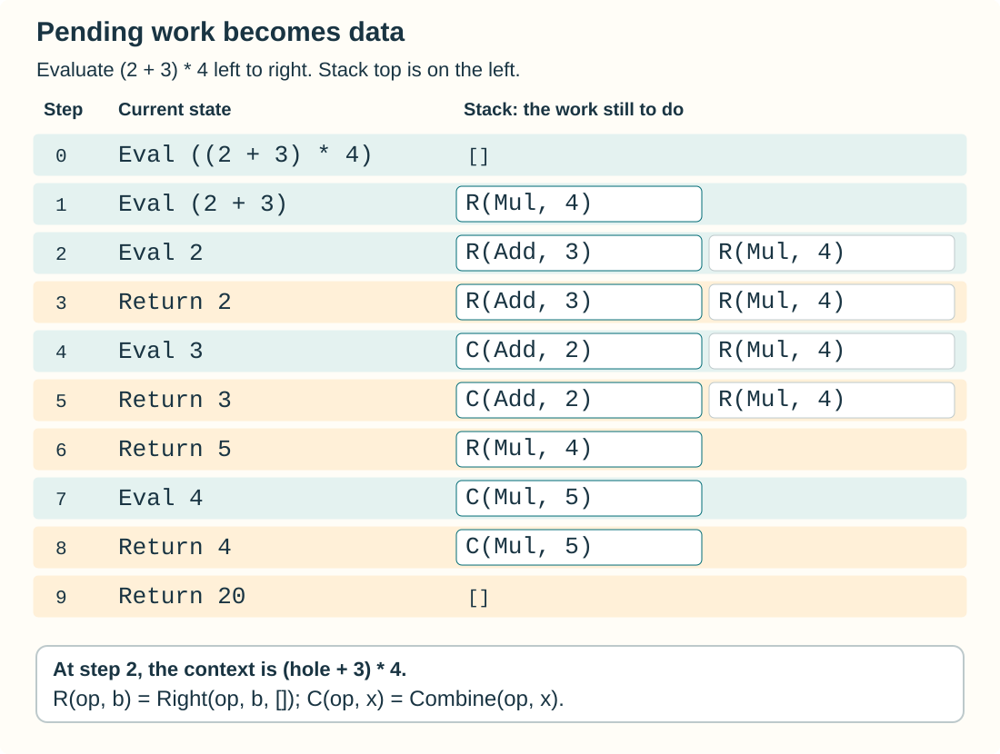

## Chapter 3: Evaluation, recursion, and machines

{.chapter-image}

**Prerequisites:** functions, variants and pattern matching from Chapters 1–2.
**Route:** read this before Chapter 5. Chapter 4 is an optional detour; Chapter 6
will express the evaluator below as a fold, and Chapter 11 will parse and extend it.

A program's result is only one part of its behavior. Which expression runs first?
What remains to be done when a recursive call returns? Where is that work stored?
We will answer these questions for one expression language, changing its
representation of pending work without changing its arithmetic operations.

### 3.1 Composition and scope

Composition builds a function; a pipeline applies one:

```ocaml env=composition
let compose f g x = f (g x)
let twice f x = f (f x)
let () =
  assert (compose string_of_int ((+) 1) 3 = "4");
  assert ((3 |> ((+) 1) |> string_of_int) = "4");
  assert (twice ((+) 1) 3 = 5)
```

In `compose f g`, `g` runs first. In `x |> g |> f`, the same order is written
left to right. Partial application supplies fewer arguments than a function
expects: `((+) 1)` waits for its second integer. None of these operations changes
OCaml's evaluation strategy.

To evaluate `let x = e in body`, evaluate `e`, then evaluate `body` with the name
`x` bound to that value. A later binding shadows an earlier one only within its
scope. Substitution is another account of this process, but it must avoid
capturing free variables (Chapter 11).

### 3.2 One language, with a specified order

Our language has numbers, named variables, four binary operations and local
bindings. Here is its entire syntax and the meaning of its primitive operations:

<!-- $MDX file=../projects/expressions/expr.ml,part=syntax -->
```ocaml
type op = Add | Sub | Mul | Div

type t =
  | Number of float
  | Variable of string
  | Binary of op * t * t
  | Let of string * t * t

exception Unbound of string

let apply op x y =
  match op with
  | Add -> x +. y | Sub -> x -. y
  | Mul -> x *. y | Div -> x /. y

let lookup env x =
  match List.assoc_opt x env with
  | Some v -> v
  | None -> raise (Unbound x)
```

The source is `projects/expressions/expr.ml`. Every displayed excerpt marked with
an MDX file reference is checked against that source. Its tests run with
`dune runtest projects/expressions`; the book's later chapters use this same type.

A value environment is a list of `(name, value)` pairs. Lookup takes the first
matching pair, so adding a binding at the front implements lexical shadowing.
An unbound variable raises `Unbound`; floating-point division by zero follows
OCaml's floating-point operations rather than raising integer `Division_by_zero`.

<!-- $MDX file=../projects/expressions/expr.ml,part=direct -->
```ocaml
let rec eval env = function
  | Number n -> n
  | Variable x -> lookup env x
  | Binary (op, a, b) ->
    let x = eval env a in
    let y = eval env b in
    apply op x y
  | Let (x, value, body) ->
    let v = eval env value in
    eval ((x, v) :: env) body
```

The two `let` bindings in the binary case make the language **left to right**.
OCaml does not specify the order of evaluating arguments to a function. Writing
`apply op (eval env a) (eval env b)` would leave our interpreter's order dependent
on its implementation. Order becomes observable if both branches fail.

```ocaml env=expressions
open Expressions.Expr

let program = Let ("x", Number 3.,
  Binary (Add, Binary (Mul, Variable "x", Number 4.), Number 2.))
let () = assert (eval [] program = 14.)
```

The big-step rule for addition says: evaluate the left operand to `x`, evaluate
the right operand to `y`, then return `x +. y`. A small-step account records the
intermediate configurations instead. For example:

```text
let x = 3 in x * 4 + 2
  -> 3 * 4 + 2
  -> 12 + 2
  -> 14
```

This trace uses exact small integers representable as floats. It does not license
arbitrary real-algebra identities on machine numbers. For example, `0. *. nan`
is NaN; replacing an expression `0 * e` by `0` can also suppress an unbound-variable
error. Reassociation may change rounding. We distinguish a mathematical real
semantics, with its domain assumptions, from this executable float semantics.

### 3.3 Tail recursion records unfinished work

A call is in tail position when its result is returned without further work by
the caller. In `1 + f x`, addition remains; in `f (x + 1)`, it does not. An
accumulator can move that remaining work into an argument:

```ocaml env=cost
let rec length = function [] -> 0 | _ :: xs -> 1 + length xs
let length_tail xs =
  let rec loop n = function [] -> n | _ :: xs -> loop (n + 1) xs in
  loop 0 xs
let () = assert (length [1;2;3] = length_tail [1;2;3])
```

The tail-recursive version needs constant call-stack space. This says nothing
by itself about heap allocation or the size of its arguments. Nor is there always
a single numerical accumulator. A tree traversal needs to remember unvisited
branches:

```ocaml env=cost
type tree = Tip | Node of tree * tree
let rec depth = function
  | Tip -> 0
  | Node (a, b) -> 1 + max (depth a) (depth b)

let depth_worklist tree =
  let rec visit best = function
    | [] -> best
    | (Tip, _) :: todo -> visit best todo
    | (Node (a, b), d) :: todo ->
      let d = d + 1 in
      visit (max best d) ((a, d) :: (b, d) :: todo)
  in visit 0 [tree, 0]

let () =
  let t = Node (Node (Tip, Tip), Tip) in
  assert (depth t = 2);
  assert (depth_worklist t = depth t)
```

The worklist is a heap representation of pending visits. On a depth-first
traversal its live length is bounded by tree height. Tail recursion removes the
corresponding recursive call stack, not the need to remember those visits.

### 3.4 From direct evaluation to CPS

In continuation-passing style (CPS), the evaluator receives a function `k`
meaning “what to do with the answer”. Each return becomes an application of `k`:

<!-- $MDX file=../projects/expressions/expr.ml,part=cps -->
```ocaml
let rec eval_cps env e k =
  match e with
  | Number n -> k n
  | Variable x -> k (lookup env x)
  | Binary (op, a, b) ->
    eval_cps env a (fun x ->
      eval_cps env b (fun y -> k (apply op x y)))
  | Let (x, value, body) ->
    eval_cps env value (fun v ->
      eval_cps ((x, v) :: env) body k)
```

```ocaml env=expressions
let () = assert (eval_cps [] program Fun.id = eval [] program)
```

There are three forms of pending work. After evaluating a left operand, evaluate
the right operand in the saved environment. After evaluating that right operand,
combine its result with the saved left value. After evaluating a binding's value,
enter its body in an extended environment. These are the three closure shapes
created by the code. `Fun.id` represents completion.

All recursive evaluator calls are tail calls. Continuation closures live on the
heap; their live depth is proportional to the expression nesting. Saved lexical
environments also retain reachable bindings. This transformation preserves
control order but does not promise constant total memory.

### 3.5 Defunctionalization: closures become data

We know every continuation shape, so we can replace its code pointer and captured
values by a constructor and fields. This is **defunctionalization**. `Right`
records a pending right operand; `Combine` records a pending arithmetic operation;
`Bind` records a pending binding body. A list of frames ends with `[]`, the identity
continuation.

<!-- $MDX file=../projects/expressions/expr.ml,part=machine -->
```ocaml
type frame =
  | Right of op * t * (string * float) list
  | Combine of op * float
  | Bind of string * t * (string * float) list

type state =
  | Eval of t * (string * float) list * frame list
  | Return of float * frame list

let step = function
  | Eval (Number n, _, stack) -> Return (n, stack)
  | Eval (Variable x, env, stack) -> Return (lookup env x, stack)
  | Eval (Binary (op, a, b), env, stack) ->
    Eval (a, env, Right (op, b, env) :: stack)
  | Eval (Let (x, value, body), env, stack) ->
    Eval (value, env, Bind (x, body, env) :: stack)
  | Return (x, Right (op, b, env) :: stack) ->
    Eval (b, env, Combine (op, x) :: stack)
  | Return (y, Combine (op, x) :: stack) ->
    Return (apply op x y, stack)
  | Return (v, Bind (x, body, env) :: stack) ->
    Eval (body, (x, v) :: env, stack)
  | Return (_, []) as final -> final

let rec run = function
  | Return (v, []) -> v
  | state -> run (step state)

let eval_machine env e = run (Eval (e, env, []))
```

{.technical-figure}

The machine alternates between evaluating syntax and returning a value to its
frames. Every call to `step` performs one transition. The `run` loop is tail
recursive; it is now possible to pause the interpreter by retaining a `state`,
inspect it, or count transitions without changing its language.

For `Binary (Add, Number 2., Number 3.)` in an empty environment, the frame lists
are `[]`, `[Right (Add, Number 3., [])]`, `[Combine (Add, 2.)]`, and `[]`. There
are also `Return`/`Eval` changes between them. Writing out those intermediate
states is a useful check that no operand is evaluated twice.

Chapter 2's subtree context remembers how to reconstruct a tree. A machine frame
remembers how to finish a computation. `Right` still carries a subtree, whereas
`Combine` carries an already computed number: an evaluation context records the
progress of computation, not just a missing piece of syntax.

```ocaml env=expressions
let () =
  assert (eval_machine [] program = 14.);
  let e = Binary (Add, Variable "first", Variable "second") in
  let failure interpret =
    try ignore (interpret e); None with Unbound x -> Some x in
  assert (failure (eval []) = Some "first");
  assert (failure (eval_machine []) = Some "first")
```

**Why the representations agree.** Interpret each frame list as its original
nested continuation. `Right` maps to the first closure in `eval_cps`, `Combine`
to the second, and `Bind` to the third. Every machine transition then performs one
piece of the corresponding CPS calculation. Induction on the finite expression
shows that direct evaluation and CPS agree; the frame interpretation transfers
that result to the machine. Equality here means the same float result (including
NaN classification) or the same first `Unbound` error, ignoring resource
exhaustion. The tests also compare generated expressions and exercise a nesting
depth of 100,000 for the CPS and machine versions; tests support, but do not replace,
this argument.

### 3.6 Exercises and a further project

1. **Practice.** List every state of the machine for `program`. Check that `x` is
   visible in the body but not in the value expression of its own `Let`.
2. **Proof.** State a worklist invariant for `depth_worklist` and prove the result
   equals `depth`. Hint: each queued depth is the depth just above its subtree;
   `best` is the greatest node depth already visited.
3. **Experiment.** Count machine transitions for a balanced tree of additions and
   a left-nested tree with the same number of nodes. Explain equal work but
   different maximum frame depth. Do not use wall-clock timings as an allocation
   measurement.
4. **Practice.** Add unary negation to all three evaluators and to the machine.
   State the new continuation shape and add a regression containing an unbound
   operand.
5. **Project.** Continue with `projects/symbolic/README.md` for symbolic
   differentiation, printing and carefully scoped algebraic simplification.

**Selected answer (1).** At `Let`, the machine first pushes `Bind ("x", body, [])`.
After returning `3.`, it evaluates `body` under `[("x", 3.)]`. The nested
multiplication returns `12.`, the addition returns `14.`, and `Return (14., [])`
is final. A `Let` binding is nonrecursive; `Let ("x", Variable "x", ...)` cannot
supply its own initial value.
