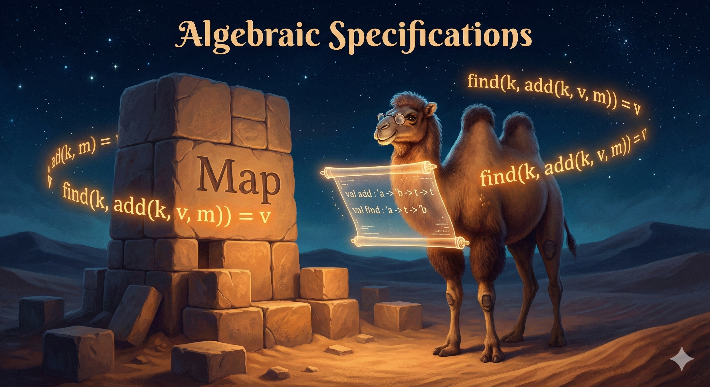

## Chapter 5: Modules, invariants, and executable laws

{.chapter-image}

**Prerequisites:** Chapters 1–3; functions, lists, patterns and lexical scope.
**Route:** complete Part I here, then follow Chapter 6. The longer type-inference
and polymorphic-recursion lesson is now `projects/type-inference/README.md`.

A module signature states what can be called. It cannot by itself say whether
`remove` really removes a key. We will specify maps, expose a counterexample,
and check alternative representations through the same observations.

### 5.1 Enough polymorphism to read an interface

In `'a list -> 'a list`, `'a` is a type parameter. A polymorphic function may be
used at several instances, but a single list still contains one element type:

```ocaml env=ch5
let twice f x = f (f x)
let () =
  assert (twice ((+) 1) 3 = 5);
  assert (twice List.rev [true; false] = [true; false])
```

A weak type variable printed as `'_weak...` has a different meaning: it is one
unknown type that must eventually be fixed. A mutable cell cannot safely be used
as both an integer-list cell and a string-list cell. The value restriction limits
generalization of such definitions. Type inference solves equations over unknowns;
using a polymorphic binding creates fresh instances of its quantified parameters.
The optional route derives these equations in detail.

For the map examples below, keys use OCaml polymorphic equality and ordering.
We restrict our executable laws to integer keys and string values. This avoids
functions, NaN and other cases that need a more explicit equality contract.
For reusable maps, `Map.Make` takes an ordered key module, making that contract
part of the interface. “Polymorphic” alone does not guarantee valid comparison.

### 5.2 Algebraic Specification

Now we turn to a fundamental question in computer science: how do we formally describe what a data structure *is* and what it should *do*? The mathematical answer is *algebraic specification*.

The way we introduce a data structure, like complex numbers or strings, in mathematics is by specifying an *algebraic structure*. This approach gives us a precise language for describing data structures independent of any particular implementation.

Algebraic structures consist of a set (or several sets, for so-called *multisorted* algebras) and a bunch of functions (also known as operations) over this set (or sets). Think of integers with addition and multiplication, or strings with concatenation and character access.

A *signature* is a rough description of an algebraic structure: it provides *sorts* -- names for the sets (in the multisorted case) -- and names of the functions-operations together with their arity (and what sorts of arguments they take). A signature tells us what operations exist, but not how they behave.

An algebraic specification adds equations to a signature. For total operations,
a class defined by equations is called a variety. The partial operations and
inequalities below require additional conventions; they are not automatically
an instance of that narrower definition.

Here is the key connection to programming: algebraic structures correspond to "implementations" and signatures to "interfaces" in programming languages. We will say that an algebraic structure *implements* an algebraic specification when all axioms of the specification hold in the structure. A specification can admit several representations, a unique model up to
isomorphism, or no model if its requirements conflict. For maps, we deliberately
allow different representations with the same observable behavior.

We say that an algebraic structure does not have *junk* when all its elements (i.e., elements in the sets corresponding to sorts) can be built using operations in its signature. Junk-free structures are "minimal" in some sense -- they contain only the values that can be constructed using the provided operations.

We allow parametric types as sorts. In that case, strictly speaking, we define a family of algebraic specifications (a different specification for each instantiation of the parametric type).

#### Algebraic Specifications: Examples

Let us look at some concrete examples to make these abstract ideas tangible. An algebraic specification can also use an earlier specification, building up complexity layer by layer. We must specify failure explicitly. Here `error` denotes a distinguished failed
result, propagated by dependent operations. OCaml can express this using `option`
or `result`; an exception-based interface must instead name the exception and
its triggering condition.

**Specification $\text{nat}_p$ (bounded natural numbers):**

For an integer bound $p \ge 2$, this specification describes natural numbers modulo $p$ (like unsigned machine integers). Range conditions below refer to the canonical representatives $0,\ldots,p-1$:

| $\text{nat}_p$ |
|----------------|
| $0 : \text{nat}_p$ |
| $\text{succ} : \text{nat}_p \rightarrow \text{nat}_p$ |
| $+ : \text{nat}_p \rightarrow \text{nat}_p \rightarrow \text{nat}_p$ |
| $* : \text{nat}_p \rightarrow \text{nat}_p \rightarrow \text{nat}_p$ |
| Variables: $n, m : \text{nat}_p$ |
| Axioms: |
| $0 + n = n$, $n + 0 = n$ |
| $m + \text{succ}(n) = \text{succ}(m + n)$ |
| $0 * n = 0$, $n * 0 = 0$ |
| $m * \text{succ}(n) = m + (m * n)$ |
| $\underbrace{\text{succ}(\ldots\text{succ}(0))}_{k \text{ times},\ 1\le k<p} \neq 0$ |
| $\underbrace{\text{succ}(\ldots\text{succ}(0))}_{p \text{ times}} = 0$ |

The axioms define how addition and multiplication work recursively, and the last two axioms capture the bounded nature: applying $\text{succ}$ between one and $p-1$ times never gives zero, but exactly $p$ times wraps around to zero.

**Specification $\text{string}_p$ (bounded strings):**

This specification describes strings of length strictly less than $p$. Here `error` denotes failure outside the successful result sort, and operations propagate failure. Thus these are partial-operation equations, not a plain total algebra over only the displayed sorts:

| $\text{string}_p$ |
|-------------------|
| uses $\text{char}$, $\text{nat}_p$ |
| `""` $: \text{string}_p$ |
| `"c"` $: \text{char} \rightarrow \text{string}_p$ |
| $\hat{\ } : \text{string}_p \rightarrow \text{string}_p \rightarrow \text{string}_p$ |
| $\cdot[\cdot] : \text{string}_p \rightarrow \text{nat}_p \rightarrow \text{char}$ |
| Variables: $s : \text{string}_p$, $c, c_1, \ldots, c_p : \text{char}$, $n : \text{nat}_p$ |
| Axioms: |
| `""` $\hat{\ } s = s$, $s \hat{\ }$ `""` $= s$ |
| $\underbrace{\text{``}c_1\text{''} \hat{\ } (\ldots \hat{\ } \text{``}c_p\text{''})}_{p \text{ times}} = \text{error}$ |
| $r \hat{\ } (s \hat{\ } t) = (r \hat{\ } s) \hat{\ } t$ |
| $(\text{``}c\text{''} \hat{\ } s)[0] = c$ |
| $(\text{``}c\text{''} \hat{\ } s)[\text{succ}(n)] = s[n]$ |
| `""`$[n] = \text{error}$ |

Both indexing equations involving a prefixed character require the concatenation to succeed. The successor-index equation additionally requires $n < p-1$, so the index does not wrap to zero.

The axioms specify that concatenation is associative, that the empty string is an identity for concatenation, that exceeding the length limit produces an error, and that indexing works by stripping characters from the front.

### 5.3 Homomorphisms

When do two implementations of the same specification "behave the same"? The mathematical answer involves *homomorphisms* -- structure-preserving mappings between algebraic structures.

Homomorphisms are mappings between algebraic structures with the same signature that preserve operations. Intuitively, if you apply an operation and then map, you get the same result as mapping first and then applying the corresponding operation.

A *homomorphism* from algebraic structure $(A, \{f^A, g^A, \ldots\})$ to $(B, \{f^B, g^B, \ldots\})$ is a function $h : A \rightarrow B$ such that:

- $h(f^A(a_1, \ldots, a_{n_f})) = f^B(h(a_1), \ldots, h(a_{n_f}))$ for all $(a_1, \ldots, a_{n_f})$
- $h(g^A(a_1, \ldots, a_{n_g})) = g^B(h(a_1), \ldots, h(a_{n_g}))$ for all $(a_1, \ldots, a_{n_g})$
- and so on for all operations.

Two algebraic structures are *isomorphic* if there are homomorphisms $h_1 : A \rightarrow B$, $h_2 : B \rightarrow A$ from one to the other and back, that when composed in any order form identity: $\forall (b \in B) \ h_1(h_2(b)) = b$ and $\forall (a \in A) \ h_2(h_1(a)) = a$.

An algebraic specification whose all implementations without junk are isomorphic is called "*monomorphic*". This means the specification pins down the structure so precisely that there's essentially only one way to implement it (up to isomorphism).

We usually only add axioms that really matter to us to the specification, so that the implementations have room for optimization. For this reason, the resulting specifications will often not be monomorphic in the above sense -- and that's intentional! A non-monomorphic specification allows for multiple genuinely different implementations, which may have different performance characteristics.

### 5.4 Example: Maps

Now let us look at a practical example that will guide the rest of this chapter. A *map* (also called dictionary or associative array) associates keys with values. This is one of the most fundamental data structures in programming -- think of Python's dictionaries, Java's `HashMap`, or OCaml's `Map` module.

Here is an algebraic specification that captures the essential behavior of maps:

| $(\alpha, \beta) \ \text{map}$ |
|--------------------------------|
| uses $\text{bool}$, type parameters $\alpha, \beta$ |
| $\text{empty} : (\alpha, \beta) \ \text{map}$ |
| $\text{member} : \alpha \rightarrow (\alpha, \beta) \ \text{map} \rightarrow \text{bool}$ |
| $\text{add} : \alpha \rightarrow \beta \rightarrow (\alpha, \beta) \ \text{map} \rightarrow (\alpha, \beta) \ \text{map}$ |
| $\text{remove} : \alpha \rightarrow (\alpha, \beta) \ \text{map} \rightarrow (\alpha, \beta) \ \text{map}$ |
| $\text{find} : \alpha \rightarrow (\alpha, \beta) \ \text{map} \rightarrow \beta$ |
| Variables: $k, k_2 : \alpha$, $v, v_2 : \beta$, $m : (\alpha, \beta) \ \text{map}$ |
| Axioms: |
| $\text{member}(k, \text{empty}) = \text{false}$ |
| $\text{member}(k, \text{add}(k, v, m)) = \text{true}$ |
| $\text{member}(k, \text{remove}(k, m)) = \text{false}$ |
| $\text{member}(k, \text{add}(k_2, v, m)) = \text{true} \wedge k \neq k_2 \Leftrightarrow \text{member}(k, m) = \text{true} \wedge k \neq k_2$ |
| $\text{member}(k, \text{remove}(k_2, m)) = \text{true} \wedge k \neq k_2 \Leftrightarrow \text{member}(k, m) = \text{true} \wedge k \neq k_2$ |
| $\text{find}(k, \text{add}(k, v, m)) = v$ |
| $\text{find}(k, \text{remove}(k, m)) = \text{error}$, $\text{find}(k, \text{empty}) = \text{error}$ |
| $\text{find}(k, \text{add}(k_2, v_2, m)) = v \wedge k \neq k_2 \Leftrightarrow \text{find}(k, m) = v \wedge k \neq k_2$ |
| $\text{find}(k, \text{remove}(k_2, m)) = v \wedge k \neq k_2 \Leftrightarrow \text{find}(k, m) = v \wedge k \neq k_2$ |
| $\text{remove}(k, \text{empty}) = \text{empty}$ |

The axioms capture the intuitive behavior: adding a key-value pair makes that key findable, removing a key makes it unfindable, and operations on different keys don't interfere with each other. Notice how the specification says nothing about *how* the map is implemented -- only about *what* behavior it must exhibit.

### 5.5 Modules and Interfaces (Signatures): Syntax

How do we express algebraic specifications in OCaml? The answer is the *module system*. In the ML family of languages, structures are given names by **module** bindings, and signatures are types of modules. From outside of a structure or signature, we refer to the values or types it provides with a dot notation: `Module.value`.

Module (and module type) names have to start with a capital letter (in ML languages). Since modules and module types have names, there is a convention to name the central type of a signature (the one that is "specified" by the signature), for brevity, `t`. Module types are often named with "all-caps" (all letters upper case).

Here is how we translate our map specification into an OCaml module signature:

```ocaml env=ch5
module type MAP = sig
  type ('a, 'b) t
  val empty : ('a, 'b) t
  val member : 'a -> ('a, 'b) t -> bool
  val add : 'a -> 'b -> ('a, 'b) t -> ('a, 'b) t
  val remove : 'a -> ('a, 'b) t -> ('a, 'b) t
  val find : 'a -> ('a, 'b) t -> 'b
end

module CounterexampleListMap : MAP = struct
  type ('a, 'b) t = ('a * 'b) list
  let empty = []
  let member = List.mem_assoc
  let add k v m = (k, v)::m
  let remove = List.remove_assoc
  let find = List.assoc
end
```

`CounterexampleListMap` **matches the signature but violates the laws**. Adding
the same key twice creates two bindings; `List.remove_assoc` removes only the
first, exposing the older one. This is a named counterexample, not our map
implementation. The annotation `: MAP` checks types and hides representation;
it does not prove behavioral equations.

```ocaml env=ch5
let () =
  let module M = CounterexampleListMap in
  let m = M.add 1 "new" (M.add 1 "old" M.empty) in
  assert (M.find 1 m = "new");
  assert (M.member 1 (M.remove 1 m))  (* The required law would say false. *)
```

The successful `find` laws concern equality of returned values. A missing key
must raise `Not_found`. Equality between maps means **observational equality**:
all lookups return the same optional result, not equality of internal trees.
The module system enforces abstraction; our law checks enforce selected behavior.

### 5.6 Implementing Maps: Association Lists

Let us now build an implementation of maps from the ground up, exploring different approaches and their trade-offs. The most straightforward implementation... might not be what you expected:

```ocaml env=ch5
module TrivialMap : MAP = struct
  type ('a, 'b) t =
    | Empty
    | Add of 'a * 'b * ('a, 'b) t
    | Remove of 'a * ('a, 'b) t

  let empty = Empty

  let rec member k m =
    match m with
    | Empty -> false
    | Add (k2, _, _) when k = k2 -> true
    | Remove (k2, _) when k = k2 -> false
    | Add (_, _, m2) -> member k m2
    | Remove (_, m2) -> member k m2

  let add k v m = Add (k, v, m)
  let remove k m = Remove (k, m)

  let rec find k m =
    match m with
    | Empty -> raise Not_found
    | Add (k2, v, _) when k = k2 -> v
    | Remove (k2, _) when k = k2 -> raise Not_found
    | Add (_, _, m2) -> find k m2
    | Remove (_, m2) -> find k m2
end
```

This "trivial" implementation is quite clever in its own way: it simply records all operations as a log! The data structure itself is a history of everything that has been done to it. The `add` and `remove` operations are $O(1)$ -- they just prepend a new node. However, `member` and `find` must traverse the entire history to determine the current state, giving them $O(n)$ complexity where $n$ is the number of operations performed.

This implementation illustrates an important point: there are many ways to satisfy the same specification, with very different performance characteristics.

Here is a more conventional implementation based on association lists, i.e., on lists of key-value pairs without the `Remove` constructor:

```ocaml env=ch5
module MyListMap : MAP = struct
  type ('a, 'b) t = Empty | Add of 'a * 'b * ('a, 'b) t

  let empty = Empty

  let rec member k m =
    match m with
    | Empty -> false
    | Add (k2, _, _) when k = k2 -> true
    | Add (_, _, m2) -> member k m2

  let rec add k v m =
    match m with
    | Empty -> Add (k, v, Empty)
    | Add (k2, _, m) when k = k2 -> Add (k, v, m)
    | Add (k2, v2, m) -> Add (k2, v2, add k v m)

  let rec remove k m =
    match m with
    | Empty -> Empty
    | Add (k2, _, m) when k = k2 -> m
    | Add (k2, v, m) -> Add (k2, v, remove k m)

  let rec find k m =
    match m with
    | Empty -> raise Not_found
    | Add (k2, v, _) when k = k2 -> v
    | Add (_, _, m2) -> find k m2
end
```

This implementation maintains the invariant that each key appears at most once in the structure. The `add` function replaces an existing key's value rather than creating a duplicate, and `remove` actually removes the key-value pair. All operations are still $O(n)$ in the worst case, but the structure stays cleaner.

### 5.7 Implementing Maps: Binary Search Trees

Can we do better than linear time? Yes, by using a smarter data structure. Binary search trees are binary trees with elements stored at the interior nodes, such that elements to the left of a node are smaller than, and elements to the right bigger than, elements within a node. This ordering property is what makes them efficient.

For maps, we store key-value pairs as elements in binary search trees, and compare the elements by keys alone. The tree structure allows us to use "divide-and-conquer" to search for the value associated with a key.

Operations cost $O(h)$, where $h$ is tree height. Random insertion order gives expected $O(\log n)$ height; a search discards one subtree at each step, but that subtree need not contain half the elements. However, in the worst case (when keys are inserted in sorted order), the tree degenerates into a linked list and operations become $O(n)$.

A note on our design: the simple polymorphic signature for maps is only possible because OCaml provides polymorphic comparison (and equality) operators that work on elements of most types (but not on functions). These operators may not behave as you expect for all types! Our signature for polymorphic maps is not the standard approach because of this limitation; it is just to keep things simple for pedagogical purposes.

```ocaml env=ch5
module BTreeMap : MAP = struct
  type ('a, 'b) t = Empty | T of ('a, 'b) t * 'a * 'b * ('a, 'b) t

  let empty = Empty

  let rec member k m =              (* "Divide and conquer" search through the tree. *)
    match m with
    | Empty -> false
    | T (_, k2, _, _) when k = k2 -> true
    | T (m1, k2, _, _) when k < k2 -> member k m1
    | T (_, _, _, m2) -> member k m2

  let rec add k v m =               (* Searches the tree in the same way as member *)
    match m with                    (* but copies every node along the way. *)
    | Empty -> T (Empty, k, v, Empty)
    | T (m1, k2, _, m2) when k = k2 -> T (m1, k, v, m2)
    | T (m1, k2, v2, m2) when k < k2 -> T (add k v m1, k2, v2, m2)
    | T (m1, k2, v2, m2) -> T (m1, k2, v2, add k v m2)

  let rec split_rightmost m =       (* A helper function, it does not belong *)
    match m with                    (* to the "exported" signature. *)
    | Empty -> raise Not_found
    | T (m1, k, v, Empty) -> k, v, m1   (* Preserve the largest node's left child. *)
    | T (m1, k, v, m2) ->           (* the one that is on the bottom right. *)
        let rk, rv, rm = split_rightmost m2 in
        rk, rv, T (m1, k, v, rm)

  let rec remove k m =
    match m with
    | Empty -> Empty
    | T (m1, k2, _, Empty) when k = k2 -> m1
    | T (Empty, k2, _, m2) when k = k2 -> m2
    | T (m1, k2, _, m2) when k = k2 ->
        let rk, rv, rm = split_rightmost m1 in
        T (rm, rk, rv, m2)
    | T (m1, k2, v, m2) when k < k2 -> T (remove k m1, k2, v, m2)
    | T (m1, k2, v, m2) -> T (m1, k2, v, remove k m2)

  let rec find k m =
    match m with
    | Empty -> raise Not_found
    | T (_, k2, v, _) when k = k2 -> v
    | T (m1, k2, _, _) when k < k2 -> find k m1
    | T (_, _, _, m2) -> find k m2
end
```

The `member` and `find` functions use the "divide-and-conquer" strategy: compare the target key with the key at the current node, and recursively search in the appropriate subtree. The `add` function searches the tree in the same way but copies every node along the path to create the new tree (since we're using immutable data structures).

The `remove` function is trickier. When removing a node with two children, we need to replace it with another value that maintains the ordering property. The `split_rightmost` helper function finds and removes the rightmost (largest) element from a subtree -- this element is guaranteed to be smaller than everything in the right subtree and larger than everything remaining in the left subtree, making it the perfect replacement.

Removing a root must also preserve the left child of its predecessor:

```ocaml env=ch5
let () =
  let m = List.fold_left (fun m k -> BTreeMap.add k (string_of_int k) m)
    BTreeMap.empty [5; 3; 2; 7] in
  let m = BTreeMap.remove 5 m in
  assert (not (BTreeMap.member 5 m));
  List.iter (fun k -> assert (BTreeMap.find k m = string_of_int k)) [2; 3; 7]
```

### 5.8 One law suite for every map

A functor is a module parameterized by another module. This one takes a map and
checks it without knowing the representation. It interprets missing lookup as
`None` solely for comparison, retaining `Not_found` as the public contract.

```ocaml env=ch5
module Map_laws (M : MAP) = struct
  let find_opt k m = try Some (M.find k m) with Not_found -> None
  let observe m = List.map (fun k -> find_opt k m) [0;1;2;3;4;5;6;7]
  let check m =
    List.iter (fun k ->
      assert (M.member k m = Option.is_some (find_opt k m));
      let added = M.add k "new" (M.add k "old" m) in
      assert (find_opt k added = Some "new");
      assert (not (M.member k (M.remove k added)));
      assert (find_opt k (M.remove k added) = None);
      List.iter (fun j -> if j <> k then begin
        assert (find_opt j (M.add k "new" m) = find_opt j m);
        assert (find_opt j (M.remove k m) = find_opt j m)
      end) [0;1;2;3;4;5;6;7]) [0;1;2;3;4;5;6;7]
  let run () =
    assert (observe M.empty = List.init 8 (fun _ -> None));
    let rec histories depth m =
      check m;
      if depth > 0 then
        List.iter (fun k ->
          histories (depth - 1) (M.add k (string_of_int k) m);
          histories (depth - 1) (M.remove k m)) [1;2;3] in
    histories 3 M.empty
end

module Log_laws = Map_laws (TrivialMap)
module List_laws = Map_laws (MyListMap)
module Tree_laws = Map_laws (BTreeMap)
let () = Log_laws.run (); List_laws.run (); Tree_laws.run ()
```

The tests cover empty membership, overwrite, removal, failure and noninterference
between keys across bounded operation histories. The earlier predecessor-removal
regression checks a particular tree shape the general law suite might not reach.
For a proof, establish each representation invariant and show it is preserved by
`add` and `remove`; then prove lookup implements the abstract finite map.
Bounded testing and invariant proofs have different roles.

#### Partial operations as executable specifications

For bounded strings, choose a small bound so that all inputs can be enumerated.
Here concatenation and indexing return options; a failed inner concatenation
propagates with `Option.bind`. This makes associativity a well-formed equation
including its failure cases.

```ocaml env=bounded_strings
let bound = 4
let concat a b =
  if String.length a + String.length b < bound then Some (a ^ b) else None
let index s i =
  if i < 0 || i >= String.length s then None else Some s.[i]
let rec strings n =
  if n = 0 then [""] else
  let shorter = strings (n - 1) in
  "" :: List.concat_map (fun c -> List.map ((^) c) shorter) ["a"; "b"]
let () =
  let inputs = strings (bound - 1) in
  List.iter (fun a ->
    assert (concat "" a = Some a && concat a "" = Some a);
    assert (index a (String.length a) = None);
    List.iter (fun b -> List.iter (fun c ->
      assert (Option.bind (concat a b) (fun ab -> concat ab c) =
              Option.bind (concat b c) (fun bc -> concat a bc))) inputs) inputs)
    inputs;
  assert (concat "ab" "cd" = None);
  assert (index "abc" 0 = Some 'a')
```

### 5.9 Optional: implementing Maps: Red-Black Trees

The fatal weakness of ordinary binary search trees is that they can become unbalanced. If keys arrive in sorted order, each insertion adds a node at the bottom of a long chain, and we lose the logarithmic performance guarantee. How can we maintain balance automatically?

This section is based on Wikipedia's [Red-black tree article](http://en.wikipedia.org/wiki/Red-black_tree), Chris Okasaki's "Purely Functional Data Structures" and Matt Might's excellent blog post on [red-black tree deletion](https://matt.might.net/articles/red-black-delete/).

Binary search trees are good when we encounter keys in random order, because the cost of operations is limited by the depth of the tree which is small relative to the number of nodes... unless the tree grows unbalanced achieving large depth (which means there are sibling subtrees of vastly different sizes on some path).

To remedy this, we *rebalance* the tree while building it -- i.e., while adding elements. The key insight is to detect when the tree is becoming unbalanced and perform local rotations to restore balance.

In *red-black trees* we achieve balance by:
1. Remembering one of two colors (red or black) with each node
2. Keeping the same number of black nodes on every path from the root to a leaf
3. Not allowing a red node to have a red child

These invariants together guarantee that the tree cannot become too unbalanced: the depth is at most twice the depth of a perfectly balanced tree with the same number of nodes. Why? The "black height" (number of black nodes on any root-to-leaf path) is the same everywhere, and red nodes can only appear between black nodes, so the longest path can have at most twice as many nodes as the shortest.

#### B-trees of Order 4 (2-3-4 Trees)

To understand where red-black trees come from, it helps to first understand 2-3-4 trees (also known as B-trees of order 4).

How can we have perfectly balanced trees without worrying about having exactly $2^k - 1$ elements? The answer is to allow variable-width nodes. **2-3-4 trees** can store from 1 to 3 elements in each node and have 2 to 4 subtrees correspondingly. This flexibility lets us maintain perfect balance!

- A **2-node** contains one element and has two children
- A **3-node** contains two elements and has three children
- A **4-node** contains three elements and has four children

To insert into a 2-3-4 tree, we descend toward the appropriate leaf position. But if we encounter a full node (4-node) along the way, we "split" it: move the middle element up to the parent and split the remaining two elements into separate 2-nodes. This maintains perfect balance at all times -- all leaves are at the same depth.

Red-black trees represent 2-3-4 nodes using binary nodes and colors. To represent a 2-3-4 tree as a binary tree with one element per node, we color the "primary" element of each node black (the middle element of a 4-node, or the first element of a 2-/3-node) and make it the parent of its neighbor elements colored red. The red elements then become parents of the original subtrees. This correspondence provides the deep intuition behind red-black trees: the colors encode the structure of the underlying 2-3-4 tree.

#### Red-Black Trees, Without Deletion

Now let us implement red-black trees in OCaml. Red-black trees maintain two invariants:

**Invariant 1.** No red node has a red child. (No two consecutive red nodes on any path.)

**Invariant 2.** Every path from the root to an empty node contains the same number of black nodes. (The "black height" is uniform.)

For simplicity, we first implement red-black tree based *sets* (not maps) without deletion. The implementation proceeds almost exactly like for unbalanced binary search trees; we only need to add code to restore the invariants after each insertion.

In Okasaki's approach, by keeping balance at each step of constructing a node, it is enough to check *locally* (around the root of the subtree) whether a violation has occurred. We never need to examine the entire tree. One implementation of deletion introduces more colors -- see Matt Might's post for details.

```ocaml env=ch5
type color = R | B
type 'a t = E | T of color * 'a t * 'a * 'a t

let empty = E

let rec member x m =                     (* Like in unbalanced binary search tree. *)
  match m with
  | E -> false
  | T (_, _, y, _) when x = y -> true
  | T (_, a, y, _) when x < y -> member x a
  | T (_, _, _, b) -> member x b

let balance = function                   (* Restoring the invariants. *)
  | B, T (R, T (R,a,x,b), y, c), z, d    (* On next figure: left, *)
  | B, T (R, a, x, T (R,b,y,c)), z, d    (* top, *)
  | B, a, x, T (R, T (R,b,y,c), z, d)    (* bottom, *)
  | B, a, x, T (R, b, y, T (R,c,z,d))    (* right, *)
      -> T (R, T (B,a,x,b), y, T (B,c,z,d))    (* center tree. *)
  | color, a, x, b -> T (color, a, x, b)   (* We allow red-red violation for now. *)

let insert x s =
  let rec ins = function                 (* Like in unbalanced binary search tree, *)
    | E -> T (R, E, x, E)                (* but fix violation above created node. *)
    | T (color, a, y, b) as s ->
        if x < y then balance (color, ins a, y, b)
        else if x > y then balance (color, a, y, ins b)
        else s
  in
  match ins s with                       (* We could still have red-red violation *)
  | T (_, a, y, b) -> T (B, a, y, b)     (* at root, fixed by coloring it black. *)
  | E -> failwith "insert: impossible"
```

The `balance` function is the heart of the algorithm. It handles four cases where a red-red violation occurs (a red node with a red child). The four cases correspond to different positions of the violation:

- A red left child with a red left grandchild
- A red left child with a red right grandchild
- A red right child with a red left grandchild
- A red right child with a red right grandchild

In each case, we perform a "rotation" that restructures the tree to eliminate the violation while maintaining the binary search tree property. All four cases produce the same balanced result: a red root with two black children, with the subtrees `a`, `b`, `c`, `d` properly distributed.

The `insert` function works like insertion into an ordinary binary search tree, but calls `balance` after each recursive step to fix any violations that may have been introduced. New nodes are always created red (which might create a red-red violation that `balance` will fix). At the very end, we color the root black -- this can never create a violation and ensures the root is always black.

The insertion invariant can also be checked independently of lookup:

```ocaml env=ch5
let check_red_black tree =
  let rec inspect lower upper = function
    | E -> 0
    | T (color, left, x, right) ->
      assert (Option.fold ~none:true ~some:(fun lo -> lo < x) lower);
      assert (Option.fold ~none:true ~some:(fun hi -> x < hi) upper);
      let red = function T (R, _, _, _) -> true | _ -> false in
      assert (color <> R || not (red left || red right));
      let a = inspect lower (Some x) left in
      let b = inspect (Some x) upper right in
      assert (a = b);
      a + if color = B then 1 else 0 in
  (match tree with E | T (B, _, _, _) -> () | _ -> assert false);
  ignore (inspect None None tree)
let () =
  let test xs = ignore (List.fold_left (fun tree x ->
    let tree = insert x tree in check_red_black tree; tree) E xs) in
  test (List.init 100 Fun.id);
  test (List.init 100 (fun i -> 99 - i));
  test [3;1;4;1;5;9;2;6;5]
```

### 5.10 Exercises

1. **Practice.** Repair `CounterexampleListMap` by ensuring each key occurs once.
   Instantiate `Map_laws` with the repair. State its invariant and operation costs.
2. **Proof.** Show `remove` preserves the binary-search ordering invariant. In the
   two-child case, explain why the predecessor's left child must be retained.
3. **Experiment.** Add a deliberate bug to one map and record the smallest law
   counterexample. Prefer the operation sequence to a dump of internal nodes.
4. **Project.** Specify a FIFO queue with `take : 'a t -> ('a * 'a t) option`.
   Implement one-list and two-list representations, compare operation traces,
   and distinguish amortized cost from worst-case cost of a single operation.
5. **Proof.** Prove bounded-string concatenation's partial associativity. Hint:
   if the sum of the three lengths is below the bound, both intermediate sums
   are too; otherwise both complete expressions fail.
6. **Project.** Extend the map tests to a comparator-parameterized interface.
   Give the comparator a total-order contract and test a non-integer key type.

**Selected answer (1).** Replace an existing binding on insertion, or remove
*all* matching bindings on removal. The former maintains a unique-key invariant;
the latter allows duplicate history internally but still meets the lookup/removal
laws. With observational equality those are legitimate different representations.
