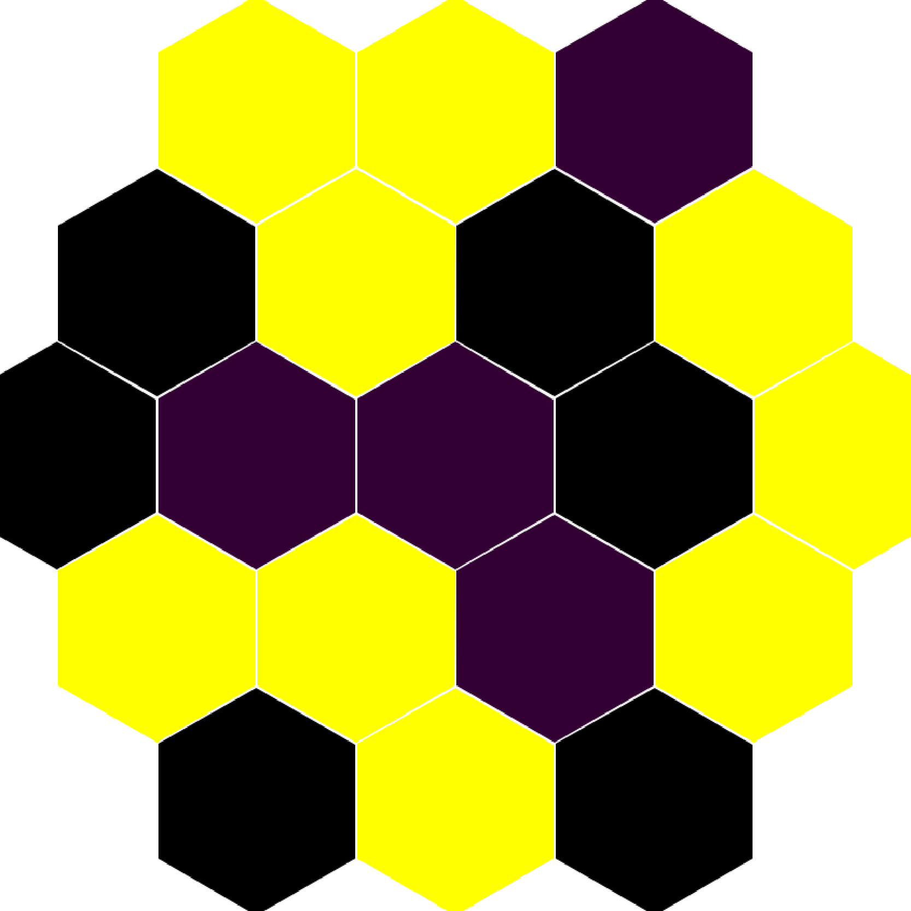

## Chapter 6: Folding and Backtracking

**In this chapter, you will:**

- Identify common recursion patterns and refactor them into `map`/`fold` abstractions
- Make folds tail-recursive using accumulators (and understand the trade-offs)
- Generalize `map`/`fold` beyond lists to trees and expression grammars
- Use backtracking (via lists) to solve search problems and puzzles

This chapter explores two fundamental programming paradigms in functional programming: **folding** (also known as reduction) and **backtracking**. We begin with the classic `map` and `fold` higher-order functions, examine how they generalize to trees and other data structures, then move on to solving puzzles using backtracking with lists.

The material in this chapter draws from Martin Odersky's "Functional Programming Fundamentals," Ralf Laemmel's "Going Bananas," Graham Hutton's "Programming in Haskell" (Chapter 11 on the Countdown Problem), and Tomasz Wierzbicki's Honey Islands Puzzle Solver.

### 6.1 Basic Generic List Operations

Functional programming emphasizes identifying common patterns and abstracting them into reusable higher-order functions. Rather than writing similar code repeatedly, we extract the common structure into a single generic function. Let us see how this principle works in practice through two motivating examples.

#### The `map` Function

How do we print a comma-separated list of integers? The `String` module provides a function that joins strings with a separator:

```
val concat : string -> string list -> string
```

But `String.concat` works on strings, not integers. So first, we need to convert numbers into strings:

```ocaml env=ch6
let rec strings_of_ints = function
  | [] -> []
  | hd::tl -> string_of_int hd :: strings_of_ints tl

let comma_sep_ints = String.concat ", " -| strings_of_ints
```

Here is another common task: how do we sort strings from shortest to longest? We can pair each string with its length and then sort by the first component. First, let us compute the lengths:

```ocaml env=ch6
let rec strings_lengths = function
  | [] -> []
  | hd::tl -> (String.length hd, hd) :: strings_lengths tl

let by_size = List.sort compare -| strings_lengths
```

Now, look carefully at `strings_of_ints` and `strings_lengths`. Do you notice the common structure? Both functions traverse a list and transform each element independently -- one applies `string_of_int`, the other applies a function that pairs a string with its length. The recursive structure is identical; only the transformation differs.

This is our cue to *extract the common pattern* into a generic higher-order function. We call it `map`:

```ocaml env=ch6
let rec list_map f = function
  | [] -> []
  | hd::tl -> f hd :: list_map f tl
```

Now we can rewrite our functions more concisely:

```ocaml env=ch6
let comma_sep_ints =
  String.concat ", " -| list_map string_of_int

let by_size =
  List.sort compare -| list_map (fun s -> String.length s, s)
```

#### The `fold` Function

Now let us consider a different kind of pattern. How do we sum all the elements of a list?

```ocaml env=ch6
let rec balance = function
  | [] -> 0
  | hd::tl -> hd + balance tl
```

And how do we multiply all the elements together (perhaps to compute a cumulative ratio)?

```ocaml env=ch6
let rec total_ratio = function
  | [] -> 1.
  | hd::tl -> hd *. total_ratio tl
```

Again, the recursive structure is the same. In both cases, we combine each element with the result of processing the rest of the list. The differences are: (1) what we return for the empty list (the "base case" or "identity element"), and (2) how we combine the head with the recursive result. This pattern is called **folding**:

```ocaml env=ch6
let rec list_fold f base = function
  | [] -> base
  | hd::tl -> f hd (list_fold f base tl)
```

**Important:** Note that `list_fold f base l` equals `List.fold_right f l base`. The OCaml standard library uses a different argument order, so be careful when using `List.fold_right`.

The key insight is understanding the fundamental difference between `map` and `fold`:

- **`map`** alters the *contents* of a data structure without changing its shape. The output list has the same length as the input; we merely transform each element.
- **`fold`** *collapses* a data structure down to a single value, using the structure itself as scaffolding for the computation.

Visually, consider what happens to the list `[a; b; c; d]`:

- `map f` transforms: `[a; b; c; d]` becomes `[f a; f b; f c; f d]` -- same structure, different contents
- `fold f accu` collapses: `[a; b; c; d]` becomes `f a (f b (f c (f d accu)))` -- structure disappears, single value remains

### 6.2 Making Fold Tail-Recursive

Our `list_fold` function above is not tail-recursive: it builds up a chain of deferred `f` applications on the call stack. For very long lists, this can cause stack overflow. Can we make folding tail-recursive?

Let us investigate some tail-recursive list functions to find a pattern. Consider reversing a list:

```ocaml env=ch6
let rec list_rev acc = function
  | [] -> acc
  | hd::tl -> list_rev (hd::acc) tl
```

The key technique here is the *accumulator* parameter `acc`. Instead of building up work to do after the recursive call returns, we do the work *before* the recursive call and pass the intermediate result along.

Here is another example -- computing an average by tracking both the running sum and the count:

```ocaml env=ch6
let rec average (sum, tot) = function
  | [] when tot = 0. -> 0.
  | [] -> sum /. tot
  | hd::tl -> average (hd +. sum, 1. +. tot) tl
```

Notice how these functions process elements from left to right, threading an accumulator through the computation. This is the pattern of `fold_left`:

```ocaml env=ch6
let rec fold_left f accu = function
  | [] -> accu
  | a::l -> fold_left f (f accu a) l
```

With `fold_left`, expressing our earlier functions becomes straightforward -- we hide the accumulator inside the initial value:

```ocaml env=ch6
let list_rev l =
  fold_left (fun t h -> h::t) [] l

let average =
  fold_left (fun (sum, tot) e -> sum +. e, 1. +. tot) (0., 0.)
```

Note that the `average` example is slightly trickier than `list_rev` because we need to track two values (sum and count) rather than one.

**Why the names `fold_right` and `fold_left`?** The names reflect the associativity of the combining operation:

- `fold_right f` makes `f` **right associative**, like the list constructor `::`:
  `List.fold_right f [a1; ...; an] b` is `f a1 (f a2 (... (f an b) ...))`

- `fold_left f` makes `f` **left associative**, like function application:
  `List.fold_left f a [b1; ...; bn]` is `f (... (f (f a b1) b2) ...) bn`

This "backward" structure of `fold_left` can be visualized by comparing the shape of the input list with the shape of the computation tree. The input list has a right-leaning spine (because `::` associates to the right), while `fold_left` produces a computation tree with a left-leaning spine:

::: {.figure}
```
    Input list              Result computation

        ::                         f
       /  \                       / \
      a    ::                    f   d
          /  \                  / \
         b    ::               f   c
             /  \             / \
            c    ::          f   b
                /  \        / \
               d    []  accu   a
```
**Figure: List spine vs. fold_left computation tree**
:::

This reversal of structure is why `fold_left` naturally reverses lists when the combining operation is `cons`.

#### Useful Derived Functions

Many common list operations can be expressed elegantly using folds. List filtering selects elements satisfying a predicate -- naturally expressed using `fold_right` to preserve order:

```ocaml env=ch6
let list_filter p l =
  List.fold_right (fun h t -> if p h then h::t else t) l []
```

When we need a tail-recursive map and can tolerate reversed output, `fold_left` gives us `rev_map`:

```ocaml env=ch6
let list_rev_map f l =
  List.fold_left (fun t h -> f h :: t) [] l
```

### 6.3 Map and Fold for Trees and Other Structures

The `map` and `fold` patterns are not limited to lists. They apply to any recursive data structure. The key insight is that `map` preserves structure while transforming contents, and `fold` collapses structure into a single value.

#### Binary Trees

Mapping binary trees is straightforward:

```ocaml env=ch6
type 'a btree = Empty | Node of 'a * 'a btree * 'a btree

let rec bt_map f = function
  | Empty -> Empty
  | Node (e, l, r) -> Node (f e, bt_map f l, bt_map f r)

let test = Node
  (3, Node (5, Empty, Empty), Node (7, Empty, Empty))
let _ = bt_map ((+) 1) test
```

**A note on terminology:** The `map` and `fold` functions we define here preserve and respect the structure of data. They are different from the `map` and `fold` operations you might find in abstract data type container libraries, which often behave more like `List.rev_map` and `List.fold_left` over container elements in arbitrary order. Here we are generalizing `List.map` and `List.fold_right` to other structures.

For binary trees, the most general form of `fold` processes each element together with the partial results already computed for its subtrees:

```ocaml env=ch6
let rec bt_fold f base = function
  | Empty -> base
  | Node (e, l, r) ->
    f e (bt_fold f base l) (bt_fold f base r)
```

Here are two examples showing how `bt_fold` can compute different properties of a tree:

```ocaml env=ch6
let sum_els = bt_fold (fun i l r -> i + l + r) 0
let depth t = bt_fold (fun _ l r -> 1 + max l r) 1 t
```

The first computes the sum of all elements (the combining function adds the current element to the sums of both subtrees). The second computes the depth -- we ignore the element value and take the maximum depth of the subtrees, adding 1 for the current level.

#### More Complex Structures: Expressions

Real-world data types often have more than two cases. To demonstrate map and fold for more complex structures, let us recall the expression type from Chapter 3:

```ocaml env=ch6
type expression =
    Const of float
  | Var of string
  | Sum of expression * expression    (* e1 + e2 *)
  | Diff of expression * expression   (* e1 - e2 *)
  | Prod of expression * expression   (* e1 * e2 *)
  | Quot of expression * expression   (* e1 / e2 *)
```

The multitude of cases makes this datatype harder to work with than binary trees. Fortunately, OCaml's *or-patterns* help us handle multiple similar cases together:

```ocaml env=ch6
let rec vars = function
  | Const _ -> []
  | Var x -> [x]
  | Sum (a,b) | Diff (a,b) | Prod (a,b) | Quot (a,b) ->
    vars a @ vars b
```

For a generic `map` and `fold` over expressions, we need to specify behavior for each case. Since there are many cases, we pack all the behaviors into records. This way, we can define default behaviors and then override just the cases we care about:

```ocaml env=ch6
type expression_map = {
  map_const : float -> expression;
  map_var : string -> expression;
  map_sum : expression -> expression -> expression;
  map_diff : expression -> expression -> expression;
  map_prod : expression -> expression -> expression;
  map_quot : expression -> expression -> expression;
}

(*
   Note: In expression_fold, we use 'a instead of expression because
   fold produces values of arbitrary type, not necessarily expressions.
*)
type 'a expression_fold = {
  fold_const : float -> 'a;
  fold_var : string -> 'a;
  fold_sum : 'a -> 'a -> 'a;
  fold_diff : 'a -> 'a -> 'a;
  fold_prod : 'a -> 'a -> 'a;
  fold_quot : 'a -> 'a -> 'a;
}
```

Now we define standard "default" behaviors. The `identity_map` reconstructs the same expression (useful as a starting point when we only want to change one case), and `make_fold` creates a fold where all binary operators behave the same:

```ocaml env=ch6
let identity_map = {
  map_const = (fun c -> Const c);
  map_var = (fun x -> Var x);
  map_sum = (fun a b -> Sum (a, b));
  map_diff = (fun a b -> Diff (a, b));
  map_prod = (fun a b -> Prod (a, b));
  map_quot = (fun a b -> Quot (a, b));
}

let make_fold op base = {
  fold_const = (fun _ -> base);
  fold_var = (fun _ -> base);
  fold_sum = op; fold_diff = op;
  fold_prod = op; fold_quot = op;
}
```

The actual `map` and `fold` functions:

```ocaml env=ch6
let rec expr_map emap = function
  | Const c -> emap.map_const c
  | Var x -> emap.map_var x
  | Sum (a,b) -> emap.map_sum (expr_map emap a) (expr_map emap b)
  | Diff (a,b) -> emap.map_diff (expr_map emap a) (expr_map emap b)
  | Prod (a,b) -> emap.map_prod (expr_map emap a) (expr_map emap b)
  | Quot (a,b) -> emap.map_quot (expr_map emap a) (expr_map emap b)

let rec expr_fold efold = function
  | Const c -> efold.fold_const c
  | Var x -> efold.fold_var x
  | Sum (a,b) -> efold.fold_sum (expr_fold efold a) (expr_fold efold b)
  | Diff (a,b) -> efold.fold_diff (expr_fold efold a) (expr_fold efold b)
  | Prod (a,b) -> efold.fold_prod (expr_fold efold a) (expr_fold efold b)
  | Quot (a,b) -> efold.fold_quot (expr_fold efold a) (expr_fold efold b)
```

Now here is the payoff. Using OCaml's `{record with field = value}` syntax, we can easily customize behaviors for specific uses by starting from the defaults and overriding just what we need:

```ocaml env=ch6
let prime_vars = expr_map
  {identity_map with map_var = fun x -> Var (x ^ "'")}

let subst s =
  let apply x = try List.assoc x s with Not_found -> Var x in
  expr_map {identity_map with map_var = apply}

let vars =
  expr_fold {(make_fold (@) []) with fold_var = fun x -> [x]}

let size = expr_fold (make_fold (fun a b -> 1 + a + b) 1)

let eval env = expr_fold {
  fold_const = id;
  fold_var = (fun x -> List.assoc x env);
  fold_sum = (+.); fold_diff = (-.);
  fold_prod = ( *.); fold_quot = (/.);
}
```

### 6.4 Point-Free Programming

In 1977/78, John Backus -- the designer of FORTRAN and BNF notation -- introduced **FP**, the first *function-level programming* language. This was a radical departure from the prevailing style: rather than manipulating variables and values, programs were built entirely by combining functions. Over the next decade, FP evolved into the **FL** language.

The philosophy behind function-level programming is captured in this quote:

> "Clarity is achieved when programs are written at the function level -- that is, by putting together existing programs to form new ones, rather than by manipulating objects and then abstracting from those objects to produce programs."
> -- *The FL Project: The Design of a Functional Language*

This style is sometimes called **point-free** or **tacit** programming, because we never mention the "points" (values) that functions operate on -- we only talk about the functions themselves and how they combine.

To write in this style, we need a toolkit of **combinators** -- higher-order functions that combine other functions. Here are some common ones, similar to what you will find in the *OCaml Batteries* library:

```ocaml env=ch6
let const x _ = x
let ( |- ) f g x = g (f x)          (* forward composition *)
let ( -| ) f g x = f (g x)          (* backward composition *)
let flip f x y = f y x
let ( *** ) f g = fun (x,y) -> (f x, g y)
let ( &&& ) f g = fun x -> (f x, g x)
let first f x = fst (f x)
let second f x = snd (f x)
let curry f x y = f (x,y)
let uncurry f (x,y) = f x y
```

One way to understand point-free programming is to visualize the flow of computation as a circuit. Values flow through the circuit, being transformed by functions at each node. Cross-sections of the circuit can be represented as tuples of intermediate values.

Consider this simple function that converts a character and an integer to a string:

```ocaml env=ch6
let print2 c i =
  let a = Char.escaped c in
  let b = string_of_int i in
  a ^ b
```

We can visualize this as a circuit: `(c, i)` enters, `c` flows through `Char.escaped`, `i` flows through `string_of_int`, and the results meet at `(^)`. In point-free style, we express this directly:

```ocaml env=ch6
let print2 = curry
  ((Char.escaped *** string_of_int) |- uncurry (^))
```

Here `***` applies two functions in parallel to the components of a pair, `|-` is forward composition, `uncurry` converts a curried function to take a pair, and `curry` converts back.

**Why the name "currying"?** Converting a C/Pascal-style function (that takes all arguments as a tuple) into one that takes arguments one at a time is called *currying*, after the logician Haskell Brooks Curry. Since OCaml functions naturally take arguments one at a time, we often need `uncurry` to interface with tuple-based operations, and `curry` to convert back.

Another approach to point-free style avoids tuples entirely, using function composition, `flip`, and the **S** combinator:

```ocaml env=ch6
let s x y z = x z (y z)
```

The S combinator allows us to pass one argument to two different functions and combine their results. This can bring a particular argument of a function to the "front" and pass it to another function.

Here is an extended example showing step-by-step transformation of a filter-map function into point-free style:

```ocaml env=ch6
let func2 f g l = List.filter f (List.map g l)
(* Step 1: Recognize that filter-after-map is composition *)
let func2 f g = (-|) (List.filter f) (List.map g)
(* Step 2: Eliminate l by composing with List.map *)
let func2 f = (-|) (List.filter f) -| List.map
(* Step 3: Rewrite without infix notation to see the structure *)
let func2 f = (-|) ((-|) (List.filter f)) List.map
(* Step 4: Use flip to rearrange arguments *)
let func2 f = flip (-|) List.map ((-|) (List.filter f))
(* Step 5: Factor out f using composition *)
let func2 f = (((|-) List.map) -| ((-|) -| List.filter)) f
(* Step 6: Finally, f disappears (eta-reduction) *)
let func2 = (|-) List.map -| ((-|) -| List.filter)
```

While point-free style can be elegant for simple cases, it can quickly become obscure. Use it judiciously!

### 6.5 Reductions and More Higher-Order Functions

Mathematics has a convenient notation for sums over intervals: $\sum_{n=a}^{b} f(n)$.

Can we express this in OCaml? The challenge is that OCaml does not have a universal addition operator -- `+` works only on integers, `+.` only on floats. So we end up writing two versions:

```ocaml env=ch6
let rec i_sum_fromto f a b =
  if a > b then 0
  else f a + i_sum_fromto f (a+1) b

let rec f_sum_fromto f a b =
  if a > b then 0.
  else f a +. f_sum_fromto f (a+1) b

let pi2_over6 =
  f_sum_fromto (fun i -> 1. /. float_of_int (i*i)) 1 5000
```

(The last example computes an approximation to $\pi^2/6$ using the Basel series.)

The natural generalization is to make the combining operation a parameter:

```ocaml env=ch6
let rec op_fromto op base f a b =
  if a > b then base
  else op (f a) (op_fromto op base f (a+1) b)
```

#### Collecting Results: concat_map

Sometimes a function produces not a single result but a *collection* of results. In mathematics, such a function is called a **multifunction** or set-valued function. If we have a multifunction $f$ and want to apply it to every element of a set $A$, we take the union of all results:

$$f(A) = \bigcup_{p \in A} f(p)$$

When we represent sets as lists, "union" becomes "append". This gives us the extremely useful `concat_map` operation:

```ocaml env=ch6
let rec concat_map f = function
  | [] -> []
  | a::l -> f a @ concat_map f l
```

For better efficiency on long lists, here is a tail-recursive version:

```ocaml env=ch6
let concat_map f l =
  let rec cmap_f accu = function
    | [] -> accu
    | a::l -> cmap_f (List.rev_append (f a) accu) l in
  List.rev (cmap_f [] l)
```

The `concat_map` function is fundamental for backtracking algorithms. We will use it extensively in the puzzle-solving sections below.

#### All Subsequences of a List

A classic example of a function that produces multiple results: given a list, generate all its subsequences (subsets that preserve order). The idea is simple: for each element, we either include it or exclude it.

```ocaml env=ch6
let rec subseqs l =
  match l with
    | [] -> [[]]
    | x::xs ->
      let pxs = subseqs xs in
      List.map (fun px -> x::px) pxs @ pxs
```

Tail-recursively:

```ocaml env=ch6
let rec rmap_append f accu = function
  | [] -> accu
  | a::l -> rmap_append f (f a :: accu) l

let rec subseqs l =
  match l with
    | [] -> [[]]
    | x::xs ->
      let pxs = subseqs xs in
      rmap_append (fun px -> x::px) pxs pxs
```

#### Permutations and Choices

Generating all permutations of a list is another classic combinatorial problem. The key insight is the `interleave` function: given an element `x` and a list, it produces all ways of inserting `x` into the list:

```ocaml env=ch6
let rec interleave x = function
  | [] -> [[x]]                 (* x can only go in one place: by itself *)
  | y::ys ->
    (x::y::ys)                  (* x goes at the front, OR *)
    :: List.map (fun zs -> y::zs) (interleave x ys)  (* x goes somewhere after y *)

let rec perms = function
  | [] -> [[]]                  (* one way to permute empty list: empty list *)
  | x::xs -> concat_map (interleave x) (perms xs)
```

For example, `interleave 1 [2;3]` produces `[[1;2;3]; [2;1;3]; [2;3;1]]` -- all positions where 1 can be inserted.

For the Countdown problem below, we will need all non-empty subsequences with all their permutations -- that is, all ways of choosing and ordering elements from a list:

```ocaml env=ch6
let choices l = concat_map perms (List.filter ((<>) []) (subseqs l))
```

### 6.6 Grouping and Map-Reduce

When processing large datasets, it is often useful to organize values by some property -- grouping all items with the same key together, then processing each group. This pattern is so common it has a name: **map-reduce** (popularized by Google for distributed computing).

#### Collecting by Key

The first step is to collect elements from an association list, grouping all values that share the same key:

```ocaml env=ch6
let collect l =
  match List.sort (fun x y -> compare (fst x) (fst y)) l with
  | [] -> []                           (* Start with associations sorted by key *)
  | (k0, v0)::tl ->
    let k0, vs, l = List.fold_left
      (fun (k0, vs, l) (kn, vn) ->     (* Collect values for current key *)
        if k0 = kn then k0, vn::vs, l  (* Same key: add value to current group *)
        else kn, [vn], (k0, List.rev vs)::l) (* New: save current group, start new *)
      (k0, [v0], []) tl in             (* Why reverse? To preserve original order *)
    List.rev ((k0, List.rev vs)::l)
```

Now we can group elements by an arbitrary property -- we just need to extract the property as the key:

```ocaml env=ch6
let group_by p l = collect (List.map (fun e -> p e, e) l)
```

#### Reduction (Aggregation)

Grouping alone is often not enough -- we want to *aggregate* each group into a summary value, like SQL's `SUM`, `COUNT`, or `AVG`. This aggregation step is called **reduction**:

```ocaml env=ch6
let aggregate_by p red base l =
  let ags = group_by p l in
  List.map (fun (k, vs) -> k, List.fold_right red vs base) ags
```

Using the **feed-forward** (pipe) operator `let ( |> ) x f = f x`:

```ocaml env=ch6
let aggregate_by p redf base l =
  group_by p l
  |> List.map (fun (k, vs) -> k, List.fold_right redf vs base)
```

Often it is cleaner to extract both the key and the value we care about upfront, before grouping. Since we first **map** elements into key-value pairs, then group and **reduce**, we call this pattern `map_reduce`:

```ocaml env=ch6
let map_reduce mapf redf base l =
  List.map mapf l
  |> collect
  |> List.map (fun (k, vs) -> k, List.fold_right redf vs base)
```

#### Map-Reduce Examples

Sometimes our mapping function produces multiple key-value pairs per input (for example, when processing documents word by word). For this we use `concat_reduce`, which uses `concat_map` instead of `map`:

```ocaml env=ch6
let concat_reduce mapf redf base l =
  concat_map mapf l
  |> collect
  |> List.map (fun (k, vs) -> k, List.fold_right redf vs base)
```

**Example 1: Word histogram.** Count how many times each word appears across a collection of documents:

```ocaml env=ch6
let histogram documents =
  let mapf doc =
    Str.split (Str.regexp "[ \t.,;]+") doc
    |> List.map (fun word -> word, 1) in
  concat_reduce mapf (+) 0 documents
```

**Example 2: Inverted index.** Build an index mapping each word to the list of documents (identified by address) containing it:

```ocaml env=ch6
let cons hd tl = hd::tl

let inverted_index documents =
  let mapf (addr, doc) =
    Str.split (Str.regexp "[ \t.,;]+") doc
    |> List.map (fun word -> word, addr) in
  concat_reduce mapf cons [] documents
```

**Example 3: Simple search engine.** Once we have an inverted index, we can search for documents containing all of a given set of words. We need set intersection -- here implemented for sets represented as sorted lists:

```ocaml env=ch6
let intersect xs ys =                       (* Sets as sorted lists *)
  let rec aux acc = function
    | [], _ | _, [] -> acc
    | (x::xs' as xs), (y::ys' as ys) ->
      let c = compare x y in
      if c = 0 then aux (x::acc) (xs', ys')
      else if c < 0 then aux acc (xs', ys)
      else aux acc (xs, ys') in
  List.rev (aux [] (xs, ys))
```

Now we can build a simple search function that finds all documents containing every word in a query:

```ocaml env=ch6
let search index words =
  match List.map (flip List.assoc index) words with
  | [] -> []
  | idx::idcs -> List.fold_left intersect idx idcs
```

### 6.7 Higher-Order Functions for the Option Type

The `option` type is OCaml's way of representing values that might be absent. Rather than using null pointers (a common source of bugs), we explicitly mark possibly-missing values with `Some x` or `None`. Here are some useful higher-order functions for working with options.

First, applying a function to an optional value:

```ocaml env=ch6
let map_option f = function
  | None -> None
  | Some e -> f e
```

Second, mapping a partial function over a list and keeping only the successful results:

```ocaml env=ch6
let rec map_some f = function
  | [] -> []
  | e::l -> match f e with
    | None -> map_some f l
    | Some r -> r :: map_some f l
```

Tail-recursively:

```ocaml env=ch6
let map_some f l =
  let rec maps_f accu = function
    | [] -> accu
    | a::l -> maps_f (match f a with None -> accu
      | Some r -> r::accu) l in
  List.rev (maps_f [] l)
```

### 6.8 The Countdown Problem Puzzle

Now we turn to solving puzzles, which will showcase the power of backtracking with lists. The **Countdown Problem** is a classic puzzle from a British TV game show:

- Using a given set of numbers and arithmetic operators +, -, *, /, construct an expression with a given value.
- All numbers, including intermediate results, must be positive integers.
- Each source number can be used at most once.

**Example:**
- Source numbers: 1, 3, 7, 10, 25, 50
- Target: 765
- One possible solution: (25-10) * (50+1) = 15 * 51 = 765

This example has 780 different solutions! Changing the target to 831 gives an example with no solutions at all.

Let us develop a solver step by step, starting with the data types.

#### Data Types

```ocaml env=ch6
type op = Add | Sub | Mul | Div

let apply op x y =
  match op with
  | Add -> x + y
  | Sub -> x - y
  | Mul -> x * y
  | Div -> x / y

let valid op x y =
  match op with
  | Add -> true
  | Sub -> x > y
  | Mul -> true
  | Div -> x mod y = 0

type expr = Val of int | App of op * expr * expr

let rec eval = function
  | Val n -> if n > 0 then Some n else None
  | App (o, l, r) ->
    eval l |> map_option (fun x ->
      eval r |> map_option (fun y ->
      if valid o x y then Some (apply o x y)
      else None))

let rec values = function
  | Val n -> [n]
  | App (_, l, r) -> values l @ values r

let solution e ns n =
  list_diff (values e) ns = [] && is_unique (values e) &&
  eval e = Some n
```

#### Brute Force Solution

Our strategy is to generate all possible expressions from the source numbers, then filter for those that evaluate to the target. To build expressions, we need to split the numbers into two groups (for the left and right operands of an operator).

First, a helper to split a list into two non-empty parts in all possible ways:

```ocaml env=ch6
let split l =
  let rec aux lhs acc = function
    | [] | [_] -> []
    | [y; z] -> (List.rev (y::lhs), [z])::acc
    | hd::rhs ->
      let lhs = hd::lhs in
      aux lhs ((List.rev lhs, rhs)::acc) rhs in
  aux [] [] l
```

We introduce a convenient operator for working with multiple data sources. The "bind" operator `|->` takes a list of values and a function that produces a list from each value, then concatenates all results:

```ocaml env=ch6
let ( |-> ) x f = concat_map f x
```

Now we can generate all expressions from a list of numbers. The structure elegantly expresses the backtracking search:

```ocaml env=ch6
let combine l r =                  (* Combine two expressions using each operator *)
  List.map (fun o -> App (o, l, r)) [Add; Sub; Mul; Div]

let rec exprs = function
  | [] -> []                       (* No expressions from empty list *)
  | [n] -> [Val n]                 (* Single number: just Val n *)
  | ns ->
    split ns |-> (fun (ls, rs) ->  (* For each way to split numbers... *)
      exprs ls |-> (fun l ->       (* ...for each expression l from left half... *)
        exprs rs |-> (fun r ->     (* ...for each expression r from right half... *)
          combine l r)))           (* ...produce all l op r combinations *)
```

Read the nested `|->` as "for each ... for each ... for each ...". This is the essence of backtracking: we explore all combinations systematically.

Finally, to find solutions, we try all choices of source numbers (all non-empty subsets with all orderings) and filter for expressions that evaluate to the target:

```ocaml env=ch6
let guard n =
  List.filter (fun e -> eval e = Some n)

let solutions ns n =
  choices ns |-> (fun ns' ->
    exprs ns' |> guard n)
```

#### Optimization: Fuse Generation with Testing

The brute force approach generates many invalid expressions (like `5 - 7` which gives a negative result, or `5 / 3` which is not an integer). We can do better by *fusing* generation with evaluation: instead of generating an expression and then checking if it is valid, we track the value alongside the expression and only generate valid subexpressions.

The key insight is to work with pairs `(e, eval e)` so that only valid subexpressions are ever generated:

```ocaml env=ch6
let combine' (l, x) (r, y) =
  [Add; Sub; Mul; Div]
  |> List.filter (fun o -> valid o x y)
  |> List.map (fun o -> App (o, l, r), apply o x y)

let rec results = function
  | [] -> []
  | [n] -> if n > 0 then [Val n, n] else []
  | ns ->
    split ns |-> (fun (ls, rs) ->
      results ls |-> (fun lx ->
        results rs |-> (fun ry ->
          combine' lx ry)))

let solutions' ns n =
  choices ns |-> (fun ns' ->
    results ns'
    |> List.filter (fun (e, m) -> m = n)
    |> List.map fst)                        (* Discard memorized values *)
```

#### Eliminating Symmetric Cases

We can further improve performance by observing that addition and multiplication are commutative: `3 + 5` and `5 + 3` give the same result. Similarly, multiplying by 1 or adding/subtracting 0 are useless. We can eliminate these redundancies by strengthening the validity predicate:

```ocaml env=ch6
let valid op x y =
  match op with
  | Add -> x <= y
  | Sub -> x > y
  | Mul -> x <= y && x <> 1 && y <> 1
  | Div -> x mod y = 0 && y <> 1
```

This eliminates symmetrical solutions on the *semantic* level (based on values) rather than the *syntactic* level (based on expression structure). This approach is both easier to implement and more effective at pruning the search space.

### 6.9 The Honey Islands Puzzle

Now let us tackle a different kind of puzzle that requires more sophisticated backtracking.

**Be a bee!** Imagine a honeycomb where you need to eat honey from certain cells to prevent the remaining honey from going sour. Sourness spreads through contact, so you want to divide the honey into isolated "islands" -- each small enough that it will be consumed before spoiling.

More precisely: given a honeycomb with some cells initially marked black (empty), mark additional cells as empty so that the remaining (unmarked) cells form exactly `num_islands` disconnected components, each with exactly `island_size` cells.

| Task: 3 islands × 3 cells | Solution |
|:-------------------------:|:--------:|
| {width=45%} | {width=45%} |

In the solution, yellow cells contain honey, black cells were initially empty, and purple cells are the newly "eaten" cells that separate the honey into 3 islands of 3 cells each.

#### Representing the Honeycomb

We represent cells using Cartesian coordinates. The honeycomb structure means that valid cells satisfy certain parity and boundary constraints.

```ocaml env=ch6
type cell = int * int          (* Cartesian coordinates *)

module CellSet =               (* Store cells in sets for efficient membership tests *)
  Set.Make (struct type t = cell let compare = compare end)

type task = {                  (* For board size N, coordinates *)
  board_size : int;            (* range from (-2N, -N) to (2N, N) *)
  num_islands : int;           (* Required number of islands *)
  island_size : int;           (* Required cells per island *)
  empty_cells : CellSet.t;     (* Initially empty cells *)
}

let cellset_of_list l =           (* Convert list to set (inverse of CellSet.elements) *)
  List.fold_right CellSet.add l CellSet.empty
```

**Neighborhood:** In a honeycomb, each cell has up to 6 neighbors. We filter out neighbors that are outside the board or already eaten:

```ocaml env=ch6
let even x = x mod 2 = 0

let inside_board n eaten (x, y) =
  even x = even y && abs y <= n &&
  abs x + abs y <= 2*n &&
  not (CellSet.mem (x, y) eaten)

let neighbors n eaten (x, y) =
  List.filter
    (inside_board n eaten)
    [x-1,y-1; x+1,y-1; x+2,y;
     x+1,y+1; x-1,y+1; x-2,y]
```

**Building the honeycomb:** We generate all valid honey cells by iterating over the coordinate range and filtering:

```ocaml env=ch6
let honey_cells n eaten =
  fromto (-2*n) (2*n) |-> (fun x ->
    fromto (-n) n |-> (fun y ->
     pred_guard (inside_board n eaten)
        (x, y)))
```

#### Drawing Honeycombs

To visualize the honeycomb, we generate colored polygons. Each cell is drawn as a hexagon
by placing 6 points evenly spaced on a circumcircle:

```ocaml env=ch6
let draw_honeycomb ~w ~h task eaten =
  let i2f = float_of_int in
  let nx = i2f (4 * task.board_size + 2) in
  let ny = i2f (2 * task.board_size + 2) in
  let radius = min (i2f w /. nx) (i2f h /. ny) in
  let x0 = w / 2 in
  let y0 = h / 2 in
  let dx = (sqrt 3. /. 2.) *. radius +. 1. in  (* Distance between *)
  let dy = (3. /. 2.) *. radius +. 2. in       (* (x,y) and (x+1,y+1) *)
  let draw_cell (x, y) =
    Array.init 7                               (* Draw a closed polygon *)
      (fun i ->                            (* with 6 points evenly spaced *)
        let phi = float_of_int i *. Float.pi /. 3. in   (* on circumcircle *)
        x0 + int_of_float (radius *. sin phi +. float_of_int x *. dx),
        y0 + int_of_float (radius *. cos phi +. float_of_int y *. dy)) in
  let honey =
    honey_cells task.board_size (CellSet.union task.empty_cells
                                   (cellset_of_list eaten))
    |> List.map (fun p -> draw_cell p, (255, 255, 0)) in   (* Yellow cells *)
  let eaten = List.map
    (fun p -> draw_cell p, (50, 0, 50)) eaten in           (* Purple: eaten *)
  let old_empty = List.map
    (fun p -> draw_cell p, (0, 0, 0))                      (* Black: empty *)
    (CellSet.elements task.empty_cells) in
  honey @ eaten @ old_empty
```

**Drawing to SVG:** We can render the polygons to an SVG image file:

```ocaml env=ch6
let draw_to_svg file ~w ~h ?title ?desc curves =
  let f = open_out file in
  Printf.fprintf f "<?xml version=\"1.0\" standalone=\"no\"?>
<!DOCTYPE svg PUBLIC \"-//W3C//DTD SVG 1.1//EN\"
  \"http://www.w3.org/Graphics/SVG/1.1/DTD/svg11.dtd\">
<svg width=\"%d\" height=\"%d\" viewBox=\"0 0 %d %d\"
    xmlns=\"http://www.w3.org/2000/svg\" version=\"1.1\">
" w h w h;
  (match title with None -> ()
  | Some title -> Printf.fprintf f "  <title>%s</title>\n" title);
  (match desc with None -> ()
  | Some desc -> Printf.fprintf f "  <desc>%s</desc>\n" desc);
  let draw_shape (points, (r, g, b)) =
    uncurry (Printf.fprintf f "  <path d=\"M %d %d") points.(0);
    Array.iteri (fun i (x, y) ->
      if i > 0 then Printf.fprintf f " L %d %d" x y) points;
    Printf.fprintf f "\"\n       fill=\"rgb(%d, %d, %d)\" stroke-width=\"3\" />\n"
      r g b in
  List.iter draw_shape curves;
  Printf.fprintf f "</svg>%!"
```

**Drawing to screen:** We can also draw interactively using the *Bogue* library.

```ocaml env=ch6
let draw_to_screen ~w ~h curves =
  Graphics.open_graph (" " ^ string_of_int w ^ "x" ^ string_of_int h);
  Graphics.set_color (Graphics.rgb 50 50 0);   (* Brown background *)
  Graphics.fill_rect 0 0 (Graphics.size_x ()) (Graphics.size_y ());
  List.iter (fun (points, (r, g, b)) ->
    Graphics.set_color (Graphics.rgb r g b);
    Graphics.fill_poly points) curves;
  if Graphics.read_key () = 'q'                (* Wait so solutions can be seen *)
  then failwith "User interrupted finding solutions.";
  Graphics.close_graph ()
```

#### Testing Correctness

Before generating solutions, let us write code to *test* whether a proposed solution is correct. We walk through each island counting its cells using depth-first search: having visited everything reachable in one direction, we check whether any unvisited cells remain.

```ocaml skip
let check_correct n island_size num_islands empty_cells =
  let honey = honey_cells n empty_cells in

  let rec check_board been_islands unvisited visited =
    match unvisited with
    | [] -> been_islands = num_islands
    | cell::remaining when CellSet.mem cell visited ->
        check_board been_islands remaining visited    (* Keep looking *)
    | cell::remaining (* when not visited *) ->
        let (been_size, unvisited, visited) =
          check_island cell                           (* Visit another island *)
            (1, remaining, CellSet.add cell visited) in
        been_size = island_size
        && check_board (been_islands+1) unvisited visited

  and check_island current state =
    neighbors n empty_cells current
    |> List.fold_left                                 (* Walk into each direction *)
      (fun (been_size, unvisited, visited as state)
        neighbor ->
        if CellSet.mem neighbor visited then state
        else
          let unvisited = remove neighbor unvisited in
          let visited = CellSet.add neighbor visited in
          let been_size = been_size + 1 in
          check_island neighbor
            (been_size, unvisited, visited))
      state in                                        (* Initial been_size is 1 *)

  check_board 0 honey empty_cells
```

#### Multiple Results per Step: concat_fold

When processing lists, sometimes each step can produce multiple results (not just one as in `fold_left`, or many independent ones as in `concat_map`). We need a hybrid: process elements sequentially like `fold_left`, but allow multiple results at each step, collecting all the final states.

This is `concat_fold`:

```ocaml env=ch6
let rec concat_fold f a = function
  | [] -> [a]
  | x::xs ->
    f x a |-> (fun a' -> concat_fold f a' xs)
```

#### Generating Solutions

The key insight is that we can transform the *testing* code into *generation* code by:

1. Passing around the current partial solution (the `eaten` list)
2. Returning results in a list (empty list means no solutions from this path)
3. At each neighbor cell, exploring *both* possibilities: eating it (adding to `eaten`) or keeping it as honey (continuing to walk the island)

```ocaml skip
let find_to_eat n island_size num_islands empty_cells =
  let honey = honey_cells n empty_cells in

  let rec find_board been_islands unvisited visited eaten =
    match unvisited with
    | [] ->
      if been_islands = num_islands then [eaten] else []
    | cell::remaining when CellSet.mem cell visited ->
      find_board been_islands remaining visited eaten
    | cell::remaining (* when not visited *) ->
      find_island cell
        (1, remaining, CellSet.add cell visited, eaten)
      |->                                             (* Concatenate solutions *)
      (fun (been_size, unvisited, visited, eaten) ->
        if been_size = island_size
        then find_board (been_islands+1)
               unvisited visited eaten
        else [])

  and find_island current state =
    neighbors n empty_cells current
    |> concat_fold                                    (* Multiple results *)
        (fun neighbor
          (been_size, unvisited, visited, eaten as state) ->
          if CellSet.mem neighbor visited then [state]
          else
            let unvisited = remove neighbor unvisited in
            let visited = CellSet.add neighbor visited in
            (been_size, unvisited, visited,
             neighbor::eaten)::
              (* solutions where neighbor is honey *)
            find_island neighbor
              (been_size+1, unvisited, visited, eaten))
        state in

  find_board 0 honey empty_cells []
```

#### Optimizations

The brute-force generation explores far too many possibilities. The key optimization principle is: **fail (drop solution candidates) as early as possible**.

Instead of blindly exploring all choices, we add guards to prune branches that cannot lead to solutions:

- Do not try to eat more cells if we have already eaten enough
- Do not add more cells to an island that is already full
- Track exactly how many cells still need to be eaten

```ocaml env=ch6
type state = {
  been_size: int;                           (* Honey cells in current island *)
  been_islands: int;                        (* Islands visited so far *)
  unvisited: cell list;                     (* Cells to visit *)
  visited: CellSet.t;                       (* Already visited *)
  eaten: cell list;                         (* Current solution candidate *)
  more_to_eat: int;                         (* Remaining cells to eat *)
}

let rec visit_cell s =
  match s.unvisited with
  | [] -> None
  | c::remaining when CellSet.mem c s.visited ->
    visit_cell {s with unvisited=remaining}
  | c::remaining (* when c not visited *) ->
    Some (c, {s with
      unvisited=remaining;
      visited = CellSet.add c s.visited})

let eat_cell c s =
  {s with eaten = c::s.eaten;
    visited = CellSet.add c s.visited;
    more_to_eat = s.more_to_eat - 1}

let keep_cell c s =                         (* c is actually unused *)
  {s with been_size = s.been_size + 1;
    visited = CellSet.add c s.visited}

let fresh_island s =                 (* Increment been_size at start of find_island *)
  {s with been_size = 0;
    been_islands = s.been_islands + 1}

let init_state unvisited more_to_eat = {
  been_size = 0; been_islands = 0;
  unvisited; visited = CellSet.empty;
  eaten = []; more_to_eat;
}
```

The optimized island loop only tries actions that make sense:

```
  and find_island current s =
    let s = keep_cell current s in
    neighbors n empty_cells current
    |> concat_fold
        (fun neighbor s ->
          if CellSet.mem neighbor s.visited then [s]
          else
            let choose_eat =                (* Guard against failed actions *)
              if s.more_to_eat = 0 then []
              else [eat_cell neighbor s]
            and choose_keep =
              if s.been_size >= island_size then []
              else find_island neighbor s in
            choose_eat @ choose_keep)
        s in
  (* Finally, compute the required eaten cells and start searching *)
  let cells_to_eat =
    List.length honey - island_size * num_islands in
  find_board (init_state honey cells_to_eat)
```

### 6.10 Constraint-Based Puzzles

Many puzzles can be understood in terms of **constraint satisfaction**:

1. The puzzle defines the *general form* of solutions (what variables need values)
2. The puzzle specifies *constraints* that valid solutions must satisfy

For example, in Sudoku, the variables are the 81 cells, each with domain {1,...,9}, and the constraints require each row, column, and 3x3 box to contain all digits exactly once.

In the Honey Islands puzzle, we could view each cell as a variable with domain {Honey, Empty}. The constraints specify which cells must be empty initially, and the requirement of forming a specific number and size of connected components.

#### Finite Domain Constraint Programming

**Constraint propagation** is a powerful technique for solving such puzzles efficiently. The key idea is to track *sets of possible values* for each variable and systematically eliminate impossibilities:

1. **Initialize:** For each variable, start with the full set of possible values (its domain). The current "partial solution" is this collection of sets.

2. **Propagate and split:** Repeat until all variables have exactly one value:
   - (a) **Propagate constraints:** If some value for a variable is inconsistent with *all* possible values of related variables, remove it
   - (b) **Prune failures:** If any variable has an empty set of possible values, this partial solution has no completions -- abandon it
   - (c) **Split:** Select a variable with multiple possible values. Create new partial solutions by partitioning its possibilities (simplest: try each value separately, or split into "this value" vs "all others")

3. **Extract solutions:** When all variables have single values, we have found a solution.

The efficiency comes from *early pruning*: constraint propagation often eliminates many possibilities without explicitly trying them, dramatically reducing the search space compared to brute-force enumeration.

### 6.11 Exercises

1. Recall how we generated all subsequences of a list. Find (generate) all:
   - permutations of a list
   - ways of choosing without repetition from a list
   - combinations of K distinct objects chosen from N elements of a list

2. Using folding for the `expression` data type, compute the degree of the corresponding polynomial.

3. Implement simplification of expressions using mapping for the `expression` data type.

4. Express in terms of `fold_left` or `fold_right`:
   - `indexed : 'a list -> (int * 'a) list`, which pairs elements with their indices
   - `concat_fold` as used in Honey Islands
   - Run-length encoding of a list: `encode ['a;'a;'a;'a;'b;'c;'c;'a;'a;'d] = [4,'a; 1,'b; 2,'c; 2,'a; 1,'d]`

5. Write more efficient variants:
   - `list_diff` computing difference of sets represented as sorted lists
   - `is_unique` in constant stack space

6. Write functions `compose` and `perform` that take a list of functions and return their composition:
   - `compose [f1; ...; fn] = x -> f1 (... (fn x)...)`
   - `perform [f1; ...; fn] = x -> fn (... (f1 x)...)`

7. Write a solver for the *Tents Puzzle*.

8. **Robot Squad** (harder): Given a map with walls and lidar readings (8 directions: E, NE, N, NW, W, SW, S, SE) for multiple robots, determine possible robot positions.

9. Write a solver for the *Plinx Puzzle* (does not need to solve all levels, but should handle initial ones).
