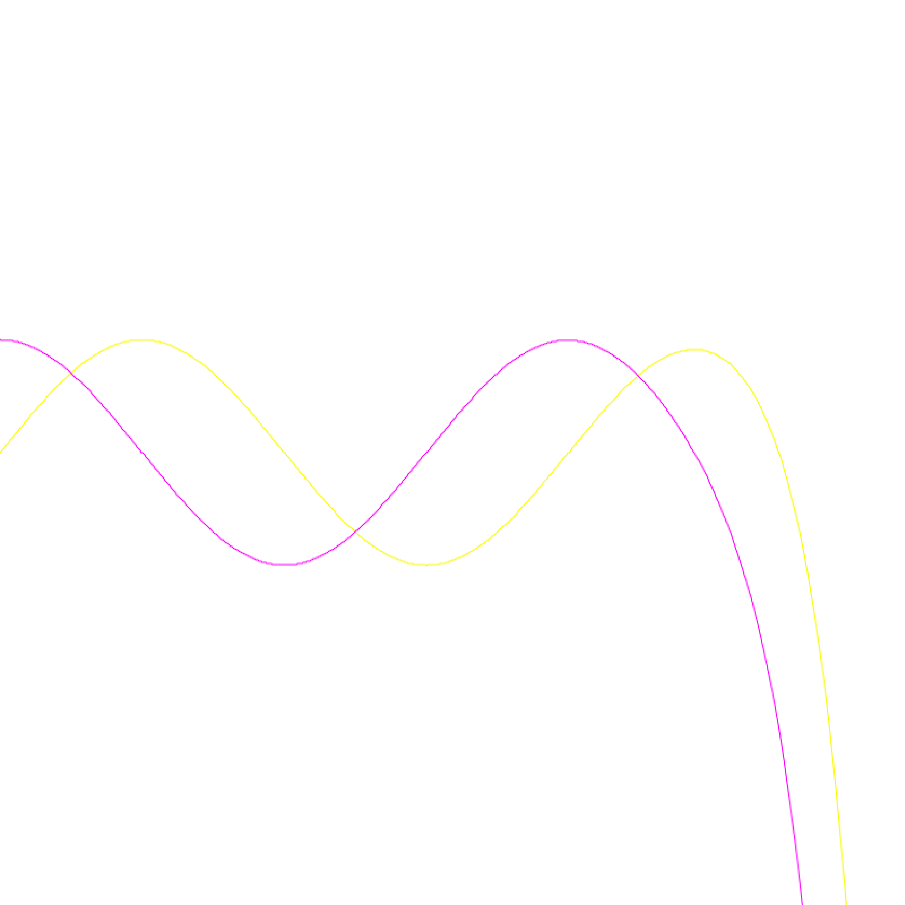

## Chapter 7: Laziness

*"Today's lecture is about lazy evaluation. Thank you for coming, goodbye!"*

Well, perhaps you have some questions? This chapter explores one of the most elegant ideas in functional programming: lazy evaluation. By deferring computation until results are actually needed, we unlock powerful techniques for working with infinite data structures, solving differential equations symbolically, and building sophisticated stream-processing pipelines.

We will examine different evaluation strategies, implement streams and lazy lists, apply them to power series computation and differential equations, build circular data structures, and develop a sophisticated pipe-based pretty-printer. Along the way, we will see how laziness transforms the way we think about computation itself.

**In this chapter, you will:**

- Distinguish evaluation strategies (call-by-value/name/need) and their consequences
- Build infinite data structures safely using streams and lazy values
- Apply laziness to nontrivial examples (power series, differential equations, pretty-printing)
- Learn where laziness interacts poorly with effects (I/O) and how to reason about it

### 7.1 Evaluation Strategies and Parameter Passing

**Evaluation strategy** is the order in which expressions are computed -- primarily, when arguments are computed. Recall our problems with using *flow control* expressions like `if_then_else` in examples from the lambda-calculus lecture. There are many technical terms describing various evaluation strategies:

**Strict evaluation**: Arguments are always evaluated completely before the function is applied.

**Non-strict evaluation**: Arguments are not evaluated unless they are actually used in the evaluation of the function body.

**Eager evaluation**: An expression is evaluated as soon as it gets bound to a variable.

**Lazy evaluation**: Non-strict evaluation which avoids repeating computation.

**Call-by-value**: The argument expression is evaluated, and the resulting value is bound to the corresponding variable in the function (frequently by copying the value into a new memory region).

**Call-by-reference**: A function receives an implicit reference to a variable used as argument, rather than a copy of its value. In purely functional languages there is no difference between the two strategies, so they are typically described as call-by-value even though implementations use call-by-reference internally for efficiency. Call-by-value languages like C and OCaml support explicit references (objects that refer to other objects), and these can be used to simulate call-by-reference.

**Normal order**: Start computing function bodies before evaluating their arguments. Do not even wait for arguments if they are not needed.

**Call-by-name**: Arguments are substituted directly into the function body and then left to be evaluated whenever they appear in the function. This means an argument might be evaluated multiple times if it appears multiple times in the function body.

**Call-by-need**: If the function argument is evaluated, that value is stored for subsequent uses. This avoids the redundant recomputation that can occur with call-by-name.

Almost all languages do not compute inside the body of an un-applied function, but with curried functions you can pre-compute data before all arguments are provided (recall the `search_bible` example from earlier lectures, where preprocessing happened when the first argument was supplied).

In eager / call-by-value languages we can simulate call-by-name by taking a function to compute the value as an argument instead of the value directly. "Our" languages have a `unit` type with a single value `()` specifically for use as throw-away arguments -- we pass `fun () -> expensive_computation` instead of `expensive_computation` directly. Scala has built-in support for call-by-name (i.e. direct, without the need to build argument functions).

OCaml (like most ML-family languages) is *strict by default* but provides explicit laziness (`lazy`, `Lazy.force`, and `Lazy.t`) when you want it. Haskell is *lazy by default* but provides explicit strictness (e.g. `seq`, strict fields, bang patterns) when you need it. This reflects the different design philosophies: OCaml defaults to strict evaluation with opt-in laziness, while Haskell defaults to lazy evaluation with opt-in strictness.

### 7.2 Call-by-name: Streams

Call-by-name is useful not only for implementing flow control. Remember how we struggled to define `if_then_else` as a regular function in the lambda calculus lecture? The problem was that both branches would be evaluated before the function could choose between them. With call-by-name simulation, we can finally make it work:

```ocaml env=ch7
let if_then_else cond e1 e2 =
  match cond with
  | true -> e1 ()
  | false -> e2 ()
```

Here `e1` and `e2` are functions that compute their respective branches only when called. But call-by-name is useful for more than just flow control -- it also enables lazy data structures.

**Streams** are lists with call-by-name tails:

```ocaml env=ch7
type 'a stream = SNil | SCons of 'a * (unit -> 'a stream)
```

The key insight is that the tail is not a stream directly, but a *function* that produces a stream when called. This means the tail is not computed until we actually need it. Reading from a stream into a regular list forces evaluation of the requested elements:

```ocaml env=ch7
let rec stake n = function
  | SCons (a, s) when n > 0 -> a :: (stake (n-1) (s ()))
  | _ -> []
```

Notice how we call `s ()` to get the next portion of the stream. This is where the "lazy" computation happens. Because of this delayed evaluation, streams can easily be infinite:

```ocaml env=ch7
let rec s_ones = SCons (1, fun () -> s_ones)

let rec s_from n =
  SCons (n, fun () -> s_from (n+1))
```

The stream `s_ones` is an infinite sequence of 1s -- it refers to itself as its own tail! The stream `s_from n` produces all integers starting from `n`. These definitions would cause infinite loops in a strict language, but with streams, we only compute as much as we request.

#### Stream Operations

Just as we can define higher-order functions on lists, streams admit similar operations. The key difference is that we must wrap recursive calls in functions to maintain laziness:

```ocaml env=ch7
let rec smap f = function
  | SNil -> SNil
  | SCons (a, s) -> SCons (f a, fun () -> smap f (s ()))

let rec szip = function
  | SNil, SNil -> SNil
  | SCons (a1, s1), SCons (a2, s2) ->
      SCons ((a1, a2), fun () -> szip (s1 (), s2 ()))
  | _ -> raise (Invalid_argument "szip")
```

Streams can provide scaffolding for recursive algorithms, enabling elegant definitions that would be impossible with strict data structures. Consider the Fibonacci sequence:

```ocaml env=ch7
let rec sfib =
  SCons (1, fun () -> smap (fun (a,b) -> a+b)
    (szip (sfib, SCons (1, fun () -> sfib))))
```

This remarkably concise definition creates a stream where each element is computed by adding pairs from the current stream and itself shifted by one position. The stream effectively "builds itself" by referring to its own earlier elements:

| sfib     | 1 | 2 | 3 | 5 | 8 | 13 | ... |
|----------|---|---|---|---|---|----|-----|
| sfib     | 1 | 2 | 3 | 5 | 8 | 13 | ... |
| shifted  | 1 | 1 | 2 | 3 | 5 | 8  | ... |

The `+` operation between corresponding elements produces the next values.

#### Streams and Input-Output

Streams can be used to read from files lazily, but there is a catch -- they are less functional than one might expect in the context of input-output effects:

```ocaml env=ch7
let file_stream name =
  let ch = open_in name in
  let rec ch_read_line () =
    try SCons (input_line ch, ch_read_line)
    with End_of_file -> SNil in
  ch_read_line ()
```

The problem is that reading from a file is a side effect. If you traverse the stream twice, you will not get the same results -- the file handle advances with each read. This is why *OCaml Batteries* uses a stream type `enum` for interfacing between various sequence-like data types, with careful documentation about when streams can be safely reused.

The safest way to use streams is in a *linear* or *ephemeral* manner: every value used only once. Streams minimize space consumption at the expense of time for recomputation -- if you need to traverse the data multiple times, you will recompute it each time. For data that should be computed once and accessed multiple times, we need lazy lists.

### 7.3 Lazy Values

Lazy evaluation is more general than call-by-need as any value can be lazy, not only a function parameter. While streams give us call-by-name semantics (recomputing on each access), lazy values give us call-by-need semantics (computing once and caching the result).

A *lazy value* is a value that "holds" an expression until its result is needed, and from then on it "holds" the result. It is also called a *suspension*. If it holds the expression (not yet evaluated), it is called a *thunk* -- a placeholder waiting to become a real value.

In OCaml, we build lazy values explicitly using the `lazy` keyword. In Haskell, all values are lazy by default, but functions can have call-by-value parameters which "need" (force evaluation of) the argument.

To create a lazy value: `lazy expr` -- where `expr` is the suspended computation. The expression `expr` is not evaluated when the lazy value is created; it is stored for later.

There are two ways to use a lazy value. Be careful to understand when the result is computed!
- In expressions: `Lazy.force l_expr` -- explicitly forces evaluation
- In patterns: `match l_expr with lazy v -> ...` -- forces evaluation during pattern matching
  - Syntactically `lazy` behaves like a data constructor, which is why it can appear in patterns.

#### Lazy Lists

Lazy lists are the "memoizing" version of streams. Instead of a function that recomputes the tail each time, we use a lazy value that computes it once:

```ocaml env=ch7
type 'a llist = LNil | LCons of 'a * 'a llist Lazy.t
```

The tail is of type `'a llist Lazy.t` -- a lazy value that will produce the rest of the list when forced. Reading from a lazy list into a regular list forces evaluation of just the elements we need:

```ocaml env=ch7
let rec ltake n = function
  | LCons (a, lazy l) when n > 0 -> a :: (ltake (n-1) l)
  | _ -> []
```

Notice the `lazy l` pattern -- this forces evaluation of the lazy tail and binds the result to `l`. Lazy lists can easily be infinite, just like streams:

```ocaml env=ch7
let rec l_ones = LCons (1, lazy l_ones)

let rec l_from n = LCons (n, lazy (l_from (n+1)))
```

The crucial difference from streams is that lazy lists support "read once, access multiple times" semantics. Once a portion of the list has been computed, subsequent accesses return the cached result:

```ocaml env=ch7
let file_llist name =
  let ch = open_in name in
  let rec ch_read_line () =
    try LCons (input_line ch, lazy (ch_read_line ()))
    with End_of_file -> LNil in
  ch_read_line ()
```

With `file_llist`, you can traverse the resulting list multiple times and get the same data each time (as long as you keep a reference to the head of the list). The file is read lazily, but each line is cached after being read.

#### Lazy List Operations

We can define the familiar higher-order functions on lazy lists. Notice the subtle but important difference from streams -- we must use `Lazy.force` to access the lazy tail before passing it to recursive calls:

```ocaml env=ch7
let rec lzip = function
  | LNil, LNil -> LNil
  | LCons (a1, ll1), LCons (a2, ll2) ->
      LCons ((a1, a2), lazy (
        lzip (Lazy.force ll1, Lazy.force ll2)))
  | _ -> raise (Invalid_argument "lzip")

let rec lmap f = function
  | LNil -> LNil
  | LCons (a, ll) ->
    LCons (f a, lazy (lmap f (Lazy.force ll)))
```

Using these operations, we can define the factorial sequence in a beautifully self-referential way:

```ocaml env=ch7
let posnums = l_from 1

let rec lfact =
  LCons (1, lazy (lmap (fun (a,b) -> a*b)
                    (lzip (lfact, posnums))))
```

This produces: 1, 1, 2, 6, 24, 120, ... The definition is elegant: each factorial is the product of the previous factorial and the corresponding positive integer. The lazy list `lfact` refers to itself to get the previous factorials!

| lfact   | 1 | 1 | 2 |  6 |  24 | 120 | ... |
|---------|---|---|---|----|-----|-----|-----|
| lfact   | 1 | 1 | 2 |  6 |  24 | 120 | ... |
| posnums | 1 | 2 | 3 |  4 |   5 |   6 | ... |

The `*` operation between corresponding elements produces the next values.

### 7.4 Power Series and Differential Equations

This section presents a fascinating application of lazy lists: computing power series and solving differential equations symbolically. The differential equations idea is due to Henning Thielemann, and demonstrates the expressive power of lazy evaluation.

The expression $P(x) = \sum_{i=0}^{n} a_i x^i$ defines a polynomial when $n < \infty$ and a power series when $n = \infty$. We can represent both as lazy lists of coefficients $[a_0; a_1; a_2; \ldots]$.

If we define:

```ocaml env=ch7
let rec lfold_right f l base =
  match l with
    | LNil -> base
    | LCons (a, lazy l) -> f a (lfold_right f l base)
```

then we can compute polynomials using Horner's method. Horner's method evaluates polynomials efficiently by factoring out powers of $x$: instead of computing $a_0 + a_1 x + a_2 x^2 + \ldots$, we compute $a_0 + x(a_1 + x(a_2 + \ldots))$:

```ocaml env=ch7
let horner x l =
  lfold_right (fun c sum -> c +. x *. sum) l 0.
```

But this will not work for infinite power series! Two natural questions arise:

- Does it make sense to compute the value at $x$ of a power series?
- Does it make sense to fold an infinite list?

The answer to both is "yes, sometimes." If the power series converges for $x > 1$, then when the elements $a_n$ get small, the remaining sum $\sum_{i=n}^{\infty} a_i x^i$ is also small. We can truncate the computation when the contribution becomes negligible.

The problem is that `lfold_right` falls into an infinite loop on infinite lists -- it tries to reach the end before computing anything. We need call-by-name / call-by-need semantics for the argument function `f`, so it can decide to stop early:

```ocaml env=ch7
let rec lazy_foldr f l base =
  match l with
    | LNil -> base
    | LCons (a, ll) ->
      f a (lazy (lazy_foldr f (Lazy.force ll) base))
```

Now we need a stopping condition in the Horner algorithm step. We stop when the coefficient becomes small enough that further terms are negligible:

```ocaml env=ch7
let lhorner x l =                    (* This is a bit of a hack: *)
  let upd c sum =                    (* we hope to "hit" the interval (0, epsilon]. *)
    if c = 0. || abs_float c > epsilon_float
    then c +. x *. Lazy.force sum
    else 0. in                       (* Stop when c is tiny but nonzero. *)
  lazy_foldr upd l 0.

let inv_fact = lmap (fun n -> 1. /. float_of_int n) lfact
let e = lhorner 1. inv_fact
```

The `inv_fact` list contains $[1/0!; 1/1!; 1/2!; \ldots]$, which is the power series for $e^x$. Evaluating `lhorner 1. inv_fact` computes $e^1 = e$.

#### Power Series / Polynomial Operations

To work with power series, we need to define arithmetic operations on lazy lists of coefficients. For floating-point coefficients, we first need a float-based version of positive numbers:

```ocaml env=ch7
let rec l_from_f n = LCons (n, lazy (l_from_f (n +. 1.)))
let posnums_f = l_from_f 1.

(* Unary negation for series *)
let (~-:) = lmap (fun x -> -.x)
```

Now we can define the basic arithmetic operations on power series. Addition and subtraction work coefficient-wise:

```ocaml env=ch7
let rec add xs ys =
  match xs, ys with
    | LNil, _ -> ys
    | _, LNil -> xs
    | LCons (x,xs), LCons (y,ys) ->
      LCons (x +. y, lazy (add (Lazy.force xs) (Lazy.force ys)))

let rec sub xs ys =
  match xs, ys with
    | LNil, _ -> lmap (fun x -> -.x) ys
    | _, LNil -> xs
    | LCons (x,xs), LCons (y,ys) ->
      LCons (x -. y, lazy (add (Lazy.force xs) (Lazy.force ys)))

let scale s = lmap (fun x -> s *. x)

let rec shift n xs =
  if n = 0 then xs
  else if n > 0 then LCons (0., lazy (shift (n-1) xs))  (* Multiply by x^n *)
  else match xs with                                    (* Divide by x^|n| *)
    | LNil -> LNil
    | LCons (0., lazy xs) -> shift (n+1) xs
    | _ -> failwith "shift: fractional division"

(* Multiplication uses the convolution formula *)
let rec mul xs = function
  | LNil -> LNil
  | LCons (y, ys) ->
    add (scale y xs) (LCons (0., lazy (mul xs (Lazy.force ys))))

(* Division is like long division of polynomials *)
let rec div xs ys =
  match xs, ys with
  | LNil, _ -> LNil
  | LCons (0., xs'), LCons (0., ys') ->   (* Both start with zero: cancel x *)
    div (Lazy.force xs') (Lazy.force ys')
  | LCons (x, xs'), LCons (y, ys') ->
    let q = x /. y in                     (* Leading coefficient of quotient *)
    LCons (q, lazy (div (sub (Lazy.force xs')
                                 (scale q (Lazy.force ys'))) ys))
  | LCons _, LNil -> failwith "div: division by zero"

(* Integration: integral of a_0 + a_1*x + a_2*x^2 + ...
   is c + a_0*x + a_1*x^2/2 + a_2*x^3/3 + ... *)
let integrate c xs =
  LCons (c, lazy (lmap (uncurry (/.)) (lzip (xs, posnums_f))))

let ltail = function
  | LNil -> invalid_arg "ltail"
  | LCons (_, lazy tl) -> tl

(* Differentiation: derivative of a_0 + a_1*x + a_2*x^2 + ...
   is a_1 + 2*a_2*x + 3*a_3*x^2 + ... *)
let differentiate xs =
  lmap (uncurry ( *.)) (lzip (ltail xs, posnums_f))
```

#### Differential Equations

Now for the remarkable part: we can solve differential equations by representing the solutions as power series! Consider the differential equations for sine and cosine:

$$\frac{d \sin x}{dx} = \cos x, \quad \frac{d \cos x}{dx} = -\sin x, \quad \sin 0 = 0, \quad \cos 0 = 1$$

We will solve the corresponding integral equations. Why integral equations rather than differential equations? Because integration gives us a way to build up the solution coefficient by coefficient, starting from the initial conditions.

Our first attempt might be to define them by direct recursion:

```
let (~-:) = lmap (fun x -> -.x)  (* Unary negation for series *)

let rec sin = integrate (of_int 0) cos
and cos = integrate (of_int 1) (~-:sin)
```

Unfortunately this fails with: `Error: This kind of expression is not allowed as right-hand side of 'let rec'`

The problem is that OCaml's `let rec` requires the right-hand side to be a "static" value -- something like a function or a data constructor applied to arguments. Even changing the second argument of `integrate` to call-by-need does not help, because OCaml cannot represent the values that `sin` and `cos` refer to at the point of their definition.

The solution is to inline a bit of `integrate` so that OCaml knows how to start building the recursive structure. We provide the first coefficient explicitly:

```ocaml env=ch7
let integ xs = lmap (uncurry (/.)) (lzip (xs, posnums_f))

let rec sin = LCons (of_int 0, lazy (integ cos))
and cos = LCons (of_int 1, lazy (integ (~-:sin)))
```

Now the `let rec` works because each right-hand side is just `LCons` applied to a value and a lazy expression. The lazy expressions are not evaluated during the definition, so there is no problem with the mutual recursion. When we force the lazy tails, the computation proceeds coefficient by coefficient.

The complete example would look much more elegant in Haskell, where all values are lazy by default -- we would not need the explicit `LCons` and `lazy` wrappers.

Although this approach is not limited to linear equations, equations like Lotka-Volterra or Lorentz are not "solvable" this way -- the computed coefficients quickly grow instead of quickly falling, so the series does not converge well.

Drawing functions work like in the previous lecture, but with open curves:

```ocaml env=ch7
let plot_1D f ~w ~scale ~t_beg ~t_end =
  let dt = (t_end -. t_beg) /. of_int w in
  Array.init w (fun i ->
    let y = lhorner (dt *. of_int i) f in
    i, to_int (scale *. y))
```

### 7.5 Arbitrary Precision Computation

Putting together the power series computation with floating-point numbers reveals drastic numerical errors for large $x$. There are two problems:
1. Floating-point numbers have limited precision, so intermediate calculations accumulate errors.
2. We break out of Horner method computations too quickly -- the stopping condition based on `epsilon_float` may stop before we have enough precision.

{width=70%}

For infinite precision on rational numbers we can use the `nums` library, but it does not help by itself -- the stopping condition still causes us to truncate the computation prematurely.

The key insight is that instead of computing a single approximate value, we should generate a *sequence of approximations* to the power series limit at $x$. Then we can watch the sequence until it converges:

```ocaml env=ch7
let infhorner x l =
  let upd c sum =
    LCons (c, lazy (lmap (fun apx -> c +. x *. apx)
                      (Lazy.force sum))) in
  lazy_foldr upd l (LCons (of_int 0, lazy LNil))
```

The function `infhorner` returns a lazy list of partial sums. Each element is a better approximation than the previous one. Now we need to find where the series has converged to the precision we need:

```ocaml env=ch7
let rec exact f = function         (* We arbitrarily decide that convergence is *)
  | LNil -> assert false           (* when three consecutive results are the same. *)
  | LCons (x0, lazy (LCons (x1, lazy (LCons (x2, _)))))
      when f x0 = f x1 && f x0 = f x2 -> f x0
  | LCons (_, lazy tl) -> exact f tl
```

The function `exact` applies a test function `f` to the approximations and stops when three consecutive results give the same answer. Why three? Because some power series (like those for sine and cosine) have alternating terms, and we want to be sure the result has stabilized.

Draw the pixels of the graph at exact coordinates:

```ocaml env=ch7
let plot_1D f ~w ~h0 ~scale ~t_beg ~t_end =
  let dt = (t_end -. t_beg) /. of_int w in
  let eval = exact (fun y -> to_int (scale *. y)) in
  Array.init w (fun i ->
    let y = infhorner (t_beg +. dt *. of_int i) f in
    i, h0 + eval y)
```

If a power series had every third term contributing (zeros in a regular pattern), we would have to check more terms in the function `exact`. We could also use a different stopping criterion like `f x0 = f x1 && not (x0 =. x1)` (stop when the transformed values match but the raw values are still changing), similar to what we did in `lhorner`.

#### Example: Nuclear Chain Reaction

Consider a nuclear chain reaction where substance A decays into B, which then decays into C. This is a classic problem in nuclear physics. The differential equations are:

$$\frac{dN_A}{dt} = -\lambda_A N_A, \quad \frac{dN_B}{dt} = \lambda_A N_A - \lambda_B N_B$$

Here $\lambda_A$ and $\lambda_B$ are the decay constants, and $N_A$, $N_B$ are the amounts of each substance. Substance A decays at a rate proportional to its amount. Substance B is produced by A's decay and itself decays into C.

We can solve these equations using the same technique as for sine and cosine:

```
let n_chain ~nA0 ~nB0 ~lA ~lB =
  let rec nA =
    LCons (nA0, lazy (integ (~-.lA *:. nA)))
  and nB =
    LCons (nB0, lazy (integ (~-.lB *:. nB +: lA *:. nA))) in
  nA, nB
```

{width=70%}

(See [Radioactive decay chain processes](http://en.wikipedia.org/wiki/Radioactive_decay#Chain-decay_processes) for more information.)

### 7.6 Circular Data Structures: Double-Linked Lists

Without delayed computation, the ability to define data structures with referential cycles is very limited. In a strict language, you cannot create a structure that refers to itself -- the reference would have to exist before the structure is created.

Double-linked lists are a classic example of structures with inherent cycles. Even if the list itself is not circular (it has a beginning and an end), each pair of adjacent nodes forms a cycle: node A points forward to node B, and node B points backward to node A:

```
+--------+     +--------+     +--------+     +--------+     +--------+
| DLNil  | <-> |   a1   | <-> |   a2   | <-> |   a3   | <-> | DLNil  |
+--------+     +--------+     +--------+     +--------+     +--------+
```

To represent such structures in OCaml, we need to "break" the cycles by making some links lazy. The backward links will be lazy, allowing us to construct the structure one node at a time:

```ocaml env=ch7
type 'a dllist =
  DLNil | DLCons of 'a dllist Lazy.t * 'a * 'a dllist
```

The type has three components: a lazy backward link, the element, and a (strict) forward link. The backward link is lazy because when we create a node, its predecessor may not exist yet.

We can navigate forward through the list, dropping elements from the front:

```ocaml env=ch7
let rec dldrop n l =
  match l with
    | DLCons (_, x, xs) when n > 0 ->
       dldrop (n-1) xs
    | _ -> l
```

The tricky part is constructing a double-linked list from a regular list. Each cell must know its predecessor, but the predecessor is created first. We use a recursive lazy value to tie the knot:

```ocaml env=ch7
let dllist_of_list l =
  let rec dllist prev l =
    match l with
      | [] -> DLNil
      | x::xs ->
        let rec cell =
          lazy (DLCons (prev, x, dllist cell xs)) in
        Lazy.force cell in
  dllist (lazy DLNil) l
```

The key trick is `let rec cell = lazy (DLCons (prev, x, dllist cell xs))`. The lazy value `cell` refers to itself! When we force `cell`, it creates a `DLCons` node whose forward link (`dllist cell xs`) receives `cell` as the predecessor for the next node. This is only possible because the backward link is lazy -- when we create the next node, we do not need to evaluate `cell`, just store a reference to it.

Taking elements going forward is straightforward:

```ocaml env=ch7
let rec dltake n l =
  match l with
    | DLCons (_, x, xs) when n > 0 ->
       x :: dltake (n-1) xs
    | _ -> []
```

Taking elements going backward shows the power of the double-linked structure -- we can traverse in either direction:

```ocaml env=ch7
let rec dlbackwards n l =
  match l with
    | DLCons (lazy xs, x, _) when n > 0 ->
      x :: dlbackwards (n-1) xs
    | _ -> []
```

### 7.7 Input-Output Streams

Let us return to streams and generalize them. The stream type we defined earlier used a throwaway argument to make a suspension:

```ocaml env=ch7
type 'a stream = SNil | SCons of 'a * (unit -> 'a stream)
```

The `unit` argument serves only to delay computation. But what if we take a *real* argument -- one that provides input to the stream? This leads to a more powerful abstraction:

```ocaml env=ch7
type ('a, 'b) iostream =
  EOS | More of 'b * ('a -> ('a, 'b) iostream)
```

This is an *interactive* stream: it produces an output value of type `'b`, and when given an input value of type `'a`, produces the rest of the stream. The stream alternates between producing output and consuming input.

```ocaml env=ch7
type 'a istream = (unit, 'a) iostream  (* Input stream produces output when "asked". *)
type 'a ostream = ('a, unit) iostream  (* Output stream consumes provided input. *)
```

The terminology can be confusing. An "input stream" (`istream`) is one that produces output when asked (like reading from a file). An "output stream" (`ostream`) is one that consumes input (like writing to a file). The confusion arises from adapting the *input file / output file* terminology.

The power of this abstraction is that we can compose streams, directing the output of one to the input of another:

```ocaml env=ch7
let rec compose sf sg =
  match sg with
  | EOS -> EOS                              (* No more output from sg. *)
  | More (z, g) ->
    match sf with
    | EOS -> More (z, fun _ -> EOS)         (* No more input from sf. *)
    | More (y, f) ->
      let update x = compose (f x) (g y) in (* Feed sf's output y to sg. *)
      More (z, update)
```

Think of it as connecting boxes with wires: every box has one incoming wire and one outgoing wire. When composing `sf` and `sg`, the output of `sf` becomes the input of `sg`. Notice that the output stream is "ahead" of the input stream -- `sg` can produce its first output `z` before `sf` has produced anything.

### 7.8 Pipes

The `iostream` type has a limitation: it must alternate strictly between producing output and consuming input. In many real-world scenarios, we need more flexibility:

- A transformation might consume several inputs before producing a single output (like computing an average).
- A transformation might produce several outputs from a single input (like splitting a string).
- A transformation might produce output without needing any input (like a constant source).

Following the Haskell tradition, we call this more flexible data structure a `pipe`:

```ocaml env=ch7
type ('a, 'b) pipe =
  EOP                                       (* End of pipe -- done processing *)
| Yield of 'b * ('a, 'b) pipe               (* Produce output b, then continue *)
| Await of ('a -> ('a, 'b) pipe)            (* Wait for input a, then continue *)
```

A pipe can be in one of three states: finished (`EOP`), ready to produce output (`Yield`), or waiting for input (`Await`). The key insight is that `Yield` includes the continuation pipe directly (not wrapped in a function), so multiple outputs can be produced in sequence without requiring input. For incremental processing where outputs should be lazy, you would change `Yield` to hold a lazy pipe instead.

Again, we can specialize to input-only and output-only pipes:

```ocaml env=ch7
type 'a ipipe = (unit, 'a) pipe
type void
type 'a opipe = ('a, void) pipe
```

Why `void` rather than `unit`, and why only for `opipe`? Because an output pipe never yields values -- if it used `unit` as the output type, it could still yield `()` values. But `void` is an abstract type with no values, making it impossible for an `opipe` to yield anything. This is a type-level guarantee that output pipes only consume.

#### Pipe Composition

Composition of pipes is like "concatenating them in space" or connecting boxes. We plug the output of pipe `pf` into the input of pipe `pg`:

```ocaml env=ch7
let rec compose pf pg =
  match pg with
  | EOP -> EOP                            (* pg is done -- composition is done. *)
  | Yield (z, pg') -> Yield (z, compose pf pg')  (* pg has output -- pass it through. *)
  | Await g ->                            (* pg needs input -- try to get it from pf. *)
    match pf with
    | EOP -> EOP                          (* pf is done -- no more input for pg. *)
    | Yield (y, pf') -> compose pf' (g y)  (* pf has output -- feed it to pg. *)
    | Await f ->                          (* Both waiting -- wait for external input. *)
      let update x = compose (f x) pg in
      Await update

let (>->) pf pg = compose pf pg
```

The `>->` operator lets us chain pipes together like Unix pipes: `source >-> transform >-> sink`.

Appending pipes means "concatenating them in time" rather than in space. When the first pipe finishes, we continue with the second:

```ocaml env=ch7
let rec append pf pg =
  match pf with
  | EOP -> pg                               (* pf is exhausted -- continue with pg. *)
  | Yield (z, pf') -> Yield (z, append pf' pg)  (* pf has output -- pass it through. *)
  | Await f ->                              (* pf awaits input -- pass it through. *)
    let update x = append (f x) pg in
    Await update
```

We can also append a list of ready results in front of a pipe. This is useful for producing multiple outputs at once:

```ocaml env=ch7
let rec yield_all l tail =
  match l with
  | [] -> tail
  | x::xs -> Yield (x, yield_all xs tail)
```

Finally, the `iterate` function creates a pipe that repeatedly applies a side-effecting function to its inputs. This is **not functional** (it performs side effects), but it is useful for output:

```ocaml env=ch7
let rec iterate f : 'a opipe =
  Await (fun x -> let () = f x in iterate f)
```

### 7.9 Example: Pretty-Printing

Now let us apply pipes to a substantial example: pretty-printing. The goal is to print a hierarchically organized document with a limited line width. When a group of text fits on the current line, we keep it together; when it does not fit, we break it across multiple lines.

```ocaml env=ch7
type doc =
  Text of string | Line | Cat of doc * doc | Group of doc
```

The document type has four constructors:

- `Text s` -- literal text
- `Line` -- a potential line break (rendered as a space if the group fits, or a newline if it does not)
- `Cat (d1, d2)` -- concatenation
- `Group d` -- a group that should be kept together if possible

Some convenient operators for building documents:

```ocaml env=ch7
let (++) d1 d2 = Cat (d1, Cat (Line, d2))
let (!) s = Text s

let test_doc =
  Group (!"Document" ++
            Group (!"First part" ++ !"Second part"))
```

The pretty-printer should produce different outputs depending on the available width:

```
# let () = print_endline (pretty 30 test_doc);;
Document
First part Second part

# let () = print_endline (pretty 20 test_doc);;
Document
First part
Second part

# let () = print_endline (pretty 60 test_doc);;
Document First part Second part
```

#### Straightforward Solution

Before diving into pipes, let us implement a straightforward recursive solution:

```ocaml env=ch7
let pretty w d =               (* Allowed width of line w. *)
  let rec width = function     (* Compute total length of subdocument. *)
    | Text z -> String.length z
    | Line -> 1                (* A line break takes 1 character (space or newline). *)
    | Cat (d1, d2) -> width d1 + width d2
    | Group d -> width d in
  let rec format f r = function  (* f: flatten (no breaks)? r: remaining space. *)
    | Text z -> z, r - String.length z
    | Line when f -> " ", r-1  (* Flatten mode: render as space. *)
    | Line -> "\n", w          (* Break mode: newline, reset remaining to full width. *)
    | Cat (d1, d2) ->
      let s1, r = format f r d1 in
      let s2, r = format f r d2 in
      s1 ^ s2, r
    | Group d -> format (f || width d <= r) r d  (* Flatten if group fits. *)
  in
  fst (format false w d)       (* Start outside any group (not flattening). *)
```

The `format` function takes a boolean `f` (are we in "flatten" mode?) and the remaining space `r`. When we enter a `Group`, we check if the whole group fits in the remaining space. If so, we format it in flatten mode (all `Line`s become spaces).

#### Stream-Based Solution

The straightforward solution works, but it has a problem: for each group, we compute `width` by traversing the entire subtree, potentially doing redundant work. The stream-based solution processes the document incrementally, computing positions as we go.

First, we define a type for document elements that can carry annotations:

```ocaml env=ch7
type ('a, 'b) doc_e =          (* Annotated nodes, special for group beginning. *)
  TE of 'a * string | LE of 'a | GBeg of 'b | GEnd of 'a
```

The type parameters `'a` and `'b` allow different annotations for different elements. `GBeg` (group beginning) has a different type because it will eventually carry the end position of the group.

Normalize a subdocument to remove empty groups:

```ocaml env=ch7
let rec norm = function
  | Group d -> norm d
  | Text "" -> None
  | Cat (Text "", d) -> norm d
  | d -> Some d
```

Generate the stream of document elements by infix traversal:

```ocaml env=ch7
let rec gen = function
  | Text z -> Yield (TE ((),z), EOP)
  | Line -> Yield (LE (), EOP)
  | Cat (d1, d2) -> append (gen d1) (gen d2)
  | Group d ->
    match norm d with
    | None -> EOP
    | Some d ->
      Yield (GBeg (),
             append (gen d) (Yield (GEnd (), EOP)))
```

The next pipe computes the position (character count from the beginning) of each element:

```ocaml env=ch7
let rec docpos curpos =
  Await (function                   (* Input from a doc_e pipe, *)
  | TE (_, z) ->
    Yield (TE (curpos, z),          (* output doc_e annotated with position. *)
           docpos (curpos + String.length z))
  | LE _ ->                         (* Spaces and line breaks: 1 character. *)
    Yield (LE curpos, docpos (curpos + 1))
  | GBeg _ ->                       (* Groups themselves have no width. *)
    Yield (GBeg curpos, docpos curpos)
  | GEnd _ ->
    Yield (GEnd curpos, docpos curpos))

let docpos = docpos 0               (* The whole document starts at position 0. *)
```

Now comes the tricky part. We want to annotate each `GBeg` with the position where the group *ends*, so we can decide whether the group fits on the line. But we see `GBeg` before we see `GEnd`! We need to buffer elements until we see the end of each group:

```ocaml env=ch7
let rec grends grstack =
  Await (function
  | TE _ | LE _ as e ->
    (match grstack with
    | [] -> Yield (e, grends [])         (* No groups waiting -- yield immediately. *)
    | gr::grs -> grends ((e::gr)::grs))  (* Inside a group -- buffer the element. *)
  | GBeg _ -> grends ([]::grstack)       (* Start a new group: push empty buffer. *)
  | GEnd endp ->
    match grstack with                   (* End the group on top of stack. *)
    | [] -> failwith "grends: unmatched group end marker"
    | [gr] ->                          (* Outermost group -- yield everything now. *)
      yield_all
        (GBeg endp::List.rev (GEnd endp::gr))  (* Annotate GBeg with end position. *)
        (grends [])
    | gr::par::grs ->                    (* Nested group -- add to parent's buffer. *)
      let par = GEnd endp::gr @ [GBeg endp] @ par in
      grends (par::grs))               (* Could use catenable lists for efficiency. *)
```

This works, but it has a problem: we wait until the entire group is processed before yielding anything. For large groups (or groups that exceed the line width), this is wasteful. We can optimize by flushing the buffer when a group clearly exceeds the line width -- if we know a group will not fit, there is no need to remember where it ends:

```ocaml env=ch7
type grp_pos = Pos of int | Too_far

let rev_concat_map ~prep f l =
  let rec cmap_f accu = function
    | [] -> accu
    | a::l -> cmap_f (prep::List.rev_append (f a) accu) l in
  cmap_f [] l

let rec grends w grstack =
  let flush tail =                   (* When a group exceeds width w, *)
    yield_all                     (* flush the stack -- yield everything buffered. *)
      (rev_concat_map ~prep:(GBeg Too_far) snd grstack)
      tail in                        (* Mark flushed groups as Too_far. *)
  Await (function
  | TE (curp, _) | LE curp as e ->
    (match grstack with              (* Track beginning position of each group. *)
    | [] -> Yield (e, grends w [])   (* No groups -- yield immediately. *)
    | (begp, _)::_ when curp-begp > w ->
      flush (Yield (e, grends w []))    (* Group too wide -- flush and yield. *)
    | (begp, gr)::grs -> grends w ((begp, e::gr)::grs))  (* Buffer element. *)
  | GBeg begp -> grends w ((begp, [])::grstack)  (* New group: remember start pos. *)
  | GEnd endp as e ->
    match grstack with               (* No longer fail when stack is empty -- *)
    | [] -> Yield (e, grends w [])   (* could have been flushed earlier. *)
    | (begp, _)::_ when endp-begp > w ->
      flush (Yield (e, grends w []))    (* Group exceeded width -- flush. *)
    | [_, gr] ->                     (* Group fits -- annotate with end position. *)
      yield_all
        (GBeg (Pos endp)::List.rev (GEnd endp::gr))
        (grends w [])
    | (_, gr)::(par_begp, par)::grs ->  (* Nested group fits -- add to parent. *)
      let par =
        GEnd endp::gr @ [GBeg (Pos endp)] @ par in
      grends w ((par_begp, par)::grs))

let grends w = grends w []           (* Initial stack is empty. *)
```

Finally, the `format` pipe produces the resulting stream of strings. It maintains a stack of booleans indicating which groups are being "flattened" (rendered inline), and the position where the current line would end:

```ocaml env=ch7
let rec format w (inline, endlpos as st) = (* inline: stack of "flatten this group?" *)
  Await (function                          (* endlpos: position where line ends *)
  | TE (_, z) -> Yield (z, format w st)    (* Text: output directly. *)
  | LE p when List.hd inline ->
    Yield (" ", format w st)               (* In flatten mode: line break -> space. *)
  | LE p -> Yield ("\n", format w (inline, p+w))  (* Break mode: update endlpos. *)
  | GBeg Too_far ->                        (* Group too wide -- don't flatten. *)
    format w (false::inline, endlpos)
  | GBeg (Pos p) ->                        (* Group fits if it ends before endlpos. *)
    format w ((p<=endlpos)::inline, endlpos)
  | GEnd _ -> format w (List.tl inline, endlpos))  (* Pop the inline stack. *)

let format w = format w ([false], w)   (* Start with no flattening, full line width. *)
```

Put the pipes together into a complete pipeline:

```
+--------+     +-------+     +---------+     +--------+     +----------------+
| gen doc| --> |docpos | --> |grends w | --> |format w| --> |iterate print_s |
+--------+     +-------+     +---------+     +--------+     +----------------+
```

The data flows from left to right: `gen` produces document elements, `docpos` annotates them with positions, `grends` annotates group beginnings with their end positions, `format` decides where to break lines and produces strings, and `iterate print_string` prints the strings.

#### Factored Solution

For maximum flexibility, we can factorize `format` into two parts: one that decides where to break lines (producing annotated document elements), and one that converts those to strings. This allows different line breaking strategies to be plugged in:

```ocaml env=ch7
(* breaks: decides where to break, outputs annotated doc_e elements *)
let rec breaks w (inline, endlpos as st) =
  Await (function
  | TE _ as e -> Yield (e, breaks w st)          (* Pass through text. *)
  | LE p when List.hd inline ->
    Yield (TE (p, " "), breaks w st)             (* Flatten: convert to space. *)
  | LE p as e -> Yield (e, breaks w (inline, p+w))  (* Break: keep as LE. *)
  | GBeg Too_far as e ->
    Yield (e, breaks w (false::inline, endlpos))
  | GBeg (Pos p) as e ->
    Yield (e, breaks w ((p<=endlpos)::inline, endlpos))
  | GEnd _ as e ->
    Yield (e, breaks w (List.tl inline, endlpos)))

let breaks w = breaks w ([false], w)

(* emit: converts doc_e elements to strings *)
let rec emit =
  Await (function
  | TE (_, z) -> Yield (z, emit)                 (* Text: output directly. *)
  | LE _ -> Yield ("\n", emit)                   (* Line break: output newline. *)
  | GBeg _ | GEnd _ -> emit)                     (* Group markers: skip. *)

let pretty_print w doc =
  gen doc >-> docpos >-> grends w >-> breaks w >->
  emit >-> iterate print_string
```

Now `breaks` can be replaced with a different strategy (for example, one that adds indentation), and `emit` stays the same. The full pipeline reads like a description of what happens: generate elements, compute positions, annotate groups with their ends, decide where to break, convert to strings, and print.

### 7.10 Exercises

**Exercise 1:** My first impulse was to define lazy list functions as follows:

```ocaml env=ch7
let rec wrong_lzip = function
  | LNil, LNil -> LNil
  | LCons (a1, lazy l1), LCons (a2, lazy l2) ->
      LCons ((a1, a2), lazy (wrong_lzip (l1, l2)))
  | _ -> raise (Invalid_argument "lzip")

let rec wrong_lmap f = function
  | LNil -> LNil
  | LCons (a, lazy l) -> LCons (f a, lazy (wrong_lmap f l))
```

What is wrong with these definitions -- for which edge cases do they not work as intended?

**Exercise 2:** Cyclic lazy lists.

1. Implement a function `cycle : 'a list -> 'a llist` that creates a lazy list with elements from a standard list, and the whole list as the tail after the last element from the input list:
   `[a1; a2; ...; aN]` maps to a cyclic structure where `aN` points back to `a1`.
   Your function `cycle` can either return `LNil` or fail for an empty list as argument.

2. Note that `inv_fact` from the lecture defines the power series for the $\exp(\cdot)$ function ($\exp(x) = e^x$). Using `cycle` and `inv_fact`, define the power series for $\sin(\cdot)$ and $\cos(\cdot)$, and draw their graphs using helper functions from the lecture script `Lec7.ml`.

**Exercise 3:** Modify one of the puzzle solving programs (either from the previous lecture or from your previous homework) to work with lazy lists. Implement the necessary higher-order lazy list functions. Check that indeed displaying only the first solution when there are multiple solutions in the result takes shorter than computing solutions by the original program.

**Exercise 4:** *Hamming's problem*. Generate in increasing order the numbers of the form $2^{a_1} 3^{a_2} 5^{a_3} \ldots p_k^{a_k}$, that is numbers not divisible by prime numbers greater than the $k$th prime number.

In the original Hamming's problem posed by Dijkstra, $k = 3$, which is related to [regular numbers](http://en.wikipedia.org/wiki/Regular_number).

Starter code is available in the lecture script `Lec7.ml`:

```ocaml env=ch7
let rec lfilter f = function
  | LNil -> LNil
  | LCons (n, ll) ->
      if f n then LCons (n, lazy (lfilter f (Lazy.force ll)))
      else lfilter f (Lazy.force ll)

let primes =
  let rec sieve = function
    | LCons(p, nf) ->
        LCons(p, lazy (sieve (sift p (Lazy.force nf))))
    | LNil -> failwith "Impossible! Internal error."
  and sift p = lfilter (fun n -> n mod p <> 0)
  in sieve (l_from 2)

let times ll n = lmap (fun i -> i * n) ll

let rec merge xs ys =
  match xs, ys with
  | LCons (x, lazy xr), LCons (y, lazy yr) ->
      if x < y then LCons (x, lazy (merge xr ys))
      else if x > y then LCons (y, lazy (merge xs yr))
      else LCons (x, lazy (merge xr yr))
  | r, LNil | LNil, r -> r

let hamming k =
  let _pr = ltake k primes in  (* TODO: use primes to generate smooth numbers *)
  let rec h = LCons (1, lazy (
     (* TODO: replace this placeholder with the real generator; `h` keeps the snippet compiling. *) h
  )) in h
```

**Exercise 5:** Modify `format` and/or `breaks` to use just a single number instead of a stack of booleans to keep track of what groups should be inlined.

**Exercise 6:** Add **indentation** to the pretty-printer for groups: if a group does not fit in a single line, its consecutive lines are indented by a given amount `tab` of spaces deeper than its parent group lines would be. For comparison, let's do several implementations.

1. Modify the straightforward implementation of `pretty`.
2. Modify the first pipe-based implementation of `pretty` by modifying the `format` function.
3. Modify the second pipe-based implementation of `pretty` by modifying the `breaks` function. Recover the positions of elements -- the number of characters from the beginning of the document -- by keeping track of the growing offset.
4. (Harder) Modify a pipe-based implementation to provide a different style of indentation: indent the first line of a group, when the group starts on a new line, at the same level as the consecutive lines (rather than at the parent level of indentation).

**Exercise 7:** Write a pipe that takes document elements annotated with linear position, and produces document elements annotated with (line, column) coordinates.

Write another pipe that takes so annotated elements and adds a line number indicator in front of each line. Do not update the column coordinate. Test the pipes by plugging them before the `emit` pipe.

```
1: first line
2: second line, etc.
```

**Exercise 8:** Write a pipe that consumes document elements `doc_e` and yields the toplevel subdocuments `doc` which would generate the corresponding elements.

You can modify the definition of documents to allow annotations, so that the element annotations are preserved (`gen` should ignore annotations to keep things simple):

```ocaml env=ch7
type 'a doc =
  Text of 'a * string | Line of 'a | Cat of 'a doc * 'a doc | Group of 'a * 'a doc
```

**Exercise 9:** (Harder) Design and implement a way to duplicate arrows outgoing from a pipe-box, that would memoize the stream, i.e. not recompute everything "upstream" for the composition of pipes. Such duplicated arrows would behave nicely with pipes reading from files.
