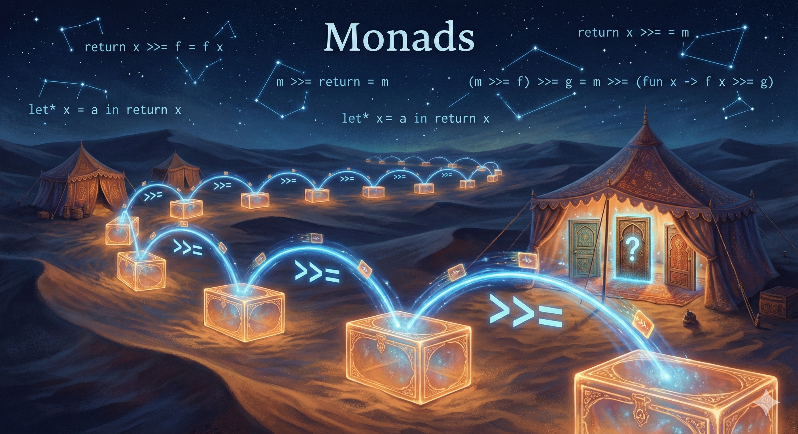

## Chapter 8: Choices and their interpreters

{.chapter-image}

**Prerequisites:** Chapters 5–7: modules, folds, finite search and delayed work.
**Route:** Part III. Chapter 9 changes how operations are represented, using
OCaml effects; the shared probability project spans both chapters.

A search program asks for alternatives and rejects some results. Does it want
all answers, the first successful answer, or only their count? Begin with those
operations, then choose their interpretation. A type signature alone does not
make different interpretations equivalent.

### 8.1 A small language of search

<!-- $MDX file=../projects/choices/search.ml,part=language -->
```ocaml
type 'a t = Return of 'a | Fail | Choice of 'a t list
let return x = Return x
let rec bind m f = match m with
  | Return x -> f x
  | Fail -> Fail
  | Choice branches -> Choice (List.map (fun m -> bind m f) branches)
let ( let* ) = bind
let choose xs = Choice (List.map return xs)
let guard b = if b then return () else Fail
```

`Return` supplies an answer, `Fail` supplies none, and `Choice` records alternatives.
`bind m f` replaces each successful leaf of `m` by the next search `f x`.
The syntax is a finite tree; it eagerly constructs branches. We make no fairness
claim for an infinite or diverging branch. A delayed representation could change
that demand policy, as Chapter 7 suggests.

<!-- $MDX file=../projects/choices/search.ml,part=model -->
```ocaml
let pairs target =
  let* x = choose [1;2;3] in
  let* y = choose [1;2;3] in
  let* () = guard (x + y = target) in
  return (x,y)
```

Read `let*` as sequencing through the language's `bind`. It is a binding operator,
not built-in backtracking. Changing the definition of `let*` changes how the
right-hand computation supplies values to the body. Ordinary `let` continues
to mean ordinary OCaml evaluation.

### 8.2 Three interpretations of the same tree

<!-- $MDX file=../projects/choices/search.ml,part=interpreters -->
```ocaml
let rec all = function
  | Return x -> [x]
  | Fail -> []
  | Choice branches -> List.concat_map all branches

let rec first = function
  | Return x -> Some x
  | Fail -> None
  | Choice branches ->
    let rec loop = function
      | [] -> None
      | m::ms -> match first m with None -> loop ms | answer -> answer in
    loop branches

let rec count = function
  | Return _ -> 1
  | Fail -> 0
  | Choice branches -> List.fold_left (fun n m -> n + count m) 0 branches
```

```ocaml env=search
let () =
  assert (Search.all (Search.pairs 4) = [1,3;2,2;3,1]);
  assert (Search.first (Search.pairs 4) = Some (1,3));
  assert (Search.count (Search.pairs 4) = 3);
  assert (Search.first (Search.pairs 9) = None)
```

These interpreters are folds over the search representation. `all` preserves the
left-to-right order and multiplicity of leaves. `first` chooses the first
*successful leaf after downstream failures*. `count` counts leaves, including
repeated equal answers; its machine integer can overflow on a very large tree.
The agreement laws for finite searches are
`first m = List.nth_opt (all m) 0` and `count m = List.length (all m)`, when that
count fits. These are weaker than saying the three results are identical.

The source and tests are `projects/choices/search.ml` and `laws.ml`. The
Honey Islands project also expresses its choices through a module interface,
so its direct and monadic implementations can share a reference specification.

### 8.3 Monad laws say how sequencing associates

A monad interface supplies a type constructor `'a t`, `return`, and `bind`:

```ocaml env=interfaces
module type MONAD = sig
  type 'a t
  val return : 'a -> 'a t
  val bind : 'a t -> ('a -> 'b t) -> 'b t
end
```

For the chosen notion of observational equality, the laws are:

- `bind (return x) f = f x` (left identity).
- `bind m return = m` (right identity).
- `bind (bind m f) g = bind m (fun x -> bind (f x) g)` (associativity).

For our search language, compare `all` results as lists: order and duplicates
matter. Some syntactically different trees then count as equal. The laws follow
by induction on the tree and list concatenation's associativity. They are not
claims about identical allocation, termination on infinite structures, or equal
performance. `projects/choices/laws.ml` gives bounded executable instances.

Options, lists and state computations can all support lawful sequencing, but
they do different things. `Option.bind None f` does not run `f`; list bind runs
it for each element. A state computation receives an initial state and returns
a result together with a new state. The interface organizes composition without
identifying these behaviors.

### 8.4 Choice needs additional laws

Let `zero` be failure and `plus` combine searches. List interpretation uses `[]`
and `(@)`. It satisfies associative choice with failure as identity and, for
finite pure computations, left distribution through bind:

```text
bind (plus a b) f = plus (bind a f) (bind b f)
bind zero f = zero
bind m (fun _ -> zero) = zero
```

These equations justify exploring alternatives and then applying a common
continuation. They do not follow from monad laws plus monoid laws alone.
Left-biased option has a lawful monad and associative choice, but fails the first:

```ocaml env=choice_laws
let plus a b = match a with Some _ -> a | None -> b
let f x = if x = 2 then Some x else None
let () =
  let left = Option.bind (plus (Some 1) (Some 2)) f in
  let right = plus (Option.bind (Some 1) f) (Option.bind (Some 2) f) in
  assert (left = None && right = Some 2)
```

Committing to `Some 1` discarded the alternative before `f` rejected it. In
contrast, `Search.first` sees the completed search tree and can try the second
branch. This is why a `MONAD_PLUS` signature is not enough to certify a
backtracking algorithm.

Other tempting laws also depend on equality. List choice is not commutative or
idempotent when order and multiplicity are observed. Right distribution can
reorder results: branching inside each value produces a different order from
collecting one branch's answers and then the other's. A set interpreter may
forget those differences; a probability interpreter may need their multiplicities.
State each law the optimization actually uses.

### 8.5 A concrete reason to combine effects

Suppose a branch increments a counter and then fails. Should the alternative
branch see the increment? There are two useful answers:

- **Branch-local state:** a failed branch rolls back its state. Represent a
  computation as `state -> (answer * state) list`, conventionally `StateT(List)`.
- **Shared execution state:** exploration updates one state even when a branch
  produces no answers. A possible representation is `state -> answer list * state`;
  its sequencing and traversal order must be specified, not inferred from its type.

Here is the first semantics in a small example:

```ocaml env=state_choice
type 'a local = int -> ('a * int) list
let return x s = [x,s]
let bind m f s = List.concat_map (fun (x,s') -> f x s') (m s)
let ( let* ) = bind
let get s = [s,s]
let put s _ = [(),s]
let fail _ = []
let plus a b s = a s @ b s
let losing = let* () = put 1 in fail
let () = assert (plus losing get 0 = [0,0])
```

Both alternatives receive the original state zero. Compare an explicitly shared
state interpretation of that same policy question:

```ocaml env=state_choice
let shared_counter = ref 0
let losing_shared () = shared_counter := 1; []
let alternative_shared () = [!shared_counter]
let () =
  let a = losing_shared () in
  let b = alternative_shared () in
  assert (a @ b = [1])
```

A transformer is useful once this semantic choice is concrete. It systematically
builds one interface from another; it does not make the order irrelevant. The
Honey Islands transformer uses branch-local removal lists, and its tests compare
all resulting removal sets against exhaustive subsets. Accidental shared state
would change that solver's meaning.

### 8.6 Probability is weighted choice

A finite distribution assigns nonnegative, finite weights to outcomes. To sample,
the support must contain positive total mass; normalize the weights before
selecting an interval. Zero-weight outcomes must never be selected. Conditioning
multiplies weights by likelihoods and normalizes at the end; impossible evidence
has zero total mass and cannot yield a posterior distribution.

For a fair Boolean `b`, observing likelihood `0.8` if true and `0.2` otherwise
gives unnormalized masses `0.4` and `0.1`, hence posterior `P(b=true)=0.8`.
A subsequent irrelevant fair draw must not change that posterior. Recounting the
observation on each replay would incorrectly strengthen the evidence.

`projects/probability/README.md` uses the same tiny models with finite enumeration,
likelihood weighting, and replay with or without resampling. “Exact enumeration”
means the entire finite support is explored; its numerical weights are still
floats. It is a reference for small models, not a cure for underflow or a proof
that a sampling estimator is consistent. The larger sensor-fusion application
uses the same compiled inference module.

### 8.7 Exercises

1. **Practice.** Add an interpreter returning the last successful result. State
   its relation to `all`, including the empty case, and check it on `pairs`.
2. **Proof.** Prove left distribution for list bind. Exhibit the order difference
   in a proposed right-distribution law using two inputs and two outcomes.
3. **Experiment.** Run the option counterexample after changing `f` so both
   inputs succeed. Explain why that passing case does not establish the law.
4. **Practice.** Count *distinct* answers by interpreting to a set. Give a search
   where this differs from `count`; specify a comparison function for the answers.
5. **Project.** Port a new Honey Islands pruning rule through its direct and
   monadic implementations, preserving its exhaustive reference comparisons.
6. **Proof / experiment.** Derive the posterior above by hand, then compare the
   inference project outputs. Explain why another draw must not square the
   likelihood, and why a fixed-seed test is weaker than a statistical theorem.

**Selected answer (2).** With inputs `[1;2]`, branches `f x = [x]` and
`g x = [10*x]`, branching inside bind gives `[1;10;2;20]`; concatenating the two
bound computations gives `[1;2;10;20]`. They are equal as multisets, not as lists.
