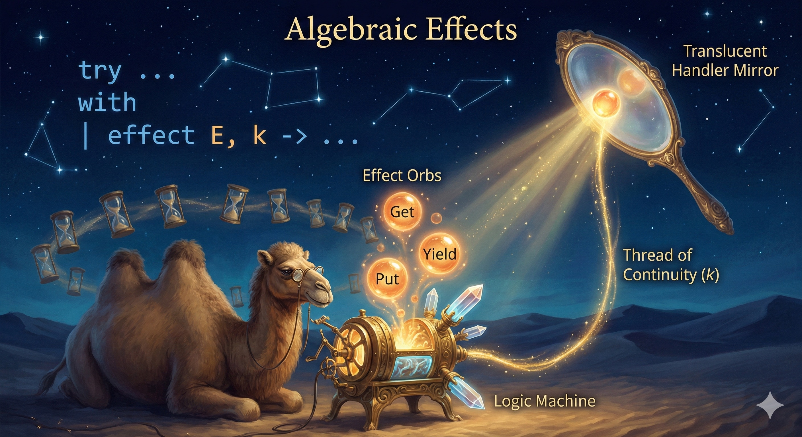

## Chapter 9: Effects, ownership, and cancellation

{.chapter-image}

**Prerequisites:** Chapter 3's continuations, Chapter 5's interfaces, and Chapter 8's
interpreters. **Route:** Part III. The executable project is `projects/effects`;
probability shares `projects/probability` with Chapter 8.

An effect operation transfers control to a handler. The handler receives a
continuation: the suspended rest of the computation. It can resume that
continuation or discontinue it with an exception. Once suspension is possible,
“who owns the continuation?” becomes as important as “what value does it return?”.
We establish that ownership before building a scheduler.

### 9.1 Operations have result types

An extensible GADT describes the type of each operation's result:

```ocaml env=effects
type _ Effect.t += Ask : string Effect.t
let greeting () = "Hello, " ^ Effect.perform Ask
let answer () =
  match greeting () with
  | text -> text
  | effect Ask, k -> Effect.Deep.continue k "reader"
let () = assert (answer () = "Hello, reader")
```

`Ask` returns a string, so its continuation expects a string. By contrast a
`Yield : unit Effect.t` operation expects `()`. A GADT constructor refines its
result index; it is not merely a tag in an untyped message channel. Chapter 11
uses the same idea to index expression syntax by its evaluation result.

The syntax here requires OCaml 5.3 or later. The
[OCaml effect-handler reference](https://ocaml.org/manual/5.3/effects.html)
describes deep handlers, one-shot continuations and discontinuation.
A deep handler remains installed when its continuation resumes, so later
operations can be handled by the same interpretation.

### 9.2 Consume a continuation exactly once

A captured continuation is one-shot. Calling `continue` twice, or calling
`discontinue` after continuing, is an error. An abandoned continuation can retain
resources and skip cleanup that would have run during stack unwinding. A handler
must therefore own it until either a resumption or a discontinuation consumes it.

```ocaml env=ownership
type _ Effect.t += Pause : unit Effect.t
exception Stop
let saved : (unit, unit) Effect.Deep.continuation option ref = ref None
let released = ref 0
let () =
  (match Fun.protect ~finally:(fun () -> incr released)
     (fun () -> Effect.perform Pause) with
   | () -> ()
   | effect Pause, k -> saved := Some k);
  assert (!released = 0);
  let k = Option.get !saved in
  saved := None;  (* Consume the ownership slot before transferring control. *)
  (try Effect.Deep.discontinue k Stop with Stop -> ());
  assert (!released = 1)
```

The resource is released on discontinuation because the exception travels through
the suspended `Fun.protect`. Removing the only reference to `k` without that
step would not express this cleanup policy. In a real resource scope, acquire
before the protected computation, and decide how a cleanup failure interacts
with an earlier exception.

Nesting also matters. The innermost matching handler handles an operation; an
unmatched operation can propagate outward. A task created by one scheduler must
not be awaited or cancelled through another scheduler's queue. Our handles carry
an owner identity to reject that mistake, while nested independent runs work.

### 9.3 Define the scheduling policy first

Our teaching runtime has these explicit rules:

| Event | Policy |
|---|---|
| Spawn | Enqueue a new child; return its handle without running the child |
| Yield | Put the current continuation at the back of the FIFO ready queue |
| Await | Suspend until the target finishes; propagate its result or exception |
| Cancel | Discontinue suspended work with `Cancelled`; never start a new cancelled child |
| Child failure | Stop the run, cancel unfinished tasks, then propagate the first failure |
| Root completion | Cancel unfinished children before returning |
| No runnable tasks with unfinished root | Raise `Deadlock` and release suspended work |
| Nested run | Own a separate queue and reject handles from another run |

Tasks cooperate: a computation that never performs a scheduler operation prevents
others from running. Cancellation exceptions must not be swallowed indefinitely,
and cleanup functions must not suspend. These are program contracts, not facts
proved by the interface. This is concurrency on one domain: tasks interleave.
Parallel execution would run work simultaneously on multiple domains and needs
synchronization policies absent from this runtime.

```ocaml env=runtime
let events = ref []
let worker name () =
  events := (name ^ "1") :: !events;
  Runtime.yield ();
  events := (name ^ "2") :: !events
let () =
  Runtime.run (fun () ->
    let a = Runtime.spawn (worker "A") in
    let b = Runtime.spawn (worker "B") in
    Runtime.await a;
    Runtime.await b);
  assert (List.rev !events = ["A1";"B1";"A2";"B2"])
```

There are no timing assumptions in this test. The trace follows from queue order:
spawning enqueues A and B, awaiting suspends the parent, A yields behind B, and B
yields behind A. The scheduler's driver owns dequeueing; spawning never recursively
runs a child to completion.

### 9.4 The runtime and its ownership invariant

The public interface is in `projects/effects/runtime.mli`. Here is the complete
implementation, so the cancellation paths are reviewable alongside normal resume:

<!-- $MDX file=../projects/effects/runtime.ml -->
```ocaml
open Effect
open Effect.Deep

exception Cancelled
exception Deadlock

type task = {
  owner : int;
  mutable state : state;
  mutable cancelled : bool;
  mutable queued : bool;
  mutable waiters : task list;
}
and state =
  | New of (unit -> unit)
  | Running
  | Paused of suspension
  | Finished of (unit, exn) result
and suspension = { resume : unit -> unit; abort : exn -> unit }

type _ Effect.t +=
  | Spawn : (unit -> unit) -> task Effect.t
  | Yield : unit Effect.t
  | Await : task -> unit Effect.t
  | Cancel : task -> unit Effect.t

let spawn f = perform (Spawn f)
let yield () = perform Yield
let await task = perform (Await task)
let cancel task = perform (Cancel task)
let next_owner = ref 0

let run main =
  incr next_owner;
  let owner = !next_owner in
  let queue = Queue.create () and tasks = ref [] and failure = ref None in
  let enqueue task =
    match task.state with
    | Finished _ | Running -> ()
    | New _ | Paused _ ->
      if not task.queued then (task.queued <- true; Queue.add task queue) in
  let create f =
    let task = {owner; state=New f; cancelled=false; queued=false; waiters=[]} in
    tasks := task :: !tasks; enqueue task; task in
  let finish task result =
    task.state <- Finished result;
    (match result with
     | Error Cancelled | Ok () -> ()
     | Error exn -> if !failure = None then failure := Some exn);
    List.iter enqueue (List.rev task.waiters);
    task.waiters <- [] in
  let rec stop task =
    task.cancelled <- true;
    match task.state with
    | Finished _ -> ()
    | New _ -> finish task (Error Cancelled)
    | Running -> () (* Delivered at the next scheduler operation. *)
    | Paused continuation ->
      task.state <- Running; (* Consume the ownership slot before resuming. *)
      continuation.abort Cancelled
  and start task f =
    match_with f () {
      retc = (fun () -> finish task (Ok ()));
      exnc = (fun exn -> finish task (Error exn));
      effc = (fun (type a) (operation : a Effect.t) ->
        match operation with
        | Yield -> Some (fun (k : (a, unit) continuation) ->
          if task.cancelled then discontinue k Cancelled
          else begin
            task.state <- Paused {
              resume=(fun () -> continue k ());
              abort=(fun exn -> discontinue k exn)};
            enqueue task
          end)
        | Spawn f -> Some (fun (k : (a, unit) continuation) ->
          if task.cancelled then discontinue k Cancelled
          else let child = create f in continue k child)
        | Cancel target -> Some (fun (k : (a, unit) continuation) ->
          if target.owner <> owner then
            discontinue k (Invalid_argument "task belongs to another run")
          else if target == task || task.cancelled then begin
            task.cancelled <- true; discontinue k Cancelled
          end else (stop target; continue k ()))
        | Await target -> Some (fun (k : (a, unit) continuation) ->
          if target.owner <> owner then
            discontinue k (Invalid_argument "task belongs to another run")
          else if task.cancelled then discontinue k Cancelled
          else
            let resume () = match target.state with
              | Finished (Ok ()) -> continue k ()
              | Finished (Error exn) -> discontinue k exn
              | _ -> failwith "scheduler resumed an unfinished await" in
            (match target.state with
             | Finished _ -> resume ()
             | _ ->
               task.state <- Paused {resume; abort=(fun exn -> discontinue k exn)};
               target.waiters <- task :: target.waiters))
        | _ -> None)
    }
  in
  let root = create main in
  let rec drive () =
    match !failure, root.state with
    | Some _, _ | _, Finished _ -> ()
    | None, _ when Queue.is_empty queue -> failure := Some Deadlock
    | None, _ ->
      let task = Queue.take queue in
      task.queued <- false;
      (match task.state with
       | New f -> task.state <- Running; start task f
       | Paused continuation -> task.state <- Running; continuation.resume ()
       | Running | Finished _ -> ());
      drive () in
  (* Scope exit cancels children, including blocked awaiters. *)
  Fun.protect ~finally:(fun () -> List.iter stop !tasks) drive;
  match !failure, root.state with
  | Some exn, _ -> raise exn
  | None, Finished (Ok ()) -> ()
  | None, Finished (Error exn) -> raise exn
  | _ -> raise Deadlock
```

A task is new, running, paused, or finished. Only `Paused` owns a continuation.
Both the driver and `stop` change the state to `Running` **before** invoking its
resumption or abort closure. Thus a stale queue entry cannot consume that same
slot again. A finished task's stale entries do nothing. The `queued` bit prevents
duplicate enqueuing while awaiters are awakened.

An await suspension stores a resume closure that checks the target's final
result. It does not guess that waking means success. A cancelled awaiter can
remain temporarily in its target's waiter list, but enqueuing a finished task
has no effect; scope exit clears the remaining lists while finishing the tasks.

The finalizer owns the entire run's unfinished children. A child that never
started acquired nothing; a paused child is discontinued to unwind its dynamic
resource scopes. If a child failed, its exception is recorded before siblings
are cancelled, preserving that original failure. The tests cover these separate
paths rather than only a happy scheduling trace.

### 9.5 A monadic program over the same operations

Chapter 8 represented a computation as data. We can do that here too:

<!-- $MDX file=../projects/effects/script.ml -->
```ocaml
(* A monadic syntax for the same operations, interpreted by the teaching runtime.
   Bind builds a program; it does not run an action during construction. *)
type 'a t =
  | Return : 'a -> 'a t
  | Bind : 'b t * ('b -> 'a t) -> 'a t
  | Action : (unit -> 'a) -> 'a t
  | Yield : unit t
  | Spawn : unit t -> Runtime.task t
  | Await : Runtime.task -> unit t
  | Cancel : Runtime.task -> unit t
  | Protect : 'a t * (unit -> unit) -> 'a t

let return x = Return x
let ( let* ) m f = Bind (m,f)
let rec interpret : type a. a t -> a = function
  | Return x -> x
  | Bind (m,f) -> let x = interpret m in interpret (f x)
  | Action f -> f ()
  | Yield -> Runtime.yield ()
  | Spawn m -> Runtime.spawn (fun () -> interpret m)
  | Await task -> Runtime.await task
  | Cancel task -> Runtime.cancel task
  | Protect (m, release) -> Fun.protect ~finally:release (fun () -> interpret m)
let run m = Runtime.run (fun () -> interpret m)
```

`Action` delays host work; constructing a `Bind` does not execute it. `Protect`
records a cleanup scope. The interpreter folds the syntax into the direct-style
runtime. This shares the scheduler policy, so it tests equivalence of two program
representations, not independence of two scheduler implementations.

The same test functor in `projects/effects/laws.ml` runs both representations.
It asserts the A/B trace, cleanup after scope exit, explicit repeated cancellation,
no acquisition for a cancelled new child, child-failure propagation and nested
runs. Additional tests reject foreign handles and clean up a deadlocked await.

The explicit syntax makes operations available for inspection and alternative
interpretation. Direct style uses the host stack for continuations and makes
ordinary function calls natural. Either representation still owes an ownership
policy. A `let*` does not by itself make resource use safe, and an effect handler
does not by itself make scheduling structured.

### 9.6 Inference is another interpretation

The probability project exposes typed `Choose`, `Gaussian` and `GObserve`
operations. Its finite reference enumerator only accepts finite choices; a
Gaussian draw cannot be enumerated as a finite support. Likelihood weighting
samples each draw and multiplies likelihoods along that run. The replay filter
records draws and restarts a pure model at the next choice boundary.

On replay, observations already accounted for must not be multiplied again.
When resampling active particles, preserve their **total active mass**, including
when other particles have already finished; resetting every active weight to one
would change their mass relative to finished results. Zero-mass particles must
not be resurrected. Paused continuations are discontinued before restarting.

```ocaml env=inference
let model () =
  let b = Probability.GProb.choose [false; true] in
  Probability.GProb.observe (if b then 0.8 else 0.2);
  ignore (Probability.GProb.choose [0;1]);
  b
let () =
  let exact = Probability.Enumerate.infer model in
  assert (abs_float (List.assoc true exact -. 0.8) < 1e-12)
```

`projects/probability/laws.ml` compares this model, an early-completion model, and
a zero-mass model across enumeration, importance sampling and replay with and
without resampling. Impossible evidence returns an empty result; it is not a
posterior assigning equal probabilities to everything. Supports, weights and
sample counts are validated before interpretation.

Replay has a stricter contract than ordinary effect handling: the model must be
deterministic apart from its handled draws, terminate on each explored trace,
and not catch the private exceptions used to pause or reject it. Arbitrary I/O,
mutation observed across runs, or changed choice support can invalidate replay.
Long traces and very small likelihoods need log-domain or otherwise stabilized
weights; the current short-model float implementation does not solve underflow.
The sensor-fusion executable is an application experiment, not a validated
physical estimator.

### 9.7 Exercises

1. **Practice.** Change the A/B program so the parent yields after spawning only
   A. Predict the trace before running it; explain the queue after each operation.
2. **Proof.** Audit the continuation ownership invariant. List every transition
   out of `Paused` and explain why repeated cancellation cannot resume twice.
3. **Experiment.** Make a child raise after its first yield. Check both the
   propagated exception and the sibling's release count.
4. **Project.** Add a timeout expressed in logical scheduler ticks. Specify which
   side wins when completion and timeout happen at the same tick. Test the policy
   in both program representations without wall-clock sleeps.
5. **Proof / experiment.** Derive the early-completion posterior in the probability
   project. Explain why normalizing only active particles changes its answer.

**Boundary of this project.** There is no OS I/O polling, multicore synchronization,
preemption, priority system or production cancellation protocol here. Adding
those requires new contracts and tests. The complete project demonstrates a small,
explicit scope policy; it is not an application runtime recommendation.
