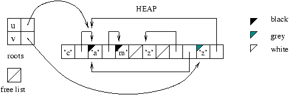
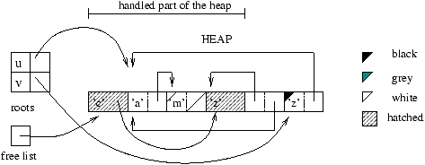

# Lecture 9: Compiler

Compilation. Runtime. Optimization. Parsing.

Andrew W. Appel *‘‘Modern Compiler Implementation in ML''*E. Chailloux, P.
Manoury, B. Pagano *‘‘Developing Applications with OCaml''*Jon D.
Harrop *‘‘OCaml for Scientists''*Francois Pottier, Yann Regis-Gianas ‘‘*Menhir
Reference Manual*''

If you see any error on the slides, let me know!

## 1 OCaml Compilers

* OCaml has two primary compilers: the bytecode compiler `ocamlc` and the 
  native code compiler `ocamlopt`.
  * Natively compiled code runs about 10 times faster than bytecode – 
    depending on program.
* OCaml has an interactive shell called *toplevel* (in other 
  languages, *repl*): `ocaml` which is based on the bytecode compiler.
  * There is a toplevel `ocamlnat` based on the native code compiler but 
    currently not part of the binary distribution.
* There are “third-party” compilers, most notably `js_of_ocaml` which 
  translates OCaml bytecode into JavaScript source.
  * On modern JS virtual machines like V8 the result can be 2-3x faster than 
    on OCaml virtual machine (but can also be slower).
* Stages of compilation:

  <table style="display: inline-table; vertical-align: middle">
  <tbody><tr>
    <td></td>
    <td></td>
  </tr></tbody>
</table>
* Programs:

  <table style="display: inline-table; vertical-align: middle">
  <tbody><tr>
    <td><tt 
  class="verbatim">ocaml</tt></td>
    <td>toplevel loop</td>
  </tr><tr>
    <td><tt 
  class="verbatim">ocamlrun</tt></td>
    <td>bytecode interpreter (VM)</td>
  </tr><tr>
    <td><tt 
  class="verbatim">camlp4</tt></td>
    <td>preprocessor (syntax extensions)</td>
  </tr><tr>
    <td><tt 
  class="verbatim">ocamlc</tt></td>
    <td>bytecode compiler</td>
  </tr><tr>
    <td><tt 
  class="verbatim">ocamlopt</tt></td>
    <td>native code compiler</td>
  </tr><tr>
    <td><tt 
  class="verbatim">ocamlmktop</tt></td>
    <td>new toplevel constructor</td>
  </tr><tr>
    <td><tt 
  class="verbatim">ocamldep</tt></td>
    <td>dependencies between modules</td>
  </tr><tr>
    <td><tt 
  class="verbatim">ocamlbuild</tt></td>
    <td>building projects tool</td>
  </tr><tr>
    <td><tt 
  class="verbatim">ocamlbrowser</tt></td>
    <td>graphical browsing of sources</td>
  </tr></tbody>
</table>
* File extensions:

  <table style="display: inline-table; vertical-align: middle">
  <tbody><tr>
    <td><tt class="verbatim">.ml</tt></td>
    <td>OCaml source file</td>
  </tr><tr>
    <td><tt 
  class="verbatim">.mli</tt></td>
    <td>OCaml interface source file</td>
  </tr><tr>
    <td><tt 
  class="verbatim">.cmi</tt></td>
    <td>compiled interface</td>
  </tr><tr>
    <td><tt 
  class="verbatim">.cmo</tt></td>
    <td>bytecode-compiled file</td>
  </tr><tr>
    <td><tt 
  class="verbatim">.cmx</tt></td>
    <td>native-code-compiled file</td>
  </tr><tr>
    <td><tt 
  class="verbatim">.cma</tt></td>
    <td>bytecode-compiled library (several source 
  files)</td>
  </tr><tr>
    <td><tt 
  class="verbatim">.cmxa</tt></td>
    <td>native-code-compiled library</td>
  </tr><tr>
    <td><tt class="verbatim">.cmt</tt>/<tt 
  class="verbatim">.cmti</tt>/<tt 
  class="verbatim">.annot</tt></td>
    <td>type information for editors</td>
  </tr><tr>
    <td><tt class="verbatim">.c</tt></td>
    <td>C source file</td>
  </tr><tr>
    <td><tt class="verbatim">.o</tt></td>
    <td>C native-code-compiled file</td>
  </tr><tr>
    <td><tt class="verbatim">.a</tt></td>
    <td>C native-code-compiled library</td>
  </tr></tbody>
</table>
* Both compilers commands:

  <table style="display: inline-table; vertical-align: middle">
  <tbody><tr>
    <td><tt class="verbatim">-a</tt></td>
    <td>construct a runtime library </td>
  </tr><tr>
    <td><tt class="verbatim">-c</tt></td>
    <td>compile without linking </td>
  </tr><tr>
    <td><tt class="verbatim">-o</tt></td>
    <td>name_of_executable specify the name of the executable 
  </td>
  </tr><tr>
    <td><tt 
  class="verbatim">-linkall</tt></td>
    <td>link with all libraries used </td>
  </tr><tr>
    <td><tt class="verbatim">-i</tt></td>
    <td>display all compiled global declarations </td>
  </tr><tr>
    <td><tt class="verbatim">-pp</tt></td>
    <td>command uses command as preprocessor </td>
  </tr><tr>
    <td><tt 
  class="verbatim">-unsafe</tt></td>
    <td>turn off index checking for arrays</td>
  </tr><tr>
    <td><tt class="verbatim">-v</tt></td>
    <td>display the version of the compiler </td>
  </tr><tr>
    <td><tt class="verbatim">-w</tt> 
  list</td>
    <td>choose among the list the level of warning message 
  </td>
  </tr><tr>
    <td><tt class="verbatim">-impl</tt> 
  file</td>
    <td>indicate that file is a Caml source (.ml) </td>
  </tr><tr>
    <td><tt class="verbatim">-intf</tt> 
  file</td>
    <td>indicate that file is a Caml interface (.mli) </td>
  </tr><tr>
    <td><tt class="verbatim">-I</tt> 
  directory</td>
    <td>add directory in the list of directories; prefix <tt 
  class="verbatim">+</tt> for
    relative</td>
  </tr><tr>
    <td><tt class="verbatim">-g</tt></td>
    <td>generate debugging information</td>
  </tr></tbody>
</table>
* Warning levels:

  <table style="display: inline-table; vertical-align: middle">
  <tbody><tr>
    <td><tt class="verbatim">A</tt>/<tt 
  class="verbatim">a</tt></td>
    <td>enable/disable all messages</td>
  </tr><tr>
    <td><tt class="verbatim">F</tt>/<tt 
  class="verbatim">f</tt></td>
    <td>partial application in a sequence </td>
  </tr><tr>
    <td><tt class="verbatim">P</tt>/<tt 
  class="verbatim">p</tt></td>
    <td>for incomplete pattern matching</td>
  </tr><tr>
    <td><tt class="verbatim">U</tt>/<tt 
  class="verbatim">u</tt></td>
    <td>for missing cases in pattern matching</td>
  </tr><tr>
    <td><tt class="verbatim">X</tt>/<tt 
  class="verbatim">x</tt></td>
    <td>enable/disable all other messages for hidden 
  object</td>
  </tr><tr>
    <td><tt class="verbatim">M</tt>/<tt 
  class="verbatim">m</tt>, <tt 
  class="verbatim">V</tt>/<tt 
  class="verbatim">v</tt></td>
    <td style="text-align: left">object-oriented related 
  warnings</td>
  </tr></tbody>
</table>
* Native compiler commands:

  <table style="display: inline-table; vertical-align: middle">
  <tbody><tr>
    <td><tt 
  class="verbatim">-compact</tt></td>
    <td>optimize the produced code for space</td>
  </tr><tr>
    <td><tt class="verbatim">-S</tt></td>
    <td>keeps the assembly code in a file</td>
  </tr><tr>
    <td><tt 
  class="verbatim">-inline</tt></td>
    <td>level set the aggressiveness of inlining</td>
  </tr></tbody>
</table>
* Environment variable `OCAMLRUNPARAM`:

  <table style="display: inline-table; vertical-align: middle">
  <tbody><tr>
    <td><tt class="verbatim">b</tt></td>
    <td>print detailed stack backtrace of runtime 
  exceptions</td>
  </tr><tr>
    <td><tt class="verbatim">s</tt>/<tt 
  class="verbatim">h</tt>/<tt 
  class="verbatim">i</tt></td>
    <td>size of the minor heap/major heap/size 
  increment</td>
  </tr><tr>
    <td><tt class="verbatim">o</tt>/<tt 
  class="verbatim">O</tt></td>
    <td>major GC speed setting / heap compaction trigger 
  setting</td>
  </tr></tbody>
</table>

  Typical use, running `prog`: `export OCAMLRUNPARAM='b'; ./prog`

  To have stack backtraces, compile with option `-g`.
* Toplevel loop directives:

  <table style="display: inline-table; vertical-align: middle">
  <tbody><tr>
    <td style="text-align: left"><tt 
  class="verbatim">#quit;;</tt></td>
    <td>exit</td>
  </tr><tr>
    <td><tt class="verbatim">#directory 
  &quot;dir&quot;;;</tt></td>
    <td>add <tt class="verbatim">dir</tt> to the 
  &ldquo;search path&rdquo;; <tt class="verbatim">+</tt>
    for rel.</td>
  </tr><tr>
    <td><tt class="verbatim">#cd 
  &quot;dir-name&quot;;;</tt></td>
    <td>change directory</td>
  </tr><tr>
    <td><tt class="verbatim">#load 
  &quot;file-name&quot;;;</tt></td>
    <td>load a bytecode <tt 
  class="verbatim">.cmo</tt>/<tt 
  class="verbatim">.cma</tt> file</td>
  </tr><tr>
    <td><tt class="verbatim">#load_rec 
  &quot;file-name&quot;;;</tt></td>
    <td>load the files <tt 
  class="verbatim">file-name</tt> depends on too</td>
  </tr><tr>
    <td><tt class="verbatim">#use 
  &quot;file-name&quot;;;</tt></td>
    <td>read, compile and execute source phrases</td>
  </tr><tr>
    <td><tt class="verbatim">#instal_printer 
  pr_nm;;</tt></td>
    <td>register <tt class="verbatim">pr_nm</tt> to 
  print values of a type</td>
  </tr><tr>
    <td><tt class="verbatim">#print_depth 
  num;;</tt></td>
    <td>how many nestings to print</td>
  </tr><tr>
    <td><tt class="verbatim">#print_length 
  num;;</tt></td>
    <td>how many nodes to print &ndash; the rest <tt 
  class="verbatim">&hellip;</tt></td>
  </tr><tr>
    <td><tt class="verbatim">#trace 
  func;;</tt>/<tt 
  class="verbatim">#untrace</tt></td>
    <td>trace calls to <tt 
  class="verbatim">func</tt>/stop tracing</td>
  </tr></tbody>
</table>

### 1.1 Compiling multiple-file projects

* Traditionally the file containing a module would have a lowercase name, 
  although the module name is always uppercase.
  * Some people think it is more elegant to use uppercase for file names, to 
    reflect module names, i.e. for MyModule, use `MyModule.ml` rather than 
    `myModule.ml`.
* We have a project with main module `main.ml` and helper modules `sub1.ml` 
  and `sub2.ml` with corresponding interfaces.
* Native compilation by hand:

  `…:…/Lec9$ ocamlopt sub1.mli…:…/Lec9$ ocamlopt 
  sub2.mli…:…/Lec9$ ocamlopt -c sub1.ml…:…/Lec9$ 
  ocamlopt -c sub2.ml…:…/Lec9$ ocamlopt -c 
  main.ml…:…/Lec9$ ocamlopt unix.cmxa sub1.cmx sub2.cmx 
  main.cmx -o prog…:…/Lec9$ ./prog`
* Native compilation using `make`:

```ocaml
PROG := prog
LIBS := unix
SOURCES := sub1.ml sub2.ml main.ml
INTERFACES := $(wildcard *.mli)
OBJS := $(patsubst %.ml,%.cmx,$(SOURCES))
LIBS := $(patsubst %,%.cmxa,$(LIBS))
$(PROG): $(OBJS)
ocamlopt -o $@ $(LIBS) $(OBJS)
clean: rm -rf $(PROG) *.o *.cmx *.cmi *~
%.cmx: %.ml
ocamlopt -c $*.ml
%.cmi: %.mli
ocamlopt -c $*.mli
depend: $(SOURCES) $(INTERFACES)
ocamldep -native $(SOURCES) $(INTERFACES)
```
  * First use command: `touch .depend; make depend; make`
  * Later just `make`, after creating new source files `make depend`
* Using `ocamlbuild`
  * files with compiled code are created in `_build` directory
  * Command: `ocamlbuild -libs unix main.native`
  * Resulting program is called `main.native` (in directory `_build`, but with 
    a link in the project directory)
  * More arguments passed after comma, e.g.

    `ocamlbuild -libs nums,unix,graphics main.native`
  * Passing parameters to the compiler with `-cflags`, e.g.:

    `ocamlbuild -cflags -I,+lablgtk,-rectypes hello.native`
  * Adding a -- at the end (followed with command-line arguments for the 
    program) will compile and run the program:

    `ocamlbuild -libs unix main.native --`

### 1.2 Editors

* Emacs
  * `ocaml-mode` from the standard distribution
  * alternative `tuareg-mode` 
    [https://forge.ocamlcore.org/projects/tuareg/](https://forge.ocamlcore.org/projects/tuareg/)
    * cheat-sheet: 
      [http://www.ocamlpro.com/files/tuareg-mode.pdf](http://www.ocamlpro.com/files/tuareg-mode.pdf)
  * `camldebug` intergration with debugger
  * type feedback with `C-c C-t` key shortcut, needs `.annot` files
* Vim
  * OMLet plugin 
    [http://www.lix.polytechnique.fr/~dbaelde/productions/omlet.html](http://www.lix.polytechnique.fr/~dbaelde/productions/omlet.html)
  * For type lookup: either 
    [https://github.com/avsm/ocaml-annot](https://github.com/avsm/ocaml-annot)
    * or 
      [http://www.vim.org/scripts/script.php?script\_id=2025](http://www.vim.org/scripts/script.php?script_id=2025)
    * also? 
      [http://www.vim.org/scripts/script.php?script\_id=1197](http://www.vim.org/scripts/script.php?script_id=1197)
* Eclipse
  * *OCaml Development Tools* 
    [http://ocamldt.free.fr/](http://ocamldt.free.fr/)
  * an old plugin OcaIDE 
    [http://www.algo-prog.info/ocaide/](http://www.algo-prog.info/ocaide/)
* TypeRex [http://www.typerex.org/](http://www.typerex.org/)
  * currently mostly as `typerex-mode` for Emacs but integration with other 
    editors will become better
  * Auto-completion of identifiers (experimental)
  * Browsing of identifiers: show type and comment, go to definition
  * local and whole-program refactoring: renaming identifiers and compilation 
    units, open elimination
* Indentation tool `ocp-ident` 
  [https://github.com/OCamlPro/ocp-indent](https://github.com/OCamlPro/ocp-indent)
  * Installation instructions for Emacs and Vim
  * Can be used with other editors.
* Some dedicated editors
  * OCamlEditor 
    [http://ocamleditor.forge.ocamlcore.org/](http://ocamleditor.forge.ocamlcore.org/)
  * `ocamlbrowser` inspects libraries and programs
    * browsing contents of modules
    * search by name and by type
    * basic editing, with syntax highlighting
  * Cameleon [http://home.gna.org/cameleon/](http://home.gna.org/cameleon/) 
    (older)
  * Camelia [http://camelia.sourceforge.net/](http://camelia.sourceforge.net/) 
    (even older)

## 2 Imperative features in OCaml

OCaml is **not** a *purely functional* language, it has built-in:

* Mutable arrays.

  let a = Array.make 5 0 ina.(3) <- 7; a.(2), a.(3)
  * Hashtables in the standard distribution (based on arrays).

    let h = Hashtbl.create 11 inTakes initial size of the array.Hashtbl.add h 
    "Alpha" 5; Hashtbl.find h "Alpha"
* Mutable strings. (Historical reasons…)

  let a = String.make 4 'a' ina.[2] <- 'b'; a.[2], a.[3]
  * Extensible mutable strings Buffer.t in standard distribution.
* Loops:
  * for i = a to/downto b do body done
  * while condition do body done
* Mutable record fields, for example:

  type 'a ref = { mutable contents : 'a }Single, mutable field.

  A record can have both mutable and immutable fields.
  * Modifying the field: record.field <- new\_value
  * The ref type has operations:

    let (:=) r v = r.contents <- vlet (!) r = r.contents
* Exceptions, defined by exception, raised by raise and caught by try-with 
  clauses.
  * An exception is a variant of type exception, which is the only open 
    algebraic datatype – new variants can be added to it.
* Input-output functions have no “type safeguards” (no *IO monad*).

Using **global** state e.g. reference cells makes code *non re-entrant*: 
finish one task before starting another – any form of concurrency is excluded.

### 2.1 Parsing command-line arguments

To go beyond Sys.argv array, see Arg 
module:[http://caml.inria.fr/pub/docs/manual-ocaml/libref/Arg.html](http://caml.inria.fr/pub/docs/manual-ocaml/libref/Arg.html)

type config = { Example: configuring a *Mine Sweeper* game.   nbcols  : int ; 
nbrows : int ; nbmines : int }let defaultconfig = { nbcols=10; nbrows=10; 
nbmines=15 }let setnbcols cf n = cf := {!cf with nbcols = n}let setnbrows cf n 
= cf := {!cf with nbrows = n}let setnbmines cf n = cf := {!cf with nbmines = 
n}let readargs() =  let cf = ref defaultconfig inState of configuration  let 
speclist = will be updated by given functions.   [("-col", Arg.Int (setnbcols 
cf), "number of columns");    ("-lin", Arg.Int (setnbrows cf), "number of 
lines");    ("-min", Arg.Int (setnbmines cf), "number of mines")] in  let 
usagemsg =    "usage : minesweep [-col n] [-lin n] [-min n]" in   Arg.parse 
speclist (fun s -> ()) usagemsg; !cf

## 3 OCaml Garbage Collection

### 3.1 Representation of values

* Pointers always end with `00` in binary (addresses are in number of bytes).
* Integers are represented by shifting them 1 bit, setting the last bit to 
  `1`.
* Constant constructors (i.e. variants without parameters) like `None`, [] and 
  (), and other integer-like types (`char`, `bool`) are represented in the 
  same way as integers.
* Pointers are always to OCaml *blocks*. Variants with parameters, strings and 
  OCaml arrays are stored as blocks.
* A block starts with a header, followed by an array of values of size 1 word: 
  either integer-like, or pointers.
* The header stores the size of the block, the 2-bit color used for garbage 
  collection, and 8-bit *tag* – which variant it is.
  * Therefore there can be at most about 240 variants with parameters in a 
    variant type (some tag numbers are reserved).
  * *Polymorphic variants* are a different story.

### 3.2 Generational Garbage Collection

* OCaml has two heaps to store blocks: a small, continuous *minor heap* and a 
  growing-as-necessary *major heap*.
* Allocation simply moves the minor heap pointer (aka. the *young pointer*) 
  and returns the pointed address.
  * Allocation of very large blocks uses the major heap instead.
* When the minor heap runs out of space, it triggers the *minor (garbage) 
  collection*, which uses the *Stop & Copy* algorithm.
* Together with the minor collection, a slice of *major (garbage) collection* 
  is performed to cleanup the major heap a bit.
  * The major heap is not cleaned all at once because it might stop the main 
    program (i.e. our application) for too long.
  * Major collection uses the *Mark & Sweep* algorithm.
* Great if most minor heap blocks are already not needed when collection 
  starts – garbage does **not** slow down collection.

### 3.3 Stop & Copy GC

* Minor collection starts from a set of *roots* – young blocks that definitely 
  are not garbage.
* Besides the root set, OCaml also maintains the *remembered set* of minor 
  heap blocks pointed at from the major heap.
  * Most mutations must check whether they assign a minor heap block to a 
    major heap block field. This is called *write barrier*.
  * Immutable blocks cannot contain pointers from major to minor heap.
    * Unless they are lazy blocks.
* Collection follows pointers in the root set and remembered set to find other 
  used blocks.
* Every found block is copied to the major heap.
* At the end of collection, the young pointer is reset so that the minor heap 
  is empty again.

### 3.4 Mark & Sweep GC

* Major collection starts from a separate root set – old blocks that 
  definitely are not garbage.
* Major garbage collection consists of a *mark* phase which colors blocks that 
  are still in use and a *sweep* phase that searches for stretches of unused 
  memory.
  * Slices of the mark phase are performed by-after each minor collection.
  * Unused memory is stored in a *free list*.
* The “proper” major collection is started when a minor collection consumes 
  the remaining free list. The mark phase is finished and sweep phase 
  performed.
* Colors:
  * **gray**: marked cells whose descendents are not yet marked;
  * **black**: marked cells whose descendents are also marked;
  * **hatched**: free list element;
  * **white**: elements previously being in use.
* `# let u = let l = ['c'; 'a'; 'm'] in List.tl l ;;``val u : char list = 
  ['a'; 'm']``# let v = let r = ( ['z'] , u ) in match r with p -> (fst p) 
  @ (snd p) ;;``val v : char list = ['z'; 'a'; 'm']`
* 
* 

## 4 Stack Frames and Closures

* The nesting of procedure calls is reflected in the *stack* of procedure 
  data.
* The stretch of stack dedicated to a single function is *stack frame* 
  aka. *activation record*.
* *Stack pointer* is where we create new frames, stored in a special register.
* *Frame pointer* allows to refer to function data by offset – data known 
  early in compilation is close to the frame pointer.
* Local variables are stored in the stack frame or in registers – some 
  registers need to be saved prior to function call (*caller-save*) or at 
  entry to a function (*callee-save*). OCaml avoids callee-save registers.
* Up to 4-6 arguments can be passed in registers, remaining ones on stack.
  * Note that *x86* architecture has a small number of registers.
* Using registers, tail call optimization and function inlining can eliminate 
  the use of stack entirely. OCaml compiler can also use stack more 
  efficiently than by creating full stack frames as depicted below.
* <table style="display: inline-table; vertical-align: middle">
  <tbody><tr>
    <td></td>
    <td></td>
  </tr></tbody>
</table>
* *Static links* point to stack frames of parent functions, so we can access 
  stack-based data, e.g. arguments of a main function from inside `aux`.
* A ***closure*** represents a function: it is a block that contains address 
  of the function: either another closure or a machine-code pointer, and a way 
  to access non-local variables of the function.
  * For partially applied functions, it contains the values of arguments and 
    the address of the original function.
* *Escaping variables* are the variables of a function `f` – arguments and 
  local definitions – which are accessed from a nested function which is part 
  of the returned value of `f` (or assigned to a mutable field).
  * Escaping variables must be either part of the closures representing the 
    nested functions, or of a closure representing the function `f` – in the 
    latter case, the nested functions must also be represented by closures 
    that have a link to the closure of `f`.

### 4.1 Tail Recursion

* A function call `f x` within the body of another function `g` is in *tail 
  position* if, roughly “calling `f` is the last thing that `g` will do before 
  returning”.
* Call inside try … with clause is not in tail position!
  * For efficient exceptions, OCaml stores *traps* for try-with on the stack 
    with topmost trap in a register, after raise unwinding directly to the 
    trap.
* The steps for a tail call are:
  1. Move actual parameters into argument registers (if they aren't already 
     there).
  1. Restore callee-save registers (if needed).
  1. Pop the stack frame of the calling function (if it has one).
  1. Jump to the callee.
* Bytecode always throws `Stack_overflow` exception on too deep recursion, 
  native code will sometimes cause *segmentation fault*!
* List`.map` from the standard distribution is **not** tail-recursive.

### 4.2 Generated assembly

* Let us look at examples from 
  [http://ocaml.org/tutorials/performance\_and\_profiling.html](http://ocaml.org/tutorials/performance_and_profiling.html)

## 5 Profiling and Optimization

* Steps of optimizing a program:
  1. Profile the program to find bottlenecks: where the time is spent.
  1. If possible, modify the algorithm used by the bottleneck to an algorithm 
     with better asymptotic complexity.
  1. If possible, modify the bottleneck algorithm to access data less 
     randomly, to increase *cache locality*.
     * Additionally, *realtime* systems may require avoiding use of huge 
       arrays, traversed by the garbage collector in one go.
  1. Experiment with various implementations of data structures used (related 
     to step 3).
  1. Avoid *boxing* and polymorphic functions. Especially for numerical 
     processing. (OCaml specific.)
  1. *Deforestation*.
  1. *Defunctorization*.

### 5.1 Profiling

* We cover native code profiling because it is more useful.
  * It relies on the “Unix” profiling program `gprof`.
* First we need to compile the sources in profiling mode: `ocamlopt -p` 
  …
  * or using `ocamlbuild` when program source is in `prog.ml`:

    `ocamlbuild prog.p.native --`
* The execution of program `./prog` produces a file `gmon.out`
* We call `gprof prog > profile.txt`
  * or when we used `ocamlbuild` as above:

    `gprof prog.p.native > profile.txt`
  * This redirects profiling analysis to `profile.txt` file.
* The result `profile.txt` has three parts:
  1. List of functions in the program in descending order of the time which 
     was spent within the body of the function, excluding time spent in the 
     bodies of any other functions.
  1. A hierarchical representation of the time taken by each function, and the 
     total time spent in it, including time spent in functions it called.
  1. A bibliography of function references.
* It contains C/assembly function names like `camlList__assoc_1169`:
  * Prefix `caml` means function comes from OCaml source.
  * `List__` means it belongs to a List module.
  * `assoc` is the name of the function in source.
  * Postfix `_1169` is used to avoid name clashes, as in OCaml different 
    functions often have the same names.
* Example: computing words histogram for a large file, `Optim0.ml`.

let readwords file =Imperative programming example.  let input = openin file 
in  let words = ref [] and more = ref true in  tryLecture 6 `read_lines` 
function would stack-overflow    while !more dobecause of the try-with clause. 
     Scanf.fscanf input "%[a-zA-Z0-9']%[a-zA-Z0-9']"        (fun b x -> 
words := x :: !words; more := x <> "")    done;    List.rev (List.tl 
!words)  with Endoffile -> List.rev !wordslet empty () = []let increment h 
w =Inefficient map update.  try    let c = List.assoc w h in    (w, c+1) :: 
List.removeassoc w h  with Notfound -> (w, 1)::hlet iterate f h =  
List.iter (fun (k,v)->f k v) hlet histogram words =  List.foldleft 
increment (empty ()) wordslet  =  let words = readwords "./shakespeare.xml" in 
 let words = List.revmap String.lowercase words in  let h = histogram words in 
 let output = openout "histogram.txt" in  iterate (Printf.fprintf output "%s: 
%dn") h;  closeout output

* Now we look at the profiling analysis, first part begins with:

```
  %   cumulative   self              self     total
 time   seconds   seconds    calls   s/call   s/call  name
 37.88      8.54     8.54 306656698    0.00     0.00  compare_val
 19.97     13.04     4.50   273169     0.00     0.00  camlList__assoc_1169
  9.17     15.10     2.07 633527269    0.00     0.00  caml_page_table_lookup
  8.72     17.07     1.97   260756    0.00  0.00 camlList__remove_assoc_1189
  7.10     18.67     1.60 612779467    0.00     0.00  caml_string_length
  4.97     19.79     1.12 306656692     0.00    0.00  caml_compare
  2.84     20.43     0.64                             caml_c_call
  1.53     20.77     0.35    14417     0.00     0.00  caml_page_table_modify
  1.07     21.01     0.24     1115     0.00     0.00  sweep_slice
  0.89     21.21     0.20      484     0.00     0.00  mark_slice
```

* List.assoc and List.removeassoc high in the ranking suggests to us that 
  `increment` could be the bottleneck.
  * They both use comparison which could explain why `compare_val` consumes 
    the most of time.
* Next we look at the interesting pieces of the second part: data about the 
  `increment` function.
  * Each block, separated by ------ lines, describes the function whose line 
    starts with an index in brackets.
  * The functions that called it are above, the functions it calls below.

```ocaml
index % time    self  children    called     name
-----------------------------------------------
                0.00    6.47  273169/273169  camlList__fold_left_1078 [7]
[8]     28.7    0.00    6.47  273169         camlOptim0__increment_1038 [8]
                4.50    0.00  273169/273169  camlList__assoc_1169 [9]
               1.97    0.00  260756/260756  camlList__remove_assoc_1189 [11]
```

* As expected, `increment` is only called by List.fold\_left. But it seems to 
  account for only 29% of time. It is because `compare` is not analysed 
  correctly, thus not included in time for `increment`:

```
-----------------------------------------------
                1.12   12.13 306656692/306656692     caml_c_call [1]
[2]     58.8    1.12   12.13 306656692         caml_compare [2]
                8.54    3.60 306656692/306656698     compare_val [3]
```

### 5.2 Algorithmic optimizations

* (All times measured with profiling turned on.)
* `Optim0.ml` asymptotic time complexity: $\mathcal{O} (n^2)$, time: 22.53s.
  * Garbage collection takes 6% of time.
    * So little because data access wastes a lot of time.
* Optimize the data structure, keep the algorithm.

  let empty () = Hashtbl.create 511let increment h w =  try    let c = 
  Hashtbl.find h w in    Hashtbl.replace h w (c+1); h  with Notfound -> 
  Hashtbl.add h w 1; hlet iterate f h = Hashtbl.iter f h

  `Optim1.ml` asymptotic time complexity: $\mathcal{O} (n)$, time: 0.63s.
  * Garbage collection takes 17% of time.
* Optimize the algorithm, keep the data structure.

  let histogram words =  let words = List.sort String.compare words in  let 
  k,c,h = List.foldleft    (fun (k,c,h) w ->      if k = w then k, c+1, h 
  else w, 1, ((k,c)::h))    ("", 0, []) words in  (k,c)::h

  `Optim2.ml` asymptotic time complexity: $\mathcal{O} (n \log n)$, time: 1s.
  * Garbage collection takes 40% of time.
* Optimizing for cache efficiency is more advanced, we will not attempt it.
* With algorithmic optimizations we should be concerned with **asymptotic 
  complexity** in terms of the $\mathcal{O} (\cdot)$ notation, but we will not 
  pursue complexity analysis in the remainder of the lecture.

### 5.3 Low-level optimizations

* Optimizations below have been made *for educational purposes only*.
* Avoid polymorphism in generic comparison function (=).

  let rec assoc x = function    [] -> raise Notfound  | (a,b)::l -> if 
  String.compare a x = 0 then b else assoc x llet rec removeassoc x = function 
   | [] -> []  | (a, b as pair) :: l ->      if String.compare a x = 0 
  then l else pair :: removeassoc x l

  `Optim3.ml` (based on `Optim0.ml`) time: 19s.
  * Despite implementation-wise the code is the same, as String.compare = 
    Pervasives.compare inside module String, and List.`assoc` is like above 
    but uses Pervasives.compare!
  * We removed polymorphism, no longer `caml_compare_val` function.
  * Usually, adding type annotations would be enough. (Useful especially for 
    numeric types int, float.)
* **Deforestation** means removing intermediate data structures.

  let readtohistogram file =  let input = openin file in  let h = empty () and 
  more = ref true in  try    while !more do      Scanf.fscanf input 
  "%[a-zA-Z0-9']%[a-zA-Z0-9']"        (fun b w ->          let w = 
  String.lowercase w in          increment h w; more := w <> "")    
  done; h  with Endoffile -> h

  `Optim4.ml` (based on `Optim1.ml`) time: 0.51s.
  * Garbage collection takes 8% of time.
    * So little because we have eliminated garbage.
* **Defunctorization** means computing functor applications by hand.
  * There was a tool `ocamldefun` but it is out of date.
  * The slight speedup comes from the fact that functor arguments are 
    implemented as records of functions.

### 5.4 Comparison of data structure implementations

* We perform a rough comparison of association lists, tree-based maps and 
  hashtables. Sets would give the same results.
* We always create hashtables with initial size 511.
* $10^7$ operations of: adding an association (creation), finding a key that 
  is in the map, finding a key out of a small number of keys not in the map.
* First row gives sizes of maps. Time in seconds, to two significant digits.

<table style="display: inline-table; vertical-align: middle">
  <tbody><tr>
    <td>create:</td>
    <td></td>
    <td></td>
    <td></td>
    <td></td>
    <td></td>
    <td></td>
    <td></td>
    <td></td>
    <td></td>
    <td></td>
  </tr><tr>
    <td>assoc list</td>
    <td>0.25</td>
    <td>0.25</td>
    <td>0.18</td>
    <td>0.19</td>
    <td>0.17</td>
    <td>0.22</td>
    <td>0.19</td>
    <td>0.19</td>
    <td>0.19</td>
    <td></td>
  </tr><tr>
    <td>tree map</td>
    <td>0.48</td>
    <td>0.81</td>
    <td>0.82</td>
    <td>1.2</td>
    <td>1.6</td>
    <td>2.3</td>
    <td>2.7</td>
    <td>3.6</td>
    <td>4.1</td>
    <td>5.1</td>
  </tr><tr>
    <td style="text-align: left">hashtable</td>
    <td>27</td>
    <td>9.1</td>
    <td>5.5</td>
    <td>4</td>
    <td>2.9</td>
    <td>2.4</td>
    <td>2.1</td>
    <td>1.9</td>
    <td>1.8</td>
    <td>3.7</td>
  </tr></tbody>
</table>

<table style="display: inline-table; vertical-align: middle">
  <tbody><tr>
    <td>create:</td>
    <td></td>
    <td></td>
    <td></td>
    <td></td>
    <td></td>
    <td></td>
    <td></td>
    <td></td>
    <td></td>
    <td></td>
    <td></td>
    <td></td>
  </tr><tr>
    <td>tree map</td>
    <td>6.5</td>
    <td>8</td>
    <td>9.8</td>
    <td>15</td>
    <td>19</td>
    <td>26</td>
    <td>34</td>
    <td>41</td>
    <td>51</td>
    <td>67</td>
    <td>80</td>
    <td>130</td>
  </tr><tr>
    <td style="text-align: left">hashtable</td>
    <td>4.8</td>
    <td>5.6</td>
    <td>6.4</td>
    <td>8.4</td>
    <td>12</td>
    <td>15</td>
    <td>19</td>
    <td>20</td>
    <td>22</td>
    <td>24</td>
    <td>23</td>
    <td>33</td>
  </tr></tbody>
</table>

<table style="display: inline-table; vertical-align: middle">
  <tbody><tr>
    <td>found:</td>
    <td></td>
    <td></td>
    <td></td>
    <td></td>
    <td></td>
    <td></td>
    <td></td>
    <td></td>
    <td></td>
    <td></td>
  </tr><tr>
    <td>assoc list</td>
    <td>1.1</td>
    <td>1.5</td>
    <td>2.5</td>
    <td>4.2</td>
    <td>8.1</td>
    <td>17</td>
    <td>30</td>
    <td>60</td>
    <td>120</td>
    <td></td>
  </tr><tr>
    <td>tree map</td>
    <td>1</td>
    <td>1.1</td>
    <td>1.3</td>
    <td>1.5</td>
    <td>1.9</td>
    <td>2.1</td>
    <td>2.5</td>
    <td>2.8</td>
    <td>3.1</td>
    <td>3.6</td>
  </tr><tr>
    <td style="text-align: left">hashtable</td>
    <td>1.4</td>
    <td>1.5</td>
    <td>1.4</td>
    <td>1.4</td>
    <td>1.5</td>
    <td>1.5</td>
    <td>1.6</td>
    <td>1.6</td>
    <td>1.8</td>
    <td>1.8</td>
  </tr></tbody>
</table>

<table style="display: inline-table; vertical-align: middle">
  <tbody><tr>
    <td>found:</td>
    <td></td>
    <td></td>
    <td></td>
    <td></td>
    <td></td>
    <td></td>
    <td></td>
    <td></td>
    <td></td>
    <td></td>
    <td></td>
    <td></td>
  </tr><tr>
    <td>tree map</td>
    <td>4.3</td>
    <td>5.2</td>
    <td>6</td>
    <td>7.6</td>
    <td>9.4</td>
    <td>12</td>
    <td>15</td>
    <td>17</td>
    <td>19</td>
    <td>24</td>
    <td>28</td>
    <td>32</td>
  </tr><tr>
    <td style="text-align: left">hashtable</td>
    <td>1.8</td>
    <td>2</td>
    <td>2.5</td>
    <td>3.1</td>
    <td>4</td>
    <td>5.1</td>
    <td>5.9</td>
    <td>6.4</td>
    <td>6.8</td>
    <td>7.6</td>
    <td>6.7</td>
    <td>7.5</td>
  </tr></tbody>
</table>

<table style="display: inline-table; vertical-align: middle">
  <tbody><tr>
    <td>not found:</td>
    <td></td>
    <td></td>
    <td></td>
    <td></td>
    <td></td>
    <td></td>
    <td></td>
    <td></td>
    <td></td>
    <td></td>
  </tr><tr>
    <td>assoc list</td>
    <td>1.8</td>
    <td>2.6</td>
    <td>4.6</td>
    <td>8</td>
    <td>16</td>
    <td>32</td>
    <td>60</td>
    <td>120</td>
    <td>240</td>
    <td></td>
  </tr><tr>
    <td>tree map</td>
    <td>1.5</td>
    <td>1.5</td>
    <td>1.8</td>
    <td>2.1</td>
    <td>2.4</td>
    <td>2.7</td>
    <td>3</td>
    <td>3.2</td>
    <td>3.5</td>
    <td>3.8</td>
  </tr><tr>
    <td style="text-align: left">hashtable</td>
    <td>1.4</td>
    <td>1.4</td>
    <td>1.5</td>
    <td>1.5</td>
    <td>1.6</td>
    <td>1.5</td>
    <td>1.7</td>
    <td>1.9</td>
    <td>2</td>
    <td>2.1</td>
  </tr></tbody>
</table>

<table style="display: inline-table; vertical-align: middle">
  <tbody><tr>
    <td>not found:</td>
    <td></td>
    <td></td>
    <td></td>
    <td></td>
    <td></td>
    <td></td>
    <td></td>
    <td></td>
    <td></td>
    <td></td>
    <td></td>
    <td></td>
  </tr><tr>
    <td>tree map</td>
    <td>4.2</td>
    <td>4.3</td>
    <td>4.7</td>
    <td>4.9</td>
    <td>5.3</td>
    <td>5.5</td>
    <td>6.1</td>
    <td>6.3</td>
    <td>6.6</td>
    <td>7.2</td>
    <td>7.5</td>
    <td>7.3</td>
  </tr><tr>
    <td style="text-align: left">hashtable</td>
    <td>1.8</td>
    <td>1.9</td>
    <td>2</td>
    <td>1.9</td>
    <td>1.9</td>
    <td>1.9</td>
    <td>2</td>
    <td>2</td>
    <td>2.2</td>
    <td>2</td>
    <td>2</td>
    <td>1.9</td>
  </tr></tbody>
</table>

* Using lists makes sense for up to about 15 elements.
* Unfortunately OCaml and Haskell do not encourage the use of efficient maps, 
  the way Scala and Python have built-in syntax for them.

## 6 Parsing: ocamllex and Menhir

* *Parsing* means transforming text, i.e. a string of characters, into a data 
  structure that is well fitted for a given task, or generally makes 
  information in the text more explicit.
* Parsing is usually done in stages:
  1. *Lexing* or *tokenizing*, dividing the text into smallest meaningful 
     pieces called *lexemes* or *tokens*,
  1. composing bigger structures out of lexemes/tokens (and smaller 
     structures) according to a *grammar*.
     * Alternatively to building such hierarchical structure, sometimes we 
       build relational structure over the tokens, e.g. *dependency grammars*.
* We will use `ocamllex` for lexing, whose rules are like pattern matching 
  functions, but with patterns being *regular expressions*.
* We will either consume the results from lexer directly, or use *Menhir* for 
  parsing, a successor of `ocamlyacc`, belonging to the *yacc*/*bison* family 
  of parsers.

### 6.1 Lexing with *ocamllex*

* The format of lexer definitions is as follows: file with extension `.mll`

  { header }let ident1 = regexp …rule `entrypoint1` [`arg1`… 
  `argN`] =  parse regexp { action1 }| …| regexp { actionN }and 
  entrypointN [arg1? argN] =  parse …and …{ trailer }
  * Comments are delimited by (* and *), as in OCaml.
  * The parse keyword can be replaced by the shortest keyword.
  * ”Header”, “trailer”, “action1”, … “actionN” are arbitrary OCaml 
    code.
  * There can be multiple let-clauses and rule-clauses.
* Let-clauses are shorthands for regular expressions.
* Each rule-clause `entrypoint` defines function(s) that as the last argument 
  (after `arg1`… `argN` if `N`>0) takes argument `lexbuf` of type 
  Lexing.lexbuf.
  * `lexbuf` is also visible in actions, just as a regular argument.
  * `entrypoint1`… `entrypointN` can be mutually recursive if we need to 
    read more before we can return output.
  * It seems rule keyword can be used only once.
* We can use `lexbuf` in actions:
  * Lexing.lexeme lexbuf – Return the matched string.
  * Lexing.lexemechar lexbuf n – Return the nth character in the matched 
    string. The first character corresponds to n = 0.
  * Lexing.lexemestart/lexemeend lexbuf – Return the absolute position in the 
    input text of the beginning/end of the matched string (i.e. the offset of 
    the first character of the matched string). The first character read from 
    the input text has offset 0.
* The parser will call an `entrypoint` when it needs another lexeme/token.
* The syntax of **regular expressions**
  * 'c' – match the character 'c'
  * `_` – match a **single** character
  * `eof` – match end of lexer input
  * "string" – match the corresponding sequence of characters
  * [character set] – match the character set, characters 'c' and ranges of 
    characters 'c'-'d' separated by space
  * [^character set] – match characters outside the character set
  * [character set 1] # [character set 2] – match the difference, i.e. only 
    characters in set 1 that are not in set 2
  * regexp* – (repetition) match the concatenation of zero or more strings 
    that match regexp
  * regexp+ – (strict repetition) match the concatenation of one or more 
    strings that match regexp
  * regexp? – (option) match the empty string, or a string matching regexp.
  * regexp1 | regexp2 – (alternative) match any string that matches regexp1 or 
    regexp2
  * regexp1 regexp2 – (concatenation) match the concatenation of two strings, 
    the first matching regexp1, the second matching regexp2.
  * ( regexp ) – match the same strings as regexp
  * `ident` – reference the regular expression bound to ident by an earlier 
    let `ident` = regexp definition
  * regexp as `ident` – bind the substring matched by regexp to identifier 
    `ident`.

  The precedences are: # highest, followed by *, +, ?, concatenation, |, as.
* The type of as `ident` variables can be string, char, string option or char 
  option
  * char means obviously a single character pattern
  * option means situations like (regexp as `ident`)? or regexp1|(regexp2 as 
    `ident`)
  * The variables can repeat in the pattern (**unlike** in normal paterns) – 
    meaning both regexpes match the same substrings.
* `ocamllex Lexer.mll` produces the lexer code in `Lexer.ml`
  * `ocamlbuild` will call `ocamllex` and `ocamlyacc`/`menhir` if needed
* Unfortunately if the lexer patterns are big we get an error:

  *transition table overflow, automaton is too big*

#### 6.1.1 Example: Finding email addresses

* We mine a text file for email addresses, that could have been obfuscated to 
  hinder our job…
* To compile and run `Emails.mll`, processing a file `email_corpus.xml`:

  `ocamlbuild Emails.native -- email_corpus.xml`

{The header with OCaml code.  open LexingMake accessing Lexing easier.  let 
nextline lexbuf =Typical lexer function: move position to next line.    let 
pos = lexbuf.lexcurrp in    lexbuf.lexcurrp <- { pos with      poslnum = 
pos.poslnum + 1;      posbol = pos.poscnum;    }  type state =Which step of 
searching for address we're at:  | SeekSeek: still seeking, Addr 
(true…): possibly finished,  | Addr of bool * string * string 
`list`Addr (false…): no domain.

```
(* Report the found address, if any. *)
let report state lexbuf =
  match state with
  | Seek -> ()
  | Addr (false, _, _) -> ()
  | Addr (true, name, addr) ->  (* With line at which it is found. *)
    Printf.printf "%d: %s@%s\n"
      lexbuf.lex_curr_p.pos_lnum
      name (String.concat "." (List.rev addr))
}
let newline = ('\n' | "\r\n")  (* Regexp for end of line. *)
let addrchar = ['a'-'z''A'-'Z''0'-'9''-''_']
let atwsymb = "where" | "WHERE" | "at" | "At" | "AT"
let atnwsymb = '@' | "&#x40;" | "&#64;"
let opensymb = ' '* '(' ' '* | ' '+  (* Demarcate a possible @ *)
let closesymb = ' '* ')' ' '* | ' '+  (* or . symbol. *)
let atsepsymb = opensymb? atnwsymb closesymb? | opensymb atwsymb closesymb
```

let dotwsymb = "dot" | "DOT" | "dt" | "DT"let domwsymb = dotwsymb | "dom" | 
"DOM"Obfuscation for last dot.let dotsepsymb =  opensymb dotwsymb closesymb |  
opensymb? '.' closesymb?let domsepsymb =  opensymb domwsymb closesymb |  
opensymb? '.' closesymb?let addrdom = `addrchar addrchar`Restricted form of 
last part| "edu" | "EDU" | "org" | "ORG" | "com" | "COM"of address.rule `email 
state` = parse| `newline`Check state before moving on.{ report state lexbuf; 
nextline lexbuf;      email Seek lexbuf }$\swarrow$Detected possible start of 
address.| (addrchar+ as name) atsepsymb (addrchar+ as addr)    { email (Addr 
(false, name, [addr])) lexbuf }

| domsepsymb (addrdom as dom)Detected possible finish of address.    { let 
state =        match state with        | Seek -> SeekWe weren't looking at 
an address.        | Addr (, name, addrs) ->Bingo.          Addr (true, 
name, dom::addrs) in      email state lexbuf }| dotsepsymb (addrchar+ as 
addr)Next part of address --    { let state =must be continued.        match 
state with        | Seek -> Seek        | Addr (, name, addrs) ->      
    Addr (false, name, addr::addrs) in      email state lexbuf }| `eof`End of 
file -- end loop.{ report state lexbuf }|Some boring character -- not looking 
at an address yet.{ report state lexbuf; email Seek lexbuf }{The trailer with 
OCaml code.  let  =Open a file and start mining for email addresses.    let ch 
= openin Sys.argv.(1) in    email Seek (Lexing.fromchannel ch);    closein 
chClose the file at the end.}

### 6.2 Parsing with Menhir

* The format of parser definitions is as follows: file with extension `.mly`

  %{ header %}OCaml code put in front.%parameter < M : 
  signature >Parameters make a functor.%token < type1 > Token1 
  Token2Terminal productions, variants%token < type3 > Token3returned 
  from lexer.%token NoArgTokenWithout an argument, e.g. keywords or 
  symbols.%nonassoc Token1This token cannot be stacked without 
  parentheses.%left Token3Associates to left,%right Token2to right.%type 
  < type4 > rule1Type of the action of the rule.%start < 
  type5 > rule2The entry point of the grammar.%%Separate out the rules 
  part.%inline rule1 (id1, …, inN) :Inlined rules can propagate 
  priorities.|production1 { action1 }If production matches, perform 
  action.|production2 |production3Several productions{ action2 }with the same 
  action.

  %public rule2 :Visible in other files of the grammar. | production4 { 
  action4 }%public rule3 :Override precedence of production5 to that of 
  productions | production5 { action5 } %prec Token1ending with Token1%%The 
  separations are needed even if the sections are empty.trailerOCaml code put 
  at the end of generated source.
* Header, actions and trailer are OCaml code.
* Comments are (* … *) in OCaml code, /* … */ or // … 
  outisde
* Rules can optionally be separated by ;
* %parameter turns the **whole** resulting grammar into a functor, multiple 
  parameters are allowed. The parameters are visible in %{…%}.
* Terminal symbols Token1 and Token2 are both variants with argument of type 
  type1, called their *semantic value*.
* `rule1`… `ruleN` must be lower-case identifiers.
* Parameters `id1`… `idN` can be lower- or upper-case.
* Priorities, i.e. precedence, are declared implicitly: %nonassoc, %left, 
  %right list tokens in increasing priority (Token2 has highest precedence).
  * Higher precedence = a rule is applied even when tokens so far could be 
    part of the other rule.
  * Precedence of a production comes from its rightmost terminal.
  * %left/%right means left/right associativity: the rule will/won't be 
    applied if the “other” rule is the same production.
* %start symbols become names of functions exported in the `.mli` file to 
  invoke the parser. They are automatically %public.
* %public rules can even be defined over multiple files, with productions 
  joined by |.
* The syntax of productions, i.e. patterns, each line shows one aspect, they 
  can be combined:

  `rule2` Token1 `rule3`Match tokens in sequence with Token1 in the 
  middle.a=rule2 t=Token3Name semantic values produced by rules/tokens.rule2; 
  Token3Parts of pattern can be separated by 
  semicolon.rule1(arg1,…,argN)Use a rule that takes 
  arguments.`rule2`?Shorthand for option(rule2)`rule2`+Shorthand for 
  nonemptylist(rule2)rule2*Shorthand for list(rule2)
* Always-visible “standard library” – most of rules copied below:

  %public option(X):  /* nothing */    { None }| x = X    { Some x }%public 
  %inline pair(X, Y):  x = X; y = Y    { (x, y) }

  %public %inline separatedpair(X, sep, Y):  x = X; sep; y = Y    { (x, y) 
  }%public %inline delimited(opening, X, closing):  opening; x = X; closing    
  { x }%public list(X):  /* nothing */    { [] }| x = X; xs = list(X)    { 
  x :: xs }%public nonemptylist(X):  x = X    { [ x ] }| x = X; xs = 
  nonemptylist(X)    { x :: xs }%public %inline separatedlist(separator, X):  
  xs = loption(separatednonemptylist(separator, X))    { xs }

  %public separatednonemptylist(separator, X):  x = X    { [ x ] }| x = X; 
  separator; xs = separatednonemptylist(separator, X)    { x :: xs }
* Only *left-recursive* rules are truly tail-recursive, as in:

  declarations:| { [] }| ds = declarations; option(COMMA);  d = declaration { 
  d :: ds }
  * This is opposite to code expressions (or *recursive descent parsers*), 
    i.e. if both OK, first rather than last invocation should be recursive.
* Invocations can be nested in arguments, e.g.:

  plist(X):| xs = loption(Like `option`, but returns a list.  
  delimited(LPAREN,            separatednonemptylist(COMMA, X),            
  RPAREN)) { xs }
* Higher-order parameters are allowed.

  procedure(list):| PROCEDURE ID list(formal) SEMICOLON block SEMICOLON 
  {…}
* Example where inlining is required (besides being an optimization)

  %token < int > INT%token PLUS TIMES%left PLUS%left 
  TIMESMultiplication has higher priority.%%expression:| i = INT { i 
  }$\swarrow$ Without inlining, would not distinguish priorities.| e = 
  expression; o = op; f = expression { o e f }%inline op:Inline operator -- 
  generate corresponding rules.| PLUS { ( + ) }| TIMES { ( * ) }
* Menhir is an $\operatorname{LR} (1)$ parser generator, i.e. it fails for 
  grammars where looking one token ahead, together with precedences, is 
  insufficient to determine whether a rule applies.
  * In particular, only unambiguous grammars.
* Although $\operatorname{LR} (1)$ grammars are a small subset of *context 
  free grammars*, the semantic actions can depend on context: actions can be 
  functions that take some form of context as input.
* Positions are available in actions via keywords $`startpos`(`x`) and 
  $`endpos`(`x`) where `x` is name given to part of pattern.
  * Do not use the Parsing module from OCaml standard library.

#### 6.2.1 Example: parsing arithmetic expressions

* Example based on a Menhir demo. Due to difficulties with `ocamlbuild`, we 
  use option `--external-tokens` to provide type token directly rather than 
  having it generated.
* File `lexer.mll`:

  {  type token =     | TIMES    | RPAREN    | PLUS    | MINUS    | LPAREN    
  | INT of (int)    | EOL    | DIV  exception Error of string}

  rule line = parse| (['n']* 'n') as line { line }| eof  { exit 0 }and token 
  = parse| [' ' 't']      { token lexbuf }| 'n' { EOL }| ['0'-'9']+ as i { INT 
  (intofstring i) }| '+'  { PLUS }| '-'  { MINUS }| '*'  { TIMES }| '/'  { 
  DIV }| '('  { LPAREN }| ')'  { RPAREN }| eof  { exit 0 }|     { raise (Error 
  (Printf.sprintf "At offset %d: unexpected character.n" (Lexing.lexemestart 
  lexbuf))) }
* File `parser.mly`:

  %token <int> INTWe still need to define tokens,%token PLUS MINUS 
  TIMES DIVMenhir does its own checks.%token LPAREN RPAREN%token EOL%left PLUS 
  MINUS        /* lowest precedence */%left TIMES DIV         /* medium 
  precedence */%nonassoc UMINUS        /* highest precedence 
  */%parameter<Semantics : sig  type number  val inject: int -> 
  number  val ( + ): number -> number -> number  val ( - ): 
  number -> number -> number  val ( * ): number -> number -> 
  number  val ( / ): number -> number -> number  val ( $\sim$-): 
  number -> numberend>%start <Semantics.number> main%{ open 
  Semantics %}

  %%main:| e = expr EOL   { e }expr:| i = INT     { inject i }| LPAREN e = 
  expr RPAREN    { e }| e1 = expr PLUS e2 = expr  { e1 + e2 }| e1 = expr MINUS 
  e2 = expr { e1 - e2 }| e1 = expr TIMES e2 = expr { e1 * e2 }| e1 = expr DIV 
  e2 = expr   { e1 / e2 }| MINUS e = expr %prec UMINUS { - e }
* File `calc.ml`:

  module FloatSemantics = struct  type number = float  let inject = floatofint 
   let ( + ) = ( +. )  let ( - ) = ( -. )  let ( * ) = ( *. )  let ( / ) = ( 
  /. )  let ($\sim$- ) = ($\sim$-. )endmodule FloatParser = 
  Parser.Make(FloatSemantics)

  let () =  let stdinbuf = Lexing.fromchannel stdin in  while true do    let 
  linebuf =      Lexing.fromstring (Lexer.line stdinbuf) in    try      
  Printf.printf "%.1fn%!"        (FloatParser.main Lexer.token linebuf)    
  with    | Lexer.Error msg ->      Printf.fprintf stderr "%s%!" msg    | 
  FloatParser.Error ->      Printf.fprintf stderr         "At offset %d: 
  syntax error.n%!"        (Lexing.lexemestart linebuf)  done
* Build and run command:

  `ocamlbuild calc.native -use-menhir -menhir "menhir parser.mly --base
  parser --external-tokens Lexer" --`
  * Other grammar files can be provided besides `parser.mly`
  * `--base` gives the file (without extension) which will become the module 
    accessed from OCaml
  * `--external-tokens` provides the OCaml module which defines the `token` 
    type

#### 6.2.2 Example: a toy sentence grammar

* Our lexer is a simple limited *part-of-speech tagger*. Not re-entrant.
* For debugging, we log execution in file `log.txt`.
* File `EngLexer.mll`:

{ type sentence = {Could be in any module visible to EngParser.   subject : 
string;The actor/actors, i.e. subject noun.   action : string;The action, i.e. 
verb.   plural : bool;Whether one or multiple actors.   adjs : string 
list;Characteristics of actor.   advs : string `list`Characteristics of 
action. }

 type token = | VERB of string | NOUN of string | ADJ of string | ADV of 
string | PLURAL | SINGULAR | ADET | THEDET | SOMEDET | THISDET | THATDET | 
THESEDET | THOSEDET | COMMACNJ | ANDCNJ | DOTPUNCT let tokstr = function 
…Print the token. let adjectives =Recognized adjectives.   ["smart"; 
"extreme"; "green"; "slow"; "old"; "incredible";    "quiet"; "diligent"; 
"mellow"; "new"] let logfile = openout "log.txt"File with debugging 
information.let log s = Printf.fprintf logfile "%sn%!" s let lasttok = ref 
DOTPUNCTState for better tagging.

```
(* Token buffer, since single word is sometimes two tokens. *)
let tokbuf = Queue.create ()
let push w =
  log ("lex: " ^ tokstr w);  (* Log lexed token. *)
  lasttok := w;
  Queue.push w tokbuf
exception LexError of string
}
let alphanum = ['0'-'9' 'a'-'z' 'A'-'Z' '\'' '-']
rule line = parse  (* For line-based interface. *)
| ([^'\n']* '\n') as l { l }
| eof { exit 0 }
and lexword = parse
| [' ' '\t']  (* Skip whitespace. *)
  { lexword lexbuf }
```| '.' { push DOTPUNCT }End of sentence.| "a" 
{ push ADET } | "the" { push THEDET }‘‘Keywords''.| "some" { push SOMEDET }| 
"this" { push THISDET } | "that" { push THATDET }| "these" { push THESEDET } | 
"those" { push THOSEDET }| "A" { push ADET } | "The" { push THEDET }| "Some" { 
push SOMEDET }| "This" { push THISDET } | "That" { push THATDET }| "These" { 
push THESEDET } | "Those" { push THOSEDET }| "and" { push ANDCNJ }| ',' { push 
COMMACNJ }| (alphanum+ as w) "ly"Adverb is adjective that ends in ‘‘ly''.{     
 if List.mem w adjectives      then push (ADV w)      else if List.mem (w"le") 
adjectives      then push (ADV (w"le"))      else (push (NOUN w); push 
SINGULAR)    }

| (alphanum+ as w) "s"Plural noun or singular verb.{      if List.mem w 
adjectives then push (ADJ w)      else match !lasttok with      | THEDET | 
SOMEDET | THESEDET | THOSEDET      | DOTPUNCT | ADJ  ->        push (NOUN 
w); push PLURAL      |  -> push (VERB w); push SINGULAR    }| alphanum+ as 
`w`Noun contexts vs. verb contexts.{      if List.mem w adjectives then push 
(ADJ w)      else match !lasttok with      | ADET | THEDET | SOMEDET | THISDET 
| THATDET      | DOTPUNCT | ADJ  ->        push (NOUN w); push SINGULAR    
  |  -> push (VERB w); push PLURAL    }

|  as w    { raise (LexError ("Unrecognized character "                       
Char.escaped w)) }{  let lexeme lexbuf =The proper interface reads from the 
token buffer.    if Queue.isempty tokbuf then lexword lexbuf;    Queue.pop 
tokbuf}

* File `EngParser.mly`:

%{  open EngLexerSource of the token type and sentence type.%}%token 
<string> VERB NOUN ADJ ADV*Open word classes*.%token PLURAL 
SINGULARNumber marker.%token ADET THEDET SOMEDET THISDET 
THATDET‘‘Keywords''.%token THESEDET THOSEDET%token COMMACNJ ANDCNJ 
DOTPUNCT%start <EngLexer.sentence> sentenceGrammar entry.%%

%public %inline sep2list(sep1, sep2, X):General purpose.| xs = 
separatednonemptylist(sep1, X) sep2 x=X    { xs @ [x] }We use it for 
‘‘comma-and'' lists:| x=option(X)*smart, quiet **and** diligent.*    { match x 
with None->[] | Some x->[x] }singonlydet:How determiners relate to 
number.| ADET | THISDET | THATDET { log "prs: singonlydet" }pluonlydet:| 
THESEDET | THOSEDET { log "prs: pluonlydet" }otherdet:| THEDET | SOMEDET { log 
"prs: otherdet" }np(det):| det adjs=list(ADJ) subject=NOUN    { log "prs: np"; 
adjs, subject }vp(NUM):| advs=separatedlist(ANDCNJ,ADV) action=VERB NUM| 
action=VERB NUM advs=sep2list(COMMACNJ,ANDCNJ,ADV)    { log "prs: vp"; action, 
advs }

sent(det,NUM):Sentence parameterized by number.| adjsub=np(det) NUM 
vbadv=vp(NUM)    { log "prs: sent";      {subject=snd adjsub; action=fst 
vbadv; plural=false;       adjs=fst adjsub; advs=snd vbadv} 
}vbsent(NUM):Unfortunately, it doesn't always work…| NUM vbadv=vp(NUM)   
 { log "prs: vbsent"; vbadv }sentence:Sentence, either singular or plural 
number.| s=sent(singonlydet,SINGULAR) DOTPUNCT    { log "prs: sentence1";      
{s with plural = false} }| s=sent(pluonlydet,PLURAL) DOTPUNCT    { log "prs: 
sentence2";      {s with plural = true} }

| adjsub=np(otherdet) vbadv=vbsent(SINGULAR) DOTPUNCT    { log "prs: 
sentence3";Because parser allows only one token look-ahead      {subject=snd 
adjsub; action=fst vbadv; plural=false;       adjs=fst adjsub; advs=snd vbadv} 
}| adjsub=np(otherdet) vbadv=vbsent(PLURAL) DOTPUNCT    { log "prs: 
sentence4";we need to factor-out the ‘‘common subset''.      {subject=snd 
adjsub; action=fst vbadv; plural=true;       adjs=fst adjsub; advs=snd vbadv} 
}

* File `Eng.ml` is the same as `calc.ml` from previous example:

```ocaml
open EngLexer
let () =
  let stdinbuf = Lexing.from_channel stdin in
  while true do
    (* Read line by line. *)
    let linebuf = Lexing.from_string (line stdinbuf) in
    try
      (* Run the parser on a single line of input. *)
      let s = EngParser.sentence lexeme linebuf in
      Printf.printf "subject=%s\nplural=%b\nadjs=%s\naction=%s\nadvs=%s\n\n%!"
        s.subject s.plural (String.concat ", " s.adjs)
        s.action (String.concat ", " s.advs)
    with
    | LexError msg -> Printf.fprintf stderr "%s\n%!" msg
    | EngParser.Error ->
      Printf.fprintf stderr "At offset %d: syntax error.\n%!"
        (Lexing.lexeme_start linebuf)
  done
```

* Build & run command:

  `ocamlbuild Eng.native -use-menhir -menhir "menhir EngParser.mly --base 
  EngParser --external-tokens EngLexer" --`

## 7 Example: Phrase search

* In lecture 6 we performed keyword search, now we turn to *phrase search* 
  i.e. require that given words be consecutive in the document.
* We start with some English-specific transformations used in lexer:

  let whorpronoun w =  w = "where" || w = "what" || w = "who" ||  w = "he" || 
  w = "she" || w = "it" ||  w = "I" || w = "you" || w = "we" || w = "they"let 
  abridged w1 w2 =Remove shortened forms like *I'll* or *press'd*.  if w2 = 
  "ll" then [w1; "will"]  else if w2 = "s" then    if whorpronoun w1 then [w1; 
  "is"]    else ["of"; w1]  else if w2 = "d" then [w1"ed"]  else if w1 = "o" 
  || w1 = "O"  then    if w2.[0] = 'e' && w2.[1] = 'r' then [w1"v"w2]    else 
  ["of"; w2]  else if w2 = "t" then [w1; "it"]  else [w1"'"w2]
* For now we normalize words just by lowercasing, but see exercise 8.
* In lexer we *tokenize* text: separate words and normalize them.
  * We also handle simple aspects of *XML* syntax.
* We store the number of each word occurrence, excluding XML tags.

{  open IndexParser  let word = ref 0  let linebreaks = ref []  let 
commentstart = ref Lexing.dummypos  let resetasfile lexbuf s =General purpose 
lexer function:    let pos = lexbuf.Lexing.lexcurrp instart lexing from a 
file.    lexbuf.Lexing.lexcurrp <- { pos with      Lexing.poslnum =  1;   
   posfname = s;      posbol = pos.Lexing.poscnum;    };    linebreaks := []; 
word := 0  let nextline lexbuf =Old friend.    …Besides changing 
position, remember a line break.    linebreaks := !word :: !`linebreaks`

let parseerrormsg startpos endpos report =General purpose lexer function:    
let clbeg =report a syntax error.      startpos.Lexing.poscnum - 
startpos.Lexing.posbol in    ignore (Format.flushstrformatter ());    
Printf.sprintf      "File "%s", lines %d-%d, characters %d-%d: %sn"      
startpos.Lexing.posfname startpos.Lexing.poslnum      endpos.Lexing.poslnum 
clbeg      (clbeg+(endpos.Lexing.poscnum - startpos.Lexing.poscnum))      
report}let alphanum = ['0'-'9' 'a'-'z' 'A'-'Z']let newline = ('n' | "rn")let 
xmlstart = ("<!--" | "<?")let xmlend = ("-->" | "?>")rule 
token = parse  | [' ' 't']      { token lexbuf }  | newline      { nextline 
lexbuf; token lexbuf }

  | '<' alphanum+ '>' as `w`Dedicated token variants for XML tags.{ 
OPEN w }  | "</" alphanum+ '>' as w      { CLOSE w }  | "'tis"      { 
word := !word+2; WORDS ["it", !word-1; "is", !word] }  | "'Tis"      { word := 
!word+2; WORDS ["It", !word-1; "is", !word] }  | "o'clock"      { incr word; 
WORDS ["o'clock", !word] }  | "O'clock"      { incr word; WORDS ["O'clock", 
!word] }  | (alphanum+ as w1) ''' (alphanum+ as w2)      { let words = 
EngMorph.abridged w1 w2 in        let words = List.map          (fun w -> 
incr word; w, !word) words in        WORDS words }  | alphanum+ as w      { 
incr word; WORDS [w, !word] }  | "&amp;"      { incr word; WORDS ["&", !word] 
}

Dedicated tokens for punctuation:
```
| ['.' '!' '?'] as p  { SENTENCE (Char.escaped p) }  (* so that it doesn't break phrases. *)
| "--"      { PUNCT "--" }
| [',' ':' '\'' '-' ';'] as p      { PUNCT (Char.escaped p) }
| eof { EOF }
| xmlstart
  { commentstart := lexbuf.Lexing.lex_curr_p;
    let s = comment [] lexbuf in
    COMMENT s }
| _
  { let pos = lexbuf.Lexing.lex_curr_p in
    let pos' = {pos with Lexing.pos_cnum = pos.Lexing.pos_cnum + 1} in
    Printf.printf "%s\n%!" (parse_error_msg pos pos' "lexer error");
    failwith "LEXER ERROR" }

and comment strings = parse
| xmlend      { String.concat "" (List.rev strings) }
| eof
  { let pos = !commentstart in
    let pos' = lexbuf.Lexing.lex_curr_p in
    Printf.printf "%s\n%!" (parse_error_msg pos pos' "lexer error: unclosed comment");
    failwith "LEXER ERROR" }
| newline
  { nextline lexbuf;
    comment (Lexing.lexeme lexbuf :: strings) lexbuf }
| _
  { comment (Lexing.lexeme lexbuf :: strings) lexbuf }
```

* Parsing: the inverted index and the query.

type token =| WORDS of (string * int) list| OPEN of string | CLOSE of string 
| COMMENT of string| SENTENCE of string | PUNCT of string| EOF

let invindex update ii lexer lexbuf =  let rec aux ii =    match lexer lexbuf 
with    | WORDS ws ->      let ws = List.map (fun 
(w,p)->EngMorph.normalize w, p) ws in      aux (List.foldleft update ii 
ws)    | OPEN  | CLOSE  | SENTENCE  | PUNCT  | COMMENT  ->      aux ii    
| EOF -> ii in  aux ii

let phrase lexer lexbuf =  let rec aux words =    match lexer lexbuf with    | 
WORDS ws ->      let ws = List.map (fun (w,p)->EngMorph.normalize w) 
ws in      aux (List.revappend ws words)    | OPEN  | CLOSE  | SENTENCE  | 
PUNCT  | COMMENT  ->      aux words    | EOF -> List.rev words in  aux 
[]

#### 1 Naive implementation of phrase search

* We need *postings lists* with positions of words rather than just the 
  document or line of document they belong to.
* First approach: association lists and merge postings lists word-by-word.

let update ii (w, p) =  try    let ps = List.assoc w ii inAdd position to the 
postings list of `w`.    (w, p::ps) :: List.removeassoc w ii  with 
Notfound -> (w, [p])::iilet empty = []let find w ii = List.assoc w iilet 
mapv f ii = List.map (fun (k,v)->k, f v) iilet index file =  let ch = 
openin file in  let lexbuf = Lexing.fromchannel ch in  EngLexer.resetasfile 
lexbuf file;  let ii =    IndexParser.invindex update empty EngLexer.token 
lexbuf in  closein ch;Keep postings lists in increasing order.  mapv List.rev 
ii, List.rev !EngLexer.linebreakslet findline linebreaks p =Recover the line 
in document of a position.  let rec aux line = function    | [] -> line    
| bp:: when p < bp -> line    | ::breaks -> aux (line+1) breaks 
in  aux 1 linebreakslet search (ii, linebreaks) phrase =  let lexbuf = 
Lexing.fromstring phrase in  EngLexer.resetasfile lexbuf ("search phrase: 
"phrase);  let phrase = IndexParser.phrase EngLexer.token lexbuf in  let rec 
aux wpos = functionMerge postings lists for words in query:    | [] -> 
`wpos`no more words in query;| `w`::ws ->for positions of `w`, keep those 
that are next to      let nwpos = find w ii infiltered positions of previous 
word.      aux (List.filter (fun p->List.mem (p-1) wpos) nwpos) ws in  let 
wpos =    match phrase with    | [] -> []No results for an empty query.    
| w::ws -> aux (find w ii) ws in  List.map (findline linebreaks) 
wposAnswer in terms of document lines.

let shakespeare = index "./shakespeare.xml"let query q =  let lines = search 
shakespeare q in  Printf.printf "%s: lines %sn%!" q    (String.concat ", " 
(List.map stringofint lines))

* Test: 200 searches of the queries:

  ["first witch"; "wherefore art thou";  "captain's captain"; "flatter'd"; "of 
  Fulvia";  "that which we call a rose"; "the undiscovered country"]
* Invocation: `ocamlbuild InvIndex.native -libs unix --`
* Time: 7.3s

#### 2 Replace association list with hash table

* I recommend using either *OCaml Batteries* or *OCaml Core* – replacement for 
  the standard library. *Batteries* has efficient Hashtbl.map (our `mapv`).
* Invocation: `ocamlbuild InvIndex1.native -libs unix --`
* Time: 6.3s

#### 3 Replace naive merging with ordered merging

* Postings lists are already ordered.
* Invocation: `ocamlbuild InvIndex2.native -libs unix --`
* Time: 2.5s

#### 4 Bruteforce optimization: biword indexes

* Pairs of words are much less frequent than single words so storing them 
  means less work for postings lists merging.
* Can result in much bigger index size: $\min (W^2, N)$ where $W$ is the 
  number of distinct words and $N$ the total number of words in documents.
* Invocation that gives us stack backtraces:

  `ocamlbuild InvIndex3.native -cflag -g -libs unix; export OCAMLRUNPARAM="b"; 
  ./InvIndex3.native`
* Time: 2.4s – disappointing.

### 7.1 Smart way: *Information Retrieval* G.V. Cormack et al.

* You should classify your problem and search literature for state-of-the-art 
  algorithm to solve it.
* The algorithm needs a data structure for inverted index that supports:
  * `first(w)` – first position in documents at which `w` appears
  * `last(w)` – last position of `w`
  * `next(w,cp)` – first position of `w` after position `cp`
  * `prev(w,cp)` – last position of `w` before position `cp`
* We develop `next` and `prev` operations in stages:
  * First, a naive (but FP) approach using the Set module of OCaml.
    * We could use our balanced binary search tree implementation to avoid the 
      overhead due to limitations of Set API.
  * Then, *binary search* based on arrays.
  * Imperative linear search.
  * Imperative *galloping search* optimization of binary search.

#### 7.1.1 The phrase search algorithm

* During search we maintain *current position* `cp` of last found word or 
  phrase.
* Algorithm is almost purely functional, we use Not\_found exception instead 
  of option type for convenience.

let rec nextphrase ii phrase cp =Return the beginning and end position  let 
rec aux cp = functionof occurrence of `phrase` after position `cp`.    | 
[] -> raise NotfoundEmpty phrase counts as not occurring.    | 
[w] ->Single or last word of phrase has the same      let np = next ii w 
cp in np, `np`beg. and end position.| w::ws ->After locating the endp. 
move back.      let np, fp = aux (next ii w cp) ws in      prev ii w np, fp 
inIf distance is this small,  let np, fp = aux cp phrase inwords are 
consecutive.  if fp - np = List.length phrase - 1 then np, fp  else nextphrase 
ii phrase fp

let search (ii, linebreaks) phrase =  let lexbuf = Lexing.fromstring phrase in 
 EngLexer.resetasfile lexbuf ("search phrase: "phrase);  let phrase = 
IndexParser.phrase EngLexer.token lexbuf in  let rec aux cp =    tryFind all 
occurrences of the phrase.      let np, fp = nextphrase ii phrase cp in      
np :: aux fp    with Notfound -> [] inMoved past last occurrence.  
List.map (findline linebreaks) (aux (-1))

#### 7.1.2 Naive but purely functional inverted index

module S = Set.Make(struct type t=int let compare i j = i-j end)let update ii (w, p) =  (try    let ps = Hashtbl.find ii w in    Hashtbl.replace ii w (S.add p ps)  with Notfound -> Hashtbl.add ii w (S.singleton p));  iilet first ii w = S.minelt (find w ii)The functions raise Not\_foundlet last ii w = S.maxelt (find w ii)whenever such position would not exist.let prev ii w cp =  let ps = find w ii inSplit the set into elements  let smaller, ,  = S.split cp ps insmaller and bigger than `cp`.  S.maxelt smallerlet next ii w cp =  let ps = find w ii in  let , , bigger = S.split cp ps in  S.minelt bigger

* Invocation: `ocamlbuild InvIndex4.native -libs unix --`
* Time: 3.3s – would be better without the overhead of S.split.

#### 7.1.3 Binary search based inverted index

let prev ii w cp =  let ps = find w ii in  let rec aux b e =We implement binary search separately for `prev`    if e-b <= 1 then ps.(b)to make sure here we return less than `cp`    else let m = (b+e)/2 in         if ps.(m) < cp then `aux m e`else aux b m in  let l = Array.length ps in  if l = 0 || ps.(0) >= cp then raise Notfound  else aux 0 (l-1)let next ii w cp =  let ps = find w ii in  let rec aux b e =    if e-b <= 1 then ps.(e)and here more than `cp`.    else let m = (b+e)/2 in         if ps.(m) <= cp then aux m e         else aux b m in  let l = Array.length ps in  if l = 0 || ps.(l-1) <= cp then raise Notfound  else aux 0 (l-1)

* File: `InvIndex5.ml`. Time: 2.4s

#### 7.1.4 Imperative, linear scan

let prev ii w cp =  let cw,ps = find w ii inFor each word we add a cell with last visited occurrence.  let l = Array.length ps in  if l = 0 || ps.(0) >= cp then raise Notfound  else if ps.(l-1) < cp then cw := l-1  else (Reset pointer if current position is not ‘‘ahead'' of it.    if !cw < l-1 && ps.(!cw+1) < cp then cw := l-1;Otherwise scan    while ps.(!cw) >= cp do decr cw donestarting from last visited.  );  ps.(!cw)let next ii w cp =  let cw,ps = find w ii in  let l = Array.length ps in  if l = 0 || ps.(l-1) <= cp then raise Notfound  else if ps.(0) > cp then cw := 0  else (Reset pointer if current position is not ahead of it.    if !cw > 0 && ps.(!cw-1) > cp then cw := 0;    while ps.(!cw) <= cp do incr cw done  );  ps.(!cw)

* End of `index`-building function:

    mapv (fun ps->ref 0, Array.oflist (List.rev ps)) ii,…
* File: `InvIndex6.ml`
* Time: 2.8s


#### 7.1.5 Imperative, galloping search

let next ii w cp =  let cw,ps = find w ii in  let l = Array.length ps in  if l = 0 || ps.(l-1) <= cp then raise Notfound;  let rec jump (b,e as bounds) j =Locate the interval with `cp` inside.    if e < l-1 && ps.(e) <= cp then jump (e,e+j) (2*j)    else bounds in  let rec binse b e =Binary search over that interval.    if e-b <= 1 then e    else let m = (b+e)/2 in         if ps.(m) <= cp then binse m e         else binse b m in  if ps.(0) > cp then cw := 0  else (    let b =The invariant is that ps.(b) <= `cp`.      if !cw > 0 && ps.(!cw-1) <= cp then !cw-1 else 0 in    let b,e = jump (b,b+1) 2 inLocate interval starting near !`cw`.    let e = if e > l-1 then l-1 else e in    cw := binse b e  );  ps.(!cw)

* `prev` is symmetric to `next`.
* File: `InvIndex7.ml`
* Time: 2.4s – minimal speedup in our simple test case.


