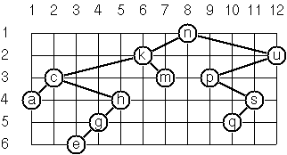

Functional ProgrammingFebruary 5th 2013

Exam set 3

**Exercise 1:** (Blue.) What is the type of the subexpression `f y` as part of 
the expression below assuming that the whole expression has the type given?

*(fun double g x -> double (g x)) (fun f y -> f (<table
style="display: inline-table; vertical-align: middle">
  <tbody><tr>
    <td></td>
  </tr></tbody>
</table>))*

 *: ('a -> 'b -> 'b) -> 'a -> 'b -> 'b*

**Exercise 2:** (Blue.) Write an example function with type:

`*(int -> int -> bool option) -> bool list*`

*Tell “in your words” what it does.*

**Exercise 3:** (Green.) Find the k'th element of a list.

**Exercise 4:** (Green.) Insert an element at a given position into a list.

**Exercise 5:** (Yellow.) Group the elements of a set into disjoint subsets. 
Represent sets as lists, preserve the order of elements. The required sizes of 
subsets are given as a list of numbers.

**Exercise 6:** (Yellow.) A complete binary tree with height $H$ is defined as 
follows: The levels $1, 2, 3, \ldots, H - 1$ contain the maximum number of 
nodes (i.e $2^{i - 1}$ at the level $i$, note that we start counting the 
levels from $1$ at the root). In level $H$, which may contain less than the 
maximum possible number of nodes, all the nodes are "left-adjusted". This 
means that in a levelorder tree traversal all internal nodes come first, the 
leaves come second, and empty successors (the nil's which are not really 
nodes!) come last.

*We can assign an address number to each node in a complete binary tree by
enumerating the nodes in levelorder, starting at the root with number 1. In
doing so, we realize that for every node X with address A the following
property holds: The address of X's left and right successors are 2*A and
2*A+1, respectively, supposed the successors do exist. This fact can be used
to elegantly construct a complete binary tree structure. Write a function
`is_complete_binary_tree` with the following specification:
`is_complete_binary_tree n t` returns true iff `t` is a complete binary tree
with `n` nodes.*

**Exercise 7:** (White.) Write two sorting algorithms, working on lists: merge 
sort and quicksort.

1. *Merge sort splits the list roughly in half, sorts the parts, and merges
   the sorted parts into the sorted result.*
1. *Quicksort splits the list into elements smaller/greater than the first
   element, sorts the parts, and puts them together.*

**Exercise 8:** (White.) Express in terms of `fold_left` or `fold_right`, i.e. 
with all recursion contained in the call to one of these functions, run-length 
encoding of a list (exercise 10 from *99 Problems*).

* `*encode [‘a;‘a;‘a;‘a;‘b;‘c;‘c;‘a;‘a;‘d] = [4,‘a; 1,‘b; 2,‘c; 2,‘a; 1,‘d]*`

**Exercise 9:** (Orange.) Implement Priority Queue module that is an abstract 
data type for polymorphic queues parameterized by comparison function: the 
empty queue creation has signature

 *`val make_empty : leq:('a -> 'a -> bool) -> 'a prio_queue`*

*Provide only functions: `make_empty`, `add`, `min`, `delete_min`. Is this
data structure "safe"?*

*Implement the heap as a *heap-ordered tree*, i.e. in which the element at
each node is no larger than the elements at its children. Unbalanced binary
trees are OK.*

**Exercise 10:** (Orange.) Write a function that transposes a rectangular 
matrix represented as a list of lists.

**Exercise 11:** (Purple.) Find the bijective functions between the types 
corresponding to $a (a^b + c)$ and $a^{b + 1} + ac$ (in OCaml).

**Exercise 12:** (Purple.) Show the monad-plus laws for `OptionM` monad.

**Exercise 13:** (Red.) As a preparation for drawing the tree, a layout 
algorithm is required to determine the position of each node in a rectangular 
grid. Several layout methods are conceivable, one of them is shown in the 
illustration below.

**

*In this layout strategy, the position of a node v is obtained by the
following two rules:*

* *x(v) is equal to the position of the node v in the inorder sequence;*
* *y(v) is equal to the depth of the node v in the tree.*

*In order to store the position of the nodes, we redefine the OCaml type
representing a node (and its successors) as follows:*

```
type 'a pos_binary_tree =
    | E (* represents the empty tree *)
    | N of 'a * int * int * 'a pos_binary_tree * 'a pos_binary_tree
```

*`N(w,x,y,l,r)` represents a (non-empty) binary tree with root w "positioned"
at `(x,y)`, and subtrees `l` and `r`. Write a function `layout_binary_tree`
with the following specification: `layout_binary_tree t` returns the
"positioned" binary tree obtained from the binary tree `t`.*

*An alternative layout method is depicted in the illustration:*

**

*Find out the rules and write the corresponding function.*

*Hint: On a given level, the horizontal distance between neighboring nodes is
constant.*

**Exercise 14:** (Crimson.) Nonograms. Each row and column of a rectangular 
bitmap is annotated with the respective lengths of its distinct strings of 
occupied cells. The person who solves the puzzle must complete the bitmap 
given only these lengths.

```
          Problem statement:          Solution:

          |_|_|_|_|_|_|_|_| 3         |_|X|X|X|_|_|_|_| 3
          |_|_|_|_|_|_|_|_| 2 1       |X|X|_|X|_|_|_|_| 2 1
          |_|_|_|_|_|_|_|_| 3 2       |_|X|X|X|_|_|X|X| 3 2
          |_|_|_|_|_|_|_|_| 2 2       |_|_|X|X|_|_|X|X| 2 2
          |_|_|_|_|_|_|_|_| 6         |_|_|X|X|X|X|X|X| 6
          |_|_|_|_|_|_|_|_| 1 5       |X|_|X|X|X|X|X|_| 1 5
          |_|_|_|_|_|_|_|_| 6         |X|X|X|X|X|X|_|_| 6
          |_|_|_|_|_|_|_|_| 1         |_|_|_|_|X|_|_|_| 1
          |_|_|_|_|_|_|_|_| 2         |_|_|_|X|X|_|_|_| 2
           1 3 1 7 5 3 4 3             1 3 1 7 5 3 4 3
           2 1 5 1                     2 1 5 1
```

*For the example above, the problem can be stated as the two lists
`[[3];[2;1];[3;2];[2;2];[6];[1;5];[6];[1];[2]]` and
`[[1;2];[3;1];[1;5];[7;1];[5];[3];[4];[3]]` which give the "solid" lengths of
the rows and columns, top-to-bottom and left-to-right, respectively. Published
puzzles are larger than this example, e.g. 25*20, and apparently always have
unique solutions.*

**Exercise 15:** (Black.) Leftist heaps are heap-ordered binary trees that 
satisfy the *leftist property*: the rank of any left child is at least as 
large as the rank of its right sibling. The rank of a node is defined to be 
the length of its *right spine*, i.e. the rightmost path from the node in 
question to an empty node. Implement $O (\log n)$ worst case time complexity 
Priority Queues based on leftist heaps. Each node of the tree should contain 
its rank.

*Note that the elements along any path through a heap-ordered tree are stored
in sorted order. The key insight behind leftist heaps is that two heaps can be
merged by merging their right spines as you would merge two sorted lists, and
then swapping the children of nodes along this path as necessary to restore
the leftist property.*


